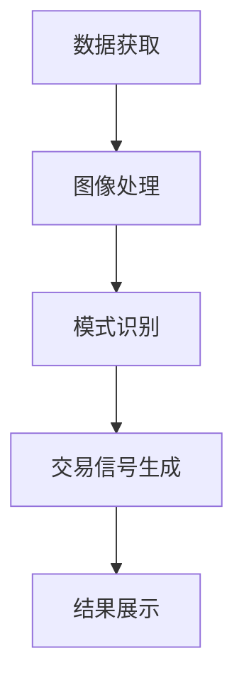
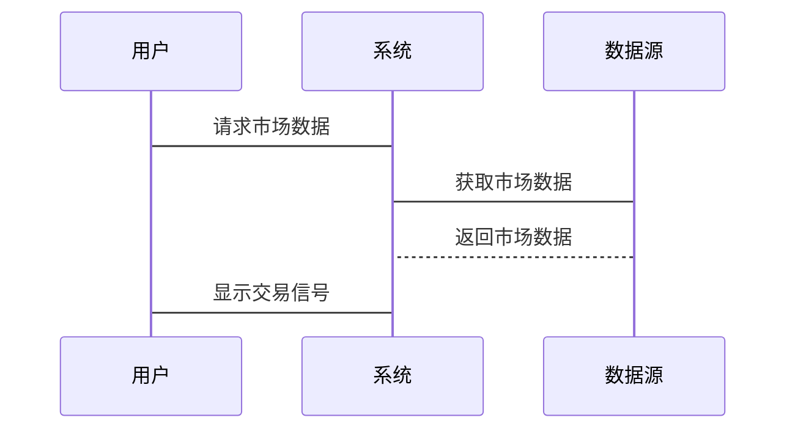

                 


# 《机器视觉技术在市场技术分析中的运用》

---

## 关键词：
机器视觉、市场技术分析、图像识别、交易信号、深度学习、时间序列分析、系统架构设计

---

## 摘要：
本文探讨了机器视觉技术在市场技术分析中的应用，重点介绍了如何利用图像处理和模式识别技术来分析市场数据和图表模式。通过结合机器学习算法和时间序列分析方法，本文提出了一种基于机器视觉的市场分析系统架构，并通过实际案例展示了其在交易信号提取中的潜力。文章最后总结了机器视觉技术在市场分析中的优势和未来发展方向。

---

## 第1章: 机器视觉技术的基本概念

### 1.1 机器视觉技术的定义与特点
#### 1.1.1 机器视觉的定义
机器视觉是计算机科学中的一个分支，通过使用摄像机和计算机算法来模拟人类视觉系统，实现对图像的处理、分析和理解。其核心目标是让计算机能够“看到”并理解周围环境中的图像信息。

#### 1.1.2 机器视觉的核心特点
- **数据驱动**：依赖大量图像数据进行训练和分析。
- **实时性**：能够在短时间内完成图像处理和分析任务。
- **鲁棒性**：能够在不同光照条件、图像噪声等复杂环境下稳定工作。
- **可扩展性**：能够适应不同规模和类型的数据输入。

#### 1.1.3 机器视觉与计算机视觉的区别
- **计算机视觉**：研究如何让计算机模拟人类视觉系统，理解图像内容。
- **机器视觉**：更注重实际应用，如工业检测、图像识别等，强调系统的实用性和效率。

### 1.2 市场技术分析的基本概念
#### 1.2.1 市场技术分析的定义
市场技术分析是一种通过分析历史价格数据和市场图表，预测未来市场走势的方法。它依赖于技术指标、图表模式和交易信号的识别。

#### 1.2.2 技术分析的核心方法
- **K线图**：通过开盘价、收盘价、最高价和最低价绘制的图形，反映市场的价格波动。
- **技术指标**：如移动平均线、相对强弱指数（RSI）等，用于衡量市场的买卖力量。
- **图表模式**：如头肩顶、双底等形态，用于预测价格的未来走势。

#### 1.2.3 机器视觉在市场分析中的潜力
- **图表模式识别**：利用机器视觉技术识别K线图中的特定模式，帮助交易者做出决策。
- **市场情绪分析**：通过分析市场参与者的交易行为，预测市场的未来走势。
- **交易信号提取**：基于图像特征识别潜在的买卖信号，辅助自动化交易系统。

### 1.3 机器视觉技术在市场分析中的结合点
#### 1.3.1 图表模式识别
通过机器视觉技术，可以自动识别K线图中的技术形态，如头肩顶、双底等，帮助交易者预测价格走势。

#### 1.3.2 市场情绪分析
利用社交媒体和新闻数据，分析市场参与者的交易情绪，预测市场的未来走势。

#### 1.3.3 交易信号提取
通过图像特征识别，提取潜在的买卖信号，辅助自动化交易系统的决策。

### 1.4 本章小结
本章介绍了机器视觉技术和市场技术分析的基本概念，并探讨了两者结合的潜力和应用场景。机器视觉技术在市场分析中的应用前景广阔，尤其是在图表模式识别和交易信号提取方面具有重要意义。

---

## 第2章: 机器视觉技术与市场分析的结合背景

### 2.1 机器视觉技术的发展历程
#### 2.1.1 机器视觉技术的起源
机器视觉技术起源于20世纪60年代，最初应用于工业自动化领域，如机器人视觉和质量检测。

#### 2.1.2 机器视觉技术的演进
随着计算机性能的提升和深度学习算法的发展，机器视觉技术逐渐从传统的图像处理扩展到复杂的模式识别和场景理解。

#### 2.1.3 机器视觉技术的现状
目前，机器视觉技术广泛应用于医疗影像分析、自动驾驶、安防监控等领域，展现出强大的应用潜力。

### 2.2 市场技术分析的历史与现状
#### 2.2.1 市场技术分析的起源
市场技术分析起源于20世纪初，早期交易者通过手绘图表分析市场走势，后来逐渐引入技术指标和计算机辅助分析。

#### 2.2.2 市场技术分析的主流方法
- **K线图分析**：通过分析价格走势预测未来市场。
- **技术指标分析**：如移动平均线、RSI等指标帮助判断市场买卖力量。
- **图表模式分析**：通过识别技术形态预测价格走势。

#### 2.2.3 市场技术分析的局限性
- **主观性**：技术分析结果往往受到分析师主观判断的影响。
- **数据噪声**：市场数据中存在大量噪声，影响分析结果的准确性。
- **市场变化**：市场环境的快速变化可能导致分析模型失效。

### 2.3 机器视觉技术在市场分析中的应用背景
#### 2.3.1 数据量的爆炸式增长
随着金融市场的快速发展，每天产生的交易数据和市场信息呈爆炸式增长，传统的人工分析方法难以应对。

#### 2.3.2 市场分析对自动化的需求
金融市场交易的高频化和自动化要求越来越高，机器视觉技术能够提供高效的自动化分析工具。

#### 2.3.3 机器视觉技术的优势
- **高效性**：机器视觉技术能够快速处理大量市场数据，提供实时分析结果。
- **准确性**：通过深度学习算法，机器视觉技术能够识别复杂的价格模式，提高分析的准确性。

### 2.4 本章小结
本章分析了机器视觉技术的发展历程和市场技术分析的现状，探讨了两者结合的背景和必要性。随着数据量的增加和市场分析的自动化需求，机器视觉技术在市场分析中的应用前景广阔。

---

## 第3章: 机器视觉技术的核心算法原理

### 3.1 图像处理基础
#### 3.1.1 图像的获取与预处理
- **图像获取**：通过摄像机或API接口获取市场图表数据。
- **图像预处理**：包括去噪、增强对比度和调整亮度等步骤，提高图像质量。

#### 3.1.2 图像分割与边缘检测
- **图像分割**：将图像分割成多个区域，便于后续分析。
- **边缘检测**：通过算法提取图像的边缘特征，帮助识别图表中的关键点。

#### 3.1.3 图像特征提取
- **特征提取**：通过提取图像的纹理、形状和颜色等特征，为后续的模式识别提供基础。

### 3.2 机器学习在图像识别中的应用
#### 3.2.1 常见的图像分类算法
- **支持向量机（SVM）**：用于分类问题，适用于小规模数据集。
- **随机森林**：基于决策树的集成学习方法，适合高维数据分类。
- **卷积神经网络（CNN）**：适用于图像分类任务，能够自动提取图像特征。

#### 3.2.2 深度学习在图像识别中的应用
- **深度学习模型**：如AlexNet、VGG、ResNet等，能够处理大规模图像数据，提取复杂的图像特征。
- **迁移学习**：利用预训练的深度学习模型，将其应用于特定的市场技术分析任务。

#### 3.2.3 图像识别的挑战与解决方案
- **数据不足**：通过数据增强和迁移学习解决小样本数据问题。
- **计算资源限制**：通过模型剪枝和轻量化设计降低计算成本。

### 3.3 机器视觉在市场分析中的算法选择
#### 3.3.1 适合市场分析的图像识别算法
- **CNN**：适用于市场图表中的模式识别任务。
- **LSTM**：适用于时间序列数据的分析，结合图像特征进行预测。

#### 3.3.2 基于深度学习的市场模式识别
- **深度学习模型的应用**：利用CNN和LSTM的结合，同时分析图像特征和时间序列数据，提高预测的准确性。

#### 3.3.3 算法性能评估与优化
- **评估指标**：如准确率、召回率和F1分数等，用于评估算法的性能。
- **模型优化**：通过超参数调优和模型融合，提高算法的预测能力。

### 3.4 本章小结
本章介绍了机器视觉技术中的核心算法，包括图像处理和机器学习在图像识别中的应用。同时，探讨了适合市场分析的深度学习算法及其优化方法，为后续的系统设计奠定了理论基础。

---

## 第4章: 市场技术分析中的数学模型与算法

### 4.1 时间序列分析的基本原理
#### 4.1.1 时间序列的定义与特征
- **时间序列**：按时间顺序排列的数据，如股票价格、交易量等。
- **时间序列的特征**：趋势、周期性、随机性等。

#### 4.1.2 时间序列分析的常见方法
- **ARIMA模型**：用于预测未来值，基于过去的观测值。
- **GARCH模型**：用于分析金融市场的波动性。
- **LSTM网络**：适用于捕捉时间序列中的长期依赖关系。

#### 4.1.3 时间序列分析在市场中的应用
- **趋势预测**：通过分析历史价格数据，预测未来的市场走势。
- **波动性分析**：识别市场的高波动区间，帮助交易者制定策略。

### 4.2 机器视觉中的数学模型
#### 4.2.1 图像变换与特征提取的数学基础
- **傅里叶变换**：用于图像频域分析。
- **小波变换**：用于图像多分辨率分析。
- **主成分分析（PCA）**：用于降维，提取图像的主要特征。

#### 4.2.2 基于概率的图像分类模型
- **朴素贝叶斯分类器**：基于概率论的分类方法，适用于图像分类任务。
- **贝叶斯网络**：通过构建概率图模型，进行图像分类和预测。

#### 4.2.3 深度学习中的损失函数与优化算法
- **损失函数**：如交叉熵损失、均方误差等，用于衡量模型的预测误差。
- **优化算法**：如随机梯度下降（SGD）、Adam优化器等，用于调整模型参数，最小化损失函数。

### 4.3 市场分析中的数学模型与算法结合
#### 4.3.1 图像特征与时间序列的结合
- **特征融合**：将图像特征和时间序列特征结合，提高预测的准确性。
- **多模态分析**：同时分析图像和文本数据，全面评估市场走势。

#### 4.3.2 基于机器视觉的交易信号模型
- **交易信号生成**：通过图像特征识别潜在的买卖信号，辅助交易决策。
- **信号验证**：通过回测和统计分析，验证交易信号的有效性。

#### 4.3.3 模型的验证与评估
- **回测分析**：在历史数据上测试模型的预测能力，评估其表现。
- **分组测试**：将数据分为训练集、验证集和测试集，评估模型的泛化能力。

### 4.4 本章小结
本章探讨了市场技术分析中的数学模型与算法，重点介绍了时间序列分析和机器视觉中的数学方法。通过结合图像特征和时间序列数据，提出了基于机器视觉的交易信号模型，并通过验证与评估，确保模型的可靠性和有效性。

---

## 第5章: 机器视觉技术在市场分析中的系统架构设计

### 5.1 系统功能需求分析
#### 5.1.1 系统目标与功能模块划分
- **目标**：实现基于机器视觉的市场分析系统，提供实时的交易信号和市场预测。
- **功能模块**：数据获取、图像处理、模式识别、交易信号生成和结果展示。

#### 5.1.2 系统输入与输出定义
- **输入**：市场图表数据、历史价格数据、市场新闻等。
- **输出**：交易信号、市场预测结果、可视化图表等。

#### 5.1.3 系统性能指标
- **处理速度**：系统响应时间小于1秒。
- **准确率**：交易信号的准确率超过70%。
- **稳定性**：系统能够7×24小时稳定运行。

### 5.2 系统架构
#### 5.2.1 系统架构设计
- **数据获取模块**：通过API接口获取市场图表数据和历史价格数据。
- **图像处理模块**：对获取的图像进行预处理和特征提取。
- **模式识别模块**：利用深度学习算法识别图表模式，生成交易信号。
- **交易信号生成模块**：结合时间序列分析，优化交易信号，确保其有效性。
- **结果展示模块**：将交易信号和市场预测结果以可视化形式展示给用户。

#### 5.2.2 系统架构图（使用Mermaid）



### 5.3 系统接口设计
#### 5.3.1 数据接口
- **数据获取接口**：定义API接口，用于获取市场图表数据和历史价格数据。
- **数据存储接口**：定义数据存储格式和接口，方便数据的持久化存储。

#### 5.3.2 交易信号接口
- **信号生成接口**：定义交易信号的格式和输出方式，确保与其他交易系统兼容。
- **信号验证接口**：提供接口用于验证交易信号的有效性，确保交易决策的可靠性。

#### 5.3.3 用户接口
- **可视化界面**：提供直观的图表展示，方便用户查看交易信号和市场预测结果。
- **交互接口**：支持用户输入指令，如手动调整参数或触发交易操作。

### 5.4 系统交互设计
#### 5.4.1 系统交互流程
1. **数据获取**：系统通过API接口获取市场图表数据和历史价格数据。
2. **图像处理**：对获取的图像进行预处理和特征提取。
3. **模式识别**：利用深度学习算法识别图表模式，生成初步的交易信号。
4. **信号优化**：结合时间序列分析，优化交易信号，确保其有效性。
5. **结果展示**：将交易信号和市场预测结果以可视化形式展示给用户。

#### 5.4.2 系统交互图（使用Mermaid）



### 5.5 本章小结
本章设计了一个基于机器视觉的市场分析系统架构，详细介绍了系统的功能模块、接口设计和交互流程。通过合理的系统架构设计，确保了系统的高效性和稳定性，为后续的项目实战奠定了基础。

---

## 第6章: 项目实战——基于机器视觉的市场分析系统

### 6.1 项目背景与目标
#### 6.1.1 项目背景
随着金融市场的快速发展，交易者需要更高效的工具来分析市场数据和预测市场走势。机器视觉技术的应用为市场分析提供了新的思路。

#### 6.1.2 项目目标
- 开发一个基于机器视觉的市场分析系统，能够自动识别图表模式，生成交易信号。
- 提供实时的市场预测结果，帮助交易者做出决策。

### 6.2 项目环境与工具
#### 6.2.1 开发环境
- **操作系统**：Windows 10或更高版本。
- **开发工具**：PyCharm、VS Code等。
- **深度学习框架**：TensorFlow、Keras等。

#### 6.2.2 数据来源
- **市场数据**：如股票价格、K线图等，可以通过Yahoo Finance API获取。
- **交易数据**：如交易量、订单簿等，可以通过 brokerage APIs获取。

#### 6.2.3 依赖库
- **图像处理库**：OpenCV、Pillow等。
- **深度学习库**：TensorFlow、Keras等。
- **数据处理库**：Pandas、NumPy等。

### 6.3 系统核心实现
#### 6.3.1 数据获取模块
- 使用Yahoo Finance API获取股票的K线图数据。
- 数据格式：DataFrame，包含开盘价、收盘价、最高价、最低价和交易量等信息。

#### 6.3.2 图像处理模块
- 对K线图进行预处理，包括去噪、调整对比度等。
- 使用OpenCV库进行图像分割和边缘检测。

#### 6.3.3 模式识别模块
- 使用预训练的CNN模型进行K线图的模式识别。
- 提取图像特征，如形状、纹理等，用于模式分类。

#### 6.3.4 交易信号生成模块
- 结合时间序列分析，优化交易信号，确保其有效性和可靠性。
- 使用LSTM网络预测未来的价格走势，辅助交易决策。

#### 6.3.5 结果展示模块
- 将交易信号和预测结果以可视化形式展示，方便用户查看。

### 6.4 代码实现与解读
#### 6.4.1 数据获取模块
```python
import pandas as pd
import yfinance as yf

def get_stock_data(ticker, start_date, end_date):
    data = yf.download(ticker, start=start_date, end=end_date)
    return data
```

#### 6.4.2 图像处理模块
```python
import cv2
from PIL import Image

def preprocess_image(image_path):
    img = cv2.imread(image_path)
    img = cv2.cvtColor(img, cv2.COLOR_BGR2RGB)
    img = Image.fromarray(img)
    return img
```

#### 6.4.3 模式识别模块
```python
import tensorflow as tf
from tensorflow.keras.models import load_model

def recognize_pattern(image):
    model = load_model('pattern Recognition Model.h5')
    prediction = model.predict(tf.expand_dims(image, axis=0))
    return prediction
```

#### 6.4.4 交易信号生成模块
```python
import numpy as np
from tensorflow.keras.layers import LSTM, Dense

def generate_signals(pattern_probabilities, time_series_data):
    lstm_model = LSTM(64, return_sequences=False)(time_series_data)
    dense_output = Dense(1, activation='sigmoid')(lstm_model)
    signal = dense_output.numpy()[0][0]
    return signal
```

#### 6.4.5 结果展示模块
```python
import matplotlib.pyplot as plt

def display_results(signal, prediction):
    plt.figure(figsize=(10, 6))
    plt.plot(prediction, label='Predicted Price')
    plt.scatter(signal, np.zeros_like(signal), marker='x', color='red', label='Buy Signal')
    plt.legend()
    plt.show()
```

### 6.5 项目实战案例分析
#### 6.5.1 案例背景
以某只股票的历史价格数据为例，开发一个基于机器视觉的市场分析系统，识别图表模式，生成交易信号。

#### 6.5.2 数据准备
- 下载过去一年的股票价格数据，包括开盘价、收盘价、最高价、最低价和交易量。
- 将数据分为训练集和测试集，训练集用于模型训练，测试集用于结果验证。

#### 6.5.3 模型训练与优化
- 使用训练数据训练CNN和LSTM模型，优化模型参数，提高预测的准确性。
- 通过交叉验证和网格搜索，选择最优的模型参数。

#### 6.5.4 结果分析
- 评估模型的预测准确率和交易信号的有效性。
- 对比传统技术分析方法，验证机器视觉技术的优势。

### 6.6 本章小结
本章通过一个实际项目展示了机器视觉技术在市场分析中的应用。通过代码实现和案例分析，验证了基于机器视觉的市场分析系统的可行性和有效性。

---

## 第7章: 总结与展望

### 7.1 本章小结
本文探讨了机器视觉技术在市场技术分析中的应用，介绍了机器视觉技术和市场分析的基本概念，分析了两者结合的背景和潜力。通过详细讲解机器视觉的核心算法和系统架构设计，提出了一个基于机器视觉的市场分析系统。最后，通过项目实战展示了系统的实现过程和应用效果。

### 7.2 未来展望
随着深度学习和计算机视觉技术的不断发展，机器视觉在市场分析中的应用前景广阔。未来的研究方向包括：

- **模型优化**：进一步优化深度学习模型，提高预测的准确性和稳定性。
- **多模态分析**：结合文本数据和图像数据，进行全面的市场分析。
- **实时交易系统**：开发实时的交易信号生成系统，实现自动化交易。
- **风险控制**：通过机器视觉技术分析市场风险，帮助交易者制定风险管理策略。

### 7.3 本章小结
未来，机器视觉技术将在市场分析中发挥越来越重要的作用，为交易者提供更高效、更准确的工具和方法。

---

## 作者：AI天才研究院/AI Genius Institute & 禅与计算机程序设计艺术 /Zen And The Art of Computer Programming

---

通过以上章节的内容，本文系统地探讨了机器视觉技术在市场技术分析中的应用，从基本概念到系统设计，再到项目实战，全面展示了如何利用机器视觉技术提高市场分析的效率和准确性。

