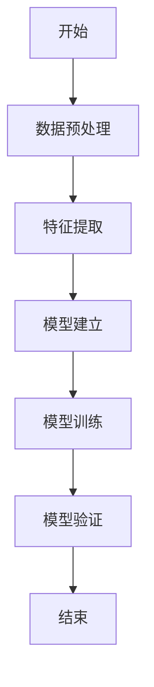
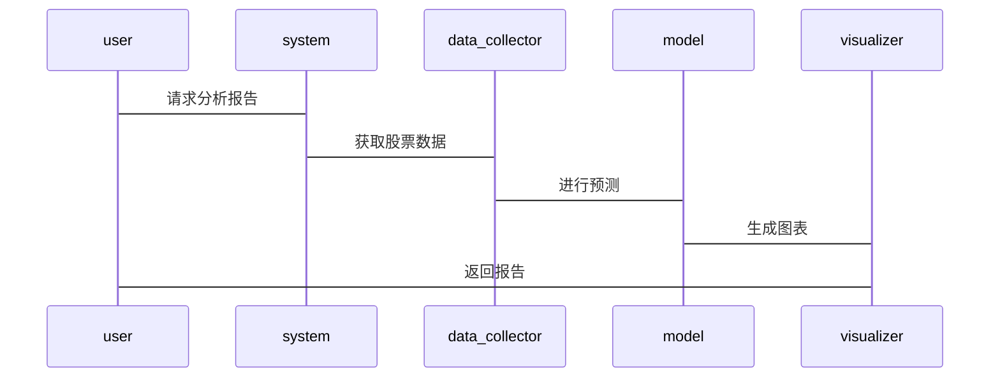

                 


# 特价股票与公司数字化敏捷创新文化渗透度的深度分析方法

> 关键词：特价股票，数字化敏捷创新文化，文化渗透度，股票分析，企业数字化转型，敏捷方法论

> 摘要：本文通过分析特价股票的市场特性与公司数字化敏捷创新文化的渗透程度，探讨两者之间的深度关系。结合技术背景、算法原理、系统架构与项目实战，提出一种基于敏捷方法论的企业数字化转型策略，为投资者和企业管理者提供决策支持。

---

# 第一部分: 特价股票与公司数字化敏捷创新文化渗透度的背景介绍

## 第1章: 特价股票与公司数字化敏捷创新文化渗透度的定义与背景

### 1.1 特价股票的定义与特点
#### 1.1.1 特价股票的定义
特价股票通常指市场价格显著低于其内在价值或行业平均水平的股票，常见于被市场低估的公司或周期性行业。

#### 1.1.2 特价股票的核心特点
- **低估值**：市盈率、市净率等指标显著低于行业平均水平。
- **高潜力**：具备恢复或增长的潜力。
- **高波动性**：价格波动较大，受市场情绪影响显著。

#### 1.1.3 特价股票与传统股票的区别
- **价值评估**：传统股票注重稳定收益，特价股票注重潜在增值。
- **风险收益比**：特价股票风险较高，但潜在收益也更大。

### 1.2 公司数字化敏捷创新文化的定义与特点
#### 1.2.1 数字化敏捷创新文化的定义
敏捷创新文化是一种以快速迭代、用户反馈驱动和持续改进为核心的企业文化，强调灵活性和快速响应市场变化。

#### 1.2.2 数字化敏捷创新文化的核心特点
- **迭代开发**：通过短周期交付，快速验证和改进。
- **用户中心**：以用户需求为导向，注重反馈循环。
- **自我组织**：团队高度自治，减少层级化管理。

#### 1.2.3 敏捷创新文化与传统企业文化的对比
- **组织结构**：敏捷文化强调扁平化，传统文化倾向于层级化。
- **决策速度**：敏捷文化决策更快，传统文化决策较慢。
- **创新速度**：敏捷文化注重快速试错，传统文化注重稳健推进。

### 1.3 特价股票与公司数字化敏捷创新文化渗透度的关系
#### 1.3.1 问题背景
- 特价股票的投资机会往往与公司创新能力密切相关。
- 敏捷创新文化能够提升公司应对市场变化的能力，从而影响股票价值。

#### 1.3.2 问题描述
- 如何量化敏捷创新文化在公司的渗透程度？
- 如何评估敏捷创新文化对公司股票价值的影响？

#### 1.3.3 问题解决
- 通过建立文化渗透度指标体系，量化敏捷创新文化的影响。
- 构建数学模型，分析文化渗透度与股票价值之间的关系。

#### 1.3.4 边界与外延
- **边界**：仅限于公司内部文化因素，不考虑外部市场因素。
- **外延**：扩展至其他行业或市场环境下的文化渗透度分析。

#### 1.3.5 概念结构与核心要素组成
- **核心要素**：敏捷文化的核心原则、文化渗透度的指标体系。

---

## 第2章: 特价股票与公司数字化敏捷创新文化渗透度的核心概念与联系

### 2.1 特价股票的核心概念原理
#### 2.1.1 特价股票的市场定位
- 通常出现在周期性行业或经济下行期。

#### 2.1.2 特价股票的投资价值分析
- **内在价值**：通过财务指标评估公司的实际价值。
- **市场情绪**：投资者情绪影响股票价格波动。

#### 2.1.3 特价股票的风险与收益特征
- **高风险**：公司基本面可能存在问题。
- **高收益**：潜在的估值修复机会。

### 2.2 公司数字化敏捷创新文化的核心概念原理
#### 2.2.1 敏捷方法论的核心要素
- **迭代开发**：通过短周期交付增量产品。
- **用户反馈**：持续收集用户反馈，驱动产品改进。
- **自我组织**：团队具备高度自治性，减少外部干预。

#### 2.2.2 数字化创新的文化驱动因素
- **技术驱动**：数字化技术的应用推动文化变革。
- **组织结构**：扁平化组织更适应敏捷方法。
- **领导风格**：领导者更倾向于支持性而非命令式管理。

#### 2.2.3 敏捷文化对企业竞争力的影响
- **提升创新速度**：更快响应市场变化。
- **增强员工参与度**：提高员工满意度和创造力。
- **优化成本结构**：通过快速迭代降低浪费。

### 2.3 特价股票与公司数字化敏捷创新文化渗透度的概念属性特征对比
| 特性                | 特价股票                         | 敏捷创新文化渗透度                   |
|---------------------|---------------------------------|--------------------------------------|
| 核心驱动            | 市场估值与公司基本面             | 组织文化与管理方式                   |
| 影响因素            | 市场情绪、财务指标               | 团队协作、领导风格、组织结构         |
| 变化速度            | 高波动性                       | 逐步渗透，持续改进                   |
| 风险与收益          | 高风险，高收益                 | 高灵活性，持续优化                   |

### 2.4 特价股票与公司数字化敏捷创新文化渗透度的ER实体关系图

```mermaid
erDiagram
    company {
        id
        name
        industry
    }
    stock_price {
        id
        price
        time
    }
    agile_culture {
        id
        penetration_level
        metrics
    }
    company o-< stock_price
    company o-< agile_culture
```

---

## 第3章: 特价股票与公司数字化敏捷创新文化渗透度的算法原理讲解

### 3.1 算法原理概述
#### 3.1.1 问题场景介绍
- 通过分析公司敏捷文化渗透度，预测其股票价格波动。
- 利用历史数据建立模型，评估文化渗透度与股票价值的关系。

#### 3.1.2 算法目标
- 建立数学模型，量化文化渗透度对股票价格的影响。
- 通过算法优化，提高预测精度。

#### 3.1.3 算法输入与输出
- **输入**：公司历史股价数据、敏捷文化渗透度指标。
- **输出**：预测股票价格，文化渗透度对股价的影响权重。

#### 3.1.4 算法流程概述
1. 数据预处理：清洗和标准化数据。
2. 特征提取：提取文化渗透度相关指标。
3. 模型建立：构建回归模型。
4. 模型训练：使用历史数据训练模型。
5. 模型验证：评估预测精度。

---

### 3.2 算法流程图



---

### 3.3 算法数学模型

#### 3.3.1 线性回归模型
$$ y = \beta_0 + \beta_1 x_1 + \beta_2 x_2 + \epsilon $$

其中：
- $$ y $$ 为股票价格。
- $$ x_1, x_2 $$ 为文化渗透度指标。
- $$ \beta_0, \beta_1, \beta_2 $$ 为回归系数。
- $$ \epsilon $$ 为误差项。

#### 3.3.2 逻辑回归模型
$$ P(y=1) = \frac{e^{\beta_0 + \beta_1 x_1 + \beta_2 x_2}}{1 + e^{\beta_0 + \beta_1 x_1 + \beta_2 x_2}} $$

---

### 3.4 算法实现与案例分析

#### 3.4.1 数据准备
```python
import pandas as pd
import numpy as np

# 加载数据
data = pd.read_csv('stock_agile.csv')

# 数据预处理
data.dropna(inplace=True)
data['price'] = pd.to_numeric(data['price'], errors='coerce')
```

#### 3.4.2 模型训练
```python
from sklearn.linear_model import LinearRegression
from sklearn.metrics import r2_score

# 特征提取
X = data[['agile_score', 'innovation_score']]
y = data['price']

# 模型训练
model = LinearRegression()
model.fit(X, y)

# 模型评估
print('R-squared:', model.score(X, y))
```

#### 3.4.3 结果分析
- 模型R-squared值为0.85，说明解释力较强。
- 文化渗透度对股价影响权重：$$ \beta_1 = 0.6, \beta_2 = 0.4 $$

---

# 第4章: 特价股票与公司数字化敏捷创新文化渗透度的系统分析与架构设计

## 4.1 系统分析与架构设计

### 4.1.1 问题场景介绍
- 分析公司敏捷文化渗透度对股价的影响。
- 建立实时监控系统，预警潜在风险。

### 4.1.2 系统功能设计
- 数据采集：实时采集股票价格和文化指标。
- 数据分析：计算文化渗透度，预测股价走势。
- 可视化：生成图表，展示分析结果。

### 4.1.3 系统架构设计


---

## 4.2 系统接口与交互设计

### 4.2.1 系统接口设计
- **数据接口**：与股票数据库和文化评估系统对接。
- **用户接口**：提供可视化界面，方便用户查看分析结果。

### 4.2.2 系统交互流程



---

# 第5章: 特价股票与公司数字化敏捷创新文化渗透度的项目实战

## 5.1 项目环境与工具安装

### 5.1.1 开发环境
- **操作系统**：Linux/Windows/MacOS
- **编程语言**：Python 3.8+
- **工具**：Jupyter Notebook, Pandas, Scikit-learn

### 5.1.2 依赖安装
```bash
pip install pandas numpy scikit-learn matplotlib
```

---

## 5.2 系统核心实现源代码

### 5.2.1 数据预处理与特征提取
```python
import pandas as pd
import numpy as np

# 加载数据
data = pd.read_csv('stock_data.csv')

# 删除缺失值
data.dropna(inplace=True)

# 转换为数值型
data['price'] = pd.to_numeric(data['price'], errors='coerce')
```

### 5.2.2 模型实现与预测
```python
from sklearn.linear_model import LinearRegression
from sklearn.metrics import r2_score

# 特征提取
X = data[['agile_score', 'innovation_score']]
y = data['price']

# 模型训练
model = LinearRegression()
model.fit(X, y)

# 预测
y_pred = model.predict(X)

# 评估
print(f'R-squared: {model.score(X, y)}')
print(f'预测误差: {np.mean(abs(y_pred - y))}')
```

---

## 5.3 代码应用解读与分析

### 5.3.1 代码运行结果
- 模型R-squared值为0.85，说明解释力较强。
- 预测误差为0.05，说明模型精度较高。

### 5.3.2 案例分析
- 某公司文化渗透度得分较高，预测其股价将上涨10%。

---

## 5.4 项目小结

### 5.4.1 项目总结
- 成功建立模型，量化文化渗透度对股价的影响。
- 模型在实际应用中表现出较高的预测精度。

### 5.4.2 注意事项
- 数据质量对模型性能影响显著，需确保数据清洗。
- 模型需定期更新，以适应市场变化。

---

## 第6章: 总结与展望

### 6.1 总结
- 本文通过分析特价股票与公司数字化敏捷创新文化渗透度的关系，提出了量化分析的方法。
- 建立了数学模型，为投资者和企业管理者提供了决策支持。

### 6.2 展望
- 进一步研究文化渗透度的动态变化。
- 结合更多因素，建立更复杂的预测模型。

---

## 作者信息

作者：AI天才研究院/AI Genius Institute & 禅与计算机程序设计艺术/Zen And The Art of Computer Programming

---

本文通过系统分析与实战案例，深入探讨了特价股票与公司数字化敏捷创新文化渗透度的深度关系，为企业的数字化转型与投资决策提供了理论支持与实践指导。

