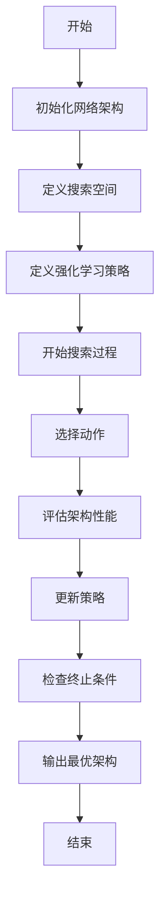
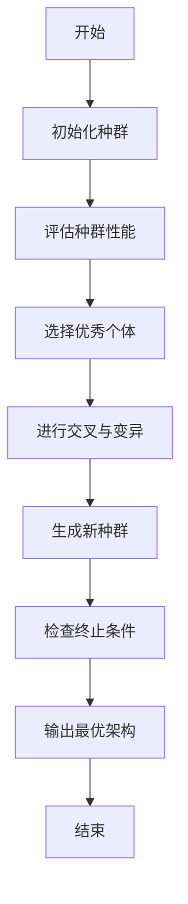
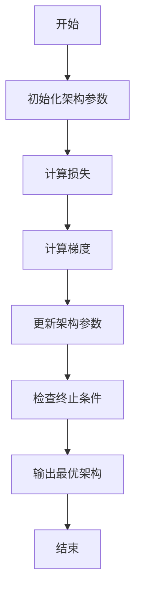
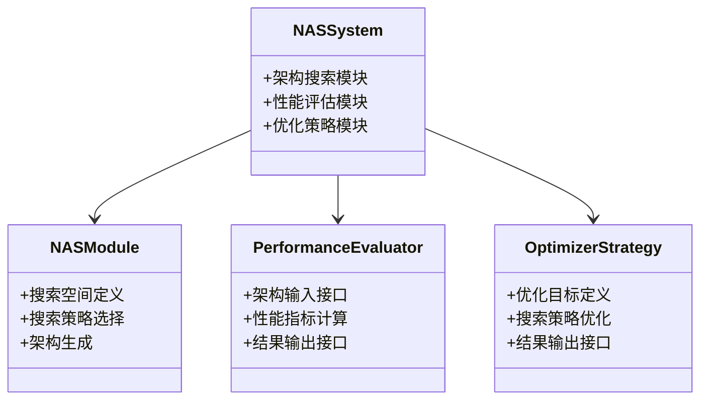
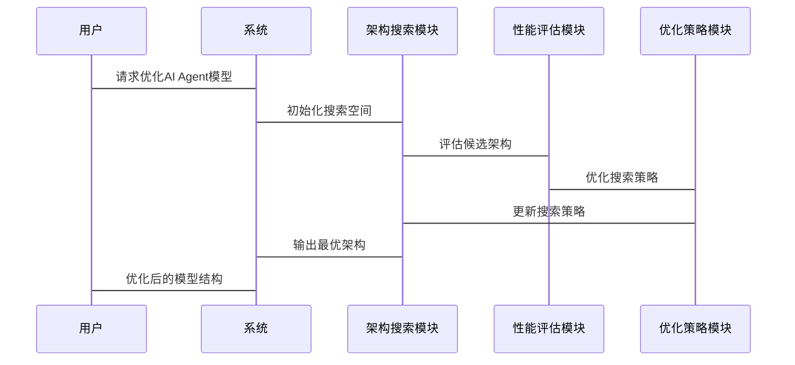

                 


# 神经网络架构搜索：优化AI Agent的模型结构

## 关键词：神经网络架构搜索、AI Agent、深度学习、强化学习、优化算法

## 摘要：  
神经网络架构搜索（Neural Architecture Search, NAS）是一种通过自动化方法寻找最优神经网络结构的技术，近年来在深度学习领域取得了显著进展。本文从AI Agent的角度出发，详细探讨了神经网络架构搜索的核心概念、算法原理、系统设计与实现，并通过实际案例展示了其在优化AI Agent模型结构中的应用价值。文章内容涵盖从基础理论到实践应用的全链条，旨在为读者提供一个全面而深入的视角，理解如何通过神经网络架构搜索提升AI Agent的性能与效率。

---

## 第1章：神经网络架构搜索概述

### 1.1 神经网络架构搜索的背景与意义

#### 1.1.1 深度学习模型的复杂性与挑战  
近年来，深度学习技术在各个领域取得了巨大成功，但其核心——神经网络的架构设计却仍然依赖于人工经验。随着模型复杂度的增加，手动设计最优架构的难度越来越大，且效率低下。神经网络架构搜索（NAS）的出现，为这一问题提供了一种自动化解决方案。

#### 1.1.2 神经网络架构搜索的定义与目标  
神经网络架构搜索是一种通过算法自动寻找最优神经网络结构的技术。其目标是通过搜索算法在可能的架构空间中找到性能最优的模型，从而减少人工设计的时间和成本。

#### 1.1.3 神经网络架构搜索在AI Agent中的应用价值  
AI Agent需要在复杂环境中进行感知、决策和行动，其性能高度依赖于模型的架构设计。通过NAS技术，AI Agent可以在不同的任务场景中自动优化其模型结构，从而实现更高的任务效率和准确性。

### 1.2 AI Agent与神经网络架构搜索的关系

#### 1.2.1 AI Agent的基本概念与任务特点  
AI Agent是一种智能体，能够在环境中执行任务，通过感知和交互完成目标。其核心能力依赖于模型的性能，而模型的架构设计直接影响其表现。

#### 1.2.2 神经网络架构在AI Agent中的作用  
神经网络架构决定了AI Agent如何处理输入信息、提取特征以及做出决策。优化架构设计可以显著提升AI Agent的感知能力和决策效率。

#### 1.2.3 神经网络架构搜索如何优化AI Agent性能  
通过NAS技术，AI Agent可以在不同任务场景下自动调整其模型结构，使其在特定任务中表现更优，同时减少人工干预的需求。

### 1.3 神经网络架构搜索的核心问题

#### 1.3.1 架构搜索的数学建模  
将神经网络架构表示为数学模型，定义搜索空间，并通过优化算法寻找最优解。

#### 1.3.2 搜索空间的定义与优化  
合理定义搜索空间，减少搜索范围，提高搜索效率。

#### 1.3.3 架构搜索的评价指标与标准  
通过性能指标（如准确率、计算效率等）评估不同架构的优劣。

### 1.4 本章小结  
本章从背景、定义、应用价值等方面介绍了神经网络架构搜索的核心概念，为后续章节的深入分析奠定了基础。

---

## 第2章：神经网络架构搜索的核心概念与原理

### 2.1 神经网络架构搜索的核心概念

#### 2.1.1 强化学习驱动的架构搜索  
通过强化学习算法（如REINFORCE）驱动架构搜索，将架构选择视为一个序列决策问题。

#### 2.1.2 遗传算法与进化策略的应用  
利用遗传算法和进化策略模拟生物进化过程，通过交叉和变异操作生成新的架构候选。

#### 2.1.3 基于梯度的架构搜索方法  
通过梯度下降等优化算法直接搜索最优架构，通常适用于可微分的架构表示。

### 2.2 架构搜索的关键要素

#### 2.2.1 搜索空间的构建与表示  
将可能的架构表示为图结构或符号化表示，定义搜索空间的范围和结构。

#### 2.2.2 架构评价函数的设计  
设计合理的评价函数，量化不同架构的性能优劣。

#### 2.2.3 搜索策略的优化与调整  
通过策略迭代或优化算法提升搜索效率，找到更优的架构解。

### 2.3 神经网络架构搜索的数学模型

#### 2.3.1 架构表示的符号化模型  
将神经网络架构表示为图结构，节点表示操作，边表示数据流。

#### 2.3.2 搜索过程的数学表达  
通过概率分布或强化学习策略定义搜索过程的数学模型。

#### 2.3.3 优化目标的数学公式  
定义目标函数，如最大化性能指标或最小化计算成本。

### 2.4 本章小结  
本章详细介绍了神经网络架构搜索的核心概念和关键要素，为后续算法原理的分析奠定了基础。

---

## 第3章：神经网络架构搜索的核心算法原理

### 3.1 强化学习驱动的架构搜索

#### 3.1.1 强化学习在架构搜索中的应用  
通过强化学习算法（如PPO）驱动架构搜索，将架构选择视为策略优化问题。

#### 3.1.2 搜索策略的训练与优化  
通过训练强化学习模型，优化搜索策略，提高架构搜索的效率。

#### 3.1.3 通过奖励机制优化架构性能  
设计合理的奖励机制，引导搜索过程，提升最终架构的性能。

#### 3.1.4 使用mermaid展示强化学习驱动的架构搜索流程  


#### 3.1.5 使用Python代码示例展示强化学习驱动的架构搜索  
```python
import gym
import numpy as np

class NASEnv(gym.Env):
    def __init__(self):
        super().__init__()
        self.action_space = gym.spaces.Discrete(5)
        self.observation_space = gym.spaces.Box(low=0, high=1, shape=(10,))
        self.current_state = 0

    def step(self, action):
        # 定义环境的动态
        reward = 0.1 * action
        self.current_state += 1
        return self.current_state, reward, False, {}

    def reset(self):
        self.current_state = 0
        return self.current_state
```

---

### 3.2 遗传算法与进化策略

#### 3.2.1 遗传算法的基本原理  
通过模拟生物进化过程，通过选择、交叉和变异操作生成新的候选架构。

#### 3.2.2 进化策略在架构搜索中的应用  
利用进化策略优化架构参数，通过变异操作生成新的架构候选。

#### 3.2.3 交叉与变异操作的实现  
通过交叉和变异操作生成新的架构候选，提高搜索效率。

#### 3.2.4 使用mermaid展示遗传算法驱动的架构搜索流程  


#### 3.2.5 使用Python代码示例展示遗传算法驱动的架构搜索  
```python
import numpy as np

def evaluate_architecture(architecture):
    # 定义架构评价函数
    return np.random.random()

def genetic_search(population_size, generations):
    population = [np.random.random(10) for _ in range(population_size)]
    for _ in range(generations):
        # 评估种群性能
        scores = [evaluate_architecture(a) for a in population]
        # 选择优秀个体
        selected = [a for a, s in zip(population, scores) if s > 0.5]
        # 进行交叉与变异
        new_population = []
        for _ in range(population_size):
            parent1 = selected[np.random.randint(len(selected))]
            parent2 = selected[np.random.randint(len(selected))]
            child = parent1 * 0.5 + parent2 * 0.5
            new_population.append(child)
        population = new_population
    return population[0]

genetic_search(10, 10)
```

---

### 3.3 基于梯度的架构搜索方法

#### 3.3.1 梯度下降在架构搜索中的应用  
通过梯度下降优化算法，直接搜索最优架构参数。

#### 3.3.2 架构参数的可微分表示  
将架构参数表示为可微分的形式，通过梯度优化算法进行搜索。

#### 3.3.3 使用mermaid展示基于梯度的架构搜索流程  


#### 3.3.4 使用Python代码示例展示基于梯度的架构搜索  
```python
import torch

def evaluate_architecture(architecture):
    # 定义架构评价函数
    return torch.nn.functional.mse_loss(architecture, target)

def gradient_search(initial_architecture, learning_rate=0.1, iterations=100):
    current_architecture = initial_architecture.clone()
    for _ in range(iterations):
        # 计算损失
        loss = evaluate_architecture(current_architecture)
        # 计算梯度
        loss.backward()
        # 更新架构参数
        current_architecture -= learning_rate * current_architecture.grad
        current_architecture.zero_grad()
    return current_architecture

gradient_search(torch.randn(10))
```

---

## 第4章：神经网络架构搜索的系统分析与架构设计

### 4.1 系统分析

#### 4.1.1 问题场景介绍  
AI Agent在复杂环境中执行任务，需要高效的模型架构支持。

#### 4.1.2 项目介绍  
通过神经网络架构搜索优化AI Agent的模型结构，提升其性能。

#### 4.1.3 系统功能设计  
定义系统功能模块，如架构搜索模块、性能评估模块等。

---

### 4.2 系统架构设计

#### 4.2.1 领域模型（使用mermaid类图）  


#### 4.2.2 系统架构图（使用mermaid架构图）  


#### 4.2.3 系统交互流程（使用mermaid序列图）  


---

## 第5章：神经网络架构搜索的项目实战

### 5.1 环境安装与配置

#### 5.1.1 安装依赖  
安装必要的Python库，如TensorFlow、Keras、PyTorch等。

#### 5.1.2 配置开发环境  
配置IDE和相关工具，确保环境能够运行神经网络架构搜索算法。

### 5.2 系统核心实现

#### 5.2.1 核心代码实现  
实现神经网络架构搜索的核心算法，如强化学习驱动的搜索模块。

#### 5.2.2 代码应用解读与分析  
通过具体代码示例，展示如何实现神经网络架构搜索算法。

### 5.3 案例分析与详细讲解

#### 5.3.1 实际案例分析  
分析一个具体的AI Agent任务，展示如何通过神经网络架构搜索优化其模型结构。

#### 5.3.2 详细讲解剖析  
详细分析案例中的每一步，展示神经网络架构搜索的实际应用效果。

### 5.4 项目小结  
总结项目实施过程中的经验和教训，提出改进建议。

---

## 第6章：神经网络架构搜索的优化与展望

### 6.1 最佳实践 tips

#### 6.1.1 架构搜索的效率优化  
通过剪枝、早停等技术优化搜索过程，提高效率。

#### 6.1.2 架构搜索的可扩展性提升  
设计可扩展的搜索算法，适应更大规模的任务需求。

### 6.2 小结

#### 6.2.1 核心概念总结  
总结神经网络架构搜索的核心概念和关键点。

#### 6.2.2 实际应用的展望  
展望神经网络架构搜索在AI Agent领域的未来应用和发展方向。

### 6.3 注意事项

#### 6.3.1 搜索空间的设计注意事项  
合理设计搜索空间，避免过于复杂或过于简单。

#### 6.3.2 算法选择的注意事项  
根据具体任务需求选择合适的搜索算法，避免盲目追求最新算法。

### 6.4 拓展阅读

#### 6.4.1 推荐的经典论文  
推荐几篇经典的神经网络架构搜索论文，供读者深入学习。

#### 6.4.2 相关领域的技术动态  
介绍神经网络架构搜索领域的最新技术动态和发展趋势。

---

## 结语

神经网络架构搜索是一种革命性的技术，它通过自动化方法优化AI Agent的模型结构，显著提升了深度学习模型的性能和效率。随着技术的不断发展，神经网络架构搜索将在更多领域发挥重要作用，为人工智能的发展注入新的活力。

---

## 作者：AI天才研究院/AI Genius Institute & 禅与计算机程序设计艺术 /Zen And The Art of Computer Programming

