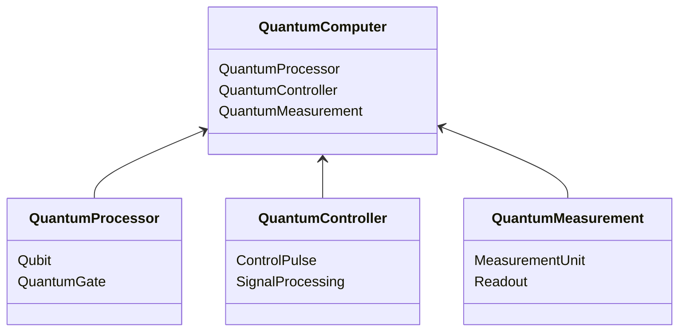

                 


# 量子计算：颠覆性技术的长期投资价值

---

## 关键词：
量子计算、投资价值、技术应用、算法原理、系统架构

---

## 摘要：
量子计算作为一种颠覆性技术，正在逐步从理论研究走向实际应用。本文将深入探讨量子计算的核心原理、算法实现、系统架构以及其在各个领域的潜在应用价值。通过分析当前技术发展现状、市场潜力以及投资风险，本文将为投资者提供关于量子计算技术长期投资价值的深度见解。

---

# 第1章: 量子计算概述

## 1.1 量子计算的基本概念

### 1.1.1 量子位与经典位的对比

- **经典位**：二进制位，0或1，存储信息的基本单位。
- **量子位（Qubit）**：量子系统中的最小信息单位，可以同时处于多个状态的叠加态。
- **区别**：经典位是确定的，而量子位可以同时处于多个状态，具有并行计算的能力。

### 1.1.2 量子叠加与量子纠缠

- **量子叠加**：量子位可以同时处于多个状态的线性组合，例如，一个量子位可以同时表示0和1的概率。
- **量子纠缠**：两个或多个量子位之间形成一种特殊的关系，使得对其中一个量子位的操作会直接影响另一个量子位的状态。

### 1.1.3 量子计算的核心原理

- 量子计算通过量子叠加和量子纠缠的特性，能够在更短的时间内完成某些复杂问题的计算。
- 量子计算的核心在于利用量子态的并行性，从而实现对问题的高效求解。

## 1.2 量子计算的优势与局限性

### 1.2.1 量子计算的优势

- **计算速度**：在某些特定问题上，量子计算机的计算速度远超经典计算机，例如大数分解和优化问题。
- **并行性**：量子计算机可以通过量子叠加和量子纠缠实现并行计算，从而在某些领域具有显著优势。

### 1.2.2 量子计算的局限性

- **技术难度**：量子计算机的制造和维护需要极高的技术门槛，例如量子位的稳定性和纠错能力。
- **应用范围**：目前量子计算机的应用范围有限，主要集中在特定领域的问题求解。

### 1.2.3 量子计算与经典计算的对比

- **计算原理**：经典计算基于二进制逻辑门，而量子计算基于量子逻辑门和量子叠加。
- **计算速度**：在特定问题上，量子计算具有显著优势，但在通用计算上并不一定优于经典计算。

## 1.3 量子计算的应用领域

### 1.3.1 量子计算在密码学中的应用

- **加密算法**：量子计算机可以快速破解基于大数分解的加密算法，如RSA。
- **后量子密码学**：研究抗量子计算机攻击的加密算法。

### 1.3.2 量子计算在优化问题中的应用

- **旅行商问题**：量子计算机可以通过量子算法优化旅行商问题，减少计算时间。
- **供应链优化**：利用量子计算优化供应链管理，提高效率。

### 1.3.3 量子计算在化学与材料科学中的应用

- **分子模拟**：量子计算机可以模拟复杂的分子结构，帮助发现新药和新材料。
- **材料科学**：通过量子计算优化材料性能，例如电池材料的研发。

## 1.4 本章小结

- 量子计算是一种基于量子叠加和量子纠缠的新型计算方式，具有并行计算的优势。
- 量子计算在密码学、优化问题和材料科学等领域具有广泛的应用潜力。
- 量子计算技术仍处于发展阶段，存在技术瓶颈和应用限制。

---

# 第2章: 量子计算的数学基础

## 2.1 量子态与向量空间

### 2.1.1 量子态的向量表示

- 量子态可以用向量空间中的向量表示，例如二维向量表示一个量子位的状态。

### 2.1.2 量子态的叠加原理

- 量子态的叠加原理允许量子态处于多个状态的线性组合，例如：

$$
|\psi\rangle = \alpha|0\rangle + \beta|1\rangle
$$

其中，$\alpha$ 和 $\beta$ 是复数，满足 $|\alpha|^2 + |\beta|^2 = 1$。

### 2.1.3 量子态的内积与外积

- 内积：两个量子态的内积用于计算它们的相似性。
- 外积：两个量子态的外积用于构建更高维的量子态。

## 2.2 量子门与量子电路

### 2.2.1 基本量子门的定义与矩阵表示

- **X门（NOT门）**：将0变为1，将1变为0。
  - 矩阵表示：
  $$
  X = \begin{bmatrix}
  0 & 1 \\
  1 & 0
  \end{bmatrix}
  $$

- **Z门（相位翻转门）**：将0变为0，将1变为-1。
  - 矩阵表示：
  $$
  Z = \begin{bmatrix}
  1 & 0 \\
  0 & -1
  \end{bmatrix}
  $$

- **H门（哈达玛门）**：将基态叠加到等概率的叠加态。
  - 矩阵表示：
  $$
  H = \frac{1}{\sqrt{2}} \begin{bmatrix}
  1 & 1 \\
  1 & -1
  \end{bmatrix}
  $$

### 2.2.2 量子电路的构建与组合

- 量子电路由多个量子门组成，用于实现特定的量子算法。
- 例如，使用H门和Z门构建的量子电路可以实现量子叠加和量子纠缠。

### 2.2.3 量子电路的复杂度分析

- 量子电路的复杂度通常用量子门的数量和深度来衡量。
- 复杂度分析是设计高效量子算法的关键。

## 2.3 量子计算的数学模型

### 2.3.1 量子计算的数学表达式

- 量子计算的数学模型可以用张量积的形式表示多个量子位的状态。
- 例如，两个量子位的总态可以表示为：
  $$
  |\psi\rangle = \alpha|00\rangle + \beta|01\rangle + \gamma|10\rangle + \delta|11\rangle
  $$

### 2.3.2 量子态的演化过程

- 量子态的演化过程由量子门的操作矩阵作用于初始态得到。
- 例如，初始态为$|0\rangle$，经过H门作用后变为$H|0\rangle = \frac{1}{\sqrt{2}}(|0\rangle + |1\rangle)$。

### 2.3.3 量子测量的数学模型

- 量子测量通过投影操作将量子态投影到某个基态上。
- 测量结果的概率由量子态在基态上的投影决定。

## 2.4 本章小结

- 量子计算的数学模型是量子计算的基础，包括量子态的表示、量子门的操作以及量子电路的构建。
- 量子门和量子电路的矩阵表示为量子算法的实现提供了数学基础。

---

# 第3章: 量子计算的算法与应用

## 3.1 Shor算法

### 3.1.1 Shor算法的基本原理

- Shor算法用于分解大数，是量子计算机在密码学中的重要应用。
- Shor算法通过量子傅里叶变换找到周期，从而分解大数。

### 3.1.2 Shor算法的数学模型

- Shor算法的核心是寻找整数n的周期，即找到最小的r使得$x^r \equiv 1 \mod n$。
- 通过量子傅里叶变换，Shor算法可以高效地找到r。

### 3.1.3 Shor算法的实现步骤

1. 初始化量子寄存器。
2. 使用量子傅里叶变换计算周期。
3. 测量周期并分解大数。

## 3.2 Grover算法

### 3.2.1 Grover算法的基本原理

- Grover算法用于无序数据库中的搜索问题，可以在$O(\sqrt{N})$次查询中找到目标。
- Grover算法利用量子叠加和量子干涉实现加速。

### 3.2.2 Grover算法的数学模型

- Grover算法通过振幅放大技术，将目标状态的振幅放大，从而提高测量概率。
- Grover算法的振幅放大过程可以通过量子门操作实现。

### 3.2.3 Grover算法的实现步骤

1. 初始化量子寄存器。
2. 进行振幅放大操作。
3. 测量结果。

## 3.3 本章小结

- Shor算法和Grover算法是量子计算中的经典算法，展示了量子计算在特定问题上的巨大优势。
- 量子算法的设计依赖于量子叠加和量子纠缠的特性。

---

# 第4章: 量子计算的系统分析与架构设计

## 4.1 量子计算机的组成

### 4.1.1 量子处理器

- 量子处理器是量子计算机的核心部分，负责执行量子门操作。
- 例如，超导量子位、离子阱量子位等。

### 4.1.2 量子控制单元

- 量子控制单元用于控制量子处理器的操作，例如脉冲生成和信号处理。

### 4.1.3 量子测量单元

- 量子测量单元用于测量量子态的结果，例如通过超导电路或光学测量。

## 4.2 量子计算机的架构设计

### 4.2.1 领域模型（Mermaid类图）



### 4.2.2 系统架构（Mermaid架构图）

```mermaid
top
    QuantumComputer
    ├── QuantumProcessor
    │   ├── Qubit
    │   └── QuantumGate
    ├── QuantumController
    │   ├── ControlPulse
    │   └── SignalProcessing
    └── QuantumMeasurement
        ├── MeasurementUnit
        └── Readout
```

### 4.2.3 系统接口设计

- 量子计算机的接口包括：
  - 控制接口：用于发送控制信号。
  - 测量接口：用于获取测量结果。
  - 数据接口：用于输入和输出数据。

## 4.3 本章小结

- 量子计算机的系统架构包括处理器、控制单元和测量单元。
- 量子计算机的架构设计需要考虑量子位的稳定性和纠错能力。

---

# 第5章: 量子计算的项目实战

## 5.1 环境配置

- 需要安装量子计算相关的库，例如Qiskit（IBM的量子计算库）。
- 配置量子计算机的环境，例如本地模拟器或云量子计算机。

## 5.2 代码实现

### 5.2.1 Shor算法的实现

```python
from qiskit import QuantumCircuit, execute, IBMQ
from qiskit.circuit import QuantumRegister, ClassicalRegister, CircuitInstruction
from qiskit.circuit.library import H, X, Measure

# 初始化量子寄存器
n = 4  # 问题规模
qr = QuantumRegister(n, 'q')
cr = ClassicalRegister(n, 'c')
qc = QuantumCircuit(qr, cr)

# Shor算法的量子部分
qc.h(qr[0])
qc.x(qr[1])
qc.h(qr[2])
qc.mct(qr[1:4], qr[0], 0)
qc.h(qr[0])
qc.measure(qr[0], cr[0])
qc.x(qr[1])
qc.mct(qr[1:4], qr[0], 0)
qc.h(qr[0])
qc.measure(qr[0], cr[0])

# 执行量子电路
job = execute(qc, backend='ibmq_qasm_simulator')
result = job.result()
print(result)
```

### 5.2.2 测量结果分析

- 执行上述代码后，可以通过结果分析得到量子计算的输出。
- 分析测量结果，验证Shor算法的正确性。

## 5.3 实际案例分析

- 使用Shor算法分解大数，例如分解n=15。
- 分析测量结果，确认分解结果是否正确。

## 5.4 本章小结

- 通过项目实战，可以理解量子算法的实现过程。
- 量子算法的实现需要结合量子计算的数学模型和系统架构。

---

# 第6章: 量子计算的投资价值分析

## 6.1 技术成熟度分析

- 量子计算目前仍处于早期阶段，但技术进步迅速。
- 主要技术瓶颈包括量子位的稳定性和纠错能力。

## 6.2 市场潜力分析

- 量子计算在密码学、优化问题和材料科学等领域具有广泛的应用潜力。
- 随着技术的成熟，量子计算的市场需求将迅速增长。

## 6.3 投资风险分析

- 量子计算的技术门槛高，投资风险较大。
- 市场竞争激烈，技术路线不确定。

## 6.4 投资建议

- 关注量子计算技术的最新进展。
- 投资量子计算相关的企业和研究机构。
- 分散投资风险，避免过度集中。

## 6.5 本章小结

- 量子计算具有巨大的市场潜力，但也面临技术瓶颈和投资风险。
- 投资者需要全面评估量子计算的投资价值，制定合理的投资策略。

---

# 第7章: 量子计算的未来展望

## 7.1 技术发展趋势

- 量子计算技术的进一步发展将依赖于量子位的稳定性和纠错能力的提升。
- 新型量子计算模型的探索将推动量子计算的发展。

## 7.2 应用领域的拓展

- 量子计算将在更多领域得到应用，例如金融、物流、能源等。
- 量子计算与人工智能的结合将推动新应用的出现。

## 7.3 量子计算的商业化前景

- 量子计算的商业化正在逐步展开，例如 IBM 的量子云服务。
- 未来的量子计算市场将更加多元化。

## 7.4 本章小结

- 量子计算的未来发展趋势包括技术进步、应用拓展和商业化进程。
- 量子计算将继续推动计算技术的革命。

---

# 作者：AI天才研究院/AI Genius Institute & 禅与计算机程序设计艺术 /Zen And The Art of Computer Programming

---

**全文完**

