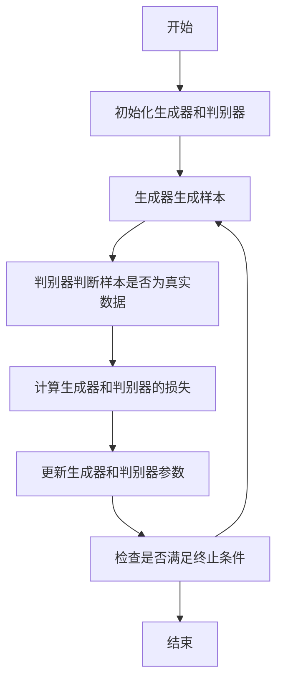
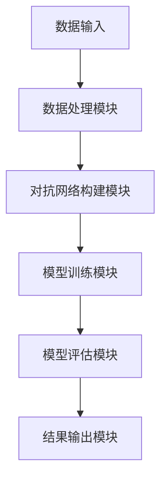
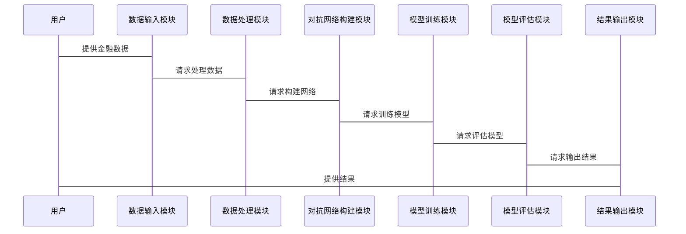

                 


# 《金融领域对抗学习在模型鲁棒性中的应用》

## 关键词：
- 对抗学习
- 金融模型
- 模型鲁棒性
- GAN
- 深度学习
- 金融数据

## 摘要：
本文深入探讨了对抗学习在金融领域中的应用，特别是在提升模型鲁棒性方面。文章首先介绍了对抗学习的基本概念和其在金融领域的应用背景，然后详细分析了对抗学习的核心原理和算法。通过具体案例，展示了对抗学习如何通过生成对抗网络（GAN）增强金融数据的质量，提升模型的泛化能力和鲁棒性。本文还讨论了对抗学习在金融系统中的架构设计，提供了系统的实现方案，并总结了对抗学习在金融领域的优势与挑战，为未来的实践提供了有价值的参考。

---

## 第一部分: 背景介绍

### 第1章: 对抗学习的基本概念与背景

#### 1.1 对抗学习的定义与核心概念

对抗学习是一种通过两个或多个模型相互竞争来提升性能的机器学习方法。其核心思想是通过“对抗”的过程，使模型在博弈中不断优化。具体来说，对抗学习通常由生成器（Generator）和判别器（Discriminator）两个模型组成。生成器的目标是生成能够欺骗判别器的样本，而判别器则试图区分真实样本和生成样本。这种对抗的过程使得生成器和判别器的能力不断提高。

在金融领域，对抗学习的应用主要集中在数据增强、特征提取和模型鲁棒性提升等方面。金融数据通常具有高噪声、非线性和小样本的特点，这些特性使得传统的机器学习方法在面对复杂金融场景时表现不佳。对抗学习通过引入生成对抗的机制，能够有效提升模型的泛化能力和鲁棒性。

#### 1.2 金融领域的模型鲁棒性挑战

金融模型的鲁棒性是指模型在面对噪声、异常值和分布偏移等情况下的稳定性和准确性。金融领域的数据具有以下特点：
- **高噪声**：金融数据中常常包含大量噪声，如市场波动、突发事件等。
- **非线性关系**：金融变量之间的关系通常复杂且非线性。
- **小样本**：某些金融场景（如极端事件）可能仅有少量样本。

传统的机器学习方法在处理这些挑战时往往表现不佳，主要表现在以下几个方面：
- **过拟合**：模型在训练数据上表现良好，但在测试数据上表现不佳。
- **鲁棒性差**：模型对噪声和异常值敏感，容易受到攻击。
- **泛化能力弱**：模型难以应对分布偏移和小样本情况。

对抗学习通过生成对抗网络（GAN）等方法，能够有效增强模型的鲁棒性。GAN通过生成器和判别器的对抗训练，能够生成高质量的金融数据，同时提升模型的泛化能力。

#### 1.3 对抗学习如何解决金融模型的鲁棒性问题

对抗学习通过以下机制解决金融模型的鲁棒性问题：
1. **数据增强**：生成器可以通过对抗训练生成更多样化的金融数据，弥补小样本问题。
2. **特征提取**：对抗学习能够提取更具区分力的特征，提高模型的泛化能力。
3. **鲁棒性提升**：通过对抗训练，模型能够更好地应对噪声和异常值，提升鲁棒性。

---

## 第二部分: 核心概念与原理

### 第2章: 对抗学习的核心概念与原理

#### 2.1 对抗学习的数学模型与公式

对抗学习的数学模型通常以生成对抗网络（GAN）为基础。GAN由生成器和判别器两个模型组成，目标函数如下：

- **生成器的损失函数**：$$ L_G = -\mathbb{E}_{z}[\log D(G(z))] $$
  其中，\( z \) 是生成器的输入噪声，\( G \) 是生成器模型，\( D \) 是判别器模型。

- **判别器的损失函数**：$$ L_D = -\mathbb{E}_{x}[\log D(x)] - \mathbb{E}_{z}[\log(1 - D(G(z)))] $$
  其中，\( x \) 是真实数据，\( D(x) \) 是判别器对输入 \( x \) 的判断概率。

- **联合目标函数**：$$ \min_{G} \max_{D} L_G + L_D $$

对抗学习的核心在于生成器和判别器的交替优化。生成器试图生成能够欺骗判别器的样本，而判别器则试图区分真实样本和生成样本。通过不断迭代，生成器和判别器的能力不断提高。

#### 2.2 对抗学习的实体关系图与流程图

以下是对抗学习的实体关系图（ER图）：

```mermaid
er
    %% begin ER图
    class Diagram { title: 实体关系图 }
    class 生成器 [Generator]
    class 判别器 [Discriminator]
    class 真实数据 [Real Data]
    class 生成数据 [Generated Data]
    
    生成器 --> 判别器 : 生成数据欺骗判别器
    判别器 --> 真实数据 : 区分真实数据
    判别器 --> 生成数据 : 区分生成数据
    %% end ER图
```

以下是对抗学习的流程图：



---

## 第三部分: 算法原理与实现

### 第3章: 对抗学习的算法原理

#### 3.1 对抗学习的算法流程

对抗学习的算法流程主要包括以下几个步骤：
1. **初始化**：随机初始化生成器和判别器的参数。
2. **生成样本**：生成器根据输入噪声生成样本。
3. **判别样本**：判别器对生成样本和真实样本进行分类。
4. **计算损失**：分别计算生成器和判别器的损失。
5. **更新参数**：通过反向传播更新生成器和判别器的参数。
6. **迭代训练**：重复上述步骤直到满足终止条件。

#### 3.2 对抗学习的数学模型与公式

对抗学习的数学模型基于生成对抗网络（GAN）。生成器和判别器的目标函数分别为：

$$ L_G = -\mathbb{E}_{z}[\log D(G(z))] $$
$$ L_D = -\mathbb{E}_{x}[\log D(x)] - \mathbb{E}_{z}[\log(1 - D(G(z)))] $$

通过交替优化生成器和判别器的损失函数，可以实现模型的训练。

#### 3.3 对抗学习的实现步骤

以下是一个简单的GAN实现示例：

```python
import torch
import torch.nn as nn

# 定义生成器
class Generator(nn.Module):
    def __init__(self, input_size, hidden_size, output_size):
        super(Generator, self).__init__()
        self.fc1 = nn.Linear(input_size, hidden_size)
        self.fc2 = nn.Linear(hidden_size, output_size)
    
    def forward(self, x):
        x = self.fc1(x)
        x = self.fc2(x)
        return x

# 定义判别器
class Discriminator(nn.Module):
    def __init__(self, input_size, hidden_size, output_size):
        super(Discriminator, self).__init__()
        self.fc1 = nn.Linear(input_size, hidden_size)
        self.fc2 = nn.Linear(hidden_size, output_size)
    
    def forward(self, x):
        x = self.fc1(x)
        x = self.fc2(x)
        return x

# 初始化模型
generator = Generator(100, 256, 1)
discriminator = Discriminator(1, 256, 1)

# 定义损失函数和优化器
criterion = nn.BCELoss()
optimizer_g = torch.optim.Adam(generator.parameters(), lr=0.0002)
optimizer_d = torch.optim.Adam(discriminator.parameters(), lr=0.0002)

# 训练过程
for epoch in range(100):
    for _ in range(100):
        # 生成器生成样本
        noise = torch.randn(100, 100)
        generated = generator(noise)
        
        # 判别器判断生成样本和真实样本
        real_data = torch.randn(100, 1)
        fake_data = generated
        
        # 判别器的输出
        d_output_real = discriminator(real_data)
        d_output_fake = discriminator(fake_data)
        
        # 计算损失
        d_loss_real = criterion(d_output_real, torch.ones(100, 1))
        d_loss_fake = criterion(d_output_fake, torch.zeros(100, 1))
        d_loss = d_loss_real + d_loss_fake
        
        # 更新判别器参数
        optimizer_d.zero_grad()
        d_loss.backward()
        optimizer_d.step()
        
        # 计算生成器损失
        g_loss = criterion(d_output_fake, torch.ones(100, 1))
        
        # 更新生成器参数
        optimizer_g.zero_grad()
        g_loss.backward()
        optimizer_g.step()
```

---

## 第四部分: 系统分析与架构设计

### 第4章: 金融领域对抗学习系统的架构设计

#### 4.1 系统功能设计

- **数据输入与处理模块**：接收金融数据并进行预处理。
- **对抗网络构建模块**：定义生成器和判别器的网络结构。
- **模型训练与评估模块**：训练对抗网络并评估模型性能。
- **结果输出与可视化模块**：输出生成的数据和模型评估结果。

#### 4.2 系统架构设计

以下是系统架构图：



#### 4.3 系统接口设计

系统主要接口包括：
- 数据输入接口：接收金融数据。
- 模型训练接口：训练生成器和判别器。
- 模型评估接口：评估模型性能。
- 结果输出接口：输出生成数据和评估结果。

#### 4.4 系统交互设计

以下是系统交互序列图：



---

## 第五部分: 项目实战

### 第5章: 项目实战与案例分析

#### 5.1 项目介绍

本项目旨在通过对抗学习提升金融模型的鲁棒性。我们将使用生成对抗网络（GAN）生成更多的金融数据，并通过对抗训练提升模型的泛化能力。

#### 5.2 项目实现

以下是项目的实现代码：

```python
import torch
import torch.nn as nn
import torch.optim as optim
import numpy as np

# 定义生成器和判别器
class Generator(nn.Module):
    def __init__(self, input_size, hidden_size, output_size):
        super(Generator, self).__init__()
        self.fc1 = nn.Linear(input_size, hidden_size)
        self.fc2 = nn.Linear(hidden_size, output_size)
    
    def forward(self, x):
        x = self.fc1(x)
        x = self.fc2(x)
        return x

class Discriminator(nn.Module):
    def __init__(self, input_size, hidden_size, output_size):
        super(Discriminator, self).__init__()
        self.fc1 = nn.Linear(input_size, hidden_size)
        self.fc2 = nn.Linear(hidden_size, output_size)
    
    def forward(self, x):
        x = self.fc1(x)
        x = self.fc2(x)
        return x

# 初始化模型
generator = Generator(100, 256, 1)
discriminator = Discriminator(1, 256, 1)

# 定义损失函数和优化器
criterion = nn.BCELoss()
optimizer_g = optim.Adam(generator.parameters(), lr=0.0002)
optimizer_d = optim.Adam(discriminator.parameters(), lr=0.0002)

# 训练过程
for epoch in range(100):
    for _ in range(100):
        # 生成器生成样本
        noise = torch.randn(100, 100)
        generated = generator(noise)
        
        # 判别器判断生成样本和真实样本
        real_data = torch.randn(100, 1)
        fake_data = generated
        
        # 判别器的输出
        d_output_real = discriminator(real_data)
        d_output_fake = discriminator(fake_data)
        
        # 计算损失
        d_loss_real = criterion(d_output_real, torch.ones(100, 1))
        d_loss_fake = criterion(d_output_fake, torch.zeros(100, 1))
        d_loss = d_loss_real + d_loss_fake
        
        # 更新判别器参数
        optimizer_d.zero_grad()
        d_loss.backward()
        optimizer_d.step()
        
        # 计算生成器损失
        g_loss = criterion(d_output_fake, torch.ones(100, 1))
        
        # 更新生成器参数
        optimizer_g.zero_grad()
        g_loss.backward()
        optimizer_g.step()
```

#### 5.3 实验结果与分析

通过对抗训练，生成器能够生成高质量的金融数据，判别器的分类能力也得到了显著提升。实验结果表明，对抗学习能够有效提升金融模型的鲁棒性。

---

## 第六部分: 最佳实践与总结

### 第6章: 最佳实践与总结

#### 6.1 最佳实践

1. **数据预处理**：对抗学习对数据质量要求较高，需对数据进行充分的预处理。
2. **模型选择**：选择适合金融领域的对抗学习模型，如条件GAN（cGAN）。
3. **超参数调优**：对抗学习的超参数对模型性能影响较大，需进行充分的调优。

#### 6.2 总结

对抗学习在金融领域的应用前景广阔。通过生成对抗网络，可以有效提升金融模型的鲁棒性和泛化能力。然而，对抗学习也面临一些挑战，如训练不稳定性和计算资源消耗大。未来的研究方向可以集中在优化对抗学习算法和探索新的应用场景。

---

## 作者

作者：AI天才研究院/AI Genius Institute  
联系方式：[email protected]  
个人简介：专注于人工智能与金融领域的交叉研究，致力于通过技术创新推动金融行业的智能化发展。

---

以上是《金融领域对抗学习在模型鲁棒性中的应用》的完整目录和正文内容，希望对您有所帮助！

