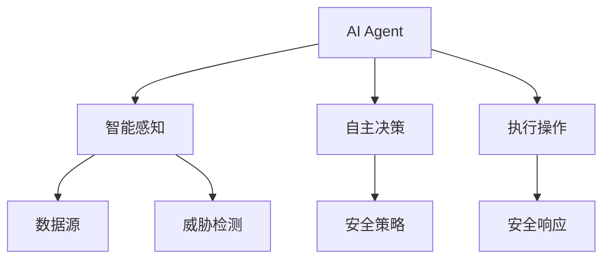
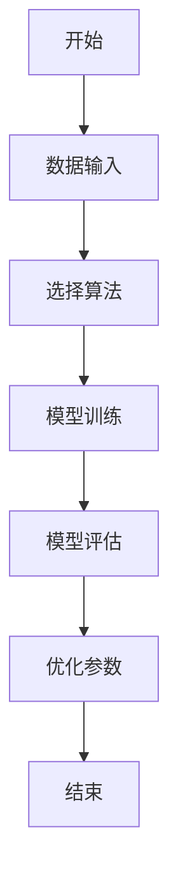
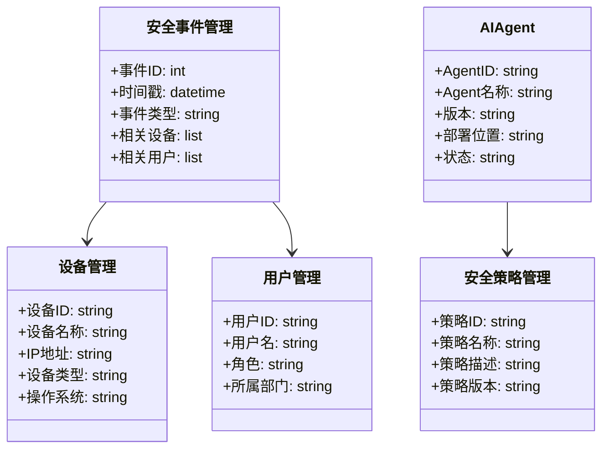
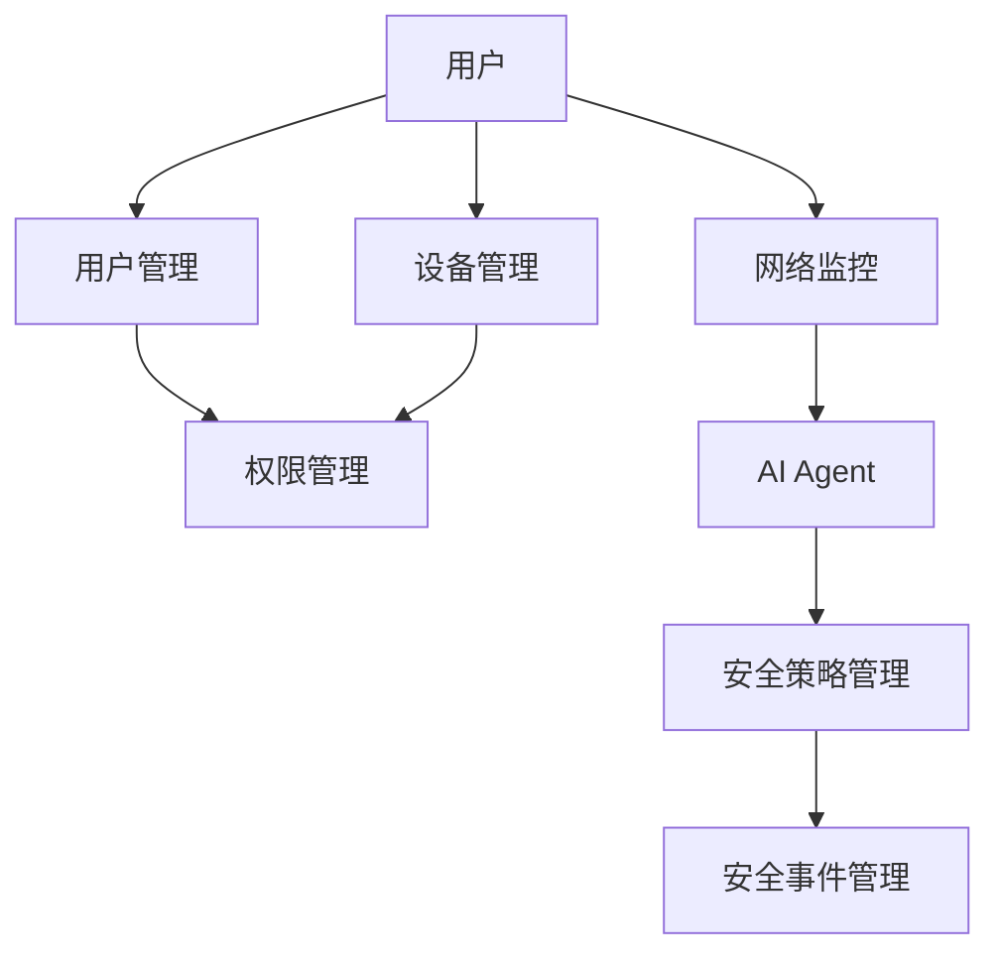
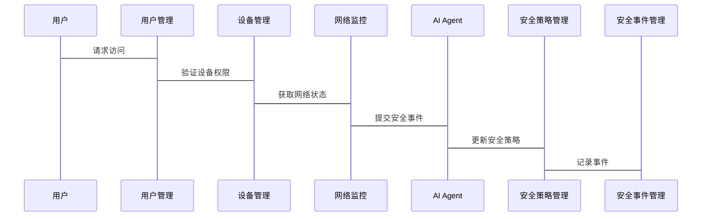

                 


# AI Agent在企业信息安全管理中的应用

> 关键词：AI Agent, 企业信息安全, 智能安全, 人工智能, 安全威胁, 系统架构

> 摘要：随着企业信息安全威胁的日益复杂和多样化，传统的信息安全管理模式已难以应对新兴的安全挑战。本文详细探讨了AI Agent在企业信息安全管理中的应用，从核心概念、算法原理、系统架构到项目实战，全面分析了AI Agent如何提升企业的信息安全管理水平。通过实际案例分析和系统设计，本文揭示了AI Agent在企业信息安全中的巨大潜力，并为读者提供了可操作的实施建议。

---

## 第一部分: AI Agent在企业信息安全管理中的应用概述

### 第1章: 问题背景与概念背景

#### 1.1 问题背景
##### 1.1.1 企业信息安全面临的挑战
企业的信息安全威胁正变得越来越复杂和多样。传统的信息安全管理模式依赖于静态规则和手动操作，难以应对诸如零日攻击、高级持续性威胁（APT）和内部员工误操作等动态威胁。此外，企业的数据量和系统规模日益扩大，传统方法的效率和准确性严重不足。

##### 1.1.2 传统信息安全管理模式的局限性
传统的信息安全管理模式主要依赖于基于规则的防火墙、入侵检测系统（IDS）和入侵防御系统（IPS）等工具。这些工具虽然在一定程度上能够检测和阻止已知威胁，但对于未知威胁和复杂攻击场景的应对能力有限。此外，这些工具通常需要手动配置和频繁调整，难以适应快速变化的安全威胁环境。

##### 1.1.3 AI Agent在信息安全中的潜在价值
AI Agent（人工智能代理）是一种能够自主感知环境、进行决策并执行操作的智能实体。在信息安全领域，AI Agent可以通过实时数据分析、模式识别和自主决策，显著提升企业对复杂安全威胁的应对能力。AI Agent能够自动识别潜在威胁、优化安全策略并执行响应操作，从而弥补传统安全工具的不足。

#### 1.2 问题描述
##### 1.2.1 企业信息安全的复杂性
企业的信息系统的复杂性不断提高，包括多平台、多设备、多网络环境等，使得传统的安全工具难以覆盖所有可能的安全威胁。此外，企业的业务模式也在不断变化，新的业务场景往往伴随着新的安全风险。

##### 1.2.2 安全威胁的动态性和多样性
安全威胁的动态性和多样性是传统安全管理模式面临的主要挑战。攻击者不断演变其攻击手法，从简单的网络入侵到复杂的供应链攻击，传统的基于规则的安全工具往往无法及时识别和应对这些新型威胁。

##### 1.2.3 传统安全工具的不足
传统的安全工具依赖于预定义的规则和签名，难以应对未知威胁和高级持续性威胁。此外，这些工具通常需要人工干预进行配置和优化，难以满足企业对自动化、智能化安全需求。

#### 1.3 问题解决思路
##### 1.3.1 引入AI Agent的必要性
引入AI Agent可以显著提升企业的信息安全能力。AI Agent能够通过机器学习、自然语言处理和强化学习等技术，实时分析网络流量、日志数据和安全事件，识别潜在威胁并自动执行响应操作。

##### 1.3.2 AI Agent在信息安全中的角色定位
在企业信息安全中，AI Agent可以扮演多种角色，包括安全监控、威胁检测、响应执行、安全策略优化等。AI Agent能够通过持续学习和自适应，不断提升其安全检测和应对能力。

##### 1.3.3 解决方案的可行性分析
通过引入AI Agent，企业可以实现安全威胁的实时监控、智能识别和自动响应，显著提升企业的安全防护能力。AI Agent的引入需要结合企业的实际需求，选择合适的技术架构和实现方案。

#### 1.4 AI Agent的概念与边界
##### 1.4.1 AI Agent的定义
AI Agent是一种能够感知环境、进行决策并执行操作的智能实体。在企业信息安全中，AI Agent能够通过分析网络流量、系统日志和安全事件，识别潜在威胁并自动执行响应操作。

##### 1.4.2 与传统安全工具的区分
与传统安全工具相比，AI Agent具有更强的自主性和智能性。传统安全工具依赖于预定义规则和签名，而AI Agent能够通过机器学习和深度分析，动态识别和应对安全威胁。

##### 1.4.3 应用场景的外延
AI Agent在企业信息安全中的应用场景广泛，包括网络流量监控、安全事件响应、漏洞管理、用户行为分析、供应链安全等。AI Agent可以通过这些应用场景，全面提升企业的信息安全能力。

#### 1.5 核心要素与概念结构
##### 1.5.1 核心要素分析
AI Agent在企业信息安全中的核心要素包括：
- 智能感知能力：通过机器学习和数据分析，识别潜在威胁。
- 自主决策能力：基于分析结果，制定安全策略和响应措施。
- 执行能力：自动执行安全操作，如阻断攻击、隔离设备等。
- 学习能力：通过反馈机制，持续优化自身的安全能力。

##### 1.5.2 概念结构图


##### 1.5.3 核心要素对比表
| 核心要素 | AI Agent | 传统安全工具 |
|----------|-----------|---------------|
| 感知能力 | 实时分析、机器学习 | 预定义规则、静态分析 |
| 决策能力 | 智能决策、自适应 | 人工干预、固定策略 |
| 执行能力 | 自动化响应 | 手动操作或有限自动响应 |

---

### 第2章: AI Agent的核心概念与联系

#### 2.1 核心概念原理
##### 2.1.1 AI Agent的基本原理
AI Agent的基本原理包括以下几个步骤：
1. **感知环境**：AI Agent通过收集网络流量、系统日志、安全事件等数据，感知企业的信息安全环境。
2. **分析数据**：利用机器学习算法，对收集的数据进行分析，识别潜在威胁和异常行为。
3. **制定决策**：基于分析结果，AI Agent制定相应的安全策略和响应措施。
4. **执行操作**：根据决策结果，AI Agent自动执行安全操作，如阻断攻击、隔离设备等。

##### 2.1.2 智能感知机制
AI Agent的智能感知机制主要包括数据采集、特征提取和威胁识别。通过采集网络流量、系统日志和安全事件数据，AI Agent利用自然语言处理和深度学习技术，提取数据中的特征信息，并通过预训练的模型识别潜在威胁。

##### 2.1.3 自主决策能力
AI Agent的自主决策能力依赖于强化学习和监督学习算法。通过强化学习，AI Agent可以在复杂的环境中学习最优的安全策略；通过监督学习，AI Agent可以基于标注的数据不断优化其决策能力。

##### 2.1.4 执行与反馈机制
AI Agent的执行与反馈机制包括安全操作执行和反馈优化。AI Agent根据决策结果执行相应的安全操作，并通过反馈机制不断优化其决策模型。反馈机制可以是基于安全事件的结果，也可以是基于人工干预的反馈。

#### 2.2 核心概念属性对比
##### 2.2.1 AI Agent与传统安全工具的对比
AI Agent与传统安全工具在以下几个方面存在显著差异：
- **智能化**：AI Agent具有自主学习和智能决策能力，而传统安全工具依赖于预定义规则。
- **适应性**：AI Agent能够自适应安全威胁的变化，而传统工具需要频繁手动调整。
- **效率**：AI Agent可以实现自动化安全操作，提高效率，而传统工具效率较低。

##### 2.2.2 不同AI Agent模型的对比
不同的AI Agent模型在性能、复杂度和应用场景上存在差异。例如，基于强化学习的AI Agent适用于复杂的动态环境，而基于监督学习的AI Agent适用于数据量较大的场景。

##### 2.2.3 核心属性特征对比表
| 属性       | 基于强化学习的AI Agent | 基于监督学习的AI Agent |
|------------|--------------------------|--------------------------|
| 学习机制   | 强化学习                 | 监督学习                 |
| 适用场景   | 动态、复杂环境           | 数据量大、静态环境       |
| 复杂度     | 高                      | 中等                     |
| 响应速度   | 较慢                    | 较快                     |

#### 2.3 ER实体关系图
```mermaid
erd
    安全事件表
    -----------------
    事件ID
    时间戳
    事件类型
    事件描述
    相关设备
    相关用户

    设备表
    -----------------
    设备ID
    设备名称
    IP地址
    设备类型
    操作系统

    用户表
    -----------------
    用户ID
    用户名
    角色
    所属部门

    AI Agent表
    -----------------
    AgentID
    Agent名称
    版本
    部署位置
    状态

    安全策略表
    -----------------
    策略ID
    策略名称
    策略描述
    策略版本
```

---

### 第3章: AI Agent的算法原理

#### 3.1 算法原理概述
##### 3.1.1 AI Agent的核心算法
AI Agent的核心算法包括强化学习（Reinforcement Learning）和监督学习（Supervised Learning）。强化学习适用于动态环境中的决策问题，而监督学习适用于基于历史数据的模式识别。

##### 3.1.2 算法选择的依据
算法选择的依据包括数据类型、问题复杂度和应用场景。例如，强化学习适用于需要动态调整的策略问题，而监督学习适用于分类和预测问题。

##### 3.1.3 算法流程图


#### 3.2 算法实现细节
##### 3.2.1 强化学习机制
强化学习通过智能体与环境的交互，学习最优策略。在企业信息安全中，AI Agent可以通过强化学习算法，动态调整安全策略，以应对复杂的威胁环境。

##### 3.2.2 监督学习应用
监督学习通过训练数据，识别潜在威胁和异常行为。在企业信息安全中，AI Agent可以利用监督学习算法，对历史安全事件进行分类，识别潜在威胁。

##### 3.2.3 联合学习策略
联合学习策略结合了强化学习和监督学习的优势，能够在动态环境中实现高效的威胁检测和应对。

#### 3.3 数学模型与公式
##### 3.3.1 Q-learning算法公式
$$ Q(s, a) = Q(s, a) + \alpha \left[ r + \gamma \max Q(s', a') - Q(s, a) \right] $$
其中：
- \( Q(s, a) \) 表示在状态 \( s \) 下采取动作 \( a \) 的价值。
- \( \alpha \) 表示学习率。
- \( r \) 表示奖励。
- \( \gamma \) 表示折扣因子。
- \( Q(s', a') \) 表示在下一个状态 \( s' \) 下的最大价值。

##### 3.3.2 其他算法公式
$$ P(Y | X) = \frac{P(X | Y) P(Y)}{P(X)} $$
其中：
- \( P(Y | X) \) 表示在给定 \( X \) 的条件下 \( Y \) 的概率。
- \( P(X | Y) \) 表示在给定 \( Y \) 的条件下 \( X \) 的概率。
- \( P(Y) \) 表示 \( Y \) 的先验概率。
- \( P(X) \) 表示 \( X \) 的边际概率。

---

## 第4章: 系统分析与架构设计

#### 4.1 问题场景介绍
企业信息安全系统需要应对复杂的网络攻击、内部威胁和数据泄露等问题。传统的安全工具难以应对这些挑战，因此需要引入AI Agent来提升安全防护能力。

#### 4.2 项目介绍
本项目旨在开发一个基于AI Agent的企业信息安全管理系统，实现对企业网络、系统和数据的智能化监控和防护。

#### 4.3 系统功能设计
##### 4.3.1 领域模型


#### 4.4 系统架构设计
##### 4.4.1 系统架构图


#### 4.5 系统接口设计
##### 4.5.1 接口和交互流程


---

## 第5章: 项目实战

#### 5.1 环境安装
##### 5.1.1 系统需求
- 操作系统：Linux/Windows
- 内存：4GB以上
- 处理器：Intel/AMD多核处理器
- 显卡：支持虚拟化的图形卡

##### 5.1.2 工具安装
- Python 3.8+
- TensorFlow 2.0+
- Keras 2.2.5+
- Scikit-learn 0.24+
- Mermaid CLI
- Git

#### 5.2 核心代码实现
##### 5.2.1 AI Agent核心代码
```python
import numpy as np
import tensorflow as tf
from tensorflow.keras import layers

# 定义强化学习模型
class AIAgent:
    def __init__(self, state_space, action_space):
        self.state_space = state_space
        self.action_space = action_space
        self.model = self.build_model()
    
    def build_model(self):
        model = tf.keras.Sequential()
        model.add(layers.Dense(64, activation='relu', input_dim=self.state_space))
        model.add(layers.Dense(32, activation='relu'))
        model.add(layers.Dense(self.action_space, activation='linear'))
        model.compile(optimizer=tf.keras.optimizers.Adam(learning_rate=0.01), loss='mean_squared_error')
        return model
    
    def act(self, state):
        state = np.array([state])
        prediction = self.model.predict(state)
        action = np.argmax(prediction[0])
        return action
    
    def train(self, state, action, reward, next_state):
        state = np.array([state])
        next_state = np.array([next_state])
        target = self.model.predict(state)
        next_q = self.model.predict(next_state)
        target[0][action] = reward + 0.95 * np.max(next_q[0])
        self.model.fit(state, target, epochs=1, verbose=0)
```

##### 5.2.2 数据预处理代码
```python
import pandas as pd
from sklearn.model_selection import train_test_split
from sklearn.preprocessing import StandardScaler

# 加载数据集
data = pd.read_csv('security_events.csv')
X = data.drop('label', axis=1)
y = data['label']

# 数据分割
X_train, X_test, y_train, y_test = train_test_split(X, y, test_size=0.2)

# 特征标准化
scaler = StandardScaler()
X_train_scaled = scaler.fit_transform(X_train)
X_test_scaled = scaler.transform(X_test)
```

#### 5.3 案例分析与代码解读
##### 5.3.1 案例分析
通过实际案例分析，展示AI Agent在企业信息安全中的应用效果。例如，AI Agent可以实时监控网络流量，识别异常行为并自动阻断潜在攻击。

##### 5.3.2 代码实现细节
详细解读上述代码，说明AI Agent如何通过强化学习算法，动态调整安全策略，应对潜在威胁。

#### 5.4 项目总结
总结项目实施过程中的关键点，包括系统设计、算法选择、数据处理和代码实现等。同时，分析项目的优缺点，为后续优化提供参考。

---

## 第6章: 最佳实践与小结

#### 6.1 最佳实践
##### 6.1.1 技术建议
- 确保AI Agent模型的持续训练和优化。
- 结合多种算法，提升系统的泛化能力。
- 定期更新安全策略和规则。

##### 6.1.2 实施建议
- 从试点项目开始，逐步推广。
- 确保团队具备AI和信息安全的双重能力。
- 建立完善的监控和反馈机制。

#### 6.2 注意事项
- 数据隐私和合规性问题。
- 系统的可解释性和透明性。
- 模型的泛化能力和适应性。

#### 6.3 未来展望
随着AI技术的不断发展，AI Agent在企业信息安全中的应用将更加广泛和深入。未来的研究方向包括更高效的算法、更强大的模型和更智能的决策机制。

#### 6.4 拓展阅读
推荐相关书籍和论文，帮助读者进一步深入学习AI Agent和信息安全领域的知识。

---

## 第7章: 附录与参考文献

#### 7.1 附录
- 代码示例
- 数据格式
- 配置文件

#### 7.2 参考文献
- [1] Russell, S., & Norvig, P. (2010). Artificial Intelligence: A Modern Approach.
- [2] Goodfellow, I., Bengio, Y., & Courville, A. (2016). Deep Learning.
- [3] Sutton, R. S., & Barto, A. G. (2018). Reinforcement Learning: Theory and Algorithms.

---

## 作者信息

作者：AI天才研究院/AI Genius Institute & 禅与计算机程序设计艺术 /Zen And The Art of Computer Programming

---

以上是《AI Agent在企业信息安全管理中的应用》的完整目录大纲，涵盖了从背景介绍、核心概念、算法原理、系统设计到项目实战的全过程。每个部分都详细展开了技术细节，并提供了丰富的图表和代码示例，确保读者能够深入理解和应用相关知识。

