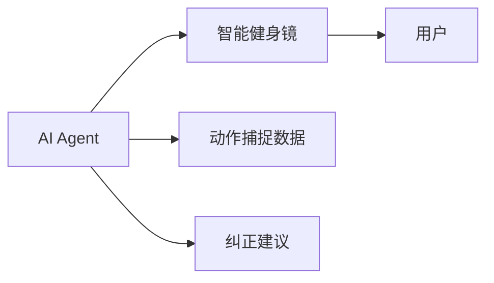
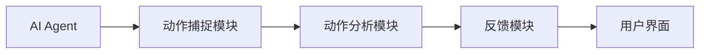
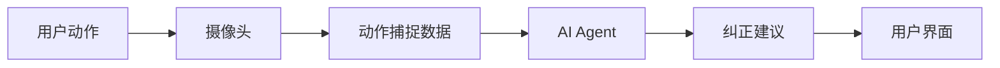
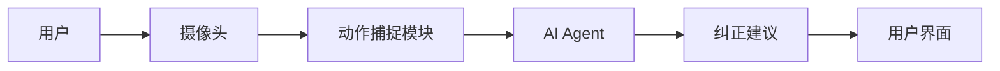

                 


# AI Agent在智能健身镜中的实时动作纠正

> 关键词：AI Agent, 智能健身镜, 实时动作纠正, 计算机视觉, 姿态估计

> 摘要：本文详细探讨了AI Agent在智能健身镜中的实时动作纠正技术。通过背景介绍、核心概念、算法原理、系统架构、项目实战和总结，全面分析了AI Agent在智能健身镜中的应用及其技术实现。文章还讨论了实时性优化、系统架构设计和实际案例分析，为读者提供了深入的技术见解。

---

## 第一部分：AI Agent与智能健身镜的背景与概念

### 第1章：AI Agent与智能健身镜的概述

#### 1.1 AI Agent的基本概念

##### 1.1.1 AI Agent的定义
AI Agent（人工智能代理）是指能够感知环境、自主决策并执行任务的智能实体。它可以是一个软件程序或物理设备，具备以下核心特征：
- **自主性**：无需外部干预，自主决策。
- **反应性**：能实时感知环境并做出反应。
- **目标导向**：基于目标执行任务。
- **学习能力**：通过数据和经验不断优化性能。

##### 1.1.2 AI Agent的核心特征
- **自主性**：AI Agent无需外部指令，能够自主完成任务。
- **反应性**：能够实时感知环境变化并做出相应反应。
- **目标导向**：基于预设目标执行任务。
- **学习能力**：通过数据和经验不断优化性能。

##### 1.1.3 AI Agent的应用场景
AI Agent广泛应用于多个领域，包括：
- **智能家居**：控制家庭设备，提供便利生活。
- **自动驾驶**：处理车辆的感知和决策。
- **健康监测**：实时监测用户的健康状况，提供反馈。
- **教育辅助**：帮助学生进行学习指导和反馈。

#### 1.2 智能健身镜的定义与特点

##### 1.2.1 智能健身镜的功能介绍
智能健身镜是一种结合了AI技术和镜子的健身设备，能够实时捕捉用户的动作，提供健身指导和反馈。其主要功能包括：
- **动作捕捉**：通过摄像头和传感器捕捉用户的动作。
- **动作分析**：分析用户的动作是否标准，识别错误动作。
- **实时反馈**：提供即时的纠正建议，帮助用户调整动作。

##### 1.2.2 智能健身镜的技术实现
智能健身镜的技术实现主要依赖于：
- **计算机视觉**：用于捕捉和分析用户的动作。
- **AI算法**：用于识别动作并提供反馈。
- **人机交互**：通过镜子界面与用户进行实时互动。

##### 1.2.3 智能健身镜的市场现状
随着健康意识的增强和科技的进步，智能健身镜在市场上的需求日益增长。其优势包括：
- **便捷性**：用户可以在家中进行专业级的健身训练。
- **个性化**：根据用户的身体状况和健身目标提供定制化建议。
- **高效性**：通过AI技术实现快速、精准的动作纠正。

#### 1.3 AI Agent在智能健身镜中的应用

##### 1.3.1 AI Agent在健身领域的价值
AI Agent在健身领域的应用价值主要体现在：
- **实时反馈**：能够实时捕捉用户动作并提供反馈，帮助用户纠正错误动作。
- **个性化指导**：根据用户的动作习惯和身体状况提供个性化的健身建议。
- **持续优化**：通过学习用户的动作数据，不断优化健身计划和反馈策略。

##### 1.3.2 智能健身镜中的实时动作纠正需求
在智能健身镜中，实时动作纠正的需求主要来自：
- **用户安全**：错误的动作可能导致运动损伤，实时纠正可以有效预防受伤。
- **健身效果**：正确的动作有助于提高健身效果，确保用户达到预期的健身目标。
- **用户体验**：实时反馈能够提升用户的锻炼体验，增加用户的参与感和满意度。

##### 1.3.3 AI Agent与智能健身镜的结合
AI Agent与智能健身镜的结合主要体现在以下几个方面：
- **动作捕捉与分析**：AI Agent通过计算机视觉技术捕捉用户的动作，并利用深度学习算法进行分析。
- **实时反馈与纠正**：AI Agent能够实时识别用户的错误动作，并通过镜子界面提供纠正建议。
- **个性化健身计划**：AI Agent根据用户的动作数据和健身目标，制定个性化的健身计划。

---

## 第二部分：AI Agent与智能健身镜的核心概念与联系

### 第2章：AI Agent与智能健身镜的核心概念

#### 2.1 AI Agent的核心概念

##### 2.1.1 AI Agent的主体与客体关系
AI Agent作为主体，与用户、健身环境等客体进行交互。主体通过感知客体的状态和行为，做出相应的反应和决策。

##### 2.1.2 AI Agent的感知与决策能力
AI Agent具备强大的感知能力和决策能力，能够通过多种传感器和数据源获取环境信息，并基于这些信息做出最优决策。

##### 2.1.3 AI Agent的交互方式
AI Agent可以通过语音、手势、触控等多种方式进行与用户的交互，提供实时的反馈和指导。

#### 2.2 智能健身镜的核心概念

##### 2.2.1 智能健身镜的硬件组成
智能健身镜的主要硬件包括：
- **摄像头**：用于捕捉用户的动作和姿势。
- **显示屏**：作为交互界面，显示健身指导和反馈信息。
- **传感器**：用于检测用户的动作细节和环境信息。

##### 2.2.2 智能健身镜的软件架构
智能健身镜的软件架构主要包括：
- **动作捕捉模块**：通过摄像头捕捉用户的动作数据。
- **动作分析模块**：利用AI算法分析动作的正确性。
- **反馈模块**：根据分析结果提供实时反馈和纠正建议。

##### 2.2.3 智能健身镜的用户界面
智能健身镜的用户界面设计直观友好，主要包括：
- **动作展示区**：显示用户的动作捕捉结果。
- **纠正建议区**：显示AI Agent提供的纠正建议。
- **健身计划区**：展示个性化的健身计划和目标。

#### 2.3 AI Agent与智能健身镜的实体关系

##### 2.3.1 实体关系图


##### 2.3.2 功能模块的交互关系


##### 2.3.3 数据流的传递过程


---

## 第三部分：AI Agent与智能健身镜的核心原理

### 第3章：AI Agent的核心原理

#### 3.1 AI Agent的感知机制

##### 3.1.1 多模态感知
AI Agent通过多种传感器和数据源进行感知，包括：
- **视觉感知**：通过摄像头捕捉用户的动作和姿势。
- **听觉感知**：通过麦克风捕捉用户的语音指令。
- **触觉感知**：通过触摸屏或传感器感知用户的触控操作。

##### 3.1.2 数据融合
AI Agent将多种感知数据进行融合，以提高感知的准确性和可靠性。例如，结合视觉和听觉数据，可以更准确地识别用户的意图和动作。

#### 3.2 AI Agent的决策机制

##### 3.2.1 基于规则的决策
基于预设的规则和逻辑，AI Agent可以做出简单的决策。例如，如果用户的动作错误，AI Agent可以根据规则提供纠正建议。

##### 3.2.2 基于机器学习的决策
通过机器学习算法，AI Agent能够从大量数据中学习，从而做出更复杂和智能的决策。例如，利用深度学习模型分析用户的动作数据，识别错误动作并提供个性化建议。

##### 3.2.3 基于强化学习的决策
通过强化学习，AI Agent可以在与环境的交互中不断优化其决策策略。例如，AI Agent可以通过试错学习，找到最优的纠正建议，以提高用户的动作准确性。

---

## 第四部分：AI Agent在智能健身镜中的应用

### 第4章：AI Agent与智能健身镜的应用场景

#### 4.1 动作捕捉与分析

##### 4.1.1 姿态估计
姿态估计是智能健身镜的核心技术之一，通过摄像头捕捉用户的身体姿势，利用计算机视觉技术进行分析。姿态估计的主要步骤包括：
1. **图像采集**：通过摄像头获取用户的图像数据。
2. **关键点检测**：识别图像中的关键点，如肩关节、肘关节、膝关节等。
3. **姿势分析**：基于关键点的位置和关系，分析用户的姿势是否正确。

##### 4.1.2 动作纠正
AI Agent通过分析用户的动作，识别错误动作并提供纠正建议。例如，如果用户的俯卧撑动作姿势不正确，AI Agent可以实时反馈，指出具体错误并提供纠正建议。

#### 4.2 实时反馈与交互

##### 4.2.1 反馈机制
AI Agent通过镜子界面实时反馈用户的动作情况，包括：
- **视觉反馈**：在镜子界面上显示纠正建议和动作示范。
- **语音反馈**：通过语音助手提供实时反馈和指导。

##### 4.2.2 用户交互
用户可以通过镜子界面与AI Agent进行交互，例如：
- **提问**：用户可以向AI Agent提问，了解动作的正确性。
- **调整**：用户根据反馈调整动作，AI Agent实时监测并提供进一步反馈。

#### 4.3 个性化健身计划

##### 4.3.1 健身目标设定
用户可以根据自身的健身目标设定个性化的健身计划，例如：
- **力量训练**：针对特定肌肉群进行训练。
- **柔韧性训练**：提高身体的柔韧性。
- **有氧运动**：提高心肺功能。

##### 4.3.2 动作优化
AI Agent根据用户的动作数据和健身目标，优化动作执行，确保用户在锻炼过程中达到最佳效果。

---

## 第五部分：系统架构与实现

### 第5章：系统架构设计

#### 5.1 系统组成

##### 5.1.1 硬件部分
- **摄像头**：用于捕捉用户的动作和姿势。
- **显示屏**：作为交互界面，显示健身指导和反馈信息。
- **传感器**：用于检测用户的动作细节和环境信息。

##### 5.1.2 软件部分
- **动作捕捉模块**：通过摄像头捕捉用户的动作数据。
- **动作分析模块**：利用AI算法分析动作的正确性。
- **反馈模块**：根据分析结果提供实时反馈和纠正建议。

#### 5.2 系统功能设计

##### 5.2.1 动作捕捉与分析
- **图像采集**：通过摄像头获取用户的图像数据。
- **关键点检测**：识别图像中的关键点，如肩关节、肘关节、膝关节等。
- **姿势分析**：基于关键点的位置和关系，分析用户的姿势是否正确。

##### 5.2.2 反馈与交互
- **视觉反馈**：在镜子界面上显示纠正建议和动作示范。
- **语音反馈**：通过语音助手提供实时反馈和指导。
- **用户交互**：用户可以通过镜子界面与AI Agent进行交互，如提问和调整动作。

#### 5.3 系统架构图


---

## 第六部分：项目实战

### 第6章：项目实战

#### 6.1 环境安装

##### 6.1.1 系统要求
- **操作系统**：Windows 10或更高版本，或macOS 10.15或更高版本。
- **硬件要求**：具备摄像头和显示屏的设备。
- **软件要求**：安装Python 3.8或更高版本，安装OpenCV、TensorFlow等库。

##### 6.1.2 安装依赖
```bash
pip install numpy
pip install opencv-python
pip install tensorflow
```

#### 6.2 核心代码实现

##### 6.2.1 动作捕捉模块
```python
import cv2
import numpy as np

def capture_pose():
    cap = cv2.VideoCapture(0)
    while True:
        ret, frame = cap.read()
        if not ret:
            break
        cv2.imshow('Pose Capture', frame)
        if cv2.waitKey(1) & 0xFF == ord('q'):
            break
    cap.release()
    cv2.destroyAllWindows()
```

##### 6.2.2 动作分析模块
```python
import tensorflow as tf
from tensorflow.keras.models import load_model

def analyze_pose(pose_image):
    model = load_model('pose_model.h5')
    prediction = model.predict(pose_image)
    return prediction
```

##### 6.2.3 反馈模块
```python
def provide_feedback(error):
    if error == 'wrong姿势':
        return "你的姿势不正确，请调整。"
    else:
        return "你的姿势正确，继续保持。"
```

#### 6.3 实际案例分析

##### 6.3.1 案例一：俯卧撑动作纠正
- **用户动作**：用户执行俯卧撑动作，但姿势不正确。
- **系统反馈**：AI Agent识别错误动作，指出用户的肩部没有下沉，并建议调整姿势。
- **纠正建议**：用户调整姿势，重复动作，直至正确。

##### 6.3.2 案例二：深蹲动作纠正
- **用户动作**：用户执行深蹲动作，但膝盖内扣。
- **系统反馈**：AI Agent识别错误动作，指出用户的膝盖内扣，并建议调整姿势。
- **纠正建议**：用户调整姿势，重复动作，直至正确。

---

## 第七部分：总结与展望

### 第7章：总结与展望

#### 7.1 总结
本文详细探讨了AI Agent在智能健身镜中的实时动作纠正技术，分析了其核心概念、算法原理和系统架构。通过实际案例分析，展示了AI Agent在智能健身镜中的应用价值和潜力。

#### 7.2 未来展望
未来，随着AI技术的不断发展，智能健身镜将具备更多功能，例如：
- **更精准的动作分析**：通过更先进的AI算法，实现更精准的动作分析和纠正。
- **更个性化的健身计划**：根据用户的动作数据和健身目标，制定更加个性化的健身计划。
- **更自然的交互方式**：通过语音、手势等多种交互方式，提供更加自然和便捷的用户体验。

---

## 作者

作者：AI天才研究院/AI Genius Institute & 禅与计算机程序设计艺术/Zen And The Art of Computer Programming

---

以上是《AI Agent在智能健身镜中的实时动作纠正》的技术博客文章的完整目录和内容规划。每一部分都详细展开了相关的内容，确保文章逻辑清晰、结构紧凑，并且涵盖了从背景介绍到项目实战的各个方面。

