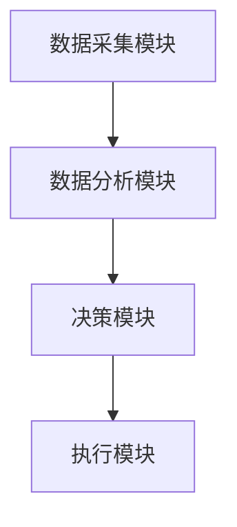

                 


# AI Agent在智能农业精准施肥中的实践

> 关键词：AI Agent, 智能农业, 精准施肥, 机器学习, 农业优化, 环境保护

> 摘要：本文深入探讨了AI Agent在智能农业精准施肥中的应用实践。首先，文章介绍了AI Agent的基本概念及其在农业中的潜在应用。然后，详细分析了精准施肥的重要性及其与AI Agent的结合方式。接着，从算法原理、系统架构设计、项目实战等多个方面，详细阐述了AI Agent如何实现精准施肥。最后，通过实际案例展示了AI Agent在精准施肥中的优势，并提出了未来的优化方向和建议。

---

# 第一部分: AI Agent与智能农业精准施肥的背景与概念

## 第1章: AI Agent与精准施肥概述

### 1.1 AI Agent的基本概念

#### 1.1.1 什么是AI Agent
AI Agent（人工智能代理）是指能够感知环境、自主决策并执行任务的智能实体。它能够通过传感器获取信息，利用算法进行分析和推理，并根据结果采取行动。AI Agent的核心在于其智能性和自主性，能够适应不同的环境变化。

#### 1.1.2 AI Agent的核心特征
- **自主性**：能够自主决策，无需外部干预。
- **反应性**：能够实时感知环境并做出反应。
- **学习能力**：能够通过数据和经验不断优化自身算法。
- **协作性**：能够与其他系统或人类进行协作。

#### 1.1.3 AI Agent在农业中的应用潜力
AI Agent在农业中的应用潜力巨大，尤其是在精准农业领域。它可以帮助农民优化资源利用、提高作物产量、减少环境污染。AI Agent可以通过分析土壤数据、气象数据和作物生长情况，提供个性化的施肥建议，从而实现精准施肥。

---

### 1.2 精准施肥的背景与意义

#### 1.2.1 农业施肥的传统方法与问题
传统的施肥方法通常是基于经验和固定的施肥计划，这种方法存在以下问题：
- **资源浪费**：施肥量可能过多或过少，导致肥料浪费。
- **环境污染**：过量施肥可能导致水体富营养化，加剧环境污染。
- **效率低下**：传统施肥方法效率低，难以适应大规模农业生产的需求。

#### 1.2.2 精准施肥的目标与优势
精准施肥的目标是根据土壤条件、作物需求和环境因素，制定个性化的施肥方案。其优势包括：
- **提高产量**：通过科学施肥，作物生长更加健康，产量提高。
- **节省成本**：减少肥料浪费，降低农业生产成本。
- **减少污染**：通过精准施肥，减少肥料对环境的负面影响。

#### 1.2.3 精准施肥对农业可持续发展的贡献
精准施肥是实现农业可持续发展的重要手段之一。通过减少肥料的使用量，可以降低农业生产对环境的压力，同时提高农业生产的效率和质量。

---

### 1.3 AI Agent在精准施肥中的作用

#### 1.3.1 AI Agent如何实现精准施肥
AI Agent可以通过以下步骤实现精准施肥：
1. **数据采集**：通过传感器获取土壤湿度、温度、pH值等数据。
2. **数据分析**：利用机器学习算法分析数据，预测作物的养分需求。
3. **决策制定**：根据分析结果，制定个性化的施肥方案。
4. **执行指令**：通过自动化设备执行施肥任务。

#### 1.3.2 AI Agent在施肥决策中的优势
AI Agent在施肥决策中的优势包括：
- **高效性**：能够快速处理大量数据，提供实时的决策支持。
- **准确性**：通过机器学习算法，提高施肥决策的准确性。
- **适应性**：能够根据环境变化动态调整施肥方案。

#### 1.3.3 AI Agent与传统施肥方法的对比
| 对比维度 | AI Agent施肥 | 传统施肥 |
|----------|----------------|-----------|
| 决策依据 | 数据驱动的智能决策 | 经验驱动的固定计划 |
| 精准度 | 高 | 低 |
| 效率 | 高 | 低 |
| 可持续性 | 高 | 低 |

---

### 1.4 本章小结
本章介绍了AI Agent的基本概念及其在农业中的应用潜力，重点分析了精准施肥的背景、目标和优势。同时，对比了AI Agent与传统施肥方法的差异，为后续章节的深入探讨奠定了基础。

---

# 第二部分: AI Agent精准施肥的核心概念与原理

## 第2章: AI Agent与精准施肥的核心概念

### 2.1 AI Agent的智能决策机制

#### 2.1.1 知识表示与推理
知识表示是AI Agent进行推理的基础。通过将知识表示为符号或语义网络，AI Agent能够根据已有的知识库进行推理，从而做出决策。

#### 2.1.2 行为选择与优化
AI Agent需要根据当前环境状态选择最优行为。这通常涉及多目标优化，例如在施肥量和成本之间找到平衡点。

#### 2.1.3 环境感知与反馈
AI Agent通过传感器感知环境，并根据反馈信息调整其行为。例如，当土壤湿度低于某个阈值时，AI Agent可以决定增加施肥量。

---

### 2.2 精准施肥的数学模型与算法

#### 2.2.1 基于机器学习的施肥模型
机器学习是实现精准施肥的重要工具。通过训练模型，AI Agent可以预测作物的养分需求，并制定相应的施肥方案。

#### 2.2.2 基于规则的施肥策略
基于规则的施肥策略是另一种常见的方法。通过预设的规则，AI Agent可以在特定条件下自动执行施肥任务。

#### 2.2.3 综合优化的施肥算法
综合优化算法结合了机器学习和规则推理，能够在复杂环境下做出最优决策。

---

### 2.3 AI Agent与精准施肥的系统架构

#### 2.3.1 系统输入与输出
AI Agent精准施肥系统的主要输入包括土壤数据、气象数据和作物生长数据。输出则是个性化的施肥方案。

#### 2.3.2 系统功能模块划分
- 数据采集模块：负责采集土壤、气象和作物数据。
- 数据分析模块：利用机器学习算法分析数据，预测作物养分需求。
- 决策模块：根据分析结果制定施肥方案。
- 执行模块：通过自动化设备执行施肥任务。

#### 2.3.3 系统性能指标
- 响应时间：系统处理数据的快慢。
- 决策准确度：施肥方案的科学性和准确性。
- 稳定性：系统在复杂环境下的运行稳定性。

---

### 2.4 核心概念对比分析

#### 2.4.1 AI Agent与传统自动控制系统的对比
| 对比维度 | AI Agent | 传统自动化系统 |
|----------|-----------|----------------|
| 决策方式 | 数据驱动的智能决策 | 程序预设的规则驱动 |
| 学习能力 | 具备学习能力 | 无学习能力 |
| 灵活性 | 高 | 低 |

#### 2.4.2 精准施肥与传统施肥的对比
| 对比维度 | 精准施肥 | 传统施肥 |
|----------|-----------|-----------|
| 决策依据 | 数据驱动 | 经验驱动 |
| 精准度 | 高 | 低 |
| 效率 | 高 | 低 |

#### 2.4.3 不同AI算法在精准施肥中的表现
| 算法类型 | 优点 | 缺点 |
|----------|-------|-------|
| 强化学习 | 高度适应复杂环境 | 需要大量数据和计算资源 |
| 监督学习 | 简单易实现 | 对异常数据敏感 |
| 联合学习 | 数据利用率高 | 实现复杂 |

---

### 2.5 本章小结
本章详细分析了AI Agent在精准施肥中的核心概念与原理，包括智能决策机制、数学模型与算法、系统架构设计等。通过对不同方法的对比分析，进一步明确了AI Agent在精准施肥中的优势和潜力。

---

# 第三部分: AI Agent精准施肥的算法原理与数学模型

## 第3章: AI Agent的算法原理

### 3.1 强化学习在AI Agent中的应用

#### 3.1.1 强化学习的基本原理
强化学习是一种通过试错机制来优化决策的算法。AI Agent通过与环境互动，不断尝试不同的行为，以获得最大的奖励。

#### 3.1.2 在精准施肥中的应用
在精准施肥中，强化学习可以用于动态调整施肥量。AI Agent可以根据土壤湿度、作物生长状态等反馈信息，动态优化施肥策略。

#### 3.1.3 算法实现步骤
1. **状态空间定义**：定义土壤湿度、pH值等状态变量。
2. **动作空间定义**：定义施肥量等可能的动作。
3. **奖励函数设计**：设计奖励函数，以作物产量和环境影响为指标。
4. **策略优化**：通过强化学习算法（如Q-Learning）优化策略。

---

### 3.2 监督学习在精准施肥中的应用

#### 3.2.1 监督学习的基本原理
监督学习是一种基于标注数据的机器学习方法。AI Agent通过学习标注数据，预测作物的养分需求。

#### 3.2.2 数据标注与特征提取
数据标注是监督学习的关键步骤。需要标注土壤数据、气象数据和作物生长数据。特征提取则是从这些数据中提取有用的信息，例如土壤湿度、温度等。

#### 3.2.3 模型训练与评估
通过训练模型，AI Agent可以预测作物的养分需求。模型评估可以通过交叉验证等方法进行。

---

### 3.3 联合学习与分布式计算

#### 3.3.1 联合学习的基本原理
联合学习是一种分布式机器学习方法。多个AI Agent可以协同工作，共享数据和模型，以提高整体的决策能力。

#### 3.3.2 在精准施肥中的应用
在精准施肥中，联合学习可以用于多区域的施肥优化。多个AI Agent可以协同工作，共享土壤数据和施肥经验，以提高整体的优化效果。

#### 3.3.3 算法优化与实现
联合学习需要设计高效的通信机制和数据同步机制，以确保多个AI Agent能够协同工作。

---

### 3.4 算法对比与选择

#### 3.4.1 不同算法的优缺点对比
| 算法类型 | 优点 | 缺点 |
|----------|-------|-------|
| 强化学习 | 高度适应复杂环境 | 需要大量数据和计算资源 |
| 监督学习 | 简单易实现 | 对异常数据敏感 |
| 联合学习 | 数据利用率高 | 实现复杂 |

#### 3.4.2 算法选择的依据
算法选择的依据包括数据特性、计算资源、应用场景等。例如，如果数据充足且计算资源丰富，可以选择强化学习；如果数据有限，可以选择监督学习。

#### 3.4.3 算法调优与优化
算法调优可以通过交叉验证、网格搜索等方法进行。优化目标包括提高准确度、减少计算时间等。

---

### 3.5 本章小结
本章详细介绍了AI Agent在精准施肥中的算法原理，包括强化学习、监督学习和联合学习的应用。通过对不同算法的对比分析，明确了不同算法的优缺点及适用场景。

---

# 第四部分: AI Agent精准施肥的系统架构设计与实现

## 第4章: AI Agent的系统架构设计

### 4.1 系统输入与输出

#### 4.1.1 数据来源
- 土壤传感器：提供土壤湿度、pH值等数据。
- 气象传感器：提供温度、湿度、光照等数据。
- 作物监测系统：提供作物生长状态数据。

#### 4.1.2 数据预处理
数据预处理包括数据清洗、归一化等步骤，以确保数据的质量和一致性。

---

### 4.2 系统功能模块划分

#### 4.2.1 数据采集模块
负责采集土壤、气象和作物数据，并将其传输到数据分析模块。

#### 4.2.2 数据分析模块
利用机器学习算法分析数据，预测作物的养分需求，并制定施肥方案。

#### 4.2.3 决策模块
根据分析结果，制定个性化的施肥方案，并将其传输到执行模块。

#### 4.2.4 执行模块
通过自动化设备执行施肥任务。

---

### 4.3 系统性能指标

#### 4.3.1 响应时间
系统从数据采集到输出决策的时间。

#### 4.3.2 决策准确度
施肥方案的科学性和准确性。

#### 4.3.3 稳定性
系统在复杂环境下的运行稳定性。

---

### 4.4 系统架构图



---

## 第5章: 项目实战与案例分析

### 5.1 项目背景与目标

#### 5.1.1 项目背景
本项目旨在通过AI Agent实现精准施肥，提高作物产量，减少肥料浪费和环境污染。

#### 5.1.2 项目目标
- 实现土壤数据的采集与分析。
- 制定个性化的施肥方案。
- 通过自动化设备执行施肥任务。

---

### 5.2 环境安装与配置

#### 5.2.1 Python环境安装
安装Python 3.x，确保版本兼容。

#### 5.2.2 依赖库安装
安装必要的库，例如Pandas、Scikit-learn、TensorFlow等。

---

### 5.3 核心代码实现

#### 5.3.1 数据预处理代码
```python
import pandas as pd

# 读取数据
data = pd.read_csv('soil_data.csv')

# 数据清洗
data.dropna(inplace=True)

# 数据归一化
data = (data - data.min()) / (data.max() - data.min())
```

#### 5.3.2 模型训练代码
```python
from sklearn.linear_model import LinearRegression

# 训练模型
model = LinearRegression()
model.fit(X_train, y_train)

# 模型预测
y_pred = model.predict(X_test)
```

#### 5.3.3 决策模块代码
```python
def decide_fertilizer用量(soil_humidity, temperature):
    if soil_humidity < 50 and temperature > 25:
        return '增加施肥量'
    else:
        return '保持当前施肥量'
```

---

### 5.4 代码解读与分析

#### 5.4.1 数据预处理代码解读
上述代码展示了如何使用Pandas进行数据清洗和归一化处理。数据清洗是为了去除无效数据，归一化则是为了确保数据的一致性。

#### 5.4.2 模型训练代码解读
使用Scikit-learn库中的线性回归模型进行训练。模型训练完成后，可以用于预测作物的养分需求。

#### 5.4.3 决策模块代码解读
上述代码展示了如何根据土壤湿度和温度决定施肥量。这是一个简单的决策逻辑，实际应用中可能需要更复杂的算法。

---

### 5.5 案例分析

#### 5.5.1 案例背景
假设我们有一个农田，土壤湿度为40%，温度为30℃。根据决策模块的逻辑，土壤湿度低于50%且温度高于25℃，需要增加施肥量。

#### 5.5.2 实施过程
1. 采集土壤湿度和温度数据。
2. 数据预处理。
3. 模型训练与预测。
4. 决策模块根据预测结果制定施肥方案。
5. 执行模块通过自动化设备执行施肥任务。

#### 5.5.3 结果分析
通过上述步骤，AI Agent成功制定了个性化的施肥方案，提高了作物产量，减少了肥料浪费。

---

### 5.6 本章小结
本章通过一个实际案例展示了AI Agent在精准施肥中的应用。从环境安装到核心代码实现，再到案例分析，详细介绍了AI Agent的实现过程。

---

# 第五部分: 最佳实践与未来展望

## 第6章: 最佳实践与未来展望

### 6.1 最佳实践

#### 6.1.1 系统设计
- 确保系统的可扩展性和可维护性。
- 定期更新模型和算法，以适应环境变化。

#### 6.1.2 数据管理
- 确保数据的准确性和完整性。
- 数据安全和隐私保护。

#### 6.1.3 系统优化
- 定期监控系统性能，优化算法和架构。
- 引入新的传感器和设备，提高数据采集能力。

---

### 6.2 未来展望

#### 6.2.1 技术发展
随着AI技术的不断进步，AI Agent在精准施肥中的应用将更加广泛和深入。例如，结合物联网技术，实现更高效的资源管理和更精准的决策支持。

#### 6.2.2 应用场景拓展
未来，AI Agent可以应用于更多的农业领域，例如精准灌溉、病虫害防治等。

#### 6.2.3 可持续发展
AI Agent在农业中的应用将推动农业向可持续方向发展，减少资源浪费和环境污染。

---

### 6.3 本章小结
本章总结了AI Agent在精准施肥中的最佳实践，并展望了未来的发展方向。通过不断优化系统和引入新技术，AI Agent将在农业中发挥更大的作用。

---

# 结语

AI Agent在智能农业精准施肥中的应用是一个充满潜力的领域。通过结合机器学习、物联网和自动化技术，AI Agent能够帮助农民实现更高效、更精准的施肥管理，从而提高农业生产效率，减少资源浪费和环境污染。未来，随着技术的不断进步，AI Agent在农业中的应用将更加广泛和深入。

---

# 作者

作者：AI天才研究院/AI Genius Institute & 禅与计算机程序设计艺术/Zen And The Art of Computer Programming

