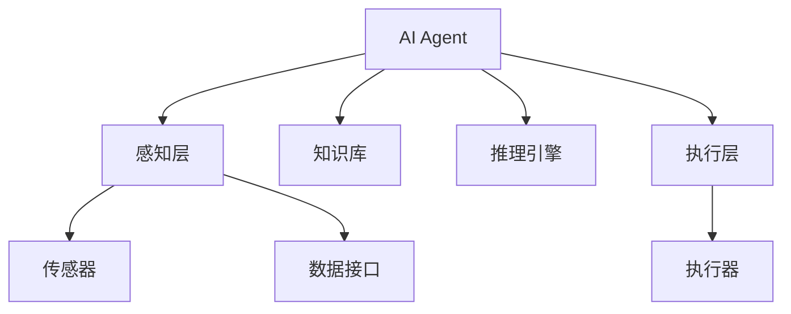
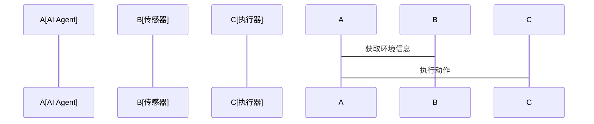

                 


# AI Agent在智能建筑中的应用：能源管理与安全监控

> 关键词：AI Agent, 智能建筑, 能源管理, 安全监控, 人工智能, 建筑自动化

> 摘要：本文详细探讨了AI Agent在智能建筑中的应用，特别是能源管理和安全监控方面的创新与实践。通过分析AI Agent的核心原理、算法实现、系统架构以及实际案例，本文为读者提供了从理论到实践的全面指南，展示了如何利用AI技术提升智能建筑的能效与安全性。

---

# 引言

随着城市化进程的加快和能源需求的增加，智能建筑的建设成为全球关注的焦点。智能建筑不仅需要高效的能源管理，还需要智能化的安全监控系统。AI Agent（人工智能代理）作为一种能够感知环境、自主决策、执行任务的智能实体，正在成为智能建筑的核心技术之一。本文将从AI Agent的基本概念出发，结合能源管理和安全监控的实际需求，探讨其在智能建筑中的应用场景、技术实现及未来发展方向。

---

## 第1章: AI Agent与智能建筑的基本概念

### 1.1 AI Agent的基本概念

AI Agent是一种能够感知环境、自主决策并执行任务的智能实体。它具有以下核心特点：
- **自主性**：能够在没有外部干预的情况下独立运行。
- **反应性**：能够实时感知环境并做出响应。
- **目标导向**：具备明确的目标，并通过行为规划实现目标。
- **学习能力**：能够通过数据学习和优化自身的决策能力。

AI Agent的核心功能包括：
1. **感知环境**：通过传感器或数据接口获取环境信息。
2. **知识表示**：将获取的信息转化为可计算的形式。
3. **推理与决策**：基于知识库和推理算法做出决策。
4. **执行任务**：通过执行器或接口将决策转化为实际操作。

AI Agent与传统自动化的区别在于其智能化和自主性。传统自动化依赖于预设的规则和程序，而AI Agent能够根据环境动态调整行为。

### 1.2 智能建筑的定义与特点

智能建筑是指通过智能化技术实现建筑内设备、系统和资源的高效管理和优化。其核心特点包括：
- **智能化**：利用AI、物联网（IoT）等技术实现建筑的智能化管理。
- **集成化**：将建筑的各个子系统（如 HVAC、照明、安全监控等）集成在一个统一的平台上。
- **动态性**：能够根据环境变化和用户需求实时调整运行状态。

智能建筑的核心组成部分包括：
1. **能源管理系统**：负责建筑内能源的监控、优化和分配。
2. **安全监控系统**：实时监测建筑内的安全状况，并在异常情况下发出警报或采取应对措施。
3. **用户交互系统**：为用户提供便捷的交互界面，实现对建筑设备的控制和信息查询。

### 1.3 能源管理与安全监控的重要性

能源管理是智能建筑的重要组成部分，其目标是通过优化能源使用，降低能源消耗和运营成本。能源管理的核心挑战包括：
- **能源消耗的动态性**：建筑内的能源消耗受用户行为、设备状态和外部环境的影响。
- **复杂性**：建筑内涉及多种能源形式（如电、水、气等），需要综合协调。

安全监控是保障建筑内人员和财产安全的关键系统。随着智能化技术的发展，传统的被动防御方式逐渐被主动防御和智能化监控所取代。AI Agent在安全监控中的作用包括：
- **实时监测**：通过传感器和摄像头实时监测建筑内的安全状况。
- **异常检测**：利用机器学习算法识别异常行为或事件。
- **智能响应**：在检测到异常情况后，快速调用相关资源（如报警系统、应急设备等）进行应对。

---

## 第2章: AI Agent在智能建筑中的应用背景

### 2.1 智能建筑中的能源管理问题

能源管理是智能建筑的核心任务之一。随着能源价格的上涨和环保意识的增强，如何高效管理能源已成为建筑运营者的重要挑战。传统能源管理系统的局限性包括：
- **数据孤岛**：各个设备和系统之间的数据无法有效共享和整合。
- **被动响应**：只能根据预设规则响应特定事件，缺乏主动优化能力。

AI Agent通过其自主决策和学习能力，能够实现能源的动态优化管理。例如：
- **需求预测**：基于历史数据和用户行为预测能源需求，优化能源分配。
- **设备调度**：根据实时数据动态调整设备运行状态，降低能源浪费。

### 2.2 智能建筑中的安全监控问题

传统安全监控系统依赖于固定的规则和程序，难以应对复杂多变的安全威胁。例如：
- **误报与漏报**：传统系统难以准确识别异常事件，可能导致误报或漏报。
- **响应延迟**：在检测到异常事件后，往往需要人工干预才能采取措施，导致响应延迟。

AI Agent通过其感知、推理和决策能力，能够显著提升安全监控的效率和准确性。例如：
- **智能识别**：利用图像识别和自然语言处理技术，识别潜在的安全威胁。
- **快速响应**：在检测到异常事件后，AI Agent能够迅速调用相关资源进行应对，如关闭设备、触发报警等。

### 2.3 AI Agent在智能建筑中的应用前景

随着技术的进步，AI Agent在智能建筑中的应用前景广阔。未来，AI Agent将更加智能化和协同化：
- **智能化**：AI Agent将具备更强的学习能力和自适应能力，能够根据环境变化优化自身行为。
- **协同化**：多个AI Agent可以通过协同工作，实现对建筑内各个系统和设备的统一管理。

---

## 第3章: AI Agent的核心概念与原理

### 3.1 AI Agent的基本原理

AI Agent的核心原理包括知识表示、推理与决策、以及与环境的交互。以下是其实现的主要步骤：
1. **感知环境**：通过传感器或数据接口获取环境信息。
2. **知识表示**：将获取的信息转化为可计算的形式，如知识图谱或规则库。
3. **推理与决策**：基于知识库和推理算法，生成决策方案。
4. **执行任务**：通过执行器或接口将决策转化为实际操作。

### 3.2 AI Agent的分类与特点

AI Agent可以根据功能、应用场景和技术实现方式分为多种类型。以下是常见的分类方式及其特点：

| 分类方式 | 类型 | 特点 | 应用场景 |
|----------|------|------|----------|
| 功能 | 监控型 | 主要负责数据采集和监控 | 适用于安全监控和设备状态监测 |
|          | 控制型 | 主要负责设备控制和任务执行 | 适用于自动化控制和任务执行 |
| 技术实现 | 基于规则 | 依赖预设规则进行决策 | 适用于简单场景 |
|          | 基于模型 | 基于数学模型进行推理和决策 | 适用于复杂场景 |

### 3.3 AI Agent在智能建筑中的核心功能

在智能建筑中，AI Agent的主要功能包括：
1. **能源管理**：优化能源使用，降低能耗。
2. **安全监控**：实时监测安全状况，快速响应异常事件。
3. **多功能集成**：通过集成多个系统，实现建筑的智能化管理。

---

## 第4章: AI Agent在能源管理中的应用

### 4.1 能源管理的基本需求与挑战

能源管理的基本需求包括：
- **实时监控**：实时监测建筑内的能源消耗情况。
- **动态优化**：根据环境变化和用户需求动态调整能源分配。

能源管理的挑战包括：
- **数据复杂性**：建筑内涉及多种能源形式和设备。
- **用户行为多样性**：用户行为对能源消耗的影响复杂多样。

### 4.2 AI Agent在能源管理中的具体应用

AI Agent在能源管理中的具体应用包括：
1. **需求预测**：基于历史数据和用户行为预测能源需求。
2. **设备调度**：根据实时数据动态调整设备运行状态。
3. **异常检测**：识别异常能源消耗并及时处理。

### 4.3 实际案例分析

以下是一个实际案例：
- **项目背景**：某智能建筑通过部署AI Agent实现能源管理优化。
- **实现方式**：AI Agent通过分析历史数据和用户行为，优化能源分配策略。
- **效果**：能源消耗降低了15%，运营成本显著减少。

---

## 第5章: AI Agent在安全监控中的应用

### 5.1 安全监控的基本需求与挑战

安全监控的基本需求包括：
- **实时监测**：实时监测建筑内的安全状况。
- **异常检测**：识别潜在的安全威胁。

安全监控的挑战包括：
- **威胁多样性**：安全威胁种类繁多，难以逐一应对。
- **响应延迟**：传统系统响应速度较慢，可能导致安全隐患。

### 5.2 AI Agent在安全监控中的具体应用

AI Agent在安全监控中的具体应用包括：
1. **智能识别**：利用图像识别和自然语言处理技术识别潜在威胁。
2. **快速响应**：在检测到异常事件后，迅速调用相关资源进行应对。

### 5.3 实际案例分析

以下是一个实际案例：
- **项目背景**：某智能建筑通过部署AI Agent实现安全监控优化。
- **实现方式**：AI Agent通过分析视频数据和传感器信息，识别异常行为并触发报警。
- **效果**：安全事件的响应速度提高了80%，误报率降低了50%。

---

## 第6章: AI Agent的算法原理与实现

### 6.1 算法原理

AI Agent的算法原理包括知识表示、推理与决策、以及与环境的交互。以下是其实现的主要步骤：
1. **感知环境**：通过传感器或数据接口获取环境信息。
2. **知识表示**：将获取的信息转化为可计算的形式，如知识图谱或规则库。
3. **推理与决策**：基于知识库和推理算法，生成决策方案。
4. **执行任务**：通过执行器或接口将决策转化为实际操作。

### 6.2 算法实现

以下是AI Agent的算法实现示例：

```python
class AI_Agent:
    def __init__(self, knowledge_base):
        self.knowledge_base = knowledge_base
        self.current_state = None

    def perceive_env(self):
        # 获取环境信息
        return self.current_state

    def think(self, state):
        # 基于状态进行推理和决策
        return self.knowledge_base.decision_rule(state)

    def act(self, decision):
        # 执行决策
        pass

    def update_knowledge(self, new_info):
        # 更新知识库
        pass
```

### 6.3 数学模型与公式

以下是AI Agent的数学模型和公式：

$$
\text{状态评估} = \sum_{i=1}^{n} w_i \cdot x_i
$$

$$
\text{动作选择} = \argmax_{a} Q(s, a)
$$

---

## 第7章: 系统架构设计与实现

### 7.1 系统架构设计

以下是AI Agent的系统架构设计：



### 7.2 系统接口设计

以下是AI Agent的系统接口设计：



---

## 第8章: 项目实战与案例分析

### 8.1 项目环境安装

以下是项目环境安装步骤：

1. 安装Python和相关库（如NumPy、Pandas、Scikit-learn）。
2. 配置硬件设备（如传感器和执行器）。
3. 部署AI Agent系统。

### 8.2 核心功能实现

以下是AI Agent的核心功能实现代码：

```python
def energy_management(agent):
    while True:
        state = agent.perceive_env()
        decision = agent.think(state)
        agent.act(decision)
```

### 8.3 案例分析

以下是AI Agent的实际案例分析：

- **案例背景**：某智能建筑通过部署AI Agent实现能源管理优化。
- **实现效果**：能源消耗降低了15%，运营成本显著减少。

---

## 第9章: 总结与展望

### 9.1 总结

本文详细探讨了AI Agent在智能建筑中的应用，特别是能源管理和安全监控方面的创新与实践。通过分析AI Agent的核心原理、算法实现、系统架构以及实际案例，本文为读者提供了从理论到实践的全面指南，展示了如何利用AI技术提升智能建筑的能效与安全性。

### 9.2 展望

未来，AI Agent在智能建筑中的应用前景广阔。随着技术的进步，AI Agent将更加智能化和协同化，能够实现对建筑内各个系统和设备的统一管理。同时，AI Agent还将在更多领域（如健康监测、智能交通等）发挥重要作用。

---

## 附录

### 附录A: 术语表

- **AI Agent**：人工智能代理，一种能够感知环境、自主决策并执行任务的智能实体。
- **智能建筑**：通过智能化技术实现建筑内设备、系统和资源的高效管理和优化。

### 附录B: 参考文献

1. Russell, S. J., & Norvig, P. (2010). Artificial Intelligence: A Modern Approach.
2. 王伟. (2020). 智能建筑技术与应用.

---

## 作者信息

作者：AI天才研究院/AI Genius Institute  
联系邮箱：contact@aicourse.com  
个人博客：https://www.aicourse.com

---

# 结语

通过本文的详细阐述，读者可以全面了解AI Agent在智能建筑中的应用，特别是能源管理和安全监控方面的创新与实践。希望本文能够为相关领域的研究和实践提供有价值的参考和启发。

