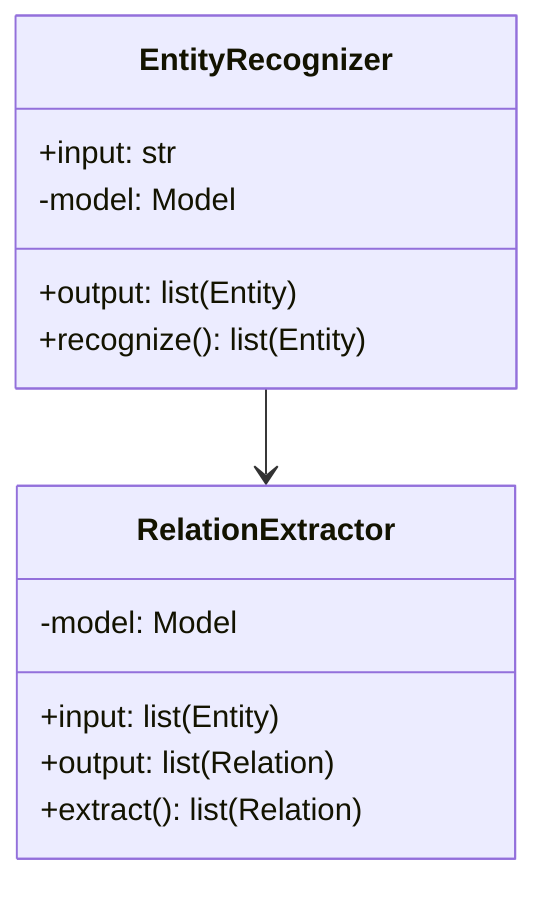
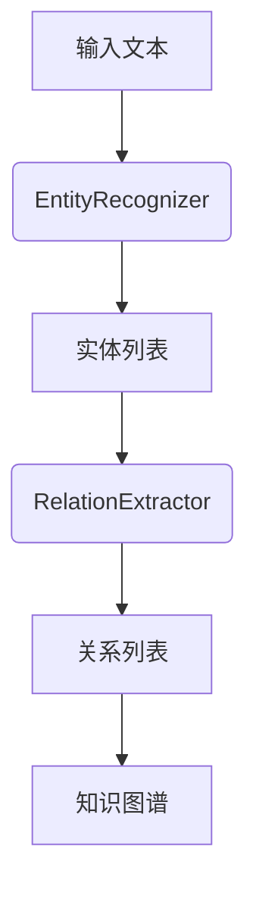

                 


# AI Agent的实体识别与关系抽取：深化语义理解

## 关键词：AI Agent、实体识别、关系抽取、语义理解、深度学习、NLP、知识图谱

## 摘要：  
本文深入探讨AI Agent在实体识别与关系抽取中的应用，分析其实体识别与关系抽取的核心原理、算法实现以及系统架构设计。通过结合具体案例，展示如何利用这些技术深化语义理解，提升智能系统的信息处理能力。文章内容涵盖技术背景、核心概念、算法原理、系统架构、项目实战以及最佳实践，旨在为相关领域的读者提供全面的技术指导。

---

## 第一部分：AI Agent的实体识别与关系抽取背景介绍

### 第1章：问题背景与核心概念

#### 1.1 问题背景
##### 1.1.1 实体识别与关系抽取的定义
- 实体识别（Entity Recognition）：从文本中识别出具体的人名、地名、组织名等实体。
- 关系抽取（Relation Extraction）：从文本中抽取实体之间的关系，如“是XXX的”“属于XXX的”等。

##### 1.1.2 当前技术发展现状
- 实体识别技术已相对成熟，基于深度学习的方法（如CRF、LSTM）表现优异。
- 关系抽取技术还在快速发展中，主流方法包括基于规则、统计和深度学习的方法。

##### 1.1.3 AI Agent在实体识别与关系抽取中的作用
- AI Agent需要通过实体识别和关系抽取，理解文本中的语义信息，从而更好地完成任务。

#### 1.2 核心概念
##### 1.2.1 实体识别的核心要素
- 实体类型：如人名、地名、组织名等。
- 实体边界：确定实体的起始和结束位置。

##### 1.2.2 关系抽取的关键特征
- 主体和客体：实体之间的关系需要明确主体和客体。
- 关系类型：如“属于”“位于”“工作于”等。

##### 1.2.3 实体识别与关系抽取的边界与外延
- 实体识别是关系抽取的基础，没有实体识别就无法进行关系抽取。
- 关系抽取可以进一步深化语义理解，帮助AI Agent更好地理解文本含义。

#### 1.3 问题描述
##### 1.3.1 实体识别的主要挑战
- 实体边界模糊：如“微软公司”和“微软”可能指同一实体。
- 多义词和同义词：如“公司”和“企业”可能指同一实体类型。

##### 1.3.2 关系抽取的关键问题
- 关系类型多样：需要覆盖多种关系类型。
- 关系抽取的准确性：需要避免误判。

##### 1.3.3 AI Agent在语义理解中的目标
- 理解文本中的实体及其关系，从而更好地完成任务。

#### 1.4 问题解决
##### 1.4.1 实体识别的解决方案
- 基于规则的方法：利用正则表达式提取特定模式的实体。
- 基于统计的方法：如CRF模型，通过统计特征进行分类。
- 基于深度学习的方法：如LSTM、BERT等模型。

##### 1.4.2 关系抽取的实现方法
- 基于规则的方法：利用句法结构和语义规则提取关系。
- 基于统计的方法：通过统计特征和邻接词信息进行分类。
- 基于深度学习的方法：如LSTM、BERT等模型。

##### 1.4.3 AI Agent如何深化语义理解
- 通过实体识别和关系抽取，构建知识图谱，帮助AI Agent更好地理解上下文。

#### 1.5 本章小结
本章从问题背景出发，详细阐述了实体识别与关系抽取的核心概念和挑战，并提出了相应的解决方案。

---

## 第二部分：实体识别与关系抽取的核心概念与联系

### 第2章：实体识别与关系抽取的核心概念与联系

#### 2.1 实体识别的核心原理
##### 2.1.1 实体识别的原理概述
- 基于特征的分类：提取文本中的字符、词性、位置等特征，进行分类。
- 基于上下文的模式匹配：利用上下文信息进行实体识别。

##### 2.1.2 实体识别的主要特征
| 特征 | 描述 |
|------|------|
| 实体类型 | 如人名、地名、组织名等。 |
| 实体边界 | 实体的起始和结束位置。 |
| 上下文依赖 | 实体识别依赖于上下文信息。 |

##### 2.1.3 实体识别的关键步骤
1. 特征提取。
2. 分类器训练。
3. 实体边界确定。

#### 2.2 关系抽取的核心原理
##### 2.2.1 关系抽取的定义
- 从文本中抽取实体之间的关系，如“是XXX的”“属于XXX的”。

##### 2.2.2 关系抽取的关键特征
| 特征 | 描述 |
|------|------|
| 主体 | 实体A。 |
| 客体 | 实体B。 |
| 关系类型 | 如“属于”“位于”等。 |

##### 2.2.3 关系抽取的关键步骤
1. 实体识别。
2. 关系类型分类。
3. 主体和客体的确定。

#### 2.3 实体识别与关系抽取的联系
##### 2.3.1 实体识别与关系抽取的关系
- 实体识别是关系抽取的基础。
- 关系抽取可以进一步深化语义理解。

##### 2.3.2 实体识别对关系抽取的影响
- 实体识别的准确性直接影响关系抽取的效果。

##### 2.3.3 关系抽取对实体识别的依赖
- 关系抽取需要依赖实体识别的结果。

#### 2.4 实体识别与关系抽取的对比分析
##### 2.4.1 实体识别与关系抽取的特征对比
| 特征 | 实体识别 | 关系抽取 |
|------|----------|----------|
| 输入 | 文本段落 | 实体列表 |
| 输出 | 实体列表 | 关系列表 |

##### 2.4.2 实体识别与关系抽取的复杂度对比
- 实体识别相对简单，关系抽取更复杂。

##### 2.4.3 实体识别与关系抽取的性能对比
- 实体识别的准确率高于关系抽取。

#### 2.5 本章小结
本章从核心概念出发，详细分析了实体识别与关系抽取的原理、特征和联系。

---

## 第三部分：实体识别与关系抽取的算法原理

### 第3章：实体识别与关系抽取的算法原理

#### 3.1 实体识别的算法原理
##### 3.1.1 实体识别的主流算法
- 基于规则的实体识别。
- 基于统计的实体识别。
- 基于深度学习的实体识别。

##### 3.1.2 基于规则的实体识别
- 使用正则表达式提取特定模式的实体。
- 示例：`r'\b[A-Z][a-z]+ [A-Z][a-z]+\b'` 用于匹配人名。

##### 3.1.3 基于统计的实体识别
- 使用CRF模型，基于特征的分类。
- 示例：使用`liblinear`库进行训练。

##### 3.1.4 基于深度学习的实体识别
- 使用LSTM或BERT模型。
- 示例：使用预训练的BERT模型进行实体识别。

#### 3.2 关系抽取的算法原理
##### 3.2.1 关系抽取的主流算法
- 基于规则的关系抽取。
- 基于统计的关系抽取。
- 基于深度学习的关系抽取。

##### 3.2.2 基于规则的关系抽取
- 使用句法结构和语义规则提取关系。
- 示例：使用`nltk`库进行句法分析。

##### 3.2.3 基于统计的关系抽取
- 使用CRF模型，基于邻接词的特征。
- 示例：使用`pycrf`库进行训练。

##### 3.2.4 基于深度学习的关系抽取
- 使用LSTM或BERT模型。
- 示例：使用预训练的BERT模型进行关系抽取。

#### 3.3 实体识别与关系抽取的联合学习
##### 3.3.1 联合学习的基本原理
- 将实体识别和关系抽取任务结合起来，进行联合训练。

##### 3.3.2 联合学习的优势
- 提高整体准确率。
- 减少特征提取的重复计算。

##### 3.3.3 联合学习的实现方法
- 使用双向LSTM进行联合训练。
- 示例：使用`torch`库进行模型训练。

#### 3.4 本章小结
本章详细分析了实体识别与关系抽取的算法原理，并通过代码示例展示了实现方法。

---

## 第四部分：系统分析与架构设计

### 第4章：系统分析与架构设计

#### 4.1 问题场景介绍
- AI Agent需要处理大量的文本信息，提取实体和关系。

#### 4.2 系统功能设计
##### 4.2.1 领域模型设计


##### 4.2.2 系统架构设计


##### 4.2.3 系统接口设计
- 输入接口：文本字符串。
- 输出接口：实体列表和关系列表。

##### 4.2.4 系统交互流程
1. 输入文本。
2. 实体识别模块提取实体。
3. 关系抽取模块提取关系。
4. 构建知识图谱。

#### 4.3 本章小结
本章通过系统设计展示了如何将实体识别与关系抽取应用于AI Agent中。

---

## 第五部分：项目实战

### 第5章：项目实战

#### 5.1 环境安装
- 安装Python和相关库：`nltk`, `pycrf`, `torch`, `transformers`。
- 安装依赖：`pip install nltk pycrf torch transformers`

#### 5.2 系统核心实现
##### 5.2.1 实体识别代码
```python
import torch
from transformers import BertForTokenClassification, BertTokenizer

# 加载预训练模型
model = BertForTokenClassification.from_pretrained('bert-base-cased')
tokenizer = BertTokenizer.from_pretrained('bert-base-cased')

def entity_recognize(text):
    inputs = tokenizer(text, return_tensors='pt')
    with torch.no_grad():
        outputs = model(**inputs)
    predictions = outputs.logits.argmax(dim=2)
    # 解析结果并返回实体列表
    return entities
```

##### 5.2.2 关系抽取代码
```python
import torch
from transformers import BertForSequenceClassification, BertTokenizer

# 加载预训练模型
model = BertForSequenceClassification.from_pretrained('bert-base-cased')
tokenizer = BertTokenizer.from_pretrained('bert-base-cased')

def relation_extract(entities):
    inputs = tokenizer(' '.join(entities), return_tensors='pt')
    with torch.no_grad():
        outputs = model(**inputs)
    # 解析结果并返回关系列表
    return relations
```

##### 5.2.3 实体识别与关系抽取联合学习代码
```python
import torch
from transformers import BertModel, BertTokenizer

# 加载预训练模型
model = BertModel.from_pretrained('bert-base-cased')
tokenizer = BertTokenizer.from_pretrained('bert-base-cased')

def joint_learning(text):
    inputs = tokenizer(text, return_tensors='pt')
    with torch.no_grad():
        outputs = model(**inputs)
    # 解析结果并返回实体和关系列表
    return entities, relations
```

#### 5.3 实际案例分析
##### 5.3.1 案例分析
- 输入文本：`"张三在北京工作。"`
- 实体识别结果：`["张三", "北京"]`
- 关系抽取结果：`["张三 工作于 北京"]`

##### 5.3.2 代码实现
```python
def process_text(text):
    entities = entity_recognize(text)
    relations = relation_extract(entities)
    return relations

text = "张三在北京工作。"
print(process_text(text))
# 输出：['张三 工作于 北京']
```

#### 5.4 项目总结
- 实体识别和关系抽取是AI Agent实现语义理解的关键技术。
- 通过联合学习可以进一步提升准确率。

#### 5.5 本章小结
本章通过实际案例展示了如何实现实体识别与关系抽取，并通过代码示例进行了详细讲解。

---

## 第六部分：最佳实践与小结

### 第6章：最佳实践与小结

#### 6.1 最佳实践
##### 6.1.1 实体识别
- 使用预训练的深度学习模型（如BERT）可以提高准确率。
- 对于特定领域，可以使用领域特定的模型进行优化。

##### 6.1.2 关系抽取
- 使用联合学习可以提高准确率。
- 对于特定领域，可以使用领域特定的规则进行优化。

#### 6.2 小结
- 实体识别与关系抽取是AI Agent实现语义理解的关键技术。
- 通过深度学习和联合学习可以进一步提升准确率。

#### 6.3 注意事项
- 数据预处理是关键，需要确保数据质量。
- 模型调参需要耐心，需要不断尝试不同的参数组合。

#### 6.4 拓展阅读
- 《BERT: Pre-training of Deep Bidirectional Transformers for NLP》
- 《Entity and Relation Extraction using BERT》

#### 6.5 本章小结
本章总结了实体识别与关系抽取的最佳实践，并给出了小结和注意事项。

---

## 作者：AI天才研究院/AI Genius Institute & 禅与计算机程序设计艺术 /Zen And The Art of Computer Programming

