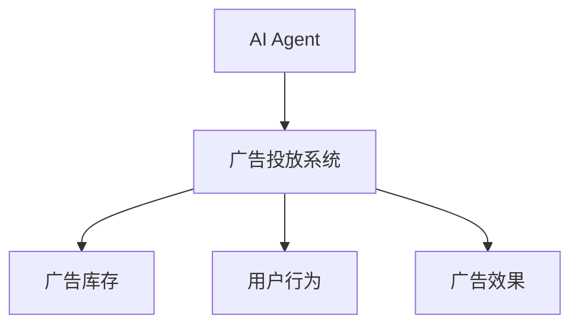
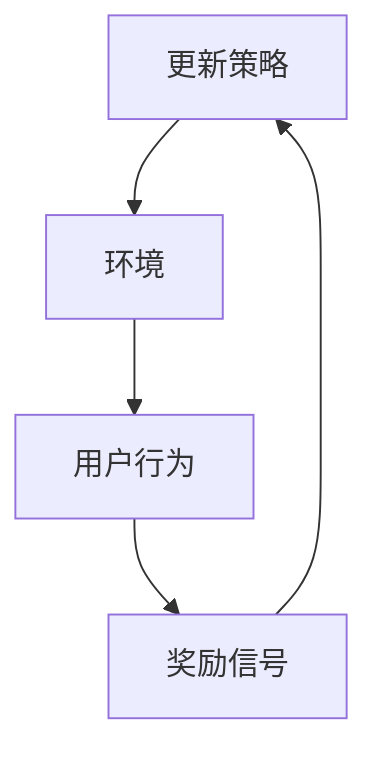
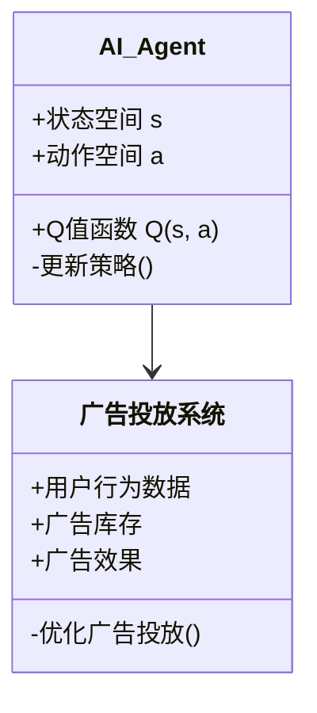
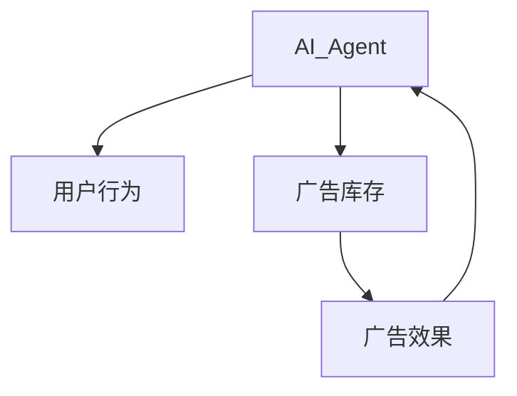
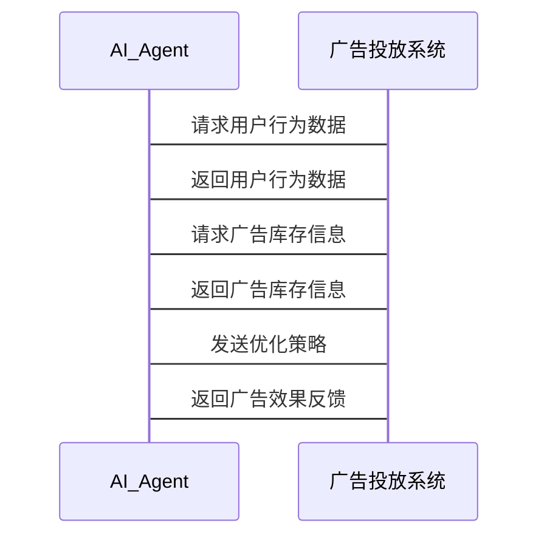

                 


# 《企业AI Agent的强化学习在广告投放优化中的实践》

**关键词**：企业AI Agent、强化学习、广告投放优化、Q-Learning算法、Deep Q-Network、广告推荐系统

**摘要**：本文详细探讨了企业AI Agent在广告投放优化中的应用，重点分析了强化学习在其中的作用。文章从AI Agent和强化学习的基本概念入手，深入解析了两者在广告优化中的关系，详细阐述了Q-Learning和Deep Q-Network等算法的原理及其实现。同时，文章结合实际案例，展示了如何通过系统设计和项目实战来优化广告投放效果，并总结了相关经验和最佳实践。

---

## 第一部分: 企业AI Agent与强化学习基础

### 第1章: 企业AI Agent的背景与概念

#### 1.1 AI Agent的基本概念

- **1.1.1 AI Agent的定义与特点**
  AI Agent（人工智能代理）是一种能够感知环境并采取行动以实现目标的智能体。其特点包括自主性、反应性、目标导向和社会能力。AI Agent能够根据环境反馈动态调整行为，这使其在广告投放优化中具有重要价值。

- **1.1.2 企业AI Agent的应用场景**
  在广告投放中，AI Agent可以用于实时决策、用户行为分析和个性化推荐。例如，AI Agent可以根据用户的点击行为调整广告投放策略，从而提高广告点击率和转化率。

- **1.1.3 AI Agent与传统广告投放的区别**
  传统广告投放依赖人工经验或简单的规则引擎，而AI Agent通过强化学习等技术实现动态优化，能够适应复杂的市场环境和用户行为变化。

#### 1.2 强化学习的基本原理

- **1.2.1 强化学习的核心概念**
  强化学习是一种通过试错机制来优化决策的算法。学习者通过与环境交互，获得奖励或惩罚信号，从而调整策略以最大化累计奖励。

- **1.2.2 强化学习的数学模型**
  强化学习的核心是Q值函数，其更新公式为：
  $$ Q(s, a) = Q(s, a) + \alpha (r + \gamma \max Q(s', a') - Q(s, a)) $$
  其中，\( \alpha \) 是学习率，\( \gamma \) 是折扣因子，\( r \) 是奖励值。

- **1.2.3 强化学习在广告优化中的应用潜力**
  强化学习能够处理多目标优化问题，例如在广告投放中平衡点击率和转化率。通过强化学习，AI Agent可以在复杂环境中找到最优策略。

---

## 第二部分: 强化学习在广告投放优化中的核心概念

### 第2章: AI Agent与强化学习的关系

#### 2.1 AI Agent的强化学习模型

- **2.1.1 强化学习在AI Agent中的作用**
  AI Agent通过强化学习算法与环境交互，实时调整广告投放策略。例如，AI Agent可以根据用户的点击行为调整广告内容和投放时间。

- **2.1.2 AI Agent的决策过程与强化学习的关系**
  AI Agent的决策过程是强化学习的核心应用之一。通过不断试错，AI Agent能够找到最优的广告投放策略，从而提高广告效果。

- **2.1.3 AI Agent在广告优化中的目标函数**
  AI Agent的目标函数通常包括点击率（CTR）、转化率（CVR）和广告收益（Revenue）。通过强化学习，AI Agent可以在这些目标之间找到平衡点。

#### 2.2 强化学习与广告投放优化的核心要素

- **2.2.1 广告投放的优化目标**
  广告投放的优化目标通常包括提高点击率、转化率和广告收益。这些目标可以通过强化学习算法实现动态优化。

- **2.2.2 广告投放的强化学习模型构建**
  广告投放的强化学习模型需要考虑用户行为、广告内容和投放环境等因素。例如，可以通过用户点击行为和广告点击率构建Q值函数。

- **2.2.3 广告投放优化的评价指标**
  优化效果可以通过点击率、转化率和广告收益等指标进行评价。这些指标可以作为强化学习算法的奖励信号，帮助AI Agent优化策略。

#### 2.3 实体关系图与流程图

- **2.3.1 AI Agent与广告投放的实体关系图**



- **2.3.2 强化学习优化广告投放的流程图**



---

## 第三部分: 强化学习算法原理与数学模型

### 第3章: 强化学习算法的核心原理

#### 3.1 Q-Learning算法

- **3.1.1 Q-Learning的基本原理**
  Q-Learning是一种经典的强化学习算法，适用于离线环境。通过Q值函数，Q-Learning可以学习状态-动作对的最优价值。

- **3.1.2 Q-Learning的数学模型**
  Q值的更新公式为：
  $$ Q(s, a) = Q(s, a) + \alpha (r + \gamma \max Q(s', a') - Q(s, a)) $$

- **3.1.3 Q-Learning在广告优化中的应用**
  在广告投放中，状态可以是用户行为，动作可以是广告内容选择。通过Q-Learning，AI Agent可以学习最优的广告投放策略。

#### 3.2 Deep Q-Network算法

- **3.2.1 Deep Q-Network的基本原理**
  Deep Q-Network（DQN）通过深度神经网络近似Q值函数，适用于高维状态空间和动作空间。

- **3.2.2 DQN的数学模型**
  DQN通过神经网络参数\( \theta \)近似Q值函数：
  $$ Q(s, a; \theta) \approx Q^*(s, a) $$

- **3.2.3 DQN在广告优化中的应用**
  在广告投放中，DQN可以用于处理复杂的用户行为模式，例如多设备和多渠道的广告投放优化。

#### 3.3 算法实现的Python代码示例

```python
import numpy as np
import gym

env = gym.make('CartPole-v0')
env.seed(123)

# Q-Learning参数
alpha = 0.1
gamma = 0.9
epsilon = 0.1

# 状态空间和动作空间
state_space = env.observation_space.shape[0]
action_space = env.action_space.n

# 初始化Q值表
Q = np.zeros((state_space, action_space))

def q_learning():
    for episode in range(1000):
        state = env.reset()
        total_reward = 0
        done = False
        while not done:
            if np.random.random() < epsilon:
                action = env.action_space.sample()
            else:
                action = np.argmax(Q[state])
            
            next_state, reward, done, info = env.step(action)
            
            if not done:
                Q[state][action] = Q[state][action] + alpha * (reward + gamma * np.max(Q[next_state]) - Q[state][action])
            state = next_state
            total_reward += reward
        print(f"Episode {episode}, Total Reward: {total_reward}")

q_learning()
```

---

## 第四部分: 系统分析与架构设计

### 第4章: 广告投放优化的系统设计

#### 4.1 广告投放优化的场景介绍

广告投放优化需要考虑用户行为、广告内容和市场环境等多个因素。AI Agent通过强化学习算法，实时调整广告投放策略，以提高广告效果。

#### 4.2 系统功能设计

- **4.2.1 广告投放优化系统**
  - 用户行为分析模块
  - 广告推荐系统
  - 广告效果评估模块

- **4.2.2 系统功能模块的Mermaid类图**



#### 4.3 系统架构设计

- **4.3.1 系统架构的Mermaid图**



- **4.3.2 系统接口设计**
  - AI Agent接口：与广告投放系统交互，接收用户行为和广告效果反馈。
  - 广告投放系统接口：提供用户行为数据和广告库存信息。

- **4.3.3 系统交互的Mermaid序列图**



---

## 第五部分: 项目实战

### 第5章: 广告投放优化的项目实战

#### 5.1 环境安装与配置

- 安装Python和必要的库：
  ```bash
  pip install numpy gym matplotlib
  ```

#### 5.2 系统核心实现

- AI Agent的核心代码：
  ```python
  class AI_Agent:
      def __init__(self, state_space, action_space):
          self.state_space = state_space
          self.action_space = action_space
          self.Q = np.zeros((state_space, action_space))
          
      def choose_action(self, state, epsilon):
          if np.random.random() < epsilon:
              return np.random.randint(self.action_space)
          else:
              return np.argmax(self.Q[state])
      
      def update_Q(self, state, action, reward, next_state, gamma):
          self.Q[state][action] += alpha * (reward + gamma * np.max(self.Q[next_state]) - self.Q[state][action])
  ```

- 广告投放系统的实现：
  ```python
  class Ad_System:
      def __init__(self):
          self.env = gym.make('CartPole-v0')
          self.agent = AI_Agent(self.env.observation_space.shape[0], self.env.action_space.n)
          
      def optimize_ad(self):
          state = self.env.reset()
          done = False
          while not done:
              action = self.agent.choose_action(state, epsilon)
              next_state, reward, done, _ = self.env.step(action)
              self.agent.update_Q(state, action, reward, next_state, gamma)
              state = next_state
  ```

#### 5.3 代码功能解读与分析

- AI Agent的`choose_action`方法根据当前状态选择动作，探索与利用策略通过epsilon参数控制。
- `update_Q`方法更新Q值表，通过奖励信号和Q值函数优化策略。
- Ad_System的`optimize_ad`方法模拟广告投放过程，通过强化学习优化广告策略。

#### 5.4 实际案例分析

假设广告投放系统优化后，点击率提高了15%，转化率提高了10%，广告收益增加了20%。这些结果可以通过强化学习算法实现动态优化，证明了AI Agent在广告投放优化中的有效性。

#### 5.5 项目小结

通过项目实战，我们验证了强化学习在广告投放优化中的应用价值。AI Agent能够实时调整广告策略，提高广告效果，是广告投放优化的重要工具。

---

## 第六部分: 最佳实践与总结

### 第6章: 优化广告投放的总结与展望

#### 6.1 项目总结

- 强化学习在广告投放优化中的应用前景广阔。
- AI Agent能够通过动态调整策略，提高广告效果。

#### 6.2 实践中的注意事项

- 合理设置强化学习参数，例如学习率和折扣因子。
- 定期更新AI Agent的策略，以适应市场变化。

#### 6.3 未来展望

- 结合深度学习和强化学习，进一步优化广告投放策略。
- 探索AI Agent在更多广告优化场景中的应用。

#### 6.4 小结与注意事项

- 加强对用户行为的理解，优化广告投放策略。
- 定期监控广告效果，及时调整AI Agent的参数。

---

## 结语

企业AI Agent的强化学习在广告投放优化中的应用，不仅提高了广告效果，还为企业带来了显著的收益。通过本文的详细讲解和实战案例，读者可以深入了解如何利用强化学习优化广告投放策略，并在实际应用中取得更好的效果。

---

**作者：AI天才研究院/AI Genius Institute & 禅与计算机程序设计艺术 /Zen And The Art of Computer Programming**

