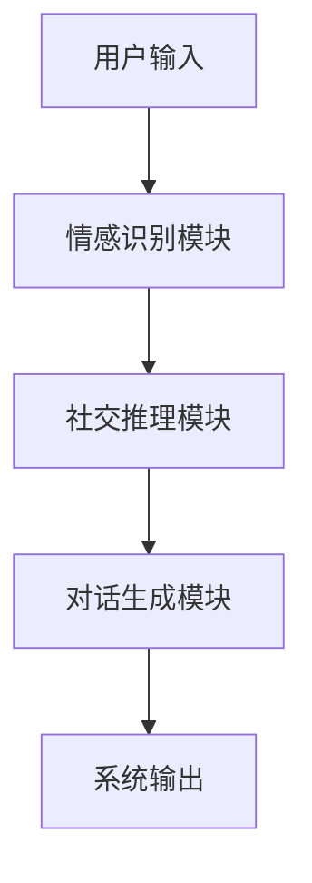
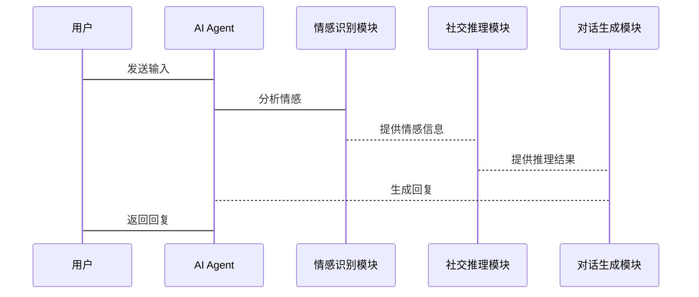

                 


# 开发具有情感计算与社交能力的AI Agent

## 关键词：情感计算、AI Agent、社交能力、机器学习、自然语言处理

## 摘要：  
本文深入探讨了开发具有情感计算与社交能力的AI Agent的理论基础、算法实现、系统设计和项目实战。文章从情感计算和社交能力的基本概念出发，详细介绍了情感识别、情绪分析、对话生成等核心技术，并结合实际案例展示了如何构建具备情感计算与社交能力的AI Agent系统。通过本文的学习，读者将能够理解并掌握如何将情感计算与社交能力整合到AI Agent中，从而实现更智能、更自然的交互体验。

---

# 第1章 情感计算与社交能力概述

## 1.1 情感计算的基本概念

### 1.1.1 情感计算的定义  
情感计算（Affective Computing）是研究如何通过计算机技术理解和模拟人类情感的一门学科。它旨在使计算机能够识别人类的情感状态（如喜悦、愤怒、悲伤等），并根据这些情感状态调整其行为或响应。

### 1.1.2 情感计算的核心要素  
情感计算的核心要素包括：  
1. **情感识别**：通过文本、语音或面部表情等输入，识别出用户的情感状态。  
2. **情感分析**：对情感数据进行分类，判断情感的性质（如积极、消极或中性）。  
3. **情感记忆**：记录和存储用户过去的情感状态，以便后续分析和响应。  

### 1.1.3 社交能力在AI Agent中的作用  
社交能力是指AI Agent在与人类交互时，能够理解和适应人类的社交规则、习惯和情感需求的能力。它使AI Agent能够更好地与人类进行自然对话，提升用户体验。

---

## 1.2 AI Agent的基本概念

### 1.2.1 AI Agent的定义  
AI Agent（人工智能代理）是指能够感知环境并采取行动以实现特定目标的智能实体。它可以是一个软件程序，也可以是一个物理设备，其目标是通过与环境交互来完成任务。

### 1.2.2 AI Agent的分类  
AI Agent可以根据功能和智能水平分为以下几类：  
1. **简单反射型Agent**：基于简单的规则做出反应，不涉及复杂计算。  
2. **基于模型的反射型Agent**：利用内部模型和环境信息进行决策。  
3. **目标驱动型Agent**：根据明确的目标采取行动。  
4. **实用驱动型Agent**：根据效用函数优化行动策略。  

### 1.2.3 情感计算与社交能力的结合  
情感计算与社交能力的结合使AI Agent能够更好地理解人类情感和社交规则，从而实现更自然、更智能的交互。

---

## 1.3 情感计算与社交能力的背景与应用

### 1.3.1 情感计算的背景  
随着人工智能技术的快速发展，情感计算逐渐成为研究热点。它在教育、医疗、娱乐等领域都有广泛的应用。

### 1.3.2 社交能力的背景  
随着社交网络的普及，人类与AI Agent的交互需求不断增加。AI Agent需要具备更强的社交能力，以适应多样化的社交场景。

### 1.3.3 情感计算与社交能力的应用场景  
1. **智能客服**：通过情感计算识别用户情绪，提供更贴心的服务。  
2. **社交机器人**：在社交媒体上与用户互动，提升用户参与度。  
3. **教育助手**：根据学生情绪调整教学策略。  

---

## 1.4 本章小结  
本章介绍了情感计算和社交能力的基本概念，并探讨了它们在AI Agent中的作用。通过理解这些概念，我们可以为后续的算法实现和系统设计打下坚实的基础。

---

# 第2章 情感计算的理论基础

## 2.1 情感识别与分析

### 2.1.1 情感识别的基本原理  
情感识别是通过分析输入数据（如文本、语音、面部表情等）来判断用户的情感状态。常见的技术包括基于规则的方法和机器学习方法。

### 2.1.2 常见的情感识别方法  
1. **基于规则的方法**：通过预定义的规则匹配情感特征。  
2. **机器学习方法**：利用训练数据训练分类器，如支持向量机（SVM）、随机森林（Random Forest）等。  
3. **深度学习方法**：使用神经网络（如卷积神经网络CNN和循环神经网络RNN）进行情感分类。  

### 2.1.3 情感识别的挑战与解决方案  
- **挑战**：情感表达的多样性和模糊性。  
- **解决方案**：结合多模态数据（如文本、语音、面部表情）进行情感识别。

---

## 2.2 情绪分析与情感记忆

### 2.2.1 情绪分析的定义与方法  
情绪分析是情感计算的重要组成部分，旨在判断文本中表达的情绪是积极、消极还是中性。常用方法包括词袋模型（Bag of Words）、TF-IDF和情感词典（如AFINN、VADER等）。

### 2.2.2 情感记忆的机制  
情感记忆是指将用户过去的情感状态记录下来，并在后续交互中利用这些信息进行个性化响应。常见的实现方法包括基于时间的遗忘机制和基于事件的情感记忆存储。

### 2.2.3 情感记忆在AI Agent中的应用  
通过情感记忆，AI Agent可以更好地理解用户的情感变化，从而提供更个性化的服务。

---

## 2.3 情感计算的数学模型

### 2.3.1 情感计算的基本数学模型  
情感计算可以基于概率论、统计学和机器学习模型进行。例如，情感分类可以使用朴素贝叶斯（Naive Bayes）模型。

### 2.3.2 情感计算的特征提取方法  
1. **文本特征提取**：使用词袋模型或TF-IDF提取文本特征。  
2. **语音特征提取**：提取语音的音调、音量等特征。  
3. **面部表情特征提取**：提取面部关键点的几何特征。  

### 2.3.3 情感计算的分类算法  
1. **支持向量机（SVM）**：适用于小规模数据集。  
2. **随机森林（Random Forest）**：适用于特征较多的情况。  
3. **深度学习模型**：如LSTM和BERT，适用于大规模数据。

---

## 2.4 本章小结  
本章详细介绍了情感计算的理论基础，包括情感识别、情绪分析和情感记忆的机制。这些内容为后续的算法实现奠定了基础。

---

# 第3章 社交能力的核心原理

## 3.1 社交网络分析

### 3.1.1 社交网络的基本概念  
社交网络是由用户、关系和互动组成的网络。社交网络分析旨在理解这些网络的结构和动态。

### 3.1.2 社交网络分析的方法  
1. **网络中心性分析**：识别网络中的关键节点。  
2. **社区检测**：发现网络中的社群结构。  
3. **网络演化分析**：研究网络随时间的变化。  

---

## 3.2 对话生成与社交推理

### 3.2.1 对话生成的基本原理  
对话生成是基于自然语言处理技术，通过理解上下文和用户意图生成合适的回复。常用的模型包括Seq2Seq、Transformer和GPT系列。

### 3.2.2 社交推理的机制  
社交推理是指AI Agent在对话中理解用户的社交意图和背景信息。例如，根据用户的上下文和历史记录调整回复内容。

### 3.2.3 对话生成与社交推理的结合  
通过结合社交推理，对话生成可以更加个性化和自然。

---

## 3.3 社交能力的评估与优化

### 3.3.1 社交能力的评估指标  
1. **准确率**：对话生成的准确率。  
2. **用户满意度**：用户的主观评价。  
3. **响应时间**：系统的响应速度。  

### 3.3.2 社交能力的优化方法  
1. **数据增强**：增加多样化的训练数据。  
2. **模型调优**：优化算法参数和结构。  
3. **多模态融合**：结合文本、语音和视觉信息。  

---

## 3.4 本章小结  
本章探讨了社交能力的核心原理，包括社交网络分析、对话生成和社交推理。通过这些方法，AI Agent可以更好地理解用户的社交需求。

---

# 第4章 情感计算与社交能力的算法实现

## 4.1 情感计算的算法原理

### 4.1.1 基于规则的情感计算算法  
基于规则的算法通过预定义的规则匹配情感特征。例如，使用情感词典判断文本的情感倾向。

### 4.1.2 基于机器学习的情感计算算法  
机器学习算法（如SVM和随机森林）通过训练数据学习情感分类器。

### 4.1.3 基于深度学习的情感计算算法  
深度学习模型（如LSTM和BERT）在情感分类任务中表现出色。

---

## 4.2 社交能力的算法实现

### 4.2.1 对话生成的算法实现  
对话生成可以基于Transformer模型实现。例如，使用开源的GPT模型进行微调。

### 4.2.2 社交推理的算法实现  
社交推理可以通过注意力机制和知识图谱结合实现。

### 4.2.3 社交网络分析的算法实现  
社区检测可以使用Louvain算法或K-means聚类。

---

## 4.3 算法的优化与调优

### 4.3.1 算法的性能优化  
1. **数据预处理**：去除噪声数据，提高模型的训练效率。  
2. **模型压缩**：通过剪枝和量化技术减少模型大小。  
3. **分布式训练**：利用多GPU加速训练过程。  

---

## 4.4 本章小结  
本章详细介绍了情感计算与社交能力的算法实现，包括基于规则、机器学习和深度学习的方法。通过优化算法，可以显著提升系统的性能。

---

# 第5章 情感计算与社交能力的系统设计

## 5.1 系统架构设计

### 5.1.1 系统功能模块划分  
AI Agent系统可以划分为情感识别模块、社交推理模块和对话生成模块。

### 5.1.2 系统架构设计图  
以下是系统的架构设计图（使用Mermaid表示）：



### 5.1.3 模块之间的交互流程  
1. 用户输入：用户通过文本或语音输入与AI Agent交互。  
2. 情感识别：系统分析输入的情感状态。  
3. 社交推理：系统根据情感状态和上下文进行推理。  
4. 对话生成：系统生成合适的回复。  
5. 系统输出：系统将回复返回给用户。  

---

## 5.2 系统接口设计

### 5.2.1 API接口设计  
系统可以通过RESTful API提供服务。例如，使用JSON格式传递输入和输出数据。

### 5.2.2 接口的实现细节  
1. 输入接口：`POST /api/input`  
2. 输出接口：`GET /api/output`  

---

## 5.3 系统交互流程图



---

## 5.4 本章小结  
本章详细介绍了AI Agent系统的架构设计和接口设计，为后续的项目实现提供了指导。

---

# 第6章 项目实战：开发具有情感计算与社交能力的AI Agent

## 6.1 项目背景与需求分析

### 6.1.1 项目背景  
本项目旨在开发一个能够理解用户情感并进行自然对话的AI Agent。

### 6.1.2 项目需求  
1. 实现情感识别功能。  
2. 实现社交推理功能。  
3. 实现对话生成功能。  

---

## 6.2 项目环境配置

### 6.2.1 环境要求  
- 操作系统：Linux/Windows/MacOS  
- Python版本：3.8及以上  
- 依赖库：numpy、pandas、transformers、tensorflow  

### 6.2.2 安装依赖  
```bash
pip install numpy pandas transformers tensorflow
```

---

## 6.3 核心代码实现

### 6.3.1 情感识别模块

```python
from transformers import pipeline

sentiment_analyzer = pipeline("sentiment-analysis")
def analyze_sentiment(text):
    return sentiment_analyzer(text)
```

### 6.3.2 社交推理模块

```python
import tensorflow as tf
from tensorflow.keras import layers

model = tf.keras.Sequential([
    layers.Dense(64, activation='relu'),
    layers.Dense(1, activation='sigmoid')
])
model.compile(optimizer='adam', loss='binary_crossentropy', metrics=['accuracy'])
```

### 6.3.3 对话生成模块

```python
from transformers import AutoTokenizer, AutoModelForSeq2Seq

tokenizer = AutoTokenizer.from_pretrained("facebook/m2o-chat")
model = AutoModelForSeq2Seq.from_pretrained("facebook/m2o-chat")
```

---

## 6.4 代码实现与测试

### 6.4.1 测试情感识别功能  
```python
text = "I love this product!"
result = analyze_sentiment(text)
print(result)
```

### 6.4.2 测试对话生成功能  
```python
input_text = "How are you?"
response = model.generate(input_text)
print(response)
```

---

## 6.5 项目优化与总结

### 6.5.1 优化建议  
1. 使用更大规模的数据集进行训练。  
2. 引入多模态数据（如图像和语音）进行情感计算。  
3. 优化对话生成模型的响应速度。  

### 6.5.2 项目总结  
通过本项目的实践，我们掌握了情感计算与社交能力的核心技术，并成功开发了一个具备情感计算与社交能力的AI Agent系统。

---

# 第7章 总结与展望

## 7.1 本章总结  
本文详细介绍了开发具有情感计算与社交能力的AI Agent的理论基础、算法实现和系统设计。通过项目实战，我们掌握了情感计算与社交能力的核心技术。

## 7.2 未来展望  
随着人工智能技术的不断发展，情感计算与社交能力在AI Agent中的应用将更加广泛。未来的研究方向包括：  
1. **多模态情感计算**：结合文本、语音和视觉信息进行情感识别。  
2. **增强社交推理能力**：使AI Agent能够更好地理解复杂的社交场景。  
3. **实时情感计算**：提升情感计算的实时性，满足实时交互需求。  

---

# 作者：AI天才研究院/AI Genius Institute & 禅与计算机程序设计艺术 /Zen And The Art of Computer Programming

---

通过本文的学习，读者将能够理解并掌握如何将情感计算与社交能力整合到AI Agent中，从而实现更智能、更自然的交互体验。希望本文的内容能够为相关领域的研究和实践提供有价值的参考。

