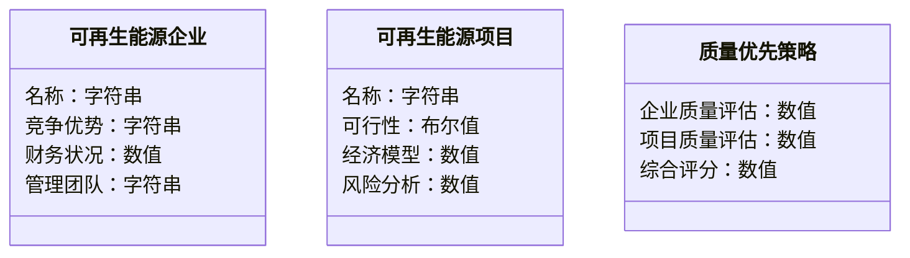
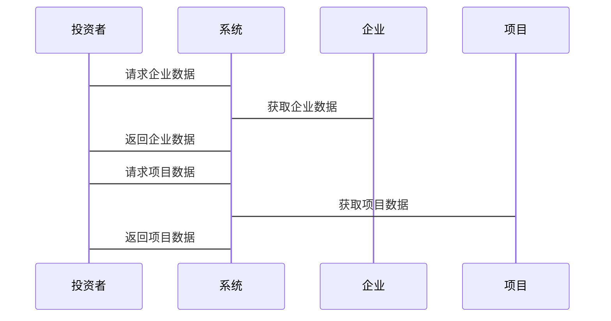

                 


# 彼得林奇的"质量优先"在可再生能源投资中的应用

> 关键词：彼得林奇、质量优先、可再生能源投资、投资策略、财务分析、企业评估、投资组合管理

> 摘要：本文深入探讨了彼得林奇的质量优先投资策略在可再生能源投资中的应用。通过分析可再生能源投资的核心要素，结合质量优先策略的核心概念，提出了基于企业质量评估、财务健康状况和竞争优势分析的可再生能源投资方法。本文还详细阐述了质量优先策略的算法原理、数学模型和系统架构设计，并通过实际案例分析，展示了如何在可再生能源投资中应用质量优先策略，实现投资收益的最大化。

---

# 第一部分: 引言

## 1.1 可再生能源投资的背景与重要性
### 1.1.1 可再生能源的全球发展趋势
随着全球能源需求的增加和化石能源的枯竭，可再生能源（如太阳能、风能、水能等）的投资需求日益增长。全球各国政府纷纷制定政策支持可再生能源的发展，推动能源结构转型。

### 1.1.2 投资者为何关注可再生能源
可再生能源投资不仅有助于减少碳排放，还能带来长期稳定的收益。投资者通过投资可再生能源项目，可以实现环境效益和经济效益的双重目标。

### 1.1.3 彼得林奇投资理念的背景介绍
彼得林奇是美国著名投资家，以其“质量优先”的投资策略闻名。他强调投资于具有强大竞争优势、良好财务状况和持续增长潜力的企业。

---

## 1.2 质量优先策略的核心思想
### 1.2.1 质量优先策略的定义
质量优先策略是指在投资过程中，优先选择具有高质量的企业，而非追求短期高收益。高质量企业的定义包括：强大的竞争优势、健康的财务状况、稳定的收益增长和良好的管理团队。

### 1.2.2 质量优先策略在传统投资中的应用
彼得林奇在传统投资中，通过对企业基本面的深入分析，选择那些具有长期竞争优势和良好财务状况的企业进行投资。

### 1.2.3 质量优先策略与可再生能源投资的结合
可再生能源投资需要结合质量优先策略的核心思想，通过对企业质量、财务健康状况和竞争优势的综合评估，选择具有长期增长潜力的可再生能源企业或项目进行投资。

---

## 1.3 本书的核心目标与结构
### 1.3.1 本书的核心目标
本文旨在探讨彼得林奇的质量优先策略在可再生能源投资中的应用，通过理论分析和实际案例，为投资者提供可操作的投资方法。

### 1.3.2 本书的结构安排
本文分为四个部分：引言、质量优先策略的核心概念与联系、质量优先策略的算法原理与数学模型、以及质量优先策略在可再生能源投资中的实际应用。

### 1.3.3 本书的适用读者
本文适合对可再生能源投资和彼得林奇投资策略感兴趣的读者，包括投资者、金融从业者、研究人员和学生。

---

# 第二部分: 质量优先策略在可再生能源投资中的背景介绍

## 2.1 可再生能源投资的背景与现状
### 2.1.1 可再生能源的定义与分类
可再生能源是指来自自然、可再生的能源资源，包括太阳能、风能、水能、生物质能等。这些能源具有无限性和可持续性，是未来能源发展的主要方向。

### 2.1.2 全球可再生能源投资的现状
近年来，全球可再生能源投资快速增长。根据国际能源署（IEA）的统计，2022年全球可再生能源投资达到3680亿美元，创历史新高。

### 2.1.3 中国可再生能源投资的政策支持
中国政府高度重视可再生能源的发展，通过“十四五”规划和“双碳”目标，推动可再生能源的快速发展。政策支持包括财政补贴、税收优惠和绿色金融等。

---

## 2.2 彼得林奇投资理念的核心要素
### 2.2.1 质量优先策略的五个核心要素
彼得林奇的质量优先策略强调以下五个核心要素：
1. 企业的竞争优势：企业是否具有独特的竞争优势，能否在行业中长期保持领先地位。
2. 财务健康状况：企业的财务状况是否健康，包括盈利能力、资产负债率、现金流等。
3. 管理团队：企业的管理团队是否具有优秀的领导能力和丰富的行业经验。
4. 行业前景：企业所处行业的前景是否良好，是否具有长期增长潜力。
5. 市场地位：企业在市场中的地位是否稳固，是否具有品牌优势。

### 2.2.2 质量优先策略的实施步骤
彼得林奇的质量优先策略的实施步骤包括：
1. 选择具有竞争优势的企业。
2. 分析企业的财务状况，评估企业的盈利能力和发展潜力。
3. 选择具有优秀管理团队的企业。
4. 评估企业所处行业的前景和市场地位。
5. 综合评估，选择具有长期增长潜力的企业进行投资。

### 2.2.3 质量优先策略的优缺点分析
质量优先策略的优点在于能够选择具有长期竞争优势和良好财务状况的企业，降低投资风险。缺点在于可能需要较长的投资周期，且在短期内可能无法获得高收益。

---

## 2.3 质量优先策略与可再生能源投资的结合
### 2.3.1 可再生能源投资中的质量优先策略
在可再生能源投资中，质量优先策略的核心是选择具有长期竞争优势和良好财务状况的企业或项目。

### 2.3.2 质量优先策略在可再生能源投资中的应用案例
以某太阳能企业为例，通过分析其竞争优势、财务状况和行业前景，评估其是否符合质量优先策略的要求。

### 2.3.3 质量优先策略与可再生能源投资的未来趋势
随着可再生能源技术的不断进步和政策支持力度的加大，质量优先策略在可再生能源投资中的应用将更加广泛。

---

# 第三部分: 质量优先策略的核心概念与联系

## 3.1 质量优先策略的核心概念
### 3.1.1 企业质量评估的定义与标准
企业质量评估是指通过对企业的财务状况、竞争优势和管理团队的综合评估，确定企业的质量等级。企业质量评估的标准包括盈利能力、资产负债率、现金流、行业地位等。

### 3.1.2 财务健康状况的评估指标
财务健康状况的评估指标包括：
- 净利润：企业的盈利能力。
- 资产负债率：企业的财务杠杆情况。
- 现金流：企业的现金流状况。

### 3.1.3 企业竞争优势的分析框架
企业竞争优势的分析框架包括：
- 技术优势：企业的技术水平和创新能力。
- 市场地位：企业在市场中的地位和品牌影响力。
- 资源优势：企业是否拥有独特的资源或原材料供应。

---

## 3.2 可再生能源投资的核心要素
### 3.2.1 可再生能源项目的生命周期
可再生能源项目的生命周期包括：
1. 项目规划：确定项目的可行性。
2. 项目开发：获取土地、审批、设计等。
3. 项目实施：建设、安装设备。
4. 项目运营：发电、维护、收益。

### 3.2.2 可再生能源项目的经济模型
可再生能源项目的经济模型包括：
- 投资成本：项目的初始投资。
- 运营成本：项目的日常维护和管理费用。
- 收益：项目的发电收入和政府补贴。

### 3.2.3 可再生能源项目的政策支持与风险
可再生能源项目的政策支持包括：
- 财政补贴：政府对可再生能源项目的财政支持。
- 税收优惠：政府对可再生能源项目的税收减免。

可再生能源项目的风险包括：
- 技术风险：技术落后或设备故障。
- 市场风险：能源价格波动。
- 政策风险：政策变化对项目的影响。

---

## 3.3 质量优先策略与可再生能源投资的联系
### 3.3.1 质量优先策略在可再生能源项目选择中的应用
通过质量优先策略，投资者可以选择具有长期竞争优势和良好财务状况的可再生能源企业或项目。

### 3.3.2 质量优先策略在可再生能源企业评估中的应用
通过质量优先策略，投资者可以对企业进行综合评估，确定企业的质量等级。

### 3.3.3 质量优先策略在可再生能源投资组合管理中的应用
通过质量优先策略，投资者可以构建一个高质量的投资组合，实现投资收益的最大化。

---

# 第四部分: 质量优先策略的算法原理与数学模型

## 4.1 质量优先策略的算法原理
### 4.1.1 质量优先策略的评估指标体系
质量优先策略的评估指标体系包括：
1. 企业质量评估：包括竞争优势、财务状况、管理团队等。
2. 项目评估：包括项目可行性、经济模型、风险分析等。

### 4.1.2 质量优先策略的评分方法
质量优先策略的评分方法包括：
- 企业质量评分：通过对企业的综合评估，确定企业的质量评分。
- 项目质量评分：通过对项目的综合评估，确定项目的质量评分。

### 4.1.3 质量优先策略的决策规则
质量优先策略的决策规则包括：
- 选择具有高质量评分的企业或项目。
- 综合考虑投资风险和收益，制定投资策略。

---

## 4.2 质量优先策略的数学模型
### 4.2.1 企业质量评估模型
企业质量评估模型包括：
$$
\text{企业质量指数} = \alpha \times \text{竞争优势} + \beta \times \text{财务状况} + \gamma \times \text{管理团队}
$$

### 4.2.2 项目评估模型
项目评估模型包括：
$$
\text{项目质量指数} = \alpha \times \text{项目可行性} + \beta \times \text{经济模型} + \gamma \times \text{风险分析}
$$

### 4.2.3 综合评估模型
综合评估模型包括：
$$
\text{综合评分} = \alpha \times \text{企业质量指数} + \beta \times \text{项目质量指数}
$$

---

## 4.3 质量优先策略的实现步骤
### 4.3.1 数据采集
数据采集包括企业财务数据、项目可行性数据等。

### 4.3.2 数据分析
数据分析包括对企业财务状况、竞争优势和项目可行性的分析。

### 4.3.3 模型计算
模型计算包括对企业质量指数、项目质量指数和综合评分的计算。

### 4.3.4 投资决策
投资决策包括根据综合评分，选择具有高质量评分的企业或项目进行投资。

---

# 第五部分: 质量优先策略在可再生能源投资中的实际应用

## 5.1 项目背景介绍
### 5.1.1 项目目标
本项目旨在通过质量优先策略，选择具有长期竞争优势和良好财务状况的可再生能源企业或项目进行投资。

### 5.1.2 项目范围
本项目涵盖太阳能、风能等可再生能源项目的选择和评估。

---

## 5.2 系统功能设计
### 5.2.1 领域模型（Mermaid 类图）


### 5.2.2 系统架构设计（Mermaid 架构图）


### 5.2.3 系统接口设计
系统接口设计包括：
- 企业数据接口：获取企业的财务数据和竞争优势信息。
- 项目数据接口：获取项目的可行性数据和经济模型。

### 5.2.4 系统交互设计（Mermaid 序列图）


---

## 5.3 项目实战
### 5.3.1 环境安装
```bash
pip install numpy pandas matplotlib
```

### 5.3.2 核心代码实现
```python
import numpy as np
import pandas as pd

# 企业质量评估函数
def evaluate_company(company_data):
    # 竞争优势评分
    competition_advantage = company_data['competition_advantage']
    # 财务状况评分
    financial_health = company_data['financial_health']
    # 管理团队评分
    management_team = company_data['management_team']
    # 综合评分
    company_score = 0.4 * competition_advantage + 0.3 * financial_health + 0.3 * management_team
    return company_score

# 项目评估函数
def evaluate_project(project_data):
    # 项目可行性评分
    project_feasibility = project_data['project_feasibility']
    # 经济模型评分
    economic_model = project_data['economic_model']
    # 风险分析评分
    risk_analysis = project_data['risk_analysis']
    # 综合评分
    project_score = 0.4 * project_feasibility + 0.3 * economic_model + 0.3 * risk_analysis
    return project_score

# 综合评分函数
def overall_score(company_score, project_score):
    return 0.5 * company_score + 0.5 * project_score
```

### 5.3.3 代码应用解读与分析
通过对企业的综合评估和项目的综合评估，计算企业的质量评分和项目的质量评分，最终计算综合评分，选择具有高综合评分的企业或项目进行投资。

### 5.3.4 实际案例分析
以某太阳能企业为例，通过代码实现，计算其综合评分，评估其是否符合质量优先策略的要求。

### 5.3.5 项目小结
通过本项目，投资者可以利用质量优先策略，选择具有长期竞争优势和良好财务状况的可再生能源企业或项目进行投资。

---

## 5.4 最佳实践 Tips
### 5.4.1 投资前的准备工作
- 收集企业的财务数据和竞争优势信息。
- 分析企业的财务状况和管理团队。

### 5.4.2 投资中的注意事项
- 定期评估企业的质量和项目的可行性。
- 根据市场变化和政策调整投资策略。

### 5.4.3 投资后的跟踪
- 监测企业的经营状况和项目的进展。
- 根据评估结果，调整投资组合。

---

# 第六部分: 结论

## 6.1 全文总结
本文深入探讨了彼得林奇的质量优先策略在可再生能源投资中的应用，通过理论分析和实际案例，为投资者提供了可操作的投资方法。

## 6.2 未来展望
随着可再生能源技术的不断进步和政策支持力度的加大，质量优先策略在可再生能源投资中的应用将更加广泛。

## 6.3 投资建议
投资者在进行可再生能源投资时，应注重企业的质量和项目的可行性，选择具有长期竞争优势和良好财务状况的企业或项目进行投资。

---

# 作者：AI天才研究院/AI Genius Institute & 禅与计算机程序设计艺术 /Zen And The Art of Computer Programming

