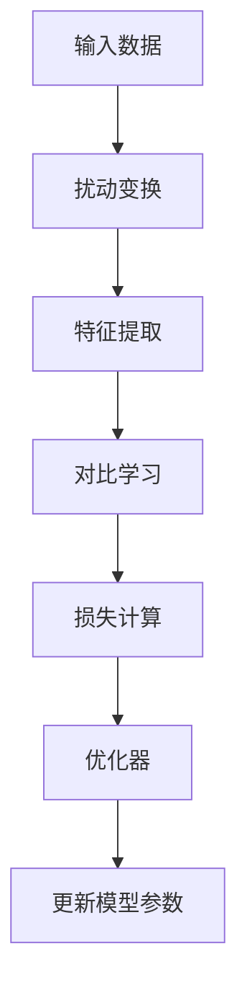
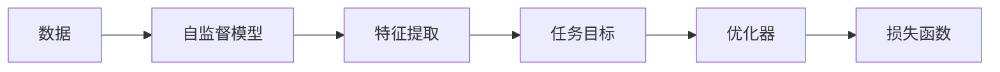
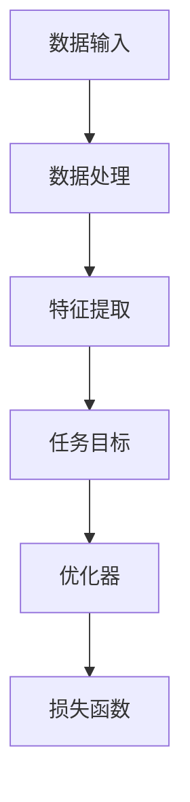
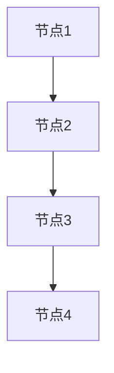
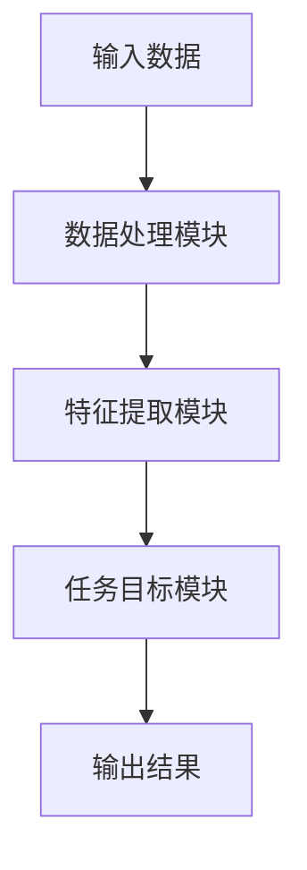

                 


# 自监督学习在AI Agent预训练中的应用

## 关键词
自监督学习, AI Agent, 预训练, 对比学习, 无监督学习, 智能体

## 摘要
本文深入探讨了自监督学习在AI Agent预训练中的应用，分析了其核心概念、算法原理和系统架构，通过具体案例展示了如何在实际项目中实现自监督学习，帮助读者全面理解自监督学习在AI Agent预训练中的重要性及其应用价值。

---

# 第一部分: 自监督学习与AI Agent概述

## 第1章: 自监督学习与AI Agent概述

### 1.1 自监督学习的定义与核心概念
#### 1.1.1 自监督学习的定义
自监督学习是一种无监督学习方法，通过利用数据本身的结构信息来学习特征表示。其核心思想是通过构建 pretext tasks（伪任务）来预测数据的某种特性，从而提取有用的特征。

#### 1.1.2 自监督学习的核心属性
- **无监督性**：无需人工标注，仅利用数据本身的结构。
- **自适应性**：能够适应不同领域和任务。
- **泛化能力**：能够在未见数据上表现出色。

#### 1.1.3 自监督学习与监督学习的区别
| 特性 | 监督学习 | 自监督学习 |
|------|----------|------------|
| 数据需求 | 需要标注数据 | 无需标注数据 |
| 训练目标 | 直接优化任务目标 | 通过伪任务间接优化目标 |
| 数据效率 | 数据利用率低 | 数据利用率高 |

### 1.2 AI Agent的基本概念与功能
#### 1.2.1 AI Agent的定义
AI Agent（智能体）是指能够感知环境并采取行动以实现目标的智能系统。它可以是一个软件程序或实体设备，具备自主决策能力。

#### 1.2.2 AI Agent的核心功能
- **感知环境**：通过传感器或数据输入获取环境信息。
- **决策制定**：基于感知信息做出决策。
- **行动执行**：根据决策执行具体操作。
- **学习与优化**：通过学习提升自身能力。

#### 1.2.3 AI Agent的应用场景
- **自动驾驶**：实时感知环境并做出驾驶决策。
- **智能助手**：如Siri、Alexa，提供语音交互服务。
- **机器人控制**：实现复杂动作的自主执行。

### 1.3 自监督学习在AI Agent中的作用
#### 1.3.1 自监督学习如何赋能AI Agent
自监督学习可以帮助AI Agent在无标注数据的情况下，从环境中提取有用的特征，提升其感知和决策能力。

#### 1.3.2 自监督学习在AI Agent预训练中的优势
- **减少标注成本**：无需人工标注数据。
- **提升泛化能力**：通过自监督学习，AI Agent能够更好地适应各种未知环境。
- **实时性**：可以在实时环境中进行学习和调整。

#### 1.3.3 自监督学习与AI Agent的结合方式
- **视觉感知**：通过图像重建或对比学习，提升视觉感知能力。
- **语音识别**：通过语音自重建任务，提升语音处理能力。
- **行为预测**：通过预测未来动作，提升决策能力。

### 1.4 本章小结
本章介绍了自监督学习和AI Agent的基本概念，并探讨了自监督学习在AI Agent中的作用及其优势。自监督学习为AI Agent提供了强大的无监督学习能力，能够在各种场景中发挥重要作用。

---

# 第二部分: 自监督学习的核心原理与算法

## 第2章: 自监督学习的核心原理

### 2.1 自监督学习的数学模型
#### 2.1.1 对比学习的目标函数
对比学习是一种常用的自监督学习方法，其目标是让相似的数据点具有相似的表示，不同的数据点具有不同的表示。对比学习的目标函数通常包括两个部分：正样本对和负样本对的相似性度量。

$$ L = -\log\left(\frac{e^{sim(x_i, x_j)}}{e^{sim(x_i, x_k)} + e^{sim(x_j, x_k)}}\right) $$

其中，$sim(x_i, x_j)$ 表示样本 $x_i$ 和 $x_j$ 之间的相似性度量。

#### 2.1.2 知识蒸馏的原理
知识蒸馏是一种通过教师模型指导学生模型学习的方法。教师模型通常是一个预训练好的大模型，学生模型则通过模仿教师模型的输出来学习知识。

$$ P_{student}(y|x) \approx P_{teacher}(y|x) $$

其中，$P_{student}$ 和 $P_{teacher}$ 分别表示学生模型和教师模型的输出概率分布。

#### 2.1.3 图结构自监督学习
图结构自监督学习通过构建图结构，利用节点之间的关系进行学习。例如，在图中，每个节点表示一个数据点，边表示节点之间的关系。

### 2.2 自监督学习的核心算法
#### 2.2.1 SimCLR算法
SimCLR是一种基于对比学习的自监督学习算法，通过将数据点进行扰动，并预测其原始数据的相似性。



#### 2.2.2 BYOL算法
BYOL（Bootstrap Your Own Labeler）是一种自监督学习算法，通过动态地生成伪标签，并利用这些伪标签进行分类任务。

#### 2.2.3 SwAV算法
SwAV（Swapping Assignments）通过将数据点分组成不同的聚类，并利用这些聚类进行对比学习。

### 2.3 自监督学习的优缺点对比
| 特性 | 优点 | 缺点 |
|------|------|------|
| 数据利用率 | 高 | 需要设计合适的伪任务 |
| 算法复杂度 | 低 | 需要处理负样本对的问题 |
| 适用场景 | 适用于无标注数据 | 适用于特定任务 |

### 2.4 自监督学习的实体关系图


---

# 第三部分: AI Agent的预训练与系统架构

## 第3章: AI Agent的预训练系统

### 3.1 AI Agent预训练的系统架构
#### 3.1.1 预训练系统的组成
- **数据输入模块**：接收原始数据。
- **数据处理模块**：对数据进行预处理和增强。
- **特征提取模块**：通过自监督学习提取特征。
- **任务目标模块**：定义伪任务并进行预测。

#### 3.1.2 系统功能模块划分
| 模块 | 功能描述 |
|------|----------|
| 数据输入 | 接收原始数据 |
| 数据处理 | 对数据进行清洗和增强 |
| 特征提取 | 提取数据的特征表示 |
| 任务目标 | 定义伪任务并进行预测 |

#### 3.1.3 系统架构设计图


### 3.2 AI Agent预训练的核心算法实现
#### 3.2.1 对比学习的实现
对比学习的目标是让相似的数据点具有相似的表示，不同的数据点具有不同的表示。

```python
def contrastive_loss(features, labels):
    # 计算正样本对的相似性
    positive_pairs = features[labels == 0]
    positive_loss = -torch.mean(torch.log(torch.exp(similarity(positive_pairs[:,0], positive_pairs[:,1])) + 1e-8))
    # 计算负样本对的相似性
    negative_pairs = features[labels == 1]
    negative_loss = -torch.mean(torch.log(1 - similarity(negative_pairs[:,0], negative_pairs[:,1]) + 1e-8))
    # 总损失
    total_loss = positive_loss + negative_loss
    return total_loss
```

#### 3.2.2 知识蒸馏的实现
知识蒸馏的目标是通过教师模型指导学生模型学习。

```python
def distillation_loss(student_logits, teacher_logits, T=1):
    # 计算软标签
    soft_labels = torch.nn.functional.softmax(teacher_logits / T, dim=1)
    # 计算KL散度
    loss = torch.nn.KLDivLoss(reduction='batchmean')(torch.nn.functional.log_softmax(student_logits, dim=1), soft_labels)
    return loss
```

#### 3.2.3 图结构自监督学习的实现
图结构自监督学习通过构建图结构，利用节点之间的关系进行学习。



### 3.3 AI Agent预训练的系统接口设计
#### 3.3.1 输入接口
- **输入数据格式**：如图像、文本等。
- **输入数据类型**：如RGB图像、语音信号等。

#### 3.3.2 输出接口
- **输出特征表示**：如特征向量。
- **输出预测结果**：如分类结果。

#### 3.3.3 接口交互流程图


### 3.4 本章小结
本章详细介绍了AI Agent预训练系统的架构设计和核心算法实现，包括对比学习、知识蒸馏和图结构自监督学习的实现。通过这些方法，AI Agent可以在无标注数据的情况下，提取有用的特征并提升其性能。

---

# 第四部分: 项目实战与代码实现

## 第4章: 自监督学习在AI Agent中的项目实战

### 4.1 项目环境安装与配置
#### 4.1.1 安装Python环境
- 使用Anaconda安装Python 3.8及以上版本。
- 安装必要的依赖库，如PyTorch、 torchvision、numpy等。

#### 4.1.2 安装依赖库
```bash
pip install torch torchvision numpy
```

#### 4.1.3 配置开发环境
- 安装Jupyter Notebook或VS Code作为开发环境。
- 配置Python路径和环境变量。

### 4.2 项目核心代码实现
#### 4.2.1 数据预处理代码
```python
import numpy as np
import torch
from torchvision import transforms

# 数据预处理
transform = transforms.Compose([
    transforms.Resize(256),
    transforms.RandomResizedCrop(224),
    transforms.ToTensor(),
])

# 加载数据集
data = torch.randn(100, 3, 224, 224)
```

#### 4.2.2 自监督学习模型实现
```python
class ContrastiveModel(torch.nn.Module):
    def __init__(self, feature_dim=128):
        super(ContrastiveModel, self).__init__()
        self.feature_extractor = torch.nn.Sequential(
            torch.nn.Conv2d(3, 64, kernel_size=3, stride=1, padding=1),
            torch.nn.ReLU(),
            torch.nn.Conv2d(64, 128, kernel_size=3, stride=1, padding=1),
            torch.nn.ReLU()
        )
        self.fc = torch.nn.Linear(128 * 224 * 224, feature_dim)
    
    def forward(self, x):
        features = self.feature_extractor(x)
        features = torch.flatten(features, start_dim=1)
        features = self.fc(features)
        return features
```

#### 4.2.3 AI Agent预训练代码
```python
def train_model(model, optimizer, loss_fn, data, epochs=100):
    for epoch in range(epochs):
        for batch in data:
            # 前向传播
            features = model(batch)
            # 计算损失
            loss = loss_fn(features, labels)
            # 反向传播
            optimizer.zero_grad()
            loss.backward()
            optimizer.step()
    return model
```

### 4.3 项目小结
本章通过具体的代码实现，展示了如何在实际项目中应用自监督学习进行AI Agent的预训练。通过对比学习、知识蒸馏等方法，可以有效提升AI Agent的性能。

---

# 第五部分: 总结与展望

## 第5章: 总结与展望

### 5.1 本章总结
本文详细探讨了自监督学习在AI Agent预训练中的应用，分析了其核心概念、算法原理和系统架构，并通过具体案例展示了如何在实际项目中实现自监督学习。自监督学习为AI Agent提供了强大的无监督学习能力，能够在各种场景中发挥重要作用。

### 5.2 未来展望
未来，随着自监督学习技术的不断发展，AI Agent的性能将进一步提升。同时，如何将自监督学习与其他学习方法结合，也将成为研究的重点。

---

# 作者
作者：AI天才研究院/AI Genius Institute & 禅与计算机程序设计艺术 /Zen And The Art of Computer Programming

