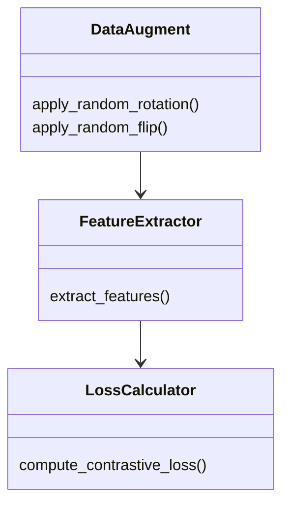
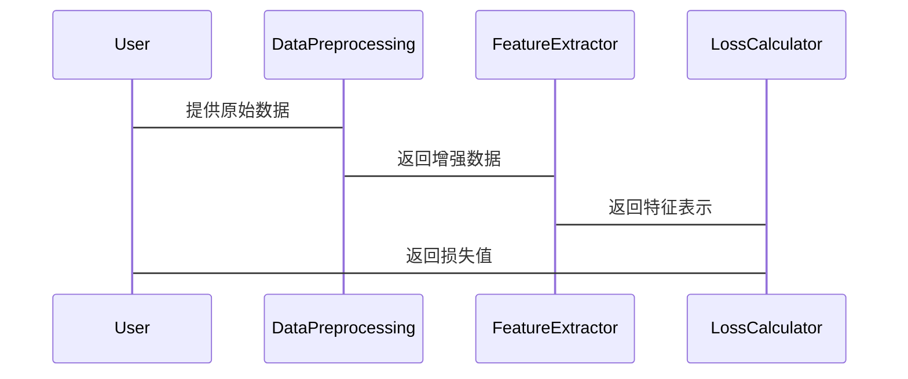

                 


# 自监督学习：减少AI Agent的标注数据依赖

## 关键词：自监督学习，AI Agent，标注数据，数据增强，对比学习，无监督学习，机器学习

## 摘要：
在AI Agent的开发中，标注数据的依赖是一个长期存在的挑战，限制了模型的泛化能力和应用场景。自监督学习作为一种新兴的学习范式，通过利用未标注数据中的内在结构信息，显著减少了对标注数据的依赖，同时提升了模型的自适应能力。本文将系统地探讨自监督学习的核心概念、算法原理、系统设计以及实际应用，帮助读者全面理解并掌握这一技术。通过理论与实践相结合的方式，本文将为AI Agent的开发提供新的思路和解决方案。

---

# 第1章: 自监督学习的背景与问题背景

## 1.1 数据标注的挑战与问题背景

### 1.1.1 数据标注的高昂成本
数据标注是AI模型训练的基础，但其成本和时间消耗常常令人望而却步。专业标注团队的投入、标注工具的开发与维护、标注质量的控制，这些都需要大量资源。例如，训练一个图像分类模型可能需要数千甚至数万个标注样本，每个样本的标注可能需要数分钟甚至更长时间。这种依赖标注数据的模式严重限制了AI技术在资源有限场景中的应用。

### 1.1.2 数据标注的局限性
标注数据的局限性主要体现在以下方面：
1. **领域依赖性**：标注数据往往集中在特定领域，难以泛化到其他领域或任务。
2. **标注偏差**：标注者的主观性和经验可能引入偏差，影响模型的公平性和准确性。
3. **动态适应性差**：当数据分布或任务需求发生变化时，标注数据的更新成本极高。

### 1.1.3 AI Agent对标注数据的过度依赖
AI Agent需要实时感知环境、理解和执行任务，这些能力的训练高度依赖标注数据。然而，在真实场景中，标注数据往往难以覆盖所有可能的输入和任务需求。这种过度依赖导致AI Agent在面对未知或复杂环境时表现不佳，限制了其实际应用价值。

## 1.2 自监督学习的定义与特点

### 1.2.1 自监督学习的定义
自监督学习（Self-Supervised Learning）是一种学习范式，旨在通过利用未标注数据中的内在结构信息，构建任务相关的表示。与监督学习不同，自监督学习不需要外部标注，而是通过设计伪任务（pseudo-tasks）来利用未标注数据。

### 1.2.2 自监督学习的核心特点
1. **无监督数据利用**：自监督学习能够从未标注数据中提取有用信息，减少对标注数据的依赖。
2. **自适应能力**：通过学习数据的内在结构，模型具备更好的泛化能力和适应性。
3. **任务驱动性**：自监督学习通过设计特定的伪任务，引导模型学习任务相关的表示。

## 1.3 自监督学习的背景与应用前景

### 1.3.1 自监督学习的应用领域
自监督学习已在多个领域展现出强大的潜力，包括计算机视觉、自然语言处理、语音识别等。例如，在图像分割任务中，自监督学习可以通过未标注数据学习图像的语义信息，辅助分割任务。

### 1.3.2 自监督学习在AI Agent中的潜力
AI Agent需要处理多模态数据（如图像、文本、语音）并实时适应环境，这使得自监督学习成为一种理想的解决方案。通过自监督学习，AI Agent可以更好地理解和预测环境，降低对标注数据的依赖。

### 1.3.3 自监督学习的挑战与机遇
尽管自监督学习展现出巨大潜力，但其在实际应用中仍面临诸多挑战，如伪任务设计的难度、模型的稳定性和收敛性等。这些挑战也为研究者提供了广阔的研究空间和创新机遇。

## 1.4 本章小结
本章从数据标注的挑战出发，介绍了自监督学习的定义和特点，并探讨了其在AI Agent中的应用前景。自监督学习通过减少对标注数据的依赖，为AI Agent的开发提供了新的思路。

---

# 第2章: 自监督学习的核心概念与原理

## 2.1 自监督学习的核心概念

### 2.1.1 自监督学习的核心要素
自监督学习的核心要素包括：
1. **数据增强**：通过变换数据生成伪样本。
2. **伪任务设计**：设计任务以利用未标注数据。
3. **对比学习**：通过对比不同数据点，学习数据的内在结构。

### 2.1.2 数据增强方法
数据增强是自监督学习的重要组成部分，常用的增强方法包括旋转、翻转、裁剪、颜色抖动等。以下是一个典型的数据增强流程：

```python
def data_augment(image):
    # 旋转
    image_rotated = rotate(image, 90)
    # 翻转
    image_flipped = flip(image)
    # 裁剪
    image_cropped = crop(image, 0.8)
    return image_cropped, image_flipped, image_rotated
```

### 2.1.3 对比学习框架
对比学习是一种常见的自监督学习框架，其核心是通过对比不同增强样本，学习数据的相似性。例如，以下是一个对比学习的伪任务设计：

$$ L(x_i, x_j) = -\frac{1}{K}\sum_{k=1}^{K} \log(\frac{e^{x_i^T x_j}}{1 + e^{x_i^T x_j}}) $$

其中，\(x_i\)和\(x_j\)是同一数据点的两种增强形式，\(K\)是样本的聚类数。

### 2.1.4 损失函数的作用
损失函数在自监督学习中起着关键作用，常用的损失函数包括对比损失、交叉熵损失等。例如，以下是一个对比损失函数的示例：

$$ L = -\log(\text{sim}(x_i, x_j) + \epsilon) $$
其中，\(\text{sim}\)是相似度函数，\(\epsilon\)是防止对数计算为零的常数。

## 2.2 自监督学习的核心原理

### 2.2.1 数据增强与特征提取
通过数据增强生成多样化的样本，特征提取器能够学习到数据的不变性。例如，图像旋转后，特征提取器需要保持对图像内容的理解。

### 2.2.2 对比损失函数的作用
对比损失函数通过最大化正样本的相似性和最小化负样本的相似性，迫使模型学习数据的内在结构。

### 2.2.3 自监督学习的数学模型
自监督学习的数学模型通常包括数据增强模块、特征提取模块和损失计算模块。例如，以下是一个典型的对比学习框架：

$$ \text{Loss} = \text{Contrastive Loss}(f(x_i), f(x_j)) $$

其中，\(f(x_i)\)和\(f(x_j)\)是同一数据点的两种增强形式的特征表示。

## 2.3 本章小结
本章深入探讨了自监督学习的核心概念，包括数据增强、对比学习和损失函数。通过这些核心要素，自监督学习能够从未标注数据中提取有用信息，降低对标注数据的依赖。

---

# 第3章: 自监督学习的算法原理与数学模型

## 3.1 自监督学习的算法原理

### 3.1.1 对比学习的流程
对比学习的流程包括数据增强、特征提取和损失计算。例如：

1. 数据增强：将原始数据变换为多种形式。
2. 特征提取：提取每种形式的特征表示。
3. 损失计算：通过对比损失函数优化特征表示。

### 3.1.2 数据增强的策略
数据增强的策略直接影响模型的泛化能力。例如，使用随机旋转、翻转和裁剪等方法生成多样化样本。

### 3.1.3 损失函数的设计
损失函数的设计需要平衡正样本和负样本的相似性。例如，对比损失函数通过最大化正样本的相似性和最小化负样本的相似性来优化特征表示。

## 3.2 自监督学习的数学模型

### 3.2.1 对比损失函数的公式
对比损失函数的公式可以表示为：

$$ L = -\frac{1}{N}\sum_{i=1}^{N}\log(\text{sim}(x_i, x_j)) $$

其中，\(N\)是样本对的数量，\(x_i\)和\(x_j\)是同一数据点的两种增强形式。

### 3.2.2 数据增强的数学表示
数据增强可以通过多种变换操作生成样本。例如，旋转操作可以表示为：

$$ x'_i = R(x_i) $$

其中，\(R\)是旋转操作函数。

### 3.2.3 特征提取的数学模型
特征提取模型通常是一个深度神经网络，其数学表示为：

$$ f(x) = \text{NN}(x) $$

其中，\(\text{NN}\)表示一个神经网络模型。

## 3.3 本章小结
本章详细探讨了自监督学习的算法原理和数学模型，重点介绍了对比学习的流程和损失函数的设计。通过这些内容，读者可以更好地理解自监督学习的实现细节。

---

# 第4章: 系统分析与架构设计方案

## 4.1 项目背景介绍

### 4.1.1 项目目标
本项目旨在通过自监督学习技术，减少AI Agent对标注数据的依赖，提升其在复杂环境中的适应能力。

### 4.1.2 项目需求
项目需求包括：
1. 数据预处理模块：处理原始数据，生成多样化的样本。
2. 特征提取模块：提取数据的特征表示。
3. 损失计算模块：计算对比损失，优化模型参数。

## 4.2 系统功能设计

### 4.2.1 领域模型设计
领域模型设计包括数据增强、特征提取和损失计算三个部分。以下是领域模型的类图：



### 4.2.2 系统架构设计
系统架构设计采用分层架构，包括数据预处理层、特征提取层和优化层。以下是系统架构的架构图：


### 4.2.3 系统接口设计
系统接口设计包括数据输入接口、特征提取接口和损失计算接口。以下是系统接口的交互图：



## 4.3 本章小结
本章通过系统分析与架构设计，详细探讨了自监督学习系统的实现方案。通过分层架构和模块化设计，系统能够高效地处理数据，优化模型参数。

---

# 第5章: 项目实战

## 5.1 环境安装与配置

### 5.1.1 安装依赖
安装必要的Python库，如：

```bash
pip install numpy
pip install matplotlib
pip install keras
pip install tensorflow
```

### 5.1.2 环境配置
配置运行环境，例如：

```bash
export CUDA_VISIBLE_DEVICES=0
```

## 5.2 系统核心实现

### 5.2.1 数据增强模块
实现数据增强模块，例如：

```python
import tensorflow as tf

def data_augment(image):
    image_rotated = tf.image.rot90(image)
    image_flipped = tf.image.flip_left_right(image)
    return image_rotated, image_flipped
```

### 5.2.2 特征提取模块
实现特征提取模块，例如：

```python
from tensorflow.keras import layers

def feature_extractor():
    model = tf.keras.Sequential([
        layers.Conv2D(32, (3, 3), activation='relu'),
        layers.MaxPooling2D((2, 2)),
        layers.Flatten(),
        layers.Dense(128, activation='relu')
    ])
    return model
```

### 5.2.3 损失计算模块
实现对比损失函数，例如：

```python
import tensorflow as tf

def contrastive_loss(y_true, y_pred, margin=1.0):
    loss = tf.maximum(0.0, margin - y_pred)
    return tf.reduce_mean(loss)
```

## 5.3 代码实现与解读

### 5.3.1 核心代码实现
以下是完整的自监督学习代码实现：

```python
import tensorflow as tf
from tensorflow.keras import layers

def data_augment(image):
    image_rotated = tf.image.rot90(image)
    image_flipped = tf.image.flip_left_right(image)
    return image_rotated, image_flipped

def feature_extractor():
    model = tf.keras.Sequential([
        layers.Conv2D(32, (3, 3), activation='relu'),
        layers.MaxPooling2D((2, 2)),
        layers.Flatten(),
        layers.Dense(128, activation='relu')
    ])
    return model

def contrastive_loss(y_true, y_pred, margin=1.0):
    loss = tf.maximum(0.0, margin - y_pred)
    return tf.reduce_mean(loss)

def train_model(train_data, epochs=100, batch_size=32):
    feature_extractor = feature_extractor()
    optimizer = tf.keras.optimizers.Adam(learning_rate=0.001)
    for epoch in range(epochs):
        for batch in train_data:
            images = batch['image']
            with tf.GradientTape() as tape:
                x1, x2 = data_augment(images)
                f1 = feature_extractor(x1)
                f2 = feature_extractor(x2)
                similarity = tf.keras.losses.cosine_similarity(f1, f2)
                loss = contrastive_loss(tf.ones_like(similarity), similarity)
            gradients = tape.gradient(loss, feature_extractor.trainable_weights)
            optimizer.apply_gradients(zip(gradients, feature_extractor.trainable_weights))
    return feature_extractor

# 示例数据
train_data = [...]  # 具体数据集
model = train_model(train_data)
```

### 5.3.2 代码解读
1. **数据增强模块**：通过旋转和翻转生成多样化样本。
2. **特征提取模块**：使用卷积神经网络提取图像特征。
3. **损失计算模块**：计算对比损失，优化模型参数。

## 5.4 实际案例分析与详细讲解
以图像分类任务为例，通过自监督学习技术，模型能够从未标注数据中学习图像的特征表示，提升分类性能。以下是具体的实现步骤：

1. 数据预处理：将图像数据进行旋转、翻转等增强。
2. 特征提取：提取增强样本的特征表示。
3. 损失计算：通过对比损失函数优化模型参数。
4. 模型训练：迭代优化模型，提升分类性能。

## 5.5 本章小结
本章通过项目实战，详细讲解了自监督学习技术的实现过程。通过代码实现和案例分析，读者可以更好地理解自监督学习的实际应用。

---

# 第6章: 总结与展望

## 6.1 总结
自监督学习通过减少对标注数据的依赖，显著提升了AI Agent的自适应能力和泛化能力。本章总结了自监督学习的核心概念、算法原理和实际应用，为读者提供了全面的知识框架。

## 6.2 未来展望
自监督学习在AI Agent中的应用前景广阔，但仍面临诸多挑战。未来研究可以进一步优化伪任务设计，提升模型的稳定性和收敛性。同时，探索多模态数据的自监督学习方法，将为AI Agent的发展注入新的活力。

## 6.3 最佳实践 tips
1. **数据增强多样性**：通过多种变换操作生成多样化的样本，提升模型的泛化能力。
2. **损失函数优化**：设计合理的损失函数，平衡正样本和负样本的相似性。
3. **模型鲁棒性**：通过数据增强和模型正则化，提升模型的鲁棒性和稳定性。

## 6.4 本章小结
本章总结了自监督学习的核心内容，并展望了未来的研究方向。通过最佳实践的分享，读者可以更好地应用自监督学习技术，提升AI Agent的性能。

---

# 作者：AI天才研究院 & 禅与计算机程序设计艺术

---

通过以上结构，本文系统地探讨了自监督学习的核心概念、算法原理和实际应用。通过理论与实践相结合的方式，本文为AI Agent的开发提供了新的思路和解决方案。希望本文能够为读者在自监督学习领域的研究和应用提供有价值的参考和启示。

