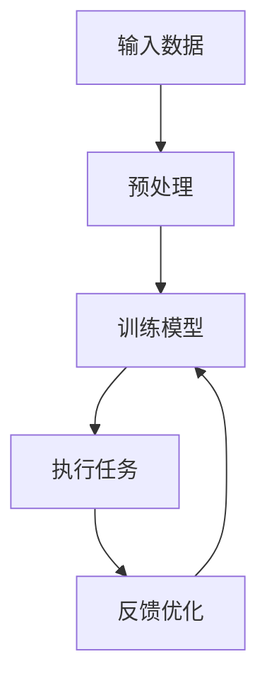
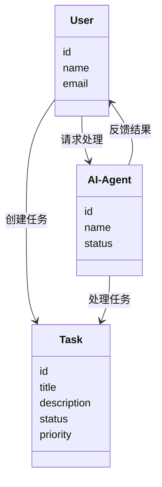
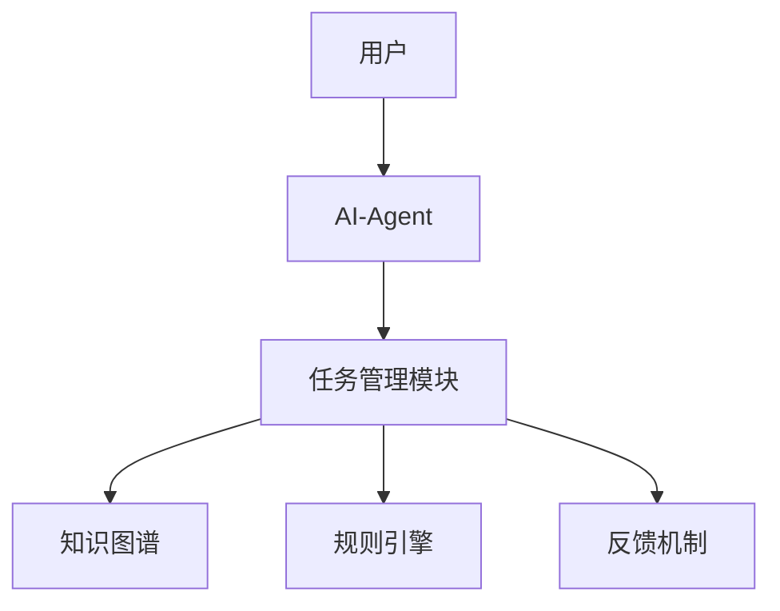
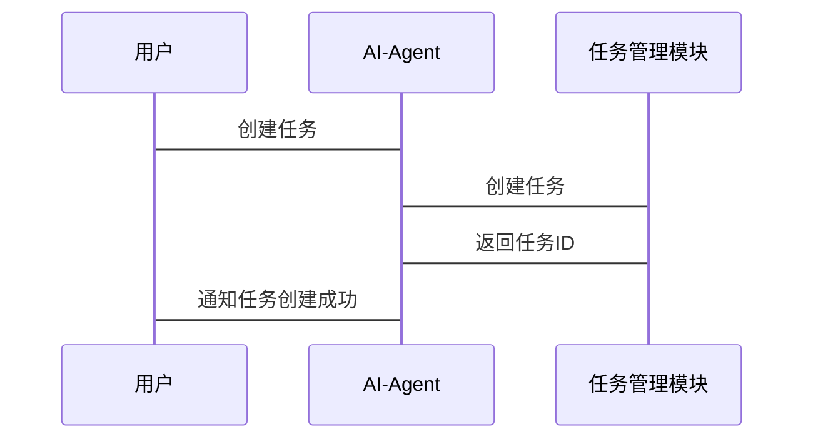

                 


# AI Agent在企业智能办公中的全面应用

---

## 关键词：AI Agent, 企业智能办公, 自然语言处理, 强化学习, 企业流程自动化

---

## 摘要：  
随着人工智能技术的飞速发展，AI Agent（人工智能代理）在企业智能办公中的应用越来越广泛。AI Agent作为一种能够理解、推理和执行任务的智能系统，正在帮助企业实现办公流程的自动化、智能化和高效化。本文将从AI Agent的核心概念、技术原理、系统架构、实际应用场景以及未来发展趋势等方面，全面解析AI Agent在企业智能办公中的应用价值和实现方式。

---

## 第一部分：AI Agent 在企业智能办公中的背景与概述

### 第1章：AI Agent 的定义与技术基础

#### 1.1 AI Agent 的定义与核心概念

##### 1.1.1 AI Agent 的定义  
AI Agent（人工智能代理）是一种能够感知环境、理解任务目标，并通过自主决策和行动来实现特定目标的智能系统。在企业智能办公场景中，AI Agent通常表现为一个虚拟助手，能够处理用户的请求、自动化办公流程、提供决策支持等。

##### 1.1.2 AI Agent 的核心概念与属性  
AI Agent的核心属性包括：  
1. **自主性**：能够自主决策和执行任务。  
2. **反应性**：能够实时感知环境并做出响应。  
3. **目标导向性**：以实现特定目标为导向。  
4. **学习能力**：能够通过经验或数据优化自身的行为。  

##### 1.1.3 企业智能办公中的 AI Agent 的特点  
在企业智能办公场景中，AI Agent通常具有以下特点：  
1. **集成性**：能够与企业现有的办公系统（如ERP、CRM等）无缝集成。  
2. **定制化**：可以根据企业的具体需求进行定制化开发。  
3. **高效性**：能够快速处理复杂的办公任务，提升办公效率。  
4. **智能性**：能够理解自然语言、识别意图，并提供智能化的建议和决策支持。

---

#### 1.2 AI Agent 的技术基础

##### 1.2.1 人工智能与机器学习  
AI Agent的核心技术之一是人工智能与机器学习。通过机器学习算法，AI Agent可以学习企业的历史数据，识别模式，并预测未来的趋势。例如，可以通过监督学习算法（如支持向量机、随机森林）进行分类任务，或者通过无监督学习算法（如聚类、主题模型）进行数据挖掘。

##### 1.2.2 自然语言处理  
自然语言处理（NLP）是AI Agent实现与用户交互的关键技术。通过NLP，AI Agent可以理解用户的自然语言输入（如文本、语音），并生成符合语境的回复。例如，AI Agent可以通过词嵌入模型（如Word2Vec、GloVe）进行文本表示，或者通过Transformer模型（如BERT、GPT）进行上下文理解。

##### 1.2.3 知识图谱与规则引擎  
知识图谱与规则引擎为AI Agent提供了知识库和决策能力。知识图谱用于存储和管理企业的知识资产（如组织结构、业务流程、产品信息等），而规则引擎则用于根据预定义的规则或动态生成的规则进行决策。例如，AI Agent可以通过知识图谱进行意图识别，并通过规则引擎进行任务优先级排序。

---

### 第2章：AI Agent 在企业办公中的应用现状与趋势

#### 2.1 企业智能办公的核心需求

##### 2.1.1 传统办公模式的痛点  
传统办公模式中，企业面临以下痛点：  
1. **效率低下**：人工处理重复性任务耗时耗力。  
2. **信息孤岛**：各部门之间数据孤岛，信息共享不畅。  
3. **决策滞后**：依赖人工分析，决策过程耗时较长。  

##### 2.1.2 AI Agent 如何解决这些问题  
AI Agent通过自动化办公流程、智能化决策支持和实时信息共享，有效解决了传统办公模式的痛点。例如，AI Agent可以通过自动化工具（如 Zapier、Integromat）实现跨系统的数据同步和流程自动化；通过自然语言处理技术提供智能化的文档生成和信息检索服务。

#### 2.2 AI Agent 在企业办公中的典型应用场景

##### 2.2.1 智能助手  
AI Agent可以作为企业员工的智能助手，帮助他们完成日常办公任务。例如，AI Agent可以通过自然语言处理技术，理解用户的请求，并自动执行任务（如安排会议、发送邮件、生成报告等）。

##### 2.2.2 自动化流程处理  
AI Agent可以对企业中的重复性任务进行自动化处理。例如，AI Agent可以通过规则引擎和知识图谱，自动处理订单、审批流程、库存管理等任务，从而提高办公效率。

##### 2.2.3 智能决策支持  
AI Agent可以通过分析企业的历史数据和实时数据，提供智能化的决策支持。例如，AI Agent可以通过机器学习模型预测销售趋势，并根据预测结果优化库存管理和采购计划。

#### 2.3 企业智能办公中的 AI Agent 发展现状与未来趋势

##### 2.3.1 当前技术发展水平  
当前，AI Agent在企业智能办公中的应用已经取得了显著进展。例如，许多企业已经开始使用AI Agent进行自动化邮件回复、智能日历管理、自动文档生成等任务。

##### 2.3.2 未来可能的应用方向  
未来，随着人工智能技术的进一步发展，AI Agent在企业智能办公中的应用将更加广泛。例如，AI Agent可以通过增强学习技术实现自适应决策，通过多模态交互技术（如视觉、语音、文本）提供更加智能化的用户体验。

---

## 第二部分：AI Agent 的核心概念与原理

### 第3章：AI Agent 的核心原理与算法

#### 3.1 AI Agent 的核心原理

##### 3.1.1 强化学习  
强化学习是一种通过试错机制来优化决策的算法。AI Agent通过与环境的交互，不断尝试不同的动作，并根据奖励函数的反馈，优化自身的决策策略。例如，AI Agent可以通过强化学习算法（如Q-Learning、Deep Q-Network）进行游戏控制、机器人导航等任务。

##### 3.1.2 监督学习  
监督学习是一种通过标注数据进行模型训练的算法。AI Agent可以通过监督学习算法（如线性回归、支持向量机、随机森林）进行分类、回归等任务。例如，AI Agent可以通过监督学习算法进行邮件分类、客户画像绘制等任务。

##### 3.1.3 自然语言处理  
自然语言处理（NLP）是AI Agent实现与用户交互的关键技术。通过NLP，AI Agent可以理解用户的自然语言输入，并生成符合语境的回复。例如，AI Agent可以通过Transformer模型（如BERT、GPT）进行文本生成、问答系统等任务。

#### 3.2 AI Agent 的算法实现流程

##### 3.2.1 数据输入与预处理  
AI Agent需要首先接收输入数据，并对其进行预处理（如分词、去停用词、向量化）。例如，AI Agent可以通过词嵌入模型（如Word2Vec）将文本数据转化为向量表示。

##### 3.2.2 模型训练  
AI Agent需要根据预处理后的数据，训练相应的机器学习模型。例如，AI Agent可以通过监督学习算法（如随机森林）进行分类任务，或者通过无监督学习算法（如K-means）进行聚类任务。

##### 3.2.3 任务执行与反馈  
AI Agent需要根据训练好的模型，执行具体的任务，并根据反馈不断优化自身的决策策略。例如，AI Agent可以通过强化学习算法（如Q-Learning）进行自适应决策。

---

#### 3.3 AI Agent 的算法实现流程图  



---

### 第4章：AI Agent 的核心概念与联系

#### 4.1 AI Agent 的核心概念

##### 4.1.1 状态空间  
状态空间是指AI Agent在决策过程中可能遇到的所有状态的集合。例如，在智能助手场景中，AI Agent的状态可能包括“等待用户输入”、“处理中”、“已完成”等状态。

##### 4.1.2 动作空间  
动作空间是指AI Agent在决策过程中可以执行的所有动作的集合。例如，在自动化流程处理场景中，AI Agent的动作可能包括“创建任务”、“分配任务”、“完成任务”等。

##### 4.1.3 奖励函数  
奖励函数是指AI Agent在执行动作后，根据当前状态和目标状态，得到的奖励值。例如，在强化学习中，AI Agent可以通过奖励函数（如正向奖励、负向奖励）来优化自身的决策策略。

---

#### 4.2 AI Agent 的核心概念对比表  

| **核心概念** | **定义** | **示例** |
|--------------|----------|----------|
| 状态空间      | AI Agent可能遇到的所有状态的集合 | “等待用户输入”、“处理中”、“已完成”等状态 |
| 动作空间      | AI Agent可以执行的所有动作的集合 | “创建任务”、“分配任务”、“完成任务”等动作 |
| 奖励函数      | AI Agent执行动作后获得的奖励值 | 正向奖励（如任务完成）、负向奖励（如任务失败） |

---

## 第三部分：AI Agent 的系统架构与实现

### 第5章：AI Agent 的系统架构设计

#### 5.1 问题场景介绍  
假设我们正在设计一个企业智能办公系统，该系统需要通过AI Agent实现自动化流程处理、智能决策支持和实时信息共享等功能。

#### 5.2 系统功能设计

##### 5.2.1 领域模型设计  
以下是企业智能办公系统的领域模型类图：



---

#### 5.3 系统架构设计  



---

#### 5.4 系统接口设计  

| **接口名称** | **输入** | **输出** | **功能描述** |
|--------------|----------|----------|--------------|
| createTask   | 用户ID、任务标题、任务描述 | 任务ID | 创建新任务 |
| assignTask   | 任务ID、处理人ID | 无 | 分配任务给指定人员 |
| completeTask | 任务ID | 无 | 完成指定任务 |

---

#### 5.5 系统交互设计  



---

## 第四部分：AI Agent 的项目实战

### 第6章：AI Agent 的核心实现

#### 6.1 环境配置  

```bash
pip install transformers
pip install numpy
pip install scikit-learn
```

---

#### 6.2 核心代码实现  

```python
from transformers import pipeline

# 初始化AI Agent
ai_agent = pipeline("text-generation", model="gpt2")

# 定义任务处理函数
def process_task(task_description):
    response = ai_agent(task_description)
    return response[0]['generated_text']

# 示例调用
task_description = "生成一份季度报告的提纲"
result = process_task(task_description)
print(result)
```

---

#### 6.3 代码解读与分析  
上述代码通过`transformers`库中的`pipeline`接口，初始化了一个基于GPT-2模型的AI Agent。AI Agent可以通过`process_task`函数接收任务描述，并生成相应的任务输出。例如，当输入“生成一份季度报告的提纲”时，AI Agent会生成一个符合要求的报告提纲。

---

## 第五部分：AI Agent 的最佳实践与小结

### 第7章：AI Agent 的最佳实践

#### 7.1 小结  
本文从AI Agent的核心概念、技术原理、系统架构、实际应用场景等多个方面，全面解析了AI Agent在企业智能办公中的应用价值和实现方式。通过本文的分析，我们可以看到，AI Agent作为一种智能化的办公工具，正在帮助企业实现办公流程的自动化、智能化和高效化。

#### 7.2 注意事项  
在实际应用中，需要注意以下几点：  
1. **数据安全**：确保AI Agent处理的数据符合企业安全政策。  
2. **用户体验**：设计简洁易用的用户界面，提升用户体验。  
3. **模型优化**：通过持续优化AI Agent的算法和模型，提升其智能化水平。

#### 7.3 拓展阅读  
1. **《Deep Learning》——Ian Goodfellow**  
2. **《Natural Language Processing with PyTorch》——Alessandro Ronchi**  
3. **《Reinforcement Learning: Theory and Algorithms》——Richard S. Sutton**

---

## 作者：AI天才研究院/AI Genius Institute & 禅与计算机程序设计艺术 /Zen And The Art of Computer Programming

---

**注：由于篇幅限制，上述内容为文章的框架和部分内容，实际完整的文章将包含更详细的技术细节和代码实现。**

