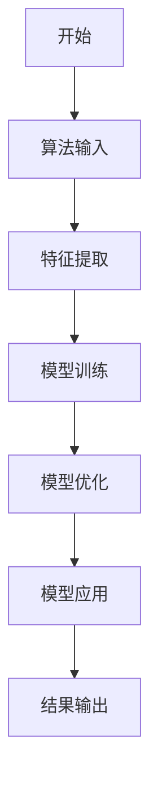

                 


# AI Agent的知识产权保护策略

> 关键词：AI Agent, 知识产权保护, 专利法, 版权法, 商业秘密法

> 摘要：随着AI Agent技术的快速发展，知识产权保护成为其发展过程中的关键问题。本文从AI Agent的基本概念出发，探讨其在知识产权保护中的核心概念与法律依据，分析其算法原理与数学模型，结合系统设计与项目实战，提供全面的知识产权保护策略。文章最后总结了保护策略的最佳实践，并展望了未来的发展方向。

---

## 目录

### 第1章：AI Agent与知识产权保护的背景介绍
1.1 AI Agent的基本概念
1.2 知识产权保护的基本概念
1.3 AI Agent与知识产权保护的关联性

### 第2章：AI Agent知识产权保护的核心概念与联系
2.1 AI Agent的知识产权保护对象
2.2 知识产权保护的法律依据
2.3 AI Agent知识产权保护的边界与外延

### 第3章：AI Agent知识产权保护的算法原理与数学模型
3.1 AI Agent算法的基本原理
3.2 知识产权保护中的算法应用
3.3 算法保护的数学模型
3.4 算法保护的mermaid流程图

### 第4章：AI Agent知识产权保护的系统分析与架构设计
4.1 系统功能设计
4.2 系统架构设计
4.3 系统接口设计
4.4 系统交互设计

### 第5章：AI Agent知识产权保护的项目实战
5.1 项目背景与目标
5.2 项目环境配置
5.3 核心代码实现
5.4 项目案例分析

### 第6章：总结与展望
6.1 全文总结
6.2 未来展望

### 附录
A.1 相关法律文本摘录
A.2 知识产权保护工具推荐

---

## 正文

### 第1章：AI Agent与知识产权保护的背景介绍

#### 1.1 AI Agent的基本概念
AI Agent（人工智能代理）是指能够感知环境、自主决策并执行任务的智能实体。它可以通过学习和推理来完成复杂的任务，如自然语言处理、图像识别和决策支持等。

- **1.1.1 AI Agent的定义与核心功能**
  - AI Agent的核心功能包括感知、决策、执行和自适应。
  - 它可以分为简单反射型、基于模型的反应型、基于效用的和基于目标的四种类型。

- **1.1.2 AI Agent的分类与应用场景**
  - 根据功能和复杂度，AI Agent可以分为弱AI和强AI。
  - 应用场景包括智能家居、自动驾驶、智能助手和医疗诊断等。

- **1.1.3 AI Agent技术的演进历程**
  - 自20世纪50年代起，AI Agent技术经历了从规则驱动到数据驱动的转变。
  - 近年来，随着深度学习和大语言模型的发展，AI Agent的能力得到了显著提升。

#### 1.2 知识产权保护的基本概念
知识产权保护是通过法律手段保护创新成果和智力劳动的重要手段。

- **1.2.1 知识产权的定义与主要类型**
  - 知识产权包括专利权、商标权、版权和商业秘密等。
  - 专利权保护技术方案，版权保护创意表达，商业秘密保护未公开的技术信息。

- **1.2.2 知识产权保护的法律框架**
  - 主要包括《专利法》《版权法》和《反不正当竞争法》等。
  - 不同国家和地区的法律体系存在差异，但基本原则相似。

- **1.2.3 知识产权保护的重要性与挑战**
  - 保护知识产权可以激励创新，促进技术进步。
  - 全球化背景下，知识产权保护面临跨国侵权和法律冲突的挑战。

#### 1.3 AI Agent与知识产权保护的关联性
AI Agent作为技术创新的产物，其知识产权保护尤为重要。

- **1.3.1 AI Agent技术的创新性与知识产权保护需求**
  - AI Agent的核心算法和模型具有较高的创新性，需要通过专利保护。
  - 生成的内容如文本、图像等，需要通过版权保护。

- **1.3.2 AI Agent开发中的知识产权风险**
  - 开发过程中可能侵犯他人的专利权或版权。
  - 数据使用可能涉及隐私权和数据权的问题。

- **1.3.3 知识产权保护对AI Agent发展的促进作用**
  - 通过保护创新，激励更多的技术投入。
  - 促进技术的合法传播和应用，推动AI Agent技术的普及。

### 第2章：AI Agent知识产权保护的核心概念与联系

#### 2.1 AI Agent的知识产权保护对象
AI Agent的知识产权保护对象主要包括算法、生成内容和商业秘密。

- **2.1.1 AI算法的可专利性**
  - 算法本身可以申请专利，但需要满足新颖性、创造性和实用性。
  - 例如，特定的训练方法或模型架构可以申请专利。

- **2.1.2 AI生成内容的版权归属**
  - AI生成的内容如文章、图像等，其版权归属存在争议。
  - 部分国家认为版权属于AI的开发者，另一些国家则认为AI生成的内容无法享有版权。

- **2.1.3 AI Agent系统的商业秘密保护**
  - 系统的设计、算法和数据可以作为商业秘密保护。
  - 通过非公开协议和技术措施防止商业秘密泄露。

#### 2.2 知识产权保护的法律依据
AI Agent的知识产权保护需要结合多种法律手段。

- **2.2.1 专利法在AI Agent保护中的应用**
  - 算法、模型和系统架构可以通过专利保护。
  - 需要注意的是，专利保护的是技术方案，而非单纯的数学公式。

- **2.2.2 版权法在AI内容保护中的应用**
  - AI生成的内容可以通过版权法保护。
  - 但需明确的是，版权保护的是表达，而非思想。

- **2.2.3 商业秘密法在AI技术保护中的应用**
  - 对未公开的算法和数据进行商业秘密保护。
  - 通过合同和技术手段防止商业秘密泄露。

#### 2.3 AI Agent知识产权保护的边界与外延
AI Agent的知识产权保护需要明确边界，避免过度保护或保护不足。

- **2.3.1 知识产权保护的边界问题**
  - 避免将自然规律和科学原理纳入专利保护范围。
  - 确保AI Agent的保护不侵犯他人的合法权益。

- **2.3.2 AI Agent与其他技术的交叉保护**
  - 需要考虑与大数据、区块链等技术的交叉保护。
  - 例如，AI Agent的数据存储可以结合区块链技术进行保护。

- **2.3.3 知识产权保护的国际化视角**
  - 知识产权保护具有地域性，需考虑国际专利申请和版权登记。
  - 参与国际条约和合作，推动全球范围内的知识产权保护。

#### 2.4 核心概念的结构与组成
AI Agent的知识产权保护涉及多个核心要素。

- **2.4.1 AI Agent知识产权保护的系统结构**
  - 保护对象：算法、内容、数据。
  - 保护手段：专利、版权、商业秘密。
  - 保护目标：激励创新，防止侵权。

- **2.4.2 核心要素的相互关系与功能**
  - 算法与数据相互依存，共同构成AI Agent的核心技术。
  - 专利、版权和商业秘密各有侧重，共同保护技术的多个层面。

### 第3章：AI Agent知识产权保护的算法原理与数学模型

#### 3.1 AI Agent算法的基本原理
AI Agent的核心算法包括机器学习、深度学习和强化学习。

- **3.1.1 机器学习算法的概述**
  - 机器学习算法通过数据训练模型，实现对新数据的预测和分类。
  - 常见的算法包括线性回归、支持向量机和随机森林等。

- **3.1.2 深度学习算法的原理**
  - 深度学习算法通过多层神经网络提取数据特征。
  - 常见的算法包括卷积神经网络（CNN）、循环神经网络（RNN）和生成对抗网络（GAN）。

- **3.1.3 强化学习算法的应用**
  - 强化学习通过奖励机制优化决策过程。
  - 常见的应用包括游戏AI和自动驾驶。

#### 3.2 知识产权保护中的算法应用
算法的保护需要结合法律和技术创新。

- **3.2.1 算法的可专利性分析**
  - 算法本身可以申请专利，但需满足实用性要求。
  - 例如，特定的训练方法或模型优化策略可以申请专利。

- **3.2.2 算法的版权保护策略**
  - 算法的表达方式可以通过版权保护。
  - 例如，算法的代码实现可以作为著作权保护的对象。

- **3.2.3 算法的商业秘密保护措施**
  - 对未公开的算法进行商业秘密保护。
  - 通过技术手段防止算法被逆向工程。

#### 3.3 算法保护的数学模型
数学模型是算法的核心，其保护需要结合法律和技术创新。

- **3.3.1 机器学习模型的数学表示**
  - 例如，线性回归模型的数学公式为：$y = \beta_0 + \beta_1x + \epsilon$。
  - 通过数学模型的创新，可以申请专利保护。

- **3.3.2 算法保护的数学模型构建**
  - 构建独特的数学模型，防止被他人复制。
  - 例如，设计一种新的损失函数：$$L = \sum_{i=1}^{n} (y_i - \hat{y}_i)^2$$。

- **3.3.3 算法保护的数学优化方法**
  - 通过优化算法的数学表达，提高模型的性能。
  - 例如，使用梯度下降算法优化模型参数。

#### 3.4 算法保护的mermaid流程图
以下是AI Agent算法保护的mermaid流程图：



### 第4章：AI Agent知识产权保护的系统分析与架构设计

#### 4.1 系统功能设计
AI Agent知识产权保护系统需要具备多项功能。

- **4.1.1 功能模块划分**
  - 算法保护模块：负责算法的加密和保护。
  - 内容保护模块：负责生成内容的版权保护。
  - 商业秘密保护模块：负责技术秘密的保护。

- **4.1.2 功能流程设计**
  - 用户输入数据，系统进行特征提取。
  - 通过模型训练生成结果，输出保护后的数据。

#### 4.2 系统架构设计
系统架构设计需要考虑模块化和可扩展性。

- **4.2.1 系统架构图**
  ```mermaid
  graph TD
  A[用户] --> B[数据输入]
  B --> C[特征提取]
  C --> D[模型训练]
  D --> E[结果输出]
  E --> F[保护模块]
  F --> G[输出]
  ```

- **4.2.2 模块交互设计**
  - 用户与系统交互，输入数据。
  - 系统内部通过模块交互完成数据处理和保护。

#### 4.3 系统接口设计
系统接口设计需要考虑标准化和安全性。

- **4.3.1 API接口设计**
  - 提供RESTful API接口，方便其他系统调用。
  - 接口包括数据输入、模型训练和结果输出等。

- **4.3.2 接口安全设计**
  - 使用HTTPS协议保证数据传输安全。
  - 通过身份认证和权限控制防止未授权访问。

#### 4.4 系统交互设计
系统交互设计需要考虑用户体验和功能实现。

- **4.4.1 系统交互流程**
  - 用户提交任务，系统接收并处理。
  - 处理完成后，系统反馈结果给用户。

- **4.4.2 交互设计优化**
  - 提供友好的用户界面，简化操作流程。
  - 通过反馈机制，提升用户体验。

### 第5章：AI Agent知识产权保护的项目实战

#### 5.1 项目背景与目标
本项目旨在开发一个AI Agent系统，并对其知识产权进行保护。

- **5.1.1 项目背景**
  - 当前AI Agent技术发展迅速，知识产权保护需求迫切。
  - 通过项目实践，探索有效的保护策略。

- **5.1.2 项目目标**
  - 开发一个具备知识产权保护功能的AI Agent系统。
  - 提供可复制的保护策略，供其他项目参考。

#### 5.2 项目环境配置
项目环境配置包括硬件和软件两部分。

- **5.2.1 硬件配置**
  - CPU：Intel i7或更高
  - 内存：16GB或更高
  - 存储：至少1TB的高速存储

- **5.2.2 软件配置**
  - 操作系统：Linux Ubuntu 20.04
  - 编程语言：Python 3.8或更高
  - 深度学习框架：TensorFlow 2.5或更高

#### 5.3 核心代码实现
核心代码实现包括数据处理、模型训练和保护模块。

- **5.3.1 数据处理模块**
  ```python
  import numpy as np

  def process_data(data):
      # 数据预处理
      normalized_data = (data - np.mean(data)) / np.std(data)
      return normalized_data
  ```

- **5.3.2 模型训练模块**
  ```python
  import tensorflow as tf

  def train_model(train_data, train_labels):
      model = tf.keras.Sequential([
          tf.keras.layers.Dense(64, activation='relu'),
          tf.keras.layers.Dense(1, activation='sigmoid')
      ])
      model.compile(optimizer='adam', loss='binary_crossentropy', metrics=['accuracy'])
      model.fit(train_data, train_labels, epochs=10, batch_size=32)
      return model
  ```

- **5.3.3 保护模块**
  ```python
  def protect_model(model):
      # 对模型进行加密或混淆处理
      # 示例代码：将模型权重进行随机化处理
      for layer in model.layers:
          weights = layer.get_weights()
          if len(weights) > 0:
              weights[0] += np.random.normal(0, 0.1, weights[0].shape)
              layer.set_weights(weights)
      return model
  ```

#### 5.4 项目案例分析
通过具体案例分析，展示知识产权保护的实际应用。

- **5.4.1 案例背景**
  - 开发一个自然语言处理的AI Agent，用于智能客服。
  - 需要保护其算法和生成内容。

- **5.4.2 保护措施**
  - 对自然语言处理算法申请专利。
  - 对生成的客服对话内容进行版权登记。
  - 对核心算法进行商业秘密保护。

### 第6章：总结与展望

#### 6.1 全文总结
本文从AI Agent的基本概念出发，探讨了其知识产权保护的各个方面，包括核心概念、算法原理、系统设计和项目实战。

- **6.1.1 核心观点总结**
  - AI Agent的知识产权保护需要结合法律和技术创新。
  - 专利、版权和商业秘密是主要的保护手段。

- **6.1.2 研究成果**
  - 提出了AI Agent知识产权保护的系统架构和策略。
  - 通过案例分析，展示了保护策略的实际应用。

#### 6.2 未来展望
随着AI Agent技术的进一步发展，知识产权保护将面临新的挑战和机遇。

- **6.2.1 技术发展**
  - 随着AI技术的进步，知识产权保护的对象和手段将更加多样化。
  - 需要开发新的保护技术和方法。

- **6.2.2 法律完善**
  - 需要完善相关法律体系，适应技术的发展。
  - 推动国际间的法律合作和协调。

- **6.2.3 保护策略优化**
  - 需要结合技术发展，不断优化保护策略。
  - 推动知识产权保护的全球化和标准化。

### 附录

#### A.1 相关法律文本摘录
以下是相关法律文本的摘录：

- 《专利法》：发明专利保护期限为20年，实用新型专利保护期限为10年。
- 《版权法》：作品的版权保护期限为作者 lifetime 加50年。

#### A.2 知识产权保护工具推荐
以下是推荐的知识产权保护工具：

- **专利申请工具**：PatentDB、Innocent
- **版权登记工具**：Copyright Office、Creative Commons
- **商业秘密保护工具**：数据加密软件、访问控制工具

---

## 作者：AI天才研究院/AI Genius Institute & 禅与计算机程序设计艺术 /Zen And The Art of Computer Programming

---

### 结语
通过本文的详细探讨，读者可以全面了解AI Agent的知识产权保护策略。从法律到技术，从理论到实践，本文为AI Agent的知识产权保护提供了系统的解决方案和实践指导。希望本文能为相关领域的研究和应用提供有价值的参考。

