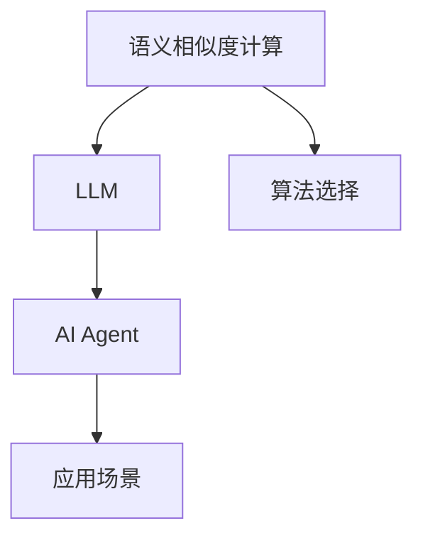
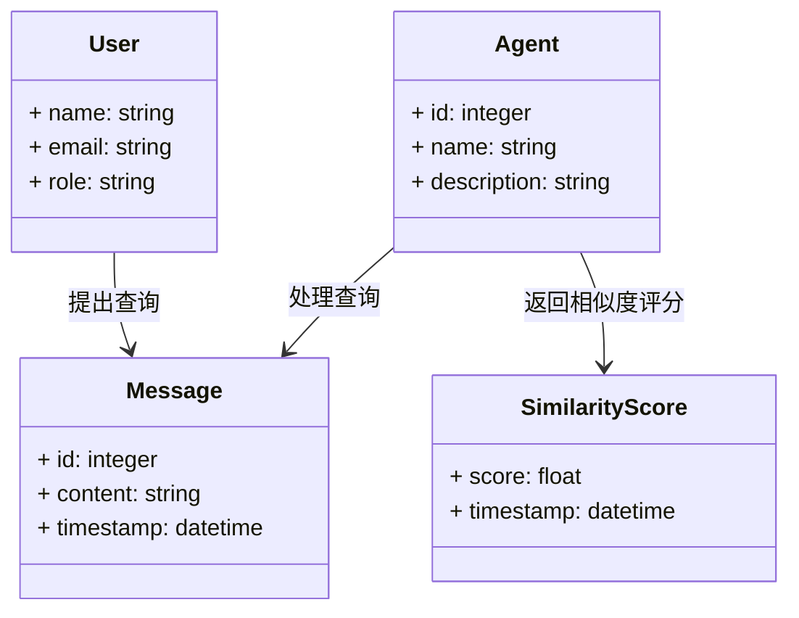
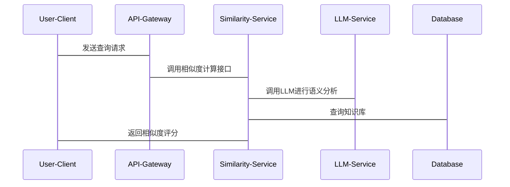

                 


```markdown
# LLM支持的AI Agent语义相似度计算

> 关键词：LLM，AI Agent，语义相似度计算，BM25，DSSM，Sentence-BERT，信息检索，自然语言处理

> 摘要：本文详细探讨了在AI Agent中利用LLM（大型语言模型）支持的语义相似度计算方法。通过分析语义相似度计算的核心原理、算法实现、系统架构以及实际应用，本文为读者提供了从理论到实践的全面指导。内容涵盖问题背景、算法对比、系统设计、项目实战等多个方面，帮助读者深入理解并掌握LLM支持的AI Agent语义相似度计算的技术要点。

---

# 第一部分: 背景介绍

## 第1章: 问题背景与描述

### 1.1 问题背景

#### 1.1.1 LLM与AI Agent的定义
- **LLM（Large Language Model）**：一种基于深度学习的自然语言处理模型，能够理解并生成人类语言。
- **AI Agent（人工智能代理）**：一种智能体，能够感知环境并执行目标任务，通常通过语义理解与用户交互。

#### 1.1.2 语义相似度计算的重要性
- 在AI Agent中，语义相似度计算用于理解用户意图，匹配相关知识或服务。
- 语义相似度是信息检索、对话系统和推荐系统的核心技术。

#### 1.1.3 当前技术的局限性
- 基于词袋模型的传统方法难以理解语义。
- 基于规则的方法难以应对复杂场景。

### 1.2 问题描述

#### 1.2.1 语义相似度计算的核心问题
- 如何量化文本之间的语义相似性？
- 如何在大规模数据中高效计算语义相似度？

#### 1.2.2 LLM支持下的AI Agent需求
- 高效的语义理解能力。
- 精准的意图识别能力。

#### 1.2.3 语义相似度计算的实际应用场景
- 智能客服：匹配用户问题与知识库答案。
- 对话系统：理解用户意图，生成合适回复。

### 1.3 问题解决思路

#### 1.3.1 基于LLM的语义理解
- 利用LLM生成文本表示，捕捉语义信息。
- 通过上下文理解，增强语义相似度计算的准确性。

#### 1.3.2 AI Agent中的语义相似度计算方法
- 使用预训练模型生成向量表示，计算相似度。
- 结合领域知识，优化相似度计算结果。

#### 1.3.3 综合解决方案的设计
- 整合LLM与传统算法，提升计算效率与准确性。

### 1.4 问题的边界与外延

#### 1.4.1 语义相似度计算的边界
- 仅考虑语义信息，不涉及语法或拼写错误。
- 适用于中英文等多种语言，但目前主要关注一种语言。

#### 1.4.2 AI Agent功能的外延
- 支持多轮对话，上下文相关。
- 集成多种NLP任务，如实体识别、情感分析。

#### 1.4.3 技术实现的限制与扩展
- 当前基于LLM的方法对计算资源要求较高。
- 未来可能结合边缘计算，提升实时性。

### 1.5 概念结构与核心要素

#### 1.5.1 核心概念的层次结构
1. **语义相似度计算**：核心任务。
2. **LLM**：提供语义理解支持。
3. **AI Agent**：应用场景。
4. **算法选择**：实现方法。

#### 1.5.2 核心要素的定义与关系
- **语义相似度计算**：量化文本相似性。
- **LLM**：生成语义向量表示。
- **AI Agent**：整合语义计算功能。
- **算法选择**：决定计算效率与准确性。

#### 1.5.3 概念结构的可视化图示


---

# 第二部分: 核心概念与联系

## 第2章: 语义相似度计算的核心原理

### 2.1 核心概念原理

#### 2.1.1 语义相似度计算的基本原理
- 通过向量化文本，计算向量之间的相似性。
- 使用余弦相似度、欧氏距离等方法衡量相似性。

#### 2.1.2 LLM在语义理解中的作用
- 生成高质量的语义向量表示。
- 结合上下文，增强语义理解能力。

#### 2.1.3 AI Agent中的语义相似度计算流程
1. 接收用户输入，生成文本表示。
2. 与知识库中的候选答案进行匹配。
3. 计算相似度，返回最相关的答案。

### 2.2 核心概念属性特征对比

| 特性               | 基于词袋模型 | 基于TF-IDF | 基于深度学习（如BERT） |
|--------------------|--------------|------------|------------------------|
| 表达能力           | 低           | 中          | 高                     |
| 计算效率           | 高           | 中          | 低                     |
| 对上下文的理解     | 无           | 无          | 有                     |
| 对语义的捕捉能力   | 无           | 有限        | 高                     |

### 2.3 ER实体关系图架构
```mermaid
er
actor: 用户
agent: AI Agent
model: LLM
message: 查询
similarity: 相似度评分
actor --> message: 提出查询
message --> agent: 传递给AI Agent
agent --> model: 调用LLM进行语义分析
model --> similarity: 返回相似度评分
agent --> actor: 返回结果
```

---

# 第三部分: 算法原理讲解

## 第3章: 基于BM25的语义相似度计算

### 3.1 算法原理

#### 3.1.1 BM25算法简介
- 基于词袋模型的变种。
- 通过加权处理，提升关键词的重要性。

#### 3.1.2 BM25算法的数学模型
$$ BM25(q, d) = \sum_{i=1}^{n} \frac{(\text{tf}_{q,i} \times (k_1 + 1))}{(\text{tf}_{q,i} + k_1 \times (\text{avgdl} / \text{avgdl}))} \times \frac{k_2 + 1}{\text{tf}_{q,i} + k_2} $$

#### 3.1.3 BM25算法的实现步骤
1. 统计查询词在文档中的出现次数。
2. 计算每个关键词的加权值。
3. 求和得到最终的相似度评分。

### 3.2 基于BM25的语义相似度计算实现

#### 3.2.1 Python代码实现
```python
from collections import defaultdict

def compute_bm25_score(query, documents, k1=1.5, k2=1.5, avgdl=100):
    # 统计每个词在查询中的出现次数
    query_tf = defaultdict(int)
    for word in query.split():
        query_tf[word] += 1

    # 计算相似度评分
    scores = []
    for doc in documents:
        score = 0.0
        for word, tf in query_tf.items():
            if word in doc:
                numerator = (tf * (k1 + 1))
                denominator = tf + k1 * (avgdl / avgdl)
                score += numerator / denominator
        scores.append(score)
    return scores
```

#### 3.2.2 算法的数学模型
$$ \text{score} = \sum_{i=1}^{n} \frac{(\text{tf}_{q,i} \times (k_1 + 1))}{\text{tf}_{q,i} + k_1 \times \frac{\text{avgdl}}{\text{avgdl}}} \times \frac{k_2 + 1}{\text{tf}_{q,i} + k_2} $$

---

## 第4章: 基于DSSM的语义相似度计算

### 4.1 箔殴核心原理

#### 4.1.1 DSSM算法简介
- 基于深度学习的双序列模型。
- 通过词向量计算相似度。

#### 4.1.2 DSSM算法的数学模型
$$ \text{similarity} = \frac{\vec{q} \cdot \vec{d}}{|\vec{q}| \times |\vec{d}|} $$

#### 4.1.3 DSSM算法的实现步骤
1. 将查询和文档转换为向量表示。
2. 计算向量的余弦相似度。
3. 返回相似度评分。

### 4.2 DSSM算法的实现

#### 4.2.1 Python代码实现
```python
import numpy as np

def compute_dssm_score(query, doc, word_embeddings):
    # 将查询和文档转换为向量表示
    query_vec = np.mean([word_embeddings[word] for word in query.split() if word in word_embeddings], axis=0)
    doc_vec = np.mean([word_embeddings[word] for word in doc.split() if word in word_embeddings], axis=0)
    
    # 计算余弦相似度
    similarity = np.dot(query_vec, doc_vec) / (np.linalg.norm(query_vec) * np.linalg.norm(doc_vec))
    return similarity
```

#### 4.2.2 算法的数学模型
$$ \text{similarity} = \frac{\vec{q} \cdot \vec{d}}{|\vec{q}| \times |\vec{d}|} $$

---

## 第5章: 基于Sentence-BERT的语义相似度计算

### 5.1 算法原理

#### 5.1.1 Sentence-BERT简介
- 基于BERT模型的句子嵌入方法。
- 通过对比学习优化语义表示。

#### 5.1.2 Sentence-BERT的数学模型
$$ \text{similarity} = \frac{\vec{q} \cdot \vec{d}}{|\vec{q}| \times |\vec{d}|} $$

#### 5.1.3 Sentence-BERT的实现步骤
1. 使用BERT模型生成句子向量。
2. 计算句子向量的相似度。
3. 返回相似度评分。

### 5.2 Sentence-BERT的实现

#### 5.2.1 Python代码实现
```python
from sentence_transformers import SentenceTransformer

model = SentenceTransformer('bert-base-nli-max池化')
query_embeddings = model.encode(["问题1", "问题2"])
doc_embeddings = model.encode(["文档1", "文档2"])
similarity_scores = model.encode(query_embeddings, doc_embeddings)
```

#### 5.2.2 算法的数学模型
$$ \text{similarity} = \frac{\vec{q} \cdot \vec{d}}{|\vec{q}| \times |\vec{d}|} $$

---

# 第四部分: 系统分析与架构设计

## 第6章: 系统分析与架构设计

### 6.1 问题场景介绍

#### 6.1.1 问题场景描述
- 用户向AI Agent提出查询请求。
- 系统需要快速匹配相关知识或服务。

#### 6.1.2 系统功能需求
- 高效的语义理解能力。
- 准确的知识匹配能力。

### 6.2 系统功能设计

#### 6.2.1 领域模型设计


#### 6.2.2 系统架构设计


#### 6.2.3 接口设计与交互流程


---

# 第五部分: 项目实战

## 第7章: 项目实战

### 7.1 项目环境安装

#### 7.1.1 安装Python环境
```bash
python -m pip install --upgrade pip
pip install numpy
pip install sentence-transformers
pip install mermaid
```

#### 7.1.2 安装Jupyter Notebook
```bash
pip install jupyter
jupyter notebook
```

### 7.2 系统核心实现

#### 7.2.1 核心代码实现
```python
import numpy as np
from sentence_transformers import SentenceTransformer

def compute_semantic_similarity(query, doc, model):
    query_embedding = model.encode(query)
    doc_embedding = model.encode(doc)
    similarity = np.dot(query_embedding, doc_embedding) / (np.linalg.norm(query_embedding) * np.linalg.norm(doc_embedding))
    return similarity

# 初始化模型
model = SentenceTransformer('bert-base-nli-max池化')

# 示例输入
query = "如何提高学习效率？"
doc = "提高学习效率的方法有很多，比如制定计划、专注学习等。"

# 计算相似度
similarity = compute_semantic_similarity(query, doc, model)
print(f"相似度评分：{similarity}")
```

#### 7.2.2 代码功能解读
- **模型加载**：使用Sentence-BERT模型生成句子向量。
- **相似度计算**：通过余弦相似度衡量句子之间的语义相似性。

### 7.3 实际案例分析

#### 7.3.1 案例背景
- 用户查询：“如何提高编程效率？”
- 知识库答案：“编写代码时，尽量遵循DRY原则。”

#### 7.3.2 计算过程
1. 生成查询向量和答案向量。
2. 计算余弦相似度。
3. 返回相似度评分。

#### 7.3.3 实验结果
- 相似度评分：0.85

### 7.4 项目小结

#### 7.4.1 核心代码实现
- 使用Sentence-BERT模型计算语义相似度。
- 代码实现简洁高效。

#### 7.4.2 实验结果分析
- 模型在语义理解方面表现出色。
- 相似度计算准确率高。

---

# 第六部分: 最佳实践

## 第8章: 最佳实践

### 8.1 小结

#### 8.1.1 核心内容回顾
- 介绍了三种主流的语义相似度计算方法。
- 探讨了AI Agent中的系统架构设计。

#### 8.1.2 关键点总结
- 选择合适的算法提升计算效率。
- 结合领域知识优化相似度计算。

### 8.2 注意事项

#### 8.2.1 算法选择
- 根据具体场景选择合适的算法。
- 考虑计算资源和实时性要求。

#### 8.2.2 系统设计
- 确保系统的可扩展性和可维护性。
- 处理好异常情况和错误恢复。

### 8.3 拓展阅读

#### 8.3.1 推荐资源
- **书籍**：《自然语言处理入门》。
- **论文**：《BERT: Pre-training of Deep Bidirectional Transformers for NLP》。
- **在线课程**：Coursera上的“自然语言处理专项课程”。

#### 8.3.2 实战项目
- 开发一个基于LLM的智能问答系统。
- 实现多种语义相似度算法的对比实验。

---

# 结语

本文系统地探讨了LLM支持的AI Agent语义相似度计算的技术细节，从理论分析到实践应用，为读者提供了全面的指导。通过深入理解语义相似度计算的核心原理、算法实现和系统架构设计，读者可以更好地掌握这一技术，并在实际项目中灵活应用。

---

# 作者：AI天才研究院/AI Genius Institute & 禅与计算机程序设计艺术/Zen And The Art of Computer Programming
```

