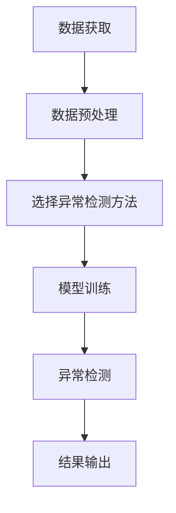
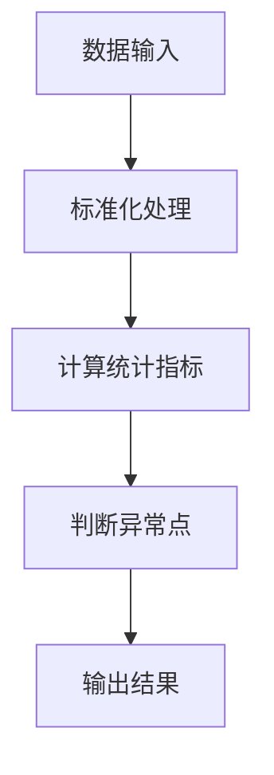
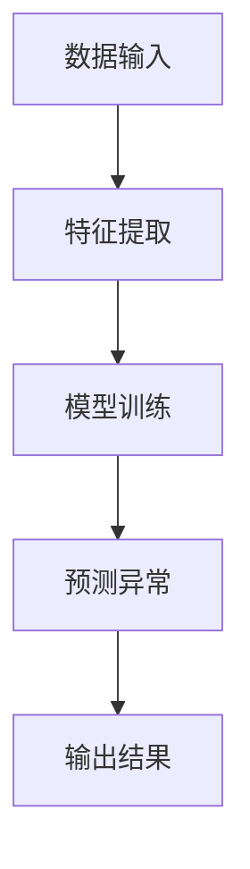
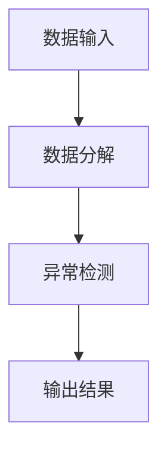
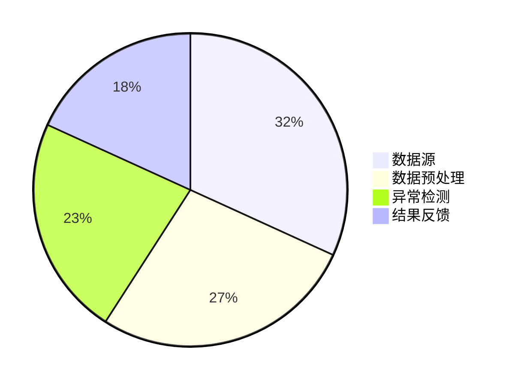
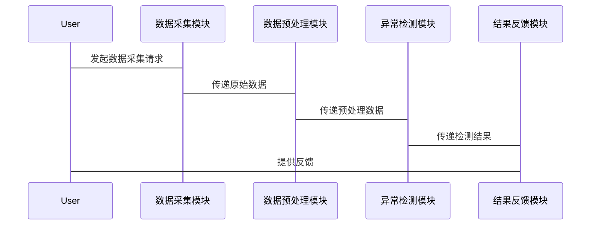

                 


# 人工智能在高频数据异常检测中的应用

## 关键词：人工智能、高频数据、异常检测、机器学习、时间序列分析

## 摘要：  
人工智能在高频数据异常检测中的应用是当前数据科学领域的重要研究方向。高频数据的特性使得传统的统计方法难以满足实时性和准确性要求，而人工智能技术，特别是深度学习和机器学习算法，为解决这一问题提供了强大的工具。本文将从高频数据的基本概念出发，系统地分析异常检测的核心原理，探讨基于统计、机器学习和时间序列分析的多种算法，并结合实际案例，展示人工智能在高频数据异常检测中的具体应用。通过本文的阐述，读者可以全面了解高频数据异常检测的理论基础、算法实现和实际应用，掌握如何利用人工智能技术解决实际问题。

---

# 第1章 高频数据异常检测概述

## 1.1 高频数据的基本概念

### 1.1.1 高频数据的定义与特点
高频数据是指在极短时间内产生的大量数据，其特点包括：
- **高频率**：数据生成速度快，通常以秒甚至毫秒为单位。
- **大容量**：数据量庞大，可能涉及百万甚至更多的数据点。
- **实时性**：需要在数据生成后立即进行处理和分析。
- **多样性**：数据来源广泛，可能包括交易数据、网络流量、传感器数据等。

### 1.1.2 高频数据的应用场景
高频数据的应用场景主要集中在以下几个领域：
1. **金融领域**：高频交易、股票价格波动监测。
2. **网络领域**：实时网络流量监控、异常流量检测。
3. **工业领域**：设备运行状态监测、故障预警。
4. **医疗领域**：实时患者监测数据的异常检测。

### 1.1.3 异常检测的定义与重要性
异常检测是指在数据中识别出与正常数据模式不符的异常点或行为。在高频数据场景下，异常检测的重要性体现在：
- **及时性**：能够快速识别异常，避免损失。
- **准确性**：在高频数据中，异常可能非常短暂，需要高精度的检测方法。
- **复杂性**：高频数据的动态变化使得异常检测更具挑战性。

## 1.2 高频数据异常检测的背景与挑战

### 1.2.1 高频数据异常检测的背景
随着技术的发展，数据生成的速度和规模呈指数级增长，尤其是在金融、网络和工业等领域，高频数据的处理和分析需求日益增加。异常检测作为数据安全和数据质量管理的重要手段，成为研究热点。

### 1.2.2 高频数据异常检测的挑战
高频数据异常检测面临以下挑战：
- **数据量大**：需要高效的数据处理和分析方法。
- **实时性要求高**：需要在数据生成后立即完成检测。
- **异常模式多样**：异常可能表现为多种形态，难以用单一方法捕捉。
- **计算资源限制**：需要在有限的计算资源下完成高效处理。

### 1.2.3 高频数据异常检测的应用价值
通过异常检测，可以及时发现数据中的异常情况，预防潜在风险，提高系统的可靠性和安全性。例如，在金融领域，异常检测可以防止欺诈交易；在网络领域，可以识别潜在的攻击行为。

## 1.3 异常检测的核心概念与分类

### 1.3.1 异常检测的核心概念
异常检测的核心概念包括：
- **正常数据**：符合预期模式的数据。
- **异常数据**：偏离正常模式的数据。
- **边界**：正常数据与异常数据之间的分界线。

### 1.3.2 异常检测的分类与应用场景
异常检测可以分为以下几类：
1. **基于统计的方法**：适用于数据分布已知的情况，如Z-score方法。
2. **基于机器学习的方法**：适用于数据分布复杂的情况，如聚类和分类算法。
3. **基于时间序列的方法**：适用于时间相关数据的异常检测，如ARIMA和LSTM模型。

### 1.3.3 高频数据异常检测的独特性
高频数据的异常检测具有以下独特性：
- **数据流特性**：数据是动态变化的，需要动态调整检测模型。
- **实时性要求**：需要在线处理数据，实时反馈结果。
- **模式多样性**：异常可能表现为瞬时 spike 或持续性变化。

---

# 第2章 高频数据异常检测的核心概念与联系

## 2.1 高频数据异常检测的原理

### 2.1.1 数据流模型
数据流模型是一种处理高频数据的有效方法，它将数据视为一个不断流动的序列，通过滑动窗口技术进行实时处理。

### 2.1.2 时间序列分析
时间序列分析是高频数据异常检测的重要方法，通过对数据的时间依赖性进行建模，识别出异常点。

### 2.1.3 统计学习方法
统计学习方法通过分析数据的分布特性，识别出偏离正常分布的异常点。

## 2.2 核心概念的对比分析

### 2.2.1 异常检测与正常数据的对比
| 属性      | 正常数据                | 异常数据                |
|-----------|------------------------|-------------------------|
| 分布特性   | 符合预期分布            | 不符合预期分布          |
| 数据量     | 占据大部分数据          | 占据小部分数据          |
| 变异性     | 变异性小               | 变异性大               |

### 2.2.2 不同异常检测方法的对比
| 方法       | 基于统计              | 基于机器学习          | 基于时间序列        |
|------------|-----------------------|-----------------------|---------------------|
| 适用场景     | 数据分布简单          | 数据分布复杂          | 时间相关性明显      |
| 优点         | 计算简单，实时性高      | 模型表达能力强         | 能捕捉时间依赖性    |
| 缺点         | 对复杂异常检测能力弱    | 需大量数据训练         | 对模型假设敏感      |

### 2.2.3 高频数据与低频数据的对比
| 属性      | 高频数据              | 低频数据              |
|-----------|-----------------------|-----------------------|
| 数据量     | 数据量大，生成速度快    | 数据量小，生成速度慢  |
| 实时性要求 | 高实时性要求           | 实时性要求较低        |
| 异常检测难度 | 异常检测难度高         | 异常检测难度较低       |

## 2.3 实体关系图与流程图

### 2.3.1 实体关系图（ER图）
```mermaid
erDiagram
    customer[CUSTOMER] {
        +string id
        +string name
        +string email
    }
    transaction[TRANSACTION] {
        +string id
        +decimal amount
        +datetime timestamp
    }
    CUSTOMER --> TRANSPORT : has
    CUSTOMER --> MANAGES : has
    MANAGES --> TRANSPORT : manages
```

### 2.3.2 异常检测流程图（Mermaid）


---

# 第3章 高频数据异常检测的算法原理

## 3.1 基于统计的异常检测算法

### 3.1.1 多变量统计方法
多变量统计方法通过分析数据的多维分布来识别异常点。常用方法包括：
- **Mahalanobis距离**：衡量数据点与整体分布的偏离程度。
- **Kolmogorov-Smirnov检验**：检验数据是否符合某种分布。

### 3.1.2 单变量统计方法
单变量统计方法适用于单一特征的异常检测，常用方法包括：
- **Z-score方法**：通过标准化数据计算每个点的偏离程度。
- **IQR方法**：基于四分位数范围识别异常点。

### 3.1.3 统计模型的优缺点
- **优点**：计算简单，实时性高。
- **缺点**：难以处理复杂的数据分布，对异常点的检测能力有限。

## 3.2 基于机器学习的异常检测算法

### 3.2.1 基于聚类的异常检测
聚类方法通过将数据分成簇，识别与簇中心距离较远的点。常用算法包括：
- **K-means**：简单易用，但需要预先指定簇数。
- **DBSCAN**：基于密度的聚类算法，适合处理噪声数据。

### 3.2.2 基于分类的异常检测
分类方法通过训练分类器，将数据点分类为正常或异常。常用算法包括：
- **随机森林**：通过特征重要性识别异常点。
- **支持向量机（SVM）**：适用于低维数据的分类。

### 3.2.3 基于深度学习的异常检测
深度学习方法通过神经网络模型学习数据的复杂分布，识别异常点。常用模型包括：
- **自动编码器（Autoencoder）**：通过重建误差识别异常点。
- **变分自编码器（VAE）**：通过生成对抗网络识别异常点。

## 3.3 基于时间序列的异常检测算法

### 3.3.1 时间序列分解方法
时间序列分解方法将数据分解为趋势、季节性和随机成分，通过分析随机成分识别异常点。

### 3.3.2 基于ARIMA模型的异常检测
ARIMA模型是一种经典的时间序列预测方法，通过预测与实际值的偏差识别异常点。

### 3.3.3 基于LSTM的异常检测
LSTM网络能够有效捕捉时间序列的长距离依赖关系，适用于复杂时间序列的异常检测。

## 3.4 算法流程图（Mermaid）

### 3.4.1 统计方法流程图


### 3.4.2 机器学习方法流程图


### 3.4.3 时间序列方法流程图


---

# 第4章 高频数据异常检测的系统分析与架构设计

## 4.1 系统分析

### 4.1.1 问题场景介绍
系统需要实时处理高频数据流，快速识别异常点，并提供实时反馈。

### 4.1.2 项目目标与范围
项目目标是设计一个高效的高频数据异常检测系统，范围包括数据采集、处理、分析和反馈。

### 4.1.3 系统功能需求分析
系统需要实现以下功能：
- 数据采集与预处理
- 异常检测算法实现
- 结果可视化与反馈

## 4.2 系统架构设计

### 4.2.1 系统架构图（Mermaid）


### 4.2.2 系统功能模块划分
- 数据采集模块：负责数据的实时采集。
- 数据预处理模块：对数据进行清洗和转换。
- 异常检测模块：实现多种异常检测算法。
- 结果反馈模块：输出检测结果并提供反馈。

### 4.2.3 系统接口设计
- 数据采集模块与数据预处理模块之间通过API接口传递数据。
- 异常检测模块与结果反馈模块之间通过队列进行通信。

## 4.3 系统交互设计

### 4.3.1 系统交互流程图（Mermaid）


### 4.3.2 用户角色与权限设计
- **普通用户**：数据采集和查看结果。
- **管理员**：配置系统参数和管理用户。

### 4.3.3 系统数据流设计
数据从数据源流向数据采集模块，经过预处理后进入异常检测模块，最终结果反馈给用户。

---

# 第5章 高频数据异常检测的项目实战

## 5.1 环境安装与配置

### 5.1.1 开发环境搭建
- **操作系统**：Linux/Windows/MacOS
- **编程语言**：Python 3.8+
- **开发工具**：Jupyter Notebook/VS Code

### 5.1.2 数据集准备
- 数据来源：公开数据集或模拟数据。
- 数据格式：CSV或JSON格式。

### 5.1.3 工具安装与配置
- 安装必要的库：numpy、pandas、scikit-learn、tensorflow、pytorch。

## 5.2 系统核心实现

### 5.2.1 数据预处理代码
```python
import pandas as pd
import numpy as np

# 加载数据
data = pd.read_csv('high_frequency_data.csv')

# 删除缺失值
data = data.dropna()

# 标准化处理
from sklearn.preprocessing import StandardScaler
scaler = StandardScaler()
scaled_data = scaler.fit_transform(data)
```

### 5.2.2 异常检测算法实现
```python
from sklearn.ensemble import IsolationForest

# 训练模型
model = IsolationForest(n_estimators=100, random_state=42)
model.fit(scaled_data)

# 预测异常
outliers = model.predict(scaled_data)
outliers[outliers == -1] = 1
outliers[outliers == 1] = 0
```

### 5.2.3 结果可视化代码
```python
import matplotlib.pyplot as plt

plt.figure(figsize=(10, 6))
plt.plot(data, label='正常数据')
plt.plot(outliers, label='异常数据')
plt.legend()
plt.show()
```

## 5.3 代码应用解读与分析

### 5.3.1 代码结构分析
- 数据预处理：加载数据，删除缺失值，标准化处理。
- 异常检测：使用Isolation Forest算法训练模型，预测异常点。
- 结果可视化：将正常数据和异常数据分开显示。

### 5.3.2 代码功能解读
- 数据预处理：确保数据质量，为后续分析做好准备。
- 异常检测：利用机器学习算法识别异常点。
- 结果可视化：直观展示检测结果，便于分析和验证。

### 5.3.3 代码优化建议
- 使用更高效的数据处理库，如Dask。
- 优化模型参数，提高检测准确率。

## 5.4 实际案例分析

### 5.4.1 案例背景介绍
以金融交易数据为例，假设我们有一个高频交易数据集，需要识别异常交易行为。

### 5.4.2 数据分析与处理
- 数据预处理：清洗数据，处理缺失值和异常值。
- 数据分析：计算统计指标，识别潜在异常点。

### 5.4.3 异常检测结果解读
通过模型预测结果，识别出异常交易行为，并进行进一步分析和处理。

## 5.5 项目小结

### 5.5.1 项目总结
通过本项目，我们实现了一个基于机器学习的高频数据异常检测系统，能够实时处理数据并识别异常点。

### 5.5.2 经验与教训
- 数据预处理是关键，需要仔细清洗和转换。
- 模型选择需要根据具体场景和数据特点进行调整。

### 5.5.3 未来改进方向
- 引入更复杂的深度学习模型，提高检测精度。
- 优化系统架构，提升处理效率。

---

# 第6章 总结与展望

## 6.1 总结
人工智能在高频数据异常检测中的应用具有重要的理论和实践意义。通过本文的阐述，我们了解了高频数据异常检测的核心概念、算法原理和系统架构设计，掌握了如何利用人工智能技术解决实际问题。

## 6.2 展望
未来，随着人工智能技术的不断发展，高频数据异常检测将更加智能化和高效化。研究者们将致力于开发更先进的算法和工具，推动该领域的进一步发展。

---

# 结语

高频数据异常检测是一个复杂而重要的任务，人工智能技术为其提供了强大的工具和方法。通过本文的系统介绍，读者可以全面掌握高频数据异常检测的理论基础和实际应用。建议读者进一步学习相关技术，深入研究，并在实际项目中加以应用。

---

作者：AI天才研究院/AI Genius Institute & 禅与计算机程序设计艺术 /Zen And The Art of Computer Programming

