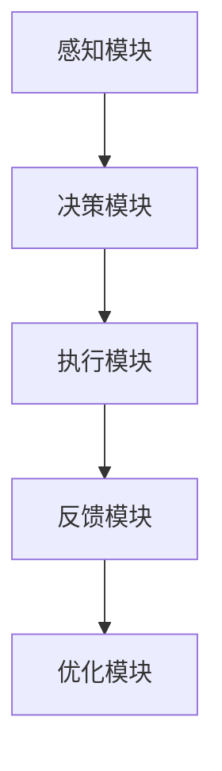
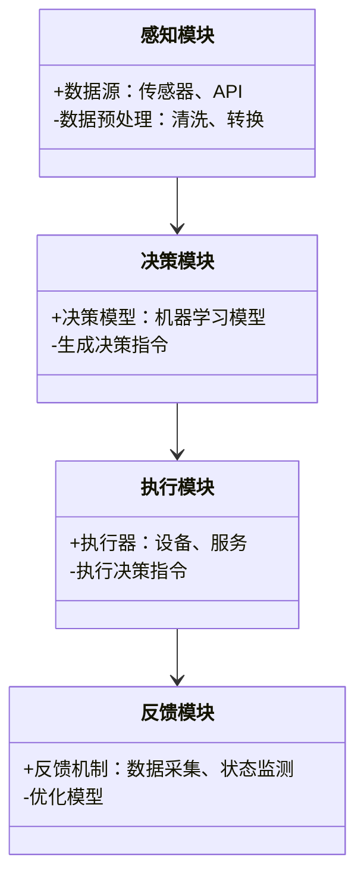

                 


# 企业AI Agent的边缘计算应用：实时处理与响应

> 关键词：企业AI Agent，边缘计算，实时处理，响应机制，分布式系统，系统架构，安全机制

> 摘要：本文将探讨企业AI Agent在边缘计算环境中的应用，重点分析实时处理与响应的核心机制。通过结合AI Agent的感知、决策和执行能力，以及边缘计算的分布式特点，我们揭示其在企业级应用中的技术优势和实际应用场景。本文不仅详细阐述了AI Agent的核心原理，还分析了边缘计算环境下的系统架构设计、数据安全与隐私保护等关键问题，并通过实际案例展示了AI Agent在边缘计算中的高效实现。

---

# 第1章: 企业AI Agent与边缘计算概述

## 1.1 企业AI Agent的定义与特点

### 1.1.1 AI Agent的基本概念
AI Agent（人工智能代理）是指能够感知环境、自主决策并执行任务的智能实体。它能够根据外部输入和内部状态，采取相应行动以实现目标。

### 1.1.2 企业AI Agent的核心特点
- **自主性**：能够自主决策和执行任务，无需人工干预。
- **反应性**：能够实时感知环境变化并做出响应。
- **目标导向**：所有行为都围绕特定目标展开。
- **分布式协作**：能够与其他AI Agent或系统协同工作。

### 1.1.3 AI Agent与传统AI的区别
| 特性 | 传统AI | AI Agent |
|------|--------|----------|
| 执行方式 | 离线计算，结果输出 | 实时感知、决策与执行 |
| 交互能力 | 单向输入输出 | 支持实时反馈与动态交互 |
| 应用场景 | 数据分析、模式识别 | 自动化控制、实时监控 |

---

## 1.2 边缘计算的基本概念与特点

### 1.2.1 边缘计算的定义
边缘计算是一种分布式计算范式，将计算能力从云端扩展到数据产生的边缘端（如传感器、设备等），以实现数据的实时处理和快速响应。

### 1.2.2 边缘计算的核心特点
- **分布式架构**：计算资源分布在靠近数据源的边缘设备上。
- **低延迟**：减少数据传输到云端的时间，提升实时性。
- **本地处理**：数据在边缘端进行处理，减少对云端的依赖。
- **安全性**：通过边缘设备的本地计算，降低数据泄露风险。

### 1.2.3 边缘计算与云计算的区别
| 特性 | 边缘计算 | 云计算 |
|------|---------|--------|
| 计算位置 | 边缘设备 | 云端服务器 |
| 数据传输 | 数据处理后仅传输关键信息 | 数据全部传输到云端 |
| 响应时间 | 低延迟 | 较高延迟 |
| 应用场景 | 实时监控、本地化服务 | 大数据分析、离线处理 |

---

## 1.3 企业AI Agent与边缘计算的结合

### 1.3.1 企业AI Agent在边缘计算中的作用
- **实时感知与响应**：AI Agent能够实时感知边缘设备的数据，并快速做出响应。
- **分布式协作**：通过边缘计算的分布式架构，AI Agent可以与多个设备协同工作。
- **边缘智能**：将AI能力下沉到边缘设备，实现本地化的智能决策。

### 1.3.2 边缘计算对企业AI Agent的优势
- **低延迟**：边缘计算减少了数据传输到云端的时间，提升了AI Agent的实时响应能力。
- **本地计算**：边缘设备的计算能力可以支持AI Agent的本地推理和决策。
- **安全性**：通过边缘计算，企业可以更好地保护数据隐私和系统安全。

### 1.3.3 企业AI Agent在边缘计算中的应用场景
| 场景 | 描述 |
|------|------|
| 智能制造 | AI Agent实时监控生产线状态，快速响应异常情况。 |
| 智慧交通 | AI Agent在边缘设备上实时处理交通数据，优化交通流量。 |
| 智能安防 | AI Agent在边缘设备上实时分析视频数据，识别异常行为。 |

---

## 1.4 本章小结

通过本章的介绍，我们了解了企业AI Agent和边缘计算的基本概念及其特点，同时探讨了两者结合的优势和应用场景。接下来，我们将深入分析AI Agent的核心原理，以及在边缘计算环境下的设计与实现。

---

# 第2章: AI Agent的核心原理

## 2.1 AI Agent的感知机制

### 2.1.1 数据采集与处理
AI Agent通过传感器、API或其他数据源获取实时数据，并进行清洗、转换和预处理。

### 2.1.2 感知模型的构建
- **感知模型**：基于机器学习或深度学习算法，构建能够理解数据的模型。
- **模型训练**：通过大量数据训练模型，使其能够准确感知环境。

### 2.1.3 感知结果的分析
通过分析感知结果，AI Agent能够理解当前环境的状态，并为后续决策提供依据。

---

## 2.2 AI Agent的决策机制

### 2.2.1 决策模型的构建
- **决策模型**：基于感知结果和目标，构建能够做出决策的模型。
- **多目标优化**：在多个目标之间进行权衡，选择最优决策。

### 2.2.2 决策优化
- **强化学习**：通过不断试错，优化决策策略。
- **动态调整**：根据环境变化，动态调整决策模型。

---

## 2.3 AI Agent的执行机制

### 2.3.1 执行指令的生成
基于决策结果，生成具体的执行指令。

### 2.3.2 执行过程的监控
通过反馈机制，实时监控执行过程，确保决策的正确性。

### 2.3.3 执行结果的反馈
将执行结果反馈给感知和决策模块，形成闭环。

---

## 2.4 本章小结

通过本章的分析，我们了解了AI Agent的核心原理，包括感知、决策和执行三个主要环节。接下来，我们将探讨边缘计算环境下的AI Agent设计与实现。

---

# 第3章: 边缘计算环境下的AI Agent设计

## 3.1 边缘计算环境的特点

### 3.1.1 边缘设备的计算能力限制
边缘设备的计算能力有限，因此需要对AI Agent进行轻量化设计。

### 3.1.2 边缘环境的实时性要求
边缘计算要求AI Agent能够快速响应，减少延迟。

### 3.1.3 边缘环境的安全性挑战
边缘设备容易受到攻击，需要加强安全性设计。

---

## 3.2 边缘计算环境下的AI Agent设计原则

### 3.2.1 轻量化设计
- **模型压缩**：通过剪枝、量化等技术，降低模型体积。
- **边缘优化**：针对边缘设备的特点，优化算法和架构。

### 3.2.2 实时性优化
- **本地推理**：在边缘设备上进行实时推理，减少云端依赖。
- **并行计算**：利用多核处理器，提升计算效率。

### 3.2.3 安全性保障
- **数据加密**：对传输和存储的数据进行加密。
- **访问控制**：通过权限管理，限制对边缘设备的访问。

---

## 3.3 边缘计算环境下的AI Agent实现

### 3.3.1 模型压缩与优化
- **模型剪枝**：移除冗余的神经网络节点。
- **模型量化**：将模型参数量化为较小的数值类型，降低存储和计算开销。

### 3.3.2 数据处理与传输优化
- **本地处理**：在边缘设备上进行数据预处理，减少数据传输量。
- **压缩传输**：对数据进行压缩后传输，降低带宽消耗。

### 3.3.3 算法加速与并行计算
- **并行计算**：利用多核处理器，提升计算效率。
- **异构计算**：结合CPU、GPU等多种计算单元，优化性能。

---

## 3.4 本章小结

通过本章的分析，我们了解了边缘计算环境下的AI Agent设计原则与实现方法。接下来，我们将深入探讨实时处理与响应的算法实现。

---

# 第4章: 实时处理与响应的算法实现

## 4.1 实时处理与响应的核心算法

### 4.1.1 算法概述
实时处理与响应的核心算法包括感知、决策和执行三个部分。

### 4.1.2 算法流程
1. **感知**：获取实时数据并进行预处理。
2. **决策**：基于感知结果，生成决策指令。
3. **执行**：根据决策指令，执行相应操作。

---

## 4.2 算法优化与实现

### 4.2.1 算法优化策略
- **模型优化**：通过剪枝和量化等技术，降低模型复杂度。
- **并行计算**：利用多核处理器，提升计算效率。
- **本地推理**：在边缘设备上进行实时推理，减少云端依赖。

### 4.2.2 算法实现
```python
def edge_ai_agent():
    while True:
        # 感知
        data =感知模块.get_data()
        # 决策
        decision = 决策模块.make_decision(data)
        # 执行
        result = 执行模块.execute(decision)
        # 反馈
        feedback = 反馈模块.get_feedback(result)
        # 优化
        优化模块.update_model(feedback)
```

---

## 4.3 本章小结

通过本章的分析，我们了解了实时处理与响应的核心算法及其优化策略。接下来，我们将探讨边缘计算环境下的数据安全与隐私保护。

---

# 第5章: 数据安全与隐私保护

## 5.1 数据安全的挑战

### 5.1.1 边缘设备的安全风险
- **物理攻击**：边缘设备容易被物理攻击。
- **网络攻击**：边缘设备容易受到网络攻击。

### 5.1.2 数据隐私的保护
- **数据加密**：对数据进行加密，确保隐私安全。
- **访问控制**：通过权限管理，限制数据访问。

---

## 5.2 数据安全与隐私保护的实现

### 5.2.1 数据加密
- **加密算法**：使用AES、RSA等加密算法，对数据进行加密。
- **密钥管理**：通过安全的密钥管理机制，确保加密数据的安全性。

### 5.2.2 访问控制
- **身份认证**：通过身份认证，确保只有授权用户可以访问数据。
- **权限管理**：通过权限管理，限制数据访问范围。

---

## 5.3 本章小结

通过本章的分析，我们了解了边缘计算环境下的数据安全与隐私保护策略。接下来，我们将探讨系统架构与设计。

---

# 第6章: 系统架构与设计

## 6.1 系统架构设计

### 6.1.1 系统模块划分
- **感知模块**：负责数据的采集与处理。
- **决策模块**：负责基于感知数据做出决策。
- **执行模块**：负责根据决策结果执行操作。
- **反馈模块**：负责将执行结果反馈给系统。

### 6.1.2 系统架构图


---

## 6.2 系统功能设计

### 6.2.1 领域模型设计


---

## 6.3 本章小结

通过本章的分析，我们了解了系统架构与设计的要点。接下来，我们将通过实际案例展示AI Agent在边缘计算中的应用。

---

# 第7章: 项目实战

## 7.1 项目背景

### 7.1.1 项目目标
实现一个基于边缘计算的企业AI Agent，用于实时监控生产线的状态。

---

## 7.2 环境搭建

### 7.2.1 环境要求
- **硬件**：边缘设备（如树莓派）、传感器。
- **软件**：Python、TensorFlow Lite、边缘计算框架。

---

## 7.3 核心实现

### 7.3.1 数据采集与处理
```python
import numpy as np

def采集数据():
    # 模拟传感器数据
    data = np.random.rand(10, 1)
    return data
```

### 7.3.2 模型训练与部署
```python
import tensorflow as tf
from tensorflow import keras

# 模型训练
model = keras.Sequential([
    keras.layers.Dense(64, activation='relu'),
    keras.layers.Dense(1, activation='sigmoid')
])
model.compile(optimizer='adam', loss='binary_crossentropy', metrics=['accuracy'])
model.fit(x_train, y_train, epochs=10, batch_size=32)
```

### 7.3.3 模型部署与推理
```python
# 模型部署
model.save('model.h5')

# 边缘推理
import tensorflow as tf
model = tf.keras.models.load_model('model.h5')

def进行推理(data):
    prediction = model.predict(data)
    return prediction
```

---

## 7.4 实际案例分析

### 7.4.1 案例描述
通过部署AI Agent，实时监控生产线的设备状态，预测设备故障并进行修复。

### 7.4.2 案例实现
```python
def监控设备():
    while True:
        data = 采集数据()
        prediction = 进行推理(data)
        if prediction > 0.5:
            执行修复操作()
```

---

## 7.5 本章小结

通过本章的实战，我们了解了企业AI Agent在边缘计算中的具体实现步骤。接下来，我们将总结全文，并展望未来的发展方向。

---

# 第8章: 总结与展望

## 8.1 总结

本文详细探讨了企业AI Agent在边缘计算环境中的应用，分析了实时处理与响应的核心算法及其优化策略，并通过实际案例展示了AI Agent在边缘计算中的高效实现。我们还讨论了数据安全与隐私保护的关键问题，并提出了相应的解决方案。

---

## 8.2 展望

随着边缘计算和人工智能技术的不断发展，企业AI Agent的应用前景将更加广阔。未来，我们需要进一步优化AI Agent的实时处理能力，提升其在边缘计算环境下的安全性和可靠性。同时，随着5G和物联网技术的普及，企业AI Agent将在更多领域发挥重要作用。

---

# 作者：AI天才研究院/AI Genius Institute & 禅与计算机程序设计艺术 /Zen And The Art of Computer Programming

