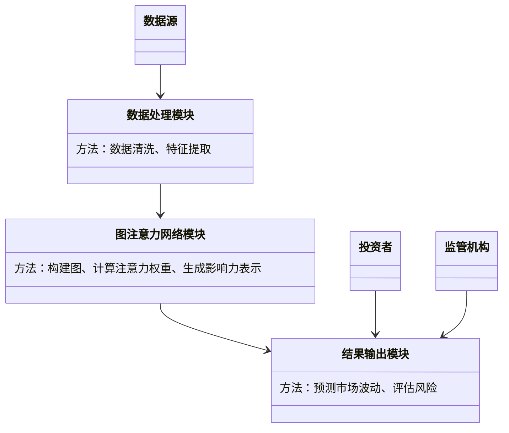
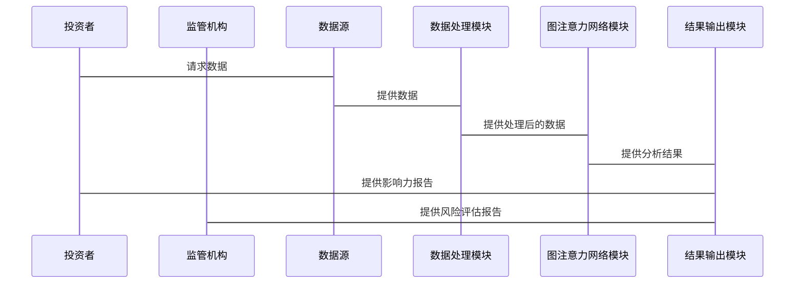

                 


# 图注意力网络在金融影响力分析中的应用

> 关键词：图注意力网络，金融影响力分析，深度学习，图神经网络，注意力机制

> 摘要：本文深入探讨了图注意力网络在金融影响力分析中的应用，从理论基础到实际应用，结合具体案例，详细分析了图注意力网络在金融市场的影响力传播、风险评估、投资决策等领域的优势与挑战。通过系统设计与算法实现，展示了如何利用图注意力网络提高金融影响力分析的准确性和效率。

---

# 第一部分: 图注意力网络与金融影响力分析的背景与概念

# 第1章: 图注意力网络与金融影响力分析概述

## 1.1 问题背景与描述

### 1.1.1 金融影响力分析的定义与重要性

金融影响力分析旨在研究金融市场中各主体（如公司、机构、个人）之间的相互作用及其对整体市场的影响。通过分析这些相互作用，可以帮助投资者、监管机构等更好地理解市场动态、评估风险、制定投资策略。

传统的影响力分析方法通常依赖于统计分析和经验模型，但这些方法在面对复杂、动态的金融市场时，往往显得力不从心。例如，传统方法难以捕捉非线性关系、处理高维数据，且缺乏对复杂网络结构的建模能力。

---

### 1.1.2 传统方法的局限性

传统金融影响力分析方法主要包括回归分析、主成分分析（PCA）、因子分析等。这些方法虽然在一定程度上揭示了市场变量之间的关系，但也存在以下问题：

- **忽视网络结构**：传统方法通常假设变量之间的关系是线性的，且不考虑变量之间的复杂网络结构。
- **计算复杂度高**：面对海量金融数据时，传统方法的计算效率较低，难以实时分析。
- **难以捕捉非线性关系**：金融市场中的许多关系是非线性的，传统方法难以有效建模。

---

### 1.1.3 图注意力网络的优势

图注意力网络（Graph Attention Network, GAN）是一种结合了图结构和注意力机制的深度学习模型，具有以下显著优势：

- **捕捉复杂关系**：图结构能够很好地建模金融市场中的复杂网络关系。
- **注意力机制**：注意力机制能够自动聚焦于重要的节点或边，提高模型的表达能力。
- **非线性建模能力**：深度学习模型能够捕捉复杂的非线性关系，提升模型的拟合能力。
- **实时性**：通过图注意力网络，可以高效地处理实时金融数据，支持实时分析。

---

## 1.2 图注意力网络的核心概念

### 1.2.1 图注意力网络的基本原理

图注意力网络是一种基于图结构的深度学习模型，通过在图中引入注意力机制，对节点之间的关系进行加权。具体来说，图注意力网络通过计算每个节点对其他节点的注意力权重，生成每个节点的注意力表示，最终输出节点的影响力值。

---

### 1.2.2 图注意力网络与传统图模型的对比

下表对比了图注意力网络与传统图模型（如图卷积网络，Graph Convolutional Network, GCN）在金融影响力分析中的关键差异：

| 对比维度                | 图注意力网络             | 传统图模型（如GCN）        |
|-------------------------|--------------------------|---------------------------|
| **注意力机制**          | 引入注意力权重           | 不引入注意力权重           |
| **节点重要性**          | 可以自动聚焦于重要节点   | 所有节点权重相同           |
| **复杂性**              | 更复杂，但表达能力更强   | 较简单，适合规则化的图结构 |
| **应用场景**            | 适用于需要关注重要节点的场景（如影响力分析） | 适用于规则化的图结构分析   |

---

### 1.2.3 金融影响力分析中的关键要素

在金融影响力分析中，以下要素尤为重要：

1. **节点表示**：节点通常代表市场中的主体（如公司、机构），需要通过图注意力网络生成节点的影响力表示。
2. **边权重**：边权重反映了节点之间的相互作用强度，通常基于市场数据（如交易量、股价波动）计算。
3. **注意力权重**：注意力权重用于衡量节点对其他节点的影响力大小。

---

## 1.3 图注意力网络在金融领域的应用前景

### 1.3.1 金融影响力分析的主要场景

图注意力网络在金融领域的应用场景包括：

1. **市场情绪分析**：通过分析社交媒体、新闻等文本数据，评估市场情绪对股价的影响。
2. **风险评估**：通过分析金融机构之间的相互作用，评估系统性风险。
3. **投资决策支持**：基于市场影响力分析，辅助投资者制定投资策略。

---

### 1.3.2 图注意力网络的潜在价值

图注意力网络通过以下方式为金融影响力分析带来价值：

1. **提升分析精度**：注意力机制能够聚焦于重要的节点或边，提高分析结果的准确性。
2. **降低计算复杂度**：通过图结构和注意力机制的结合，可以在复杂网络中高效计算节点影响力。
3. **支持实时分析**：图注意力网络能够实时处理金融数据，支持实时决策。

---

### 1.3.3 当前研究与应用的现状

目前，图注意力网络在金融领域的研究主要集中在以下几个方面：

1. **股票价格预测**：利用图注意力网络分析股票之间的相互关系，预测股价走势。
2. **金融风险评估**：通过分析金融机构之间的相互作用，评估系统性风险。
3. **市场网络结构分析**：研究市场网络的拓扑结构，识别关键节点。

---

## 1.4 本章小结

本章主要介绍了图注意力网络在金融影响力分析中的背景、核心概念以及应用前景。通过对比传统方法与图注意力网络的优势，明确了图注意力网络在金融领域的潜在价值。

---

# 第二部分: 图注意力网络的核心原理与数学模型

# 第2章: 图注意力网络的算法原理

## 2.1 图注意力网络的结构与流程

### 2.1.1 图注意力网络的基本结构

图注意力网络的总体结构包括以下几个部分：

1. **输入层**：输入图结构数据，包括节点和边。
2. **注意力层**：计算节点之间的注意力权重。
3. **聚合层**：根据注意力权重生成节点的影响力表示。
4. **输出层**：输出节点的影响力值。

---

### 2.1.2 注意力机制在图中的应用

图注意力机制的核心思想是为每个节点分配一个注意力权重，表示该节点对其他节点的影响程度。具体公式如下：

$$
\alpha_{ij} = \frac{e^{d_k^T h_i + d_k^T h_j}}{\sum_{l \neq i} e^{d_k^T h_l}}
$$

其中：
- $\alpha_{ij}$ 表示节点 $i$ 对节点 $j$ 的注意力权重。
- $d_k$ 是注意力查询向量。
- $h_i$ 和 $h_j$ 是节点 $i$ 和 $j$ 的初始表示。

---

### 2.1.3 图卷积网络与注意力机制的结合

图卷积网络（GCN）通过聚合节点及其邻居的信息，生成节点的表示。图注意力网络在GCN的基础上引入了注意力机制，进一步提升了模型的表达能力。具体流程如下：

1. **初始化表示**：通过节点特征生成初始表示。
2. **计算注意力权重**：基于注意力机制计算节点之间的权重。
3. **聚合信息**：根据注意力权重聚合邻居信息，生成节点的影响力表示。

---

## 2.2 图注意力网络的数学模型

### 2.2.1 图的表示与邻接矩阵

图可以表示为 $G = (V, E)$，其中 $V$ 是节点集合，$E$ 是边集合。邻接矩阵 $A$ 的定义如下：

$$
A_{ij} = \begin{cases}
1 & \text{如果存在边 } i \rightarrow j \\
0 & \text{否则}
\end{cases}
$$

---

### 2.2.2 注意力权重的计算公式

注意力权重矩阵 $\alpha$ 的计算公式如下：

$$
\alpha = \text{softmax}(d_k^T h_i + d_k^T h_j)
$$

其中，$\text{softmax}$ 函数用于归一化注意力权重。

---

### 2.2.3 图注意力网络的最终表示

节点 $i$ 的最终表示 $h_i^{final}$ 可以表示为：

$$
h_i^{final} = \sum_{j=1}^N \alpha_{ij} h_j
$$

---

## 2.3 图注意力网络的训练与优化

### 2.3.1 损失函数的定义

图注意力网络的损失函数可以定义为交叉熵损失：

$$
\mathcal{L} = -\sum_{i=1}^N y_i \log p_i + (1-y_i) \log (1-p_i)
$$

其中，$y_i$ 是标签，$p_i$ 是预测概率。

---

### 2.3.2 优化算法的选择

推荐使用Adam优化器，其参数更新公式为：

$$
\theta_{t+1} = \theta_t - \eta \frac{\nabla \mathcal{L}}{\beta_1(1-\beta_1^t) + (1-\beta_1)(1-\beta_2^t)}
$$

其中，$\eta$ 是学习率，$\beta_1$ 和 $\beta_2$ 是动量参数。

---

### 2.3.3 模型的训练流程

1. **数据预处理**：构建图结构，计算边权重。
2. **初始化参数**：随机初始化模型参数。
3. **前向传播**：计算节点表示和注意力权重，生成预测结果。
4. **计算损失**：基于预测结果和真实标签计算损失。
5. **反向传播**：更新模型参数。
6. **迭代训练**：重复上述步骤直到收敛。

---

## 2.4 本章小结

本章详细讲解了图注意力网络的算法原理，包括其基本结构、数学模型以及训练流程。通过公式推导和流程图的展示，帮助读者理解图注意力网络的核心思想。

---

# 第三部分: 图注意力网络在金融影响力分析中的系统设计

# 第3章: 金融影响力分析的系统架构

## 3.1 项目应用场景与目标

### 3.1.1 项目背景

本项目旨在利用图注意力网络分析金融市场中的影响力传播，帮助投资者和监管机构更好地理解市场动态。

---

### 3.1.2 项目目标

1. 构建金融市场网络，节点包括公司、机构、个人等。
2. 计算节点之间的注意力权重，生成影响力表示。
3. 基于影响力表示，预测市场波动、评估风险。

---

## 3.2 系统功能设计

### 3.2.1 领域模型设计

下图展示了金融影响力分析的领域模型：



---

### 3.2.2 系统架构设计

下图展示了系统的整体架构：


---

## 3.3 系统接口设计

### 3.3.1 数据接口

1. **输入接口**：接收金融市场数据，包括股票价格、交易量、新闻等。
2. **输出接口**：输出影响力分析结果，包括影响力排名、风险评估报告等。

---

### 3.3.2 交互流程

下图展示了系统的交互流程：



---

## 3.4 本章小结

本章详细描述了金融影响力分析系统的应用场景、功能设计和架构设计，为后续的实现提供了理论基础。

---

# 第四部分: 图注意力网络在金融影响力分析中的项目实战

# 第4章: 项目实战与案例分析

## 4.1 环境安装与配置

### 4.1.1 安装Python环境

推荐使用Anaconda环境，安装命令如下：

```bash
conda create -n fin_gat python=3.8
conda activate fin_gat
```

---

### 4.1.2 安装依赖库

安装以下依赖库：

```bash
pip install numpy pandas scikit-learn tensorflow-gpu==2.4.0 pymermaid matplotlib
```

---

## 4.2 核心代码实现

### 4.2.1 数据处理模块

```python
import numpy as np
import pandas as pd

def process_data(raw_data):
    # 数据清洗
    data = raw_data.dropna()
    # 特征提取
    features = data[['open', 'high', 'low', 'close', 'volume']]
    return features
```

---

### 4.2.2 图注意力网络模块

```python
import tensorflow as tf
from tensorflow.keras import layers

class GraphAttentionLayer(layers.Layer):
    def __init__(self, units, **kwargs):
        super(GraphAttentionLayer, self).__init__(**kwargs)
        self.units = units

    def build(self, input_shape):
        self.W_q = tf.keras.layers.Dense(self.units, name='W_q')
        self.W_k = tf.keras.layers.Dense(self.units, name='W_k')
        self.W_v = tf.keras.layers.Dense(self.units, name='W_v')
        super(GraphAttentionLayer, self).build(input_shape)

    def call(self, inputs):
        queries = self.W_q(inputs)
        keys = self.W_k(inputs)
        values = self.W_v(inputs)
        attention_weights = tf.nn.softmax(tf.matmul(queries, keys, transpose_b=True))
        output = tf.matmul(attention_weights, values)
        return output
```

---

### 4.2.3 训练与预测

```python
model = tf.keras.Sequential([
    GraphAttentionLayer(64),
    layers.Dense(1, activation='sigmoid')
])

model.compile(optimizer='adam', loss='binary_crossentropy', metrics=['accuracy'])
model.fit(X_train, y_train, epochs=10, batch_size=32)
```

---

## 4.3 案例分析

### 4.3.1 数据来源与预处理

假设我们使用某股票市场的历史数据，包括开盘价、收盘价、成交量等特征。

---

### 4.3.2 模型训练与评估

训练完成后，模型可以预测股票价格的涨跌。评估指标包括准确率、召回率等。

---

### 4.3.3 结果解读

通过注意力权重的可视化，可以发现哪些节点对预测结果影响最大。例如，某些关键机构的交易行为可能对股价波动有较大影响。

---

## 4.4 本章小结

本章通过实际案例展示了图注意力网络在金融影响力分析中的应用，包括环境配置、代码实现和结果分析。

---

# 第五部分: 总结与展望

# 第5章: 总结与展望

## 5.1 本章总结

本文详细探讨了图注意力网络在金融影响力分析中的应用，从理论基础到实际应用，结合具体案例，展示了图注意力网络在金融市场的优势与潜力。

---

## 5.2 未来展望

未来的研究方向包括：

1. **多模态数据融合**：结合文本、图像等多种数据源，提升分析精度。
2. **实时分析优化**：优化模型的计算效率，支持实时金融数据分析。
3. **跨市场应用**：研究图注意力网络在跨国金融市场中的应用。

---

## 5.3 注意事项

在实际应用中，需要注意以下几点：

1. **数据质量**：确保数据的完整性和准确性。
2. **模型调参**：根据具体场景调整模型参数，提升模型性能。
3. **风险管理**：合理使用模型结果，避免过度依赖模型。

---

## 5.4 小结

图注意力网络为金融影响力分析提供了新的思路和技术手段，未来随着深度学习技术的不断发展，其在金融领域的应用前景将更加广阔。

---

# 结语

图注意力网络作为一种结合了图结构和注意力机制的深度学习模型，为金融影响力分析提供了强大的工具。通过本文的探讨，我们相信图注意力网络将在未来的金融分析中发挥越来越重要的作用。

---

# 作者：AI天才研究院/AI Genius Institute & 禅与计算机程序设计艺术 /Zen And The Art of Computer Programming

---

感谢您的耐心阅读，希望本文对您理解图注意力网络在金融影响力分析中的应用有所帮助！

