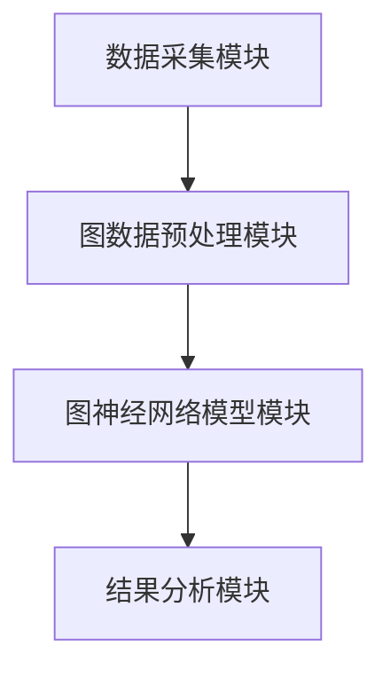
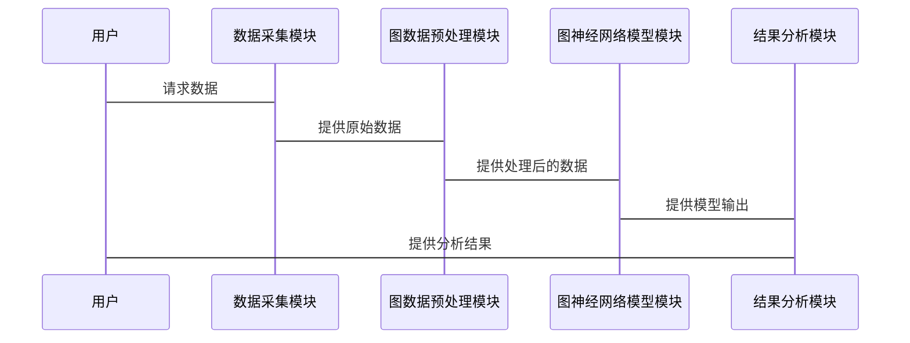

                 


# 开发具有图神经网络能力的AI Agent

> **关键词**：AI Agent, 图神经网络, 图结构数据, 智能决策, 深度学习, 图数据建模

> **摘要**：随着人工智能技术的不断发展，AI Agent在各个领域的应用越来越广泛。然而，传统的AI Agent在处理复杂关系数据时面临诸多挑战。图神经网络作为一种新兴的技术，能够有效地处理图结构数据，为AI Agent的能力提升提供了新的可能性。本文将详细介绍图神经网络的基本原理、其在AI Agent中的应用，以及如何开发具有图神经网络能力的AI Agent。通过理论与实践相结合的方式，读者将能够掌握这一前沿技术的核心要点。

---

# 第一部分：AI Agent与图神经网络概述

## 第1章：AI Agent与图神经网络概述

### 1.1 AI Agent的基本概念

#### 1.1.1 什么是AI Agent
AI Agent（人工智能代理）是指能够感知环境、自主决策并采取行动的智能实体。它可以是一个软件程序、机器人或其他智能系统，旨在为用户提供服务或完成特定任务。

#### 1.1.2 AI Agent的核心特点
1. **自主性**：能够在没有外部干预的情况下自主运行。
2. **反应性**：能够实时感知环境并做出响应。
3. **目标导向**：具有明确的目标，并根据目标采取行动。
4. **学习能力**：能够通过经验改进自身的性能。

#### 1.1.3 图神经网络在AI Agent中的作用
AI Agent的核心能力依赖于对数据的处理和分析。传统的数据通常以文本、图像或序列形式存在，而图神经网络（Graph Neural Networks, GNN）能够处理图结构数据，这使得AI Agent在处理复杂关系数据时更加高效和智能。

---

### 1.2 图神经网络的基本概念

#### 1.2.1 图结构与图数据
图结构是一种数据组织方式，由节点（Node）和边（Edge）组成。节点代表数据的实体，边代表实体之间的关系。例如，在社交网络中，节点可以是用户，边可以是用户之间的关系。

#### 1.2.2 图神经网络的定义
图神经网络是一种能够处理图结构数据的深度学习模型。它通过在图的节点和边上进行特征传播和聚合，提取图数据中的有用信息。

#### 1.2.3 图神经网络与传统神经网络的区别
| 特性          | 图神经网络                      | 传统神经网络                  |
|---------------|--------------------------------|-------------------------------|
| 数据结构      | 图结构（节点和边）              | 序列数据或图像数据            |
| 节点关系      | 能够处理节点之间的关系         | 无法直接处理节点之间的关系   |
| 拓扑变体       | GCN、GAT、GraphSAGE            | CNN、RNN、MLP                 |

---

### 1.3 图神经网络在AI Agent中的应用前景

#### 1.3.1 图神经网络的优势
1. **处理复杂关系**：图神经网络能够捕捉数据中的复杂关系，这对于AI Agent的理解和决策至关重要。
2. **实时性**：通过分布式计算，图神经网络可以在实时环境下运行。
3. **可解释性**：图神经网络的输出通常具有较高的可解释性，有助于AI Agent的决策过程。

#### 1.3.2 图神经网络在AI Agent中的潜在应用领域
1. **社交网络分析**：识别用户之间的关系、情感分析等。
2. **推荐系统**：基于用户行为和偏好进行个性化推荐。
3. **网络安全**：检测网络中的异常行为和潜在威胁。

#### 1.3.3 图神经网络应用的挑战与机遇
- **挑战**：图数据的稀疏性、大规模图数据的处理效率。
- **机遇**：通过图神经网络提升AI Agent的智能性和决策能力。

---

## 1.4 本章小结
本章介绍了AI Agent和图神经网络的基本概念，并探讨了图神经网络在AI Agent中的应用前景。通过对比图神经网络和传统神经网络的特点，我们看到了图神经网络在处理复杂关系数据方面的优势。

---

# 第二部分：图神经网络的核心原理

## 第2章：图神经网络的原理与算法

### 2.1 图结构的表示

#### 2.1.1 图的节点与边
- **节点**：代表数据的实体，例如用户、物品、地点等。
- **边**：代表节点之间的关系，例如“用户购买了物品”、“城市之间的距离”。

#### 2.1.2 图的邻接矩阵与邻接表
- **邻接矩阵**：一个矩阵，其中矩阵的元素表示节点之间的连接情况。
- **邻接表**：一种数据结构，通过节点列表和边列表表示图的结构。

#### 2.1.3 图的嵌入表示
图嵌入（Graph Embedding）是将图中的节点或边表示为低维向量的过程。常用的图嵌入方法包括：
1. **Node2Vec**：通过随机游走生成节点表示。
2. **GraphSAGE**：通过归纳式方法生成节点表示。

---

### 2.2 图神经网络的基本模型

#### 2.2.1 图卷积网络（GCN）
图卷积网络（Graph Convolutional Network, GCN）是一种经典的图神经网络模型。其核心思想是将卷积操作扩展到图结构数据上。

**GCN的数学模型**：
$$
h^{(l+1)}_i = \sigma\left(\sum_{j \in \mathcal{N}(i)} \frac{1}{| \mathcal{N}(i) |} W h^{(l)}_j\right)
$$

其中：
- $h^{(l)}_i$ 表示第 $l$ 层节点 $i$ 的表示。
- $\mathcal{N}(i)$ 表示节点 $i$ 的邻居节点集合。
- $W$ 是参数矩阵。
- $\sigma$ 是激活函数。

**GCN的优势**：
1. **全局信息聚合**：能够捕捉到图中所有节点的信息。
2. **易于实现**：基于矩阵乘法，实现简单。

**GCN的缺点**：
1. **计算复杂度高**：对于大规模图数据，计算量较大。
2. **难以捕捉长距离关系**：GCN的传播层较浅，难以捕捉长距离的节点关系。

---

#### 2.2.2 图注意力网络（GAT）
图注意力网络（Graph Attention Network, GAT）是一种通过注意力机制来处理图结构数据的模型。

**GAT的数学模型**：
$$
\alpha_{ij} = \text{softmax}\left(e^{\beta (w^T (h_i^{(l)} + h_j^{(l)})}\right)
$$

其中：
- $\alpha_{ij}$ 表示节点 $i$ 和节点 $j$ 之间的注意力权重。
- $\beta$ 是一个可学习的参数。
- $w$ 是权重向量。

**GAT的优势**：
1. **捕捉长距离关系**：注意力机制能够捕捉到图中长距离的节点关系。
2. **灵活性高**：适用于多种类型的图数据。

---

#### 2.2.3 图池化与上采样
- **图池化**：通过聚合操作将图中的节点信息进行降维，类似于图像中的下采样。
- **图上采样**：通过插值或其他方法将低维表示恢复为高维表示。

---

### 2.3 图神经网络的训练与优化

#### 2.3.1 图神经网络的训练方法
图神经网络的训练通常采用以下步骤：
1. **初始化参数**：随机初始化权重矩阵和偏置项。
2. **前向传播**：将输入数据通过图神经网络模型进行计算，得到输出结果。
3. **计算损失**：使用损失函数（如交叉熵损失）计算预测结果与真实结果之间的差异。
4. **反向传播**：通过链式法则计算损失对模型参数的梯度。
5. **参数更新**：使用优化算法（如Adam）更新模型参数。

---

#### 2.3.2 图神经网络的损失函数
常用的损失函数包括：
1. **交叉熵损失**：
$$
\mathcal{L} = -\sum_{i=1}^n y_i \log(p_i) + (1-y_i)\log(1-p_i)
$$

2. **均方误差**：
$$
\mathcal{L} = \frac{1}{2n}\sum_{i=1}^n (y_i - p_i)^2
$$

---

#### 2.3.3 图神经网络的优化策略
1. **Adam优化器**：结合动量和自适应学习率的优化算法。
2. **学习率衰减**：在训练过程中逐渐减小学习率，防止模型过拟合。
3. **早停法**：在验证集上损失不再下降时提前终止训练。

---

## 2.4 本章小结
本章详细介绍了图神经网络的核心原理，包括图结构的表示、基本模型（GCN和GAT）以及训练与优化策略。通过对比不同模型的优缺点，我们能够更好地理解图神经网络的设计思想和应用场景。

---

# 第三部分：图神经网络在AI Agent中的应用

## 第3章：图神经网络在AI Agent中的应用

### 3.1 AI Agent中的图数据处理

#### 3.1.1 图数据的获取与预处理
1. **数据获取**：从数据库、API或其他数据源获取图数据。
2. **数据预处理**：对数据进行清洗、归一化处理，并构建图的邻接矩阵或邻接表。

---

#### 3.1.2 图数据的存储与管理
常用的图数据库包括：
1. **Neo4j**：支持属性图模型的数据库。
2. **Neo4j Aura**：Neo4j 的云版本。
3. **TigerGraph**：支持大规模图数据存储和查询的数据库。

---

#### 3.1.3 图数据的嵌入表示
通过图嵌入技术，将图中的节点和边表示为低维向量，便于后续的分析和处理。

---

### 3.2 图神经网络在AI Agent中的具体应用

#### 3.2.1 情感分析
通过图神经网络分析社交网络中的用户情感，帮助AI Agent理解用户的情绪状态。

#### 3.2.2 用户行为预测
基于用户的交互历史和关系网络，预测用户的下一步行为。

---

#### 3.2.3 网络安全
通过图神经网络检测网络中的异常行为，识别潜在的安全威胁。

---

## 3.3 本章小结
本章探讨了图神经网络在AI Agent中的具体应用，包括情感分析、用户行为预测和网络安全等领域。通过图神经网络的强大能力，AI Agent能够更好地理解和处理复杂的关系数据。

---

# 第四部分：系统架构与设计

## 第4章：图神经网络AI Agent的系统架构设计

### 4.1 系统功能设计

#### 4.1.1 系统模块划分
1. **数据采集模块**：负责获取图数据。
2. **图数据预处理模块**：对图数据进行清洗和归一化处理。
3. **图神经网络模型模块**：实现图神经网络的核心算法。
4. **结果分析模块**：对模型的输出结果进行分析和解释。

---

#### 4.1.2 系统功能流程
1. 数据采集模块获取原始图数据。
2. 图数据预处理模块构建图的邻接矩阵或邻接表。
3. 图神经网络模型模块对图数据进行训练和推理。
4. 结果分析模块对模型的输出结果进行分析和可视化。

---

### 4.2 系统架构设计

#### 4.2.1 系统架构图


---

#### 4.2.2 系统接口设计
1. **数据接口**：提供与图数据库的交互接口。
2. **模型接口**：提供与图神经网络模型的交互接口。
3. **结果接口**：提供结果分析模块的输出接口。

---

#### 4.2.3 系统交互流程


---

## 4.3 本章小结
本章详细介绍了图神经网络AI Agent的系统架构设计，包括模块划分、功能流程和系统交互设计。通过合理的架构设计，能够提升系统的可扩展性和可维护性。

---

# 第五部分：项目实战

## 第5章：开发一个基于图神经网络的AI Agent

### 5.1 项目背景与目标
本项目旨在开发一个基于图神经网络的AI Agent，用于社交网络中的用户行为分析。

---

### 5.2 项目环境配置

#### 5.2.1 安装依赖库
1. **Python**：3.6+
2. **深度学习框架**：TensorFlow或PyTorch
3. **图神经网络库**：PyG（PyTorch Geometric）

```bash
pip install torch torch-geometric
```

---

#### 5.2.2 数据准备
使用社交网络中的用户数据，构建用户-用户关系图。

---

### 5.3 项目核心实现

#### 5.3.1 数据预处理
```python
import torch
from torch_geometric.data import Data

# 节点特征
x = torch.randn(100, 10)  # 100个节点，每个节点10维特征
# 边列表
edge_index = torch.tensor([
    [0, 1, 2, ..., 99],
    [1, 2, 3, ..., 100]
], dtype=torch.long)
data = Data(x=x, edge_index=edge_index)
```

---

#### 5.3.2 图神经网络模型实现
```python
import torch.nn as nn
from torch_geometric.nn import GCNConv

class GNNModel(nn.Module):
    def __init__(self, input_dim, hidden_dim, output_dim):
        super(GNNModel, self).__init__()
        self.gcn1 = GCNConv(input_dim, hidden_dim)
        self.gcn2 = GCNConv(hidden_dim, output_dim)
        self.relu = nn.ReLU()
    
    def forward(self, x, edge_index):
        x = self.gcn1(x, edge_index)
        x = self.relu(x)
        x = self.gcn2(x, edge_index)
        return x
```

---

#### 5.3.3 模型训练与评估
```python
model = GNNModel(input_dim=10, hidden_dim=20, output_dim=1)
criterion = nn.BCEWithLogitsLoss()
optimizer = torch.optim.Adam(model.parameters(), lr=0.01)

for epoch in range(100):
    model.train()
    out = model(data.x, data.edge_index)
    loss = criterion(out, data.y)
    loss.backward()
    optimizer.step()
    print(f"Epoch: {epoch}, Loss: {loss.item()}")
```

---

### 5.4 项目小结
本章通过一个具体的项目展示了如何开发一个基于图神经网络的AI Agent。通过项目实战，读者能够更好地理解图神经网络的核心原理和应用方法。

---

# 第六部分：总结与展望

## 第6章：总结与展望

### 6.1 本章总结
本文详细介绍了图神经网络的基本原理及其在AI Agent中的应用。通过理论与实践相结合的方式，读者能够掌握图神经网络的核心要点，并了解其在实际应用中的潜力。

---

### 6.2 未来展望
随着图神经网络技术的不断发展，AI Agent的能力将得到进一步提升。未来的研究方向包括：
1. **更高效的图神经网络算法**：通过优化算法提升模型的计算效率。
2. **多模态图数据处理**：结合文本、图像等多种数据形式，提升AI Agent的综合能力。
3. **实时图神经网络**：研究如何在实时环境下高效运行图神经网络模型。

---

## 6.3 最佳实践 Tips

1. **数据预处理**：在处理图数据时，确保数据的完整性和准确性。
2. **模型调参**：通过实验找到最优的模型参数和超参数。
3. **性能优化**：使用分布式计算和并行处理提升模型的训练效率。

---

## 6.4 本章小结
本章总结了全文的主要内容，并展望了图神经网络在AI Agent中的未来发展方向。通过本文的学习，读者将能够更好地理解和应用这一前沿技术。

---

# 作者：AI天才研究院/AI Genius Institute & 禅与计算机程序设计艺术 /Zen And The Art of Computer Programming

---

通过以上目录和内容的详细规划，我们可以看到《开发具有图神经网络能力的AI Agent》这本书将为读者提供一个全面而深入的技术视角，帮助他们在AI Agent的开发中充分利用图神经网络的强大能力。希望这篇博客能够为相关领域的研究和实践提供有价值的参考和指导。

