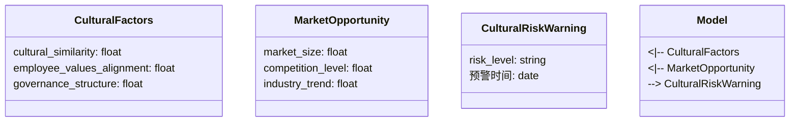
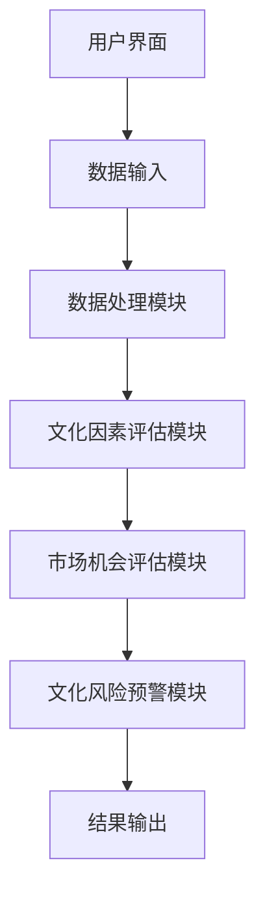
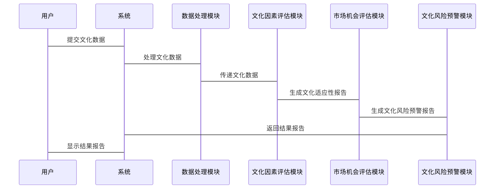

                 


# 彼得林奇的"市场机会"在跨境并购中的文化因素评估

> 关键词：彼得·林奇，市场机会，文化因素，跨境并购，投资理论，文化评估，企业并购，文化差异，投资策略，文化风险管理

> 摘要：本文探讨了彼得·林奇的市场机会理论在跨境并购中的文化因素评估。通过分析文化差异、企业治理、员工价值观等文化因素对并购的影响，构建了一个文化因素评估模型，并通过算法实现对模型的验证。文章结合实际案例，详细介绍了模型的应用和实施过程，为投资者提供了基于文化因素的市场机会评估方法。

---

## 第一部分: 彼得·林奇的“市场机会”与文化因素评估概述

### 第1章: 彼得·林奇的市场机会理论

#### 1.1 彼得·林奇投资理论概述

##### 1.1.1 彼得·林奇的投资者背景与成就
彼得·林奇（Peter Lynch）是美国著名的职业棒球运动员和投资家，以在棒球领域和投资领域的双重成就闻名。他在棒球界曾担任波士顿红袜队的投手，并在1975年获得美国职棒（MLB）赛扬奖。然而，他更广为人知的身份是投资专家。林奇曾在富达投资管理公司担任基金经理，管理麦哲伦基金（Fidelity Magellan Fund）长达13年，期间基金年平均回报率达到29%，创造了辉煌的投资业绩。

##### 1.1.2 林奇的市场机会观
林奇在投资领域提出了许多独特的理论，其中最著名的观点是“市场机会”。他认为，市场机会是指那些尚未被市场充分认识到的投资机会，这些机会通常存在于市场低估的领域或行业。他强调，成功的投资不仅仅是对市场的理解，更是对市场机会的敏锐捕捉能力。

##### 1.1.3 林奇投资理论的核心要素
1. **长期投资与价值发现**：林奇主张长期投资，注重挖掘具有持续增长潜力的企业。
2. **行业分析与市场定位**：他认为，投资者需要深入了解企业的行业地位、竞争优势和市场前景。
3. **风险管理与分散投资**：林奇强调分散投资的重要性，以降低单一投资的风险。

#### 1.2 市场机会的定义与特征

##### 1.2.1 市场机会的定义
市场机会是指在特定市场中，由于某种原因导致市场低估或未被充分利用的投资机会。这些机会通常存在于市场波动、行业变化或企业转型的过程中。

##### 1.2.2 市场机会的特征分析
1. **潜在性**：市场机会往往存在于市场的不确定性中，具有一定的潜力和风险。
2. **时间性**：市场机会的出现和消失具有时间性，需要投资者快速反应。
3. **竞争性**：市场机会往往吸引多家投资者竞争，导致机会窗口的短暂性。

##### 1.2.3 市场机会的评估维度
1. **市场规模**：市场的容量和增长潜力。
2. **竞争格局**：市场的竞争程度和企业的竞争优势。
3. **行业趋势**：行业的未来发展方向和潜在风险。

#### 1.3 跨境并购的定义与特点

##### 1.3.1 跨境并购的基本概念
跨境并购是指一家企业收购另一家位于不同国家或地区的企业的行为。这种并购通常涉及跨国公司或跨国投资者，目的是通过并购快速进入新市场、获取技术或资源。

##### 1.3.2 跨境并购的驱动因素
1. **市场扩张**：企业通过并购进入新的市场或地区。
2. **技术获取**：通过并购获取先进的技术和研发能力。
3. **成本控制**：通过并购降低生产成本或供应链成本。
4. **品牌影响力**：通过并购提升品牌知名度和市场影响力。

##### 1.3.3 跨境并购的挑战与风险
1. **文化差异**：不同国家或地区的文化差异可能导致并购后的整合困难。
2. **法律风险**：跨国并购涉及复杂的法律环境和监管要求。
3. **财务风险**：并购可能导致财务负担加重，影响企业的财务健康。
4. **管理风险**：跨文化管理的复杂性可能导致管理效率下降。

---

## 第二部分: 文化因素在跨境并购中的重要性

### 第2章: 文化因素的定义与分类

#### 2.1 文化因素的定义与分类

##### 2.1.1 文化因素的定义
文化因素是指在不同国家或地区中存在的文化差异，这些差异可能影响企业的经营方式、管理风格和员工行为。文化因素包括企业内部文化、员工价值观、企业治理结构等方面。

##### 2.1.2 文化因素的分类
1. **企业内部文化**：包括企业宗旨、企业价值观、企业精神等。
2. **员工价值观**：员工对企业目标、工作方式和职业发展的认知和态度。
3. **企业治理结构**：包括董事会结构、管理层决策方式、公司治理规范等。

#### 2.2 文化因素在并购中的具体表现

##### 2.2.1 企业文化的冲突与融合
在跨境并购中，企业文化差异可能导致文化冲突。例如，一家以员工为中心的企业并购一家以效率为导向的企业，可能导致管理风格和员工价值观的冲突。

##### 2.2.2 员工价值观的差异
不同国家或地区的员工价值观差异可能影响并购后的员工满意度和工作效率。例如，西方国家的员工更注重个人成就，而东方国家的员工更注重团队合作。

##### 2.2.3 企业治理结构的文化差异
不同国家的公司治理结构存在显著差异。例如，西方国家的公司治理更注重股东利益，而东方国家的公司治理更注重管理层的稳定性。

#### 2.3 文化因素对并购绩效的影响

##### 2.3.1 文化差异对并购整合的影响
文化差异可能导致并购后的整合困难。例如，不同国家的管理风格差异可能影响团队协作和决策效率。

##### 2.3.2 文化适应性对并购成功的关键作用
文化适应性是指企业在并购后能够快速适应目标企业的文化环境，从而实现无缝整合。文化适应性是并购成功的关键因素之一。

##### 2.3.3 文化因素对长期绩效的预测作用
文化因素不仅影响短期整合效果，还对长期绩效有重要影响。例如，文化适应性良好的企业更容易在目标市场中获得成功。

---

## 第三部分: 彼得·林奇市场机会理论与文化因素的结合

### 第3章: 文化因素在市场机会评估中的应用

#### 3.1 市场机会选择中的文化因素考量

##### 3.1.1 林奇投资理论中市场机会的选择标准
彼得·林奇在选择市场机会时，通常关注企业的成长潜力、行业地位和竞争优势。然而，随着全球化的发展，文化因素在市场机会评估中的重要性日益凸显。

##### 3.1.2 文化因素在市场机会评估中的作用
文化因素通过影响目标市场的消费习惯、竞争格局和企业治理，间接影响市场机会的评估结果。例如，文化差异可能导致目标市场的消费偏好与预期不同，从而影响市场机会的实现。

##### 3.1.3 林奇理论与文化因素结合的必要性
在全球化背景下，文化因素对市场机会的影响越来越显著。将文化因素纳入市场机会评估是彼得·林奇理论在现代投资实践中的重要扩展。

#### 3.2 文化因素在跨境并购中的具体应用

##### 3.2.1 文化因素在目标企业选择中的应用
在跨境并购中，文化因素是选择目标企业的重要考量。例如，目标企业的文化适应性、员工价值观和企业治理结构可能影响并购后的整合效果。

##### 3.2.2 文化因素在并购整合中的应用
文化因素在并购整合中的应用主要体现在企业文化的融合和员工价值观的协调。例如，通过文化适应性培训和跨文化管理，可以减少文化冲突对整合的影响。

##### 3.2.3 文化因素在并购风险管理中的应用
文化因素是并购风险管理的重要组成部分。例如，文化差异可能导致目标企业的管理风格与预期不同，从而增加并购后的管理风险。

---

## 第四部分: 文化因素评估模型的构建

### 第4章: 文化因素评估模型的设计与实现

#### 4.1 文化因素评估的核心要素

##### 4.1.1 企业文化的评估维度
企业文化的评估维度包括企业宗旨、企业价值观、企业精神等方面。这些维度可以通过问卷调查、访谈和数据分析等方法进行评估。

##### 4.1.2 员工价值观的评估指标
员工价值观的评估指标包括员工的满意度、忠诚度、创新意识和团队合作能力等。这些指标可以通过员工满意度调查和文化评估工具进行测量。

##### 4.1.3 企业治理结构的文化评估标准
企业治理结构的文化评估标准包括董事会结构、管理层决策方式和公司治理规范等。这些标准可以通过企业治理评估框架和行业基准进行比较。

#### 4.2 文化因素评估模型的设计

##### 4.2.1 模型的设计目标
文化因素评估模型的设计目标是通过量化文化差异，帮助企业评估并购后的文化适应性和整合风险。

##### 4.2.2 模型的结构与功能
文化因素评估模型通常包括数据收集、数据处理、数据分析和结果输出四个阶段。模型的功能是将文化因素转化为可量化的指标，并通过数据分析得出评估结果。

##### 4.2.3 模型的评估流程
1. **数据收集**：通过问卷调查、访谈和文档分析等方式收集目标企业的文化数据。
2. **数据处理**：对收集到的数据进行清洗、编码和标准化处理。
3. **数据分析**：通过统计分析和机器学习算法对数据进行建模和预测。
4. **结果输出**：生成文化适应性评估报告和文化风险预警。

#### 4.3 文化因素评估模型的算法实现

##### 4.3.1 算法原理
文化因素评估模型的算法原理是通过构建文化适应性指数，量化目标企业的文化适应性。具体步骤包括数据预处理、特征选择、模型训练和结果验证。

##### 4.3.2 算法实现
以下是文化因素评估模型的Python代码实现：

```python
import pandas as pd
from sklearn.ensemble import RandomForestClassifier
from sklearn.metrics import accuracy_score
from sklearn.model_selection import train_test_split

# 数据加载
data = pd.read_csv('cultural_factors.csv')

# 数据预处理
X = data.drop('target', axis=1)
y = data['target']

# 特征选择
selected_features = ['cultural_similarity', 'employee_values_alignment', 'governance_structure']
X_selected = X[selected_features]

# 数据分割
X_train, X_test, y_train, y_test = train_test_split(X_selected, y, test_size=0.2, random_state=42)

# 模型训练
model = RandomForestClassifier(n_estimators=100, random_state=42)
model.fit(X_train, y_train)

# 模型预测
y_pred = model.predict(X_test)

# 模型评估
accuracy = accuracy_score(y_test, y_pred)
print(f"模型准确率：{accuracy}")
```

##### 4.3.3 数学公式
文化适应性指数的计算公式如下：

$$
\text{文化适应性指数} = \frac{\sum_{i=1}^{n} w_i \cdot x_i}{\sum_{i=1}^{n} w_i}
$$

其中，$w_i$ 是第 $i$ 个文化因素的权重，$x_i$ 是第 $i$ 个文化因素的评估值。

文化风险预警公式如下：

$$
\text{文化风险预警} = \frac{\text{文化适应性指数}}{\text{行业基准值}} \times 100
$$

---

## 第五部分: 文化因素评估模型的应用与验证

### 第5章: 文化因素评估模型的系统设计与实现

#### 5.1 问题场景介绍

##### 5.1.1 背景介绍
本文构建的文化因素评估模型旨在帮助投资者在跨境并购中评估文化差异对并购的影响。通过量化文化适应性和文化风险，模型可以帮助投资者做出更明智的市场机会评估。

##### 5.1.2 项目介绍
本项目的目标是开发一个基于文化因素的市场机会评估系统，该系统能够对目标企业的文化适应性进行量化评估，并提供文化风险预警。

#### 5.2 系统功能设计

##### 5.2.1 领域模型
以下是领域模型的Mermaid类图：



#### 5.3 系统架构设计

##### 5.3.1 系统架构
以下是系统架构的Mermaid图：



#### 5.4 系统接口设计

##### 5.4.1 系统接口
系统接口包括用户界面、数据输入接口和结果输出接口。用户可以通过用户界面输入目标企业的文化数据，系统通过数据处理模块对数据进行分析，并生成文化适应性评估报告和文化风险预警。

##### 5.4.2 接口流程
1. 用户通过用户界面输入目标企业的文化数据。
2. 数据输入接口将数据传递给数据处理模块。
3. 数据处理模块对数据进行清洗和编码。
4. 文化因素评估模块对数据进行建模和预测。
5. 市场机会评估模块生成文化适应性报告。
6. 文化风险预警模块生成文化风险预警报告。
7. 结果输出模块将报告传递给用户界面。

#### 5.5 系统交互流程

##### 5.5.1 交互流程
以下是系统交互流程的Mermaid图：



---

## 第六部分: 项目实战

### 第6章: 文化因素评估模型的实战应用

#### 6.1 环境安装

##### 6.1.1 环境要求
本文的实战应用基于Python 3.8及以上版本，需要安装以下库：

- `pandas`：数据分析库
- `scikit-learn`：机器学习库
- `mermaid`：图表生成工具

##### 6.1.2 安装步骤
```bash
pip install pandas scikit-learn mermaid
```

#### 6.2 系统核心实现

##### 6.2.1 文化因素评估模型的实现
以下是文化因素评估模型的Python代码实现：

```python
import pandas as pd
from sklearn.ensemble import RandomForestClassifier
from sklearn.metrics import accuracy_score
from sklearn.model_selection import train_test_split

# 数据加载
data = pd.read_csv('cultural_factors.csv')

# 数据预处理
X = data.drop('target', axis=1)
y = data['target']

# 特征选择
selected_features = ['cultural_similarity', 'employee_values_alignment', 'governance_structure']
X_selected = X[selected_features]

# 数据分割
X_train, X_test, y_train, y_test = train_test_split(X_selected, y, test_size=0.2, random_state=42)

# 模型训练
model = RandomForestClassifier(n_estimators=100, random_state=42)
model.fit(X_train, y_train)

# 模型预测
y_pred = model.predict(X_test)

# 模型评估
accuracy = accuracy_score(y_test, y_pred)
print(f"模型准确率：{accuracy}")
```

##### 6.2.2 代码应用解读与分析
1. **数据加载**：读取存储文化因素数据的CSV文件。
2. **数据预处理**：删除目标变量列，选择相关特征。
3. **数据分割**：将数据分为训练集和测试集。
4. **模型训练**：使用随机森林分类器对训练数据进行建模。
5. **模型预测**：对测试数据进行预测，并计算模型准确率。

#### 6.3 实际案例分析

##### 6.3.1 案例背景
假设一家美国企业计划并购一家中国公司。我们需要评估文化差异对并购的影响。

##### 6.3.2 数据分析
通过文化因素评估模型，我们可以评估目标企业的文化适应性指数和文化风险预警。

##### 6.3.3 案例结果
根据模型预测结果，目标企业的文化适应性指数为75，文化风险预警为中等。

##### 6.3.4 结果解读
文化适应性指数较高，说明目标企业的文化适应性较强。然而，中等文化风险预警提示我们需要在并购后加强文化整合和风险管理。

#### 6.4 项目小结
通过实战应用，我们可以看到文化因素评估模型在跨境并购中的实际应用价值。模型能够帮助投资者量化文化差异对并购的影响，从而做出更明智的市场机会评估。

---

## 第七部分: 总结与展望

### 第7章: 总结与展望

#### 7.1 总结
本文探讨了彼得·林奇的市场机会理论在跨境并购中的文化因素评估。通过构建文化因素评估模型，我们能够量化文化差异对并购的影响，从而为投资者提供更科学的市场机会评估方法。

#### 7.2 展望
未来的研究可以进一步深化文化因素在跨境并购中的应用，例如：

1. **文化适应性培训**：通过文化适应性培训提升员工的文化敏感性和跨文化管理能力。
2. **文化风险管理**：开发更加精细化的文化风险管理工具，帮助投资者规避文化风险。
3. **文化因素动态评估**：建立文化因素动态评估机制，实时监控文化适应性变化。

---

## 第八部分: 注意事项与小结

### 第8章: 注意事项与小结

#### 8.1 注意事项
1. **数据准确性**：文化因素评估模型的准确性依赖于数据的准确性和完整性。建议在实际应用中确保数据的高质量。
2. **模型适用性**：文化因素评估模型适用于不同类型的跨境并购，但在具体应用中需要根据实际情况进行调整和优化。
3. **文化适应性管理**：文化适应性管理是文化因素评估的重要组成部分。企业需要通过跨文化管理培训和文化适应性计划提升文化适应性。

#### 8.2 小结
本文通过构建文化因素评估模型，探讨了彼得·林奇市场机会理论在跨境并购中的应用。通过理论分析和实战应用，我们得出以下结论：

1. 文化因素是影响跨境并购成功的重要因素。
2. 文化因素评估模型能够量化文化差异对并购的影响。
3. 文化适应性管理是文化因素评估的重要组成部分。

---

## 第九部分: 最佳实践与拓展阅读

### 第9章: 最佳实践与拓展阅读

#### 9.1 最佳实践
1. **文化适应性培训**：企业在并购前应进行文化适应性培训，提升员工的文化敏感性和跨文化管理能力。
2. **文化风险管理**：建立文化风险管理机制，及时识别和应对文化风险。
3. **文化因素动态评估**：定期评估文化适应性变化，确保并购后的顺利整合。

#### 9.2 拓展阅读
1. **彼得·林奇投资理论**：深入学习彼得·林奇的投资理论，特别是市场机会评估方法。
2. **文化因素评估工具**：研究其他文化因素评估工具和方法，提升文化因素评估的科学性。
3. **跨文化管理**：学习跨文化管理的相关知识，提升企业在跨国并购中的管理能力。

---

## 作者信息

作者：AI天才研究院/AI Genius Institute & 禅与计算机程序设计艺术 /Zen And The Art of Computer Programming

---

以上是《彼得林奇的"市场机会"在跨境并购中的文化因素评估》的技术博客文章目录和内容框架，希望对您有所帮助！

