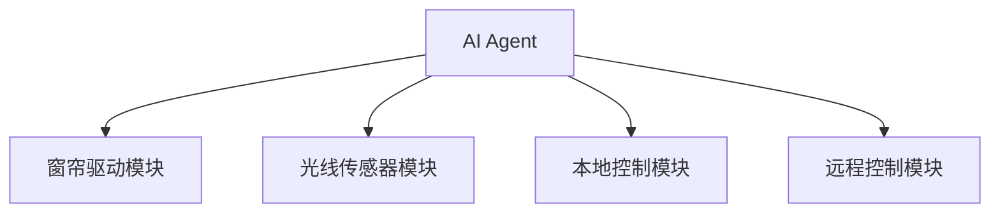
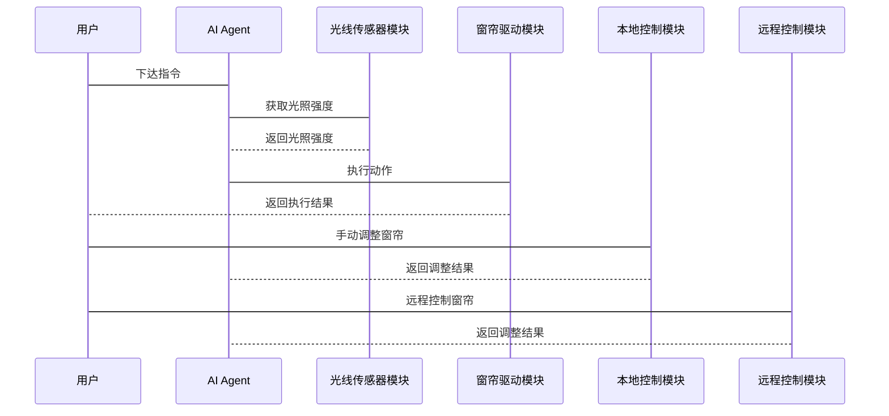

                 


# 智能窗帘：AI Agent的室内光线优化

## 关键词：智能窗帘，AI Agent，室内光线优化，物联网，智能家居，强化学习

## 摘要：本文深入探讨了AI Agent在智能窗帘中的应用，通过分析室内光线优化的背景与意义，详细阐述了AI Agent的核心概念、算法原理、系统架构设计及项目实战。文章结合强化学习算法，展示了如何通过AI Agent实现智能窗帘的自动化控制，从而优化室内光线，提升居住舒适度和能源效率。

---

# 第1章: 智能窗帘与AI Agent的背景介绍

## 1.1 智能窗帘的发展历程

### 1.1.1 传统窗帘的局限性
传统窗帘主要依赖手动操作，存在以下问题：
- **不便性**：用户需要手动开关窗帘，尤其在早晨或晚上，操作繁琐。
- **光线控制不足**：无法根据光照强度或时间自动调整，可能导致室内光线过强或过弱。
- **能源浪费**：未能有效利用自然光线，导致能源浪费。

### 1.1.2 智能化窗帘的出现
随着物联网技术的发展，智能窗帘应运而生。智能窗帘通过传感器和自动化控制，能够根据光照强度和时间自动调节窗帘的开合程度，从而优化室内光线。

### 1.1.3 AI Agent在智能窗帘中的应用
AI Agent（人工智能代理）是一种能够感知环境、自主决策并执行任务的智能实体。在智能窗帘中，AI Agent能够通过分析光照数据和用户需求，优化窗帘的开合策略，实现室内光线的智能化管理。

## 1.2 AI Agent的核心概念

### 1.2.1 AI Agent的定义
AI Agent是指能够感知环境、自主决策并执行任务的智能实体。AI Agent能够通过传感器获取环境信息，利用算法进行分析和决策，并通过执行器完成任务。

### 1.2.2 AI Agent的基本特征
- **感知能力**：能够通过传感器获取环境信息。
- **决策能力**：能够根据环境信息和目标，自主决策。
- **执行能力**：能够通过执行器完成任务。
- **学习能力**：能够通过经验优化决策策略。

### 1.2.3 AI Agent与智能窗帘的结合
AI Agent与智能窗帘的结合，使得窗帘能够根据光照强度、时间、用户需求等因素，自动调整开合程度，从而优化室内光线。

## 1.3 室内光线优化的背景与意义

### 1.3.1 室内光线优化的必要性
- **舒适性**：优化室内光线能够提升居住舒适度，减少眼睛疲劳。
- **能源效率**：合理利用自然光线，减少人工照明的使用，降低能源消耗。
- **健康性**：合理的光线环境有助于改善情绪和健康状况。

### 1.3.2 AI Agent在光线优化中的作用
AI Agent能够通过分析光照数据和用户需求，优化窗帘的开合策略，实现室内光线的智能化管理。

### 1.3.3 智能窗帘系统的应用前景
随着智能家居的普及，智能窗帘的应用前景广阔。通过AI Agent的优化，智能窗帘能够进一步提升用户体验，成为智能家居的重要组成部分。

## 1.4 本章小结
本章介绍了智能窗帘的发展历程，AI Agent的核心概念，以及室内光线优化的背景与意义。通过AI Agent的智能化管理，智能窗帘能够优化室内光线，提升居住舒适度和能源效率。

---

# 第2章: AI Agent与智能窗帘的核心原理

## 2.1 AI Agent的基本原理

### 2.1.1 AI Agent的感知与决策机制
AI Agent通过传感器获取环境信息，利用算法进行分析和决策。例如，AI Agent可以通过光照传感器获取室内光照强度，并根据预设的目标（如保持室内光线适宜）决策窗帘的开合程度。

### 2.1.2 AI Agent的学习与优化能力
AI Agent能够通过强化学习等算法，不断优化决策策略。例如，AI Agent可以通过学习用户的行为模式和光照变化，优化窗帘的开合策略，以适应不同的光照条件和用户需求。

### 2.1.3 AI Agent的执行与反馈机制
AI Agent通过执行器（如电机）完成任务，并通过反馈机制不断优化决策策略。例如，AI Agent可以根据用户的反馈（如手动调整窗帘）优化自身的决策算法。

## 2.2 智能窗帘的系统构成

### 2.2.1 窗帘驱动模块
窗帘驱动模块负责执行AI Agent的决策，包括电机、传动机构等。

### 2.2.2 光线传感器模块
光线传感器模块负责采集室内光照强度数据。

### 2.2.3 本地控制模块
本地控制模块负责接收用户的输入指令，并与AI Agent进行交互。

### 2.2.4 远程控制模块
远程控制模块通过互联网与手机APP或其他智能设备进行交互，用户可以远程控制窗帘的开合。

## 2.3 AI Agent与智能窗帘的交互流程

### 2.3.1 光线数据采集
AI Agent通过光线传感器模块获取室内光照强度数据。

### 2.3.2 数据分析与决策
AI Agent根据光照数据和预设的目标，决策窗帘的开合程度。例如，当光照强度过低时，AI Agent可以决策打开窗帘以增加室内光线。

### 2.3.3 窗帘执行与反馈
AI Agent通过窗帘驱动模块执行决策，并通过反馈机制不断优化决策策略。

## 2.4 本章小结
本章详细讲解了AI Agent的基本原理，智能窗帘的系统构成，以及AI Agent与智能窗帘的交互流程。通过这些核心原理，AI Agent能够实现对智能窗帘的智能化控制，优化室内光线。

---

# 第3章: AI Agent的算法原理与实现

## 3.1 基于强化学习的光线优化算法

### 3.1.1 强化学习的基本概念
强化学习是一种机器学习算法，通过智能体与环境的交互，学习最优策略。智能体通过执行动作，获得环境的反馈（奖励或惩罚），并不断优化策略。

### 3.1.2 强化学习的三要素
- **状态（State）**：智能体所处的环境状态，例如室内光照强度。
- **动作（Action）**：智能体执行的动作，例如打开或关闭窗帘。
- **奖励（Reward）**：智能体执行动作后获得的反馈，例如用户满意度或能源消耗。

### 3.1.3 强化学习的算法流程
1. 智能体感知当前状态。
2. 智能体根据当前状态选择动作。
3. 智能体执行动作，获得奖励。
4. 智能体根据奖励优化策略。

### 3.1.4 强化学习的数学模型
强化学习的数学模型可以用以下公式表示：
$$
Q(s, a) = Q(s, a) + \alpha (r + \gamma V(s') - Q(s, a))
$$
其中，\( Q(s, a) \) 表示状态 \( s \) 下动作 \( a \) 的价值，\( \alpha \) 是学习率，\( r \) 是奖励，\( \gamma \) 是折扣因子，\( V(s') \) 是下一状态 \( s' \) 的价值。

### 3.1.5 强化学习在光线优化中的应用
通过强化学习算法，AI Agent可以不断优化窗帘的开合策略，以达到最优的室内光线效果。

## 3.2 算法实现流程

### 3.2.1 数据采集与预处理
AI Agent通过光线传感器模块获取室内光照强度数据，并进行预处理（如滤波、归一化）。

### 3.2.2 状态转移与动作选择
AI Agent根据当前状态选择动作（如打开或关闭窗帘），并执行动作。

### 3.2.3 奖励函数的设计
奖励函数设计是强化学习的关键。例如，当光照强度达到目标范围时，AI Agent获得正奖励；否则获得负奖励。

### 3.2.4 策略优化
通过强化学习算法，AI Agent不断优化策略，以最大化累积奖励。

## 3.3 本章小结
本章详细讲解了基于强化学习的光线优化算法，包括强化学习的基本概念、算法流程、数学模型以及在光线优化中的应用。通过强化学习算法，AI Agent能够不断优化窗帘的开合策略，实现室内光线的智能化管理。

---

# 第4章: 智能窗帘系统的系统架构设计

## 4.1 系统功能设计

### 4.1.1 系统功能模块
- **光线传感器模块**：采集室内光照强度数据。
- **AI Agent模块**：分析数据并决策窗帘的开合。
- **窗帘驱动模块**：执行AI Agent的决策。
- **本地控制模块**：接收用户的输入指令。
- **远程控制模块**：通过互联网与手机APP或其他智能设备交互。

### 4.1.2 系统功能流程
1. 光线传感器模块采集光照强度数据。
2. AI Agent模块分析数据并决策窗帘的开合。
3. 窗帘驱动模块执行决策。
4. 用户可以通过本地或远程控制模块手动调整窗帘。

## 4.2 系统架构设计

### 4.2.1 系统架构图


### 4.2.2 系统接口设计
- **AI Agent接口**：与光线传感器模块、窗帘驱动模块、本地控制模块和远程控制模块进行交互。
- **本地控制接口**：用户通过本地按钮或触摸屏控制窗帘。
- **远程控制接口**：用户通过手机APP或其他智能设备控制窗帘。

### 4.2.3 系统交互序列图


## 4.3 本章小结
本章详细设计了智能窗帘系统的系统架构，包括功能模块、架构图和交互序列图。通过系统的架构设计，AI Agent能够高效地与各个模块交互，实现对窗帘的智能化控制。

---

# 第5章: 项目实战

## 5.1 环境安装与配置

### 5.1.1 硬件设备
- 光线传感器模块（如光敏电阻或光线传感器）
- 窗帘驱动模块（如电机和传动机构）
- 本地控制模块（如按钮或触摸屏）
- 远程控制模块（如Wi-Fi模块或蓝牙模块）

### 5.1.2 软件环境
- Python编程语言
- 机器学习框架（如TensorFlow或PyTorch）
- 开发工具（如VS Code或PyCharm）

## 5.2 核心代码实现

### 5.2.1 AI Agent的核心代码
```python
class AIAgent:
    def __init__(self):
        self.Q = {}  # 状态-动作价值表
        self.alpha = 0.1  # 学习率
        self.gamma = 0.9  # 折扣因子

    def get_action(self, state):
        # 随机选择动作
        import random
        actions = ['open', 'close']
        return random.choice(actions)

    def update_Q(self, state, action, reward, next_state):
        # 更新Q表
        self.Q[(state, action)] = self.Q.get((state, action), 0) + self.alpha * (reward + self.gamma * max(self.Q.get((next_state, a), 0) for a in ['open', 'close']) - self.Q.get((state, action), 0))
```

### 5.2.2 光线传感器数据处理
```python
import sensor  # 假设传感器模块名为sensor

class LightSensor:
    def get_light_intensity(self):
        # 返回当前光照强度
        return sensor.get_light_intensity()
```

### 5.2.3 窗帘驱动模块
```python
class CurtainDriver:
    def __init__(self):
        self.state = 'closed'  # 当前状态

    def open(self):
        self.state = 'open'
        print("窗帘打开")

    def close(self):
        self.state = 'closed'
        print("窗帘关闭")

    def get_state(self):
        return self.state
```

## 5.3 实际案例分析
假设当前室内光照强度为500 lux，目标光照强度范围为300-600 lux。AI Agent通过强化学习算法决策窗帘的开合程度。如果当前光照强度过低，AI Agent会决策打开窗帘以增加室内光线。

## 5.4 本章小结
本章通过项目实战，详细讲解了智能窗帘系统的环境安装、核心代码实现以及实际案例分析。通过实际案例分析，读者可以更好地理解AI Agent在智能窗帘中的应用。

---

# 第6章: 系统优化与安全考虑

## 6.1 系统优化

### 6.1.1 算法优化
通过改进强化学习算法，例如使用更深的神经网络结构或优化奖励函数，可以进一步提高系统的优化效果。

### 6.1.2 系统性能优化
通过优化硬件设计（如选择更灵敏的光线传感器）和软件实现（如优化算法效率），可以提高系统的性能。

## 6.2 系统安全考虑

### 6.2.1 数据安全
保护用户数据的安全，防止数据泄露。

### 6.2.2 系统防护
防止恶意攻击和非法访问，确保系统的安全性和稳定性。

## 6.3 本章小结
本章讨论了系统优化和安全考虑，包括算法优化、系统性能优化和数据安全等。通过优化和安全考虑，可以进一步提高智能窗帘系统的性能和安全性。

---

# 第7章: 总结与展望

## 7.1 本章总结
本文详细探讨了AI Agent在智能窗帘中的应用，通过强化学习算法优化室内光线，提升居住舒适度和能源效率。

## 7.2 未来展望
随着人工智能和物联网技术的不断发展，智能窗帘的应用前景广阔。未来，可以通过进一步优化算法和硬件设计，提升系统的智能化水平和用户体验。

## 7.3 本章小结
本文总结了AI Agent在智能窗帘中的应用，展望了未来的发展方向。

---

# 作者：AI天才研究院/AI Genius Institute & 禅与计算机程序设计艺术 /Zen And The Art of Computer Programming

