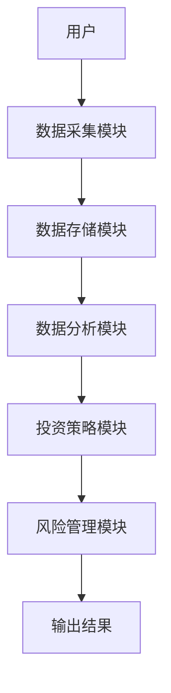
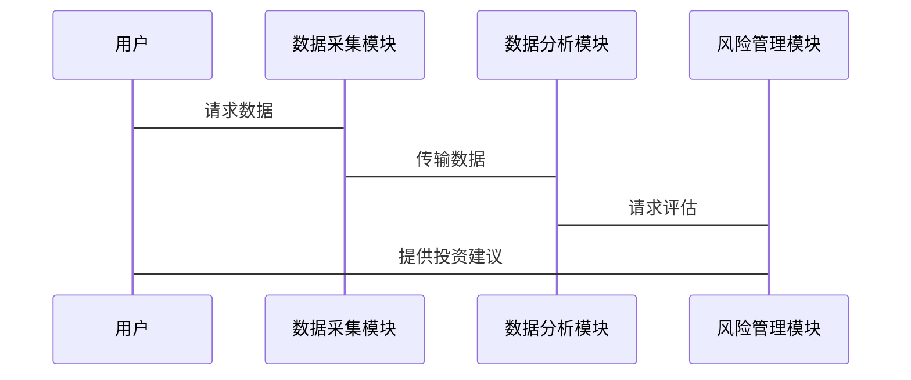

                 


# 特价股票投资策略在数字新兴主权经济体中的适用性探讨

## 关键词：特价股票、数字新兴主权经济体、投资策略、量化分析、风险管理

## 摘要：本文探讨了特价股票投资策略在数字新兴主权经济体中的适用性。通过分析数字技术对金融市场的深远影响，结合新兴主权经济体的经济特点，本文提出了一种基于量化分析的投资策略，以帮助投资者在新兴市场中有效配置资产。文章还讨论了如何利用技术手段降低投资风险，提升投资回报。

---

## 第1章: 特价股票投资策略的背景与核心概念

### 1.1 特价股票的基本概念

#### 1.1.1 特价股票的定义

特价股票是指在特定市场条件下，价格被市场低估的股票。这些股票通常具有较高的潜在回报，但由于市场认知不足或市场周期性波动，其价格未能反映其真实价值。特价股票的特点包括低估值、高潜力和较高的风险承受能力。

#### 1.1.2 特价股票的主要特点

- **低估值**：市场价格低于内在价值。
- **高潜力**：具备增长潜力，未来可能有较高的回报。
- **波动性**：价格波动较大，可能受到市场情绪影响。
- **风险较高**：由于市场认知不足，投资风险较高。

#### 1.1.3 特价股票与普通股票的区别

| 特性       | 特价股票             | 普通股票             |
|------------|----------------------|----------------------|
| 估值水平   | 通常低于市场价值     | 通常接近市场价值     |
| 投资潜力   | 较高                 | 较稳定               |
| 风险水平   | 较高                 | 较低                 |
| 价格波动   | 波动较大             | 波动相对较小         |

### 1.2 数字新兴主权经济体的定义与特点

#### 1.2.1 数字新兴主权经济体的定义

数字新兴主权经济体是指那些在数字化转型中表现出色，且具有独立货币政策和财政政策的新兴经济体。这些国家通常通过技术创新和数字化手段提升经济效率，吸引外资，促进经济增长。

#### 1.2.2 数字新兴主权经济体的主要特点

- **数字化经济**：广泛应用数字技术，推动经济转型。
- **新兴市场**：经济增长速度快，但市场波动较大。
- **政策独立性**：拥有独立的货币政策和财政政策。
- **技术创新**：注重技术创新和数字化基础设施建设。

#### 1.2.3 数字新兴主权经济体与传统主权经济体的对比

| 特性               | 数字新兴主权经济体       | 传统主权经济体       |
|--------------------|--------------------------|--------------------------|
| 经济增长模式         | 数字驱动，创新驱动       | 传统制造业驱动       |
| 技术应用           | 高度数字化               | 数字化程度较低       |
| 政策灵活性         | 较高                     | 较低                   |
| 市场波动性         | 较高                     | 较低                   |

### 1.3 本章小结

本章介绍了特价股票的基本概念和数字新兴主权经济体的定义与特点，分析了两者之间的联系，为后续策略探讨奠定了基础。

---

## 第2章: 特价股票投资策略的核心概念与联系

### 2.1 特价股票投资策略的原理

#### 2.1.1 特价股票投资的基本原理

特价股票投资基于价值投资理念，寻找市场价格低于内在价值的股票。投资者通过分析公司基本面，识别低估股票，长期持有，等待价格回归合理水平。

#### 2.1.2 特价股票投资的核心要素

- **基本面分析**：评估公司财务状况、盈利能力、行业地位等。
- **市场估值**：比较市场价格与内在价值。
- **风险承受能力**：投资者需具备较高的风险承受能力。
- **市场环境**：经济周期、政策环境等因素影响投资策略。

#### 2.1.3 特价股票投资的市场环境分析

经济周期、市场流动性、政策变化等因素会影响特价股票的投资机会。在经济下行周期，特价股票可能更具吸引力，而在经济上行周期，市场整体估值较高，特价股票机会减少。

### 2.2 数字新兴主权经济体中的特价股票投资特点

#### 2.2.1 数字技术对特价股票投资的影响

数字化技术为投资者提供了更多的数据和分析工具，提高了投资决策的效率和准确性。大数据分析、人工智能等技术帮助投资者发现市场中的低估股票，优化投资组合。

#### 2.2.2 新兴市场中的投资机会

新兴市场通常具有较高的经济增长潜力，但市场波动较大。数字技术的应用使得新兴市场的信息获取和分析更加便捷，投资者可以更有效地识别投资机会。

#### 2.2.3 数字化与金融创新的结合

数字化转型推动了金融创新，如区块链、智能合约等技术的应用，降低了交易成本，提高了市场效率。这些创新为特价股票投资提供了新的工具和策略。

### 2.3 特价股票与数字新兴主权经济体的联系

#### 2.3.1 特价股票在数字新兴主权经济体中的地位

数字新兴主权经济体中的特价股票通常具有较高的增长潜力，但由于市场认知不足或信息不对称，价格被低估。这些股票可能成为投资者的重要投资对象。

#### 2.3.2 数字化对特价股票投资策略的影响

数字化技术的应用提高了投资者的分析能力，帮助他们更准确地识别低估股票。同时，数字化工具还提供了实时数据和市场分析，支持投资者做出更明智的投资决策。

#### 2.3.3 新兴市场中特价股票投资的风险与机遇

新兴市场具有较高的增长潜力，但也伴随着较高的投资风险。数字技术的应用可以帮助投资者更好地管理风险，捕捉市场机会。

### 2.4 本章小结

本章探讨了数字新兴主权经济体中的特价股票投资策略，分析了数字化技术对投资策略的影响，指出了新兴市场中的风险与机遇。

---

## 第3章: 特价股票投资策略在数字新兴主权经济体中的适用性分析

### 3.1 特价股票投资策略的理论基础

#### 3.1.1 金融学基础理论

金融学基础理论包括资产定价理论、投资组合理论等，为特价股票投资提供了理论支持。

#### 3.1.2 投资组合理论

投资组合理论强调通过分散投资降低风险，优化投资组合。在数字新兴主权经济体中，投资者可以通过配置特价股票和其它资产类别，分散风险。

#### 3.1.3 数字化金融创新的理论支持

数字化金融创新为投资策略提供了新的工具和方法，如算法交易、大数据分析等，支持投资者更有效地实施特价股票投资策略。

### 3.2 数字新兴主权经济体中的投资环境分析

#### 3.2.1 数字化金融市场的特点

数字化金融市场具有高效、透明、便捷的特点，信息获取和交易成本较低，支持投资者进行实时分析和交易。

#### 3.2.2 新兴市场的经济政策与监管环境

新兴市场的经济政策和监管环境通常较为灵活，但也可能带来政策风险。投资者需要关注政策变化，及时调整投资策略。

#### 3.2.3 数字化对投资行为的影响

数字化技术改变了投资行为，投资者可以利用技术工具进行实时监控和分析，提高了投资决策的效率和准确性。

### 3.3 特价股票投资策略的适用性分析

#### 3.3.1 投资策略的有效性

在数字新兴主权经济体中，特价股票投资策略的有效性取决于市场环境、政策变化和公司的基本面。投资者需要结合市场具体情况，灵活调整投资策略。

#### 3.3.2 投资策略的风险管理

投资者需要通过分散投资、风险评估等方法，有效管理投资风险，避免过度集中投资于单一股票或市场。

#### 3.3.3 投资策略的优化

通过持续监控市场变化和公司基本面，投资者可以不断优化投资策略，提高投资回报。

### 3.4 本章小结

本章分析了数字新兴主权经济体中的投资环境，探讨了特价股票投资策略的适用性，强调了风险管理的重要性。

---

## 第4章: 特价股票投资策略的算法原理

### 4.1 特价股票评估的数学模型

#### 4.1.1 市场价值与内在价值的计算

内在价值 = 现金流的现值

市场价值 = 当前股价

#### 4.1.2 投资价值的判断

投资价值 = 内在价值 > 市场价值

### 4.2 基于量化分析的投资策略

#### 4.2.1 数据采集与处理

使用Python从金融数据库中获取股票数据，清洗和处理数据，提取关键指标如市盈率、市净率等。

#### 4.2.2 数据分析与建模

使用机器学习算法对股票进行分类，识别低估股票，构建投资组合。

#### 4.2.3 算法实现

```python
import pandas as pd
import numpy as np

# 示例代码：计算股票的内在价值
def calculate_intrinsic_value(stock_data):
    # 假设股票数据包括收入、现金流等指标
    revenue = stock_data['revenue']
    cash_flow = stock_data['cash_flow']
    # 简单计算内在价值，仅为示例
    intrinsic_value = (revenue + cash_flow) / 2
    return intrinsic_value

# 示例代码：识别低估股票
def identify_cheap_stocks(stock_data):
    market_price = stock_data['price']
    intrinsic_values = calculate_intrinsic_value(stock_data)
    cheap_stocks = []
    for i in range(len(market_price)):
        if intrinsic_values[i] > market_price[i]:
            cheap_stocks.append(i)
    return cheap_stocks

# 示例代码：评估投资组合
def evaluate_portfolio(portfolio, stock_data):
    portfolio_returns = []
    for stock in portfolio:
        returns = stock_data[stock]['returns']
        portfolio_returns.append(returns.mean())
    return portfolio_returns
```

#### 4.2.4 模型验证与优化

通过历史数据验证模型的有效性，调整参数，优化投资策略。

### 4.3 本章小结

本章通过量化分析的方法，探讨了特价股票投资策略的算法原理，展示了如何利用技术手段优化投资决策。

---

## 第5章: 数字新兴主权经济体中的投资策略系统设计

### 5.1 系统功能设计

#### 5.1.1 数据采集模块

从多个数据源获取股票数据，清洗和处理数据，提取关键指标。

#### 5.1.2 数据分析模块

使用量化分析工具对股票进行评估，识别低估股票，构建投资组合。

#### 5.1.3 风险管理模块

监控市场变化，评估投资组合的风险，调整投资策略。

### 5.2 系统架构设计

#### 5.2.1 系统架构图



#### 5.2.2 系统接口设计

- 数据采集模块接口：从API获取实时数据
- 数据分析模块接口：接收数据，输出评估结果
- 风险管理模块接口：接收评估结果，输出投资建议

#### 5.2.3 系统交互设计



### 5.3 本章小结

本章设计了一个基于数字化技术的投资策略系统，展示了如何利用技术手段优化投资决策。

---

## 第6章: 项目实战

### 6.1 环境安装

- 安装Python和相关库（如Pandas、NumPy、Scikit-learn）
- 安装金融数据API接口

### 6.2 核心代码实现

#### 6.2.1 数据采集与处理

```python
import pandas as pd
import requests

def fetch_stock_data(api_key):
    url = "https://api.example.com/stocks"
    params = {'api_key': api_key}
    response = requests.get(url, params=params)
    data = response.json()
    df = pd.DataFrame(data)
    return df

# 示例代码：获取股票数据
api_key = "your_api_key"
stock_data = fetch_stock_data(api_key)
```

#### 6.2.2 特价股票识别

```python
def identify_cheap_stocks(stock_data):
    # 计算内在价值和市场价值
    intrinsic_values = stock_data['intrinsic_value']
    market_prices = stock_data['price']
    # 识别低估股票
    cheap_stocks = []
    for i in range(len(intrinsic_values)):
        if intrinsic_values[i] > market_prices[i]:
            cheap_stocks.append(i)
    return cheap_stocks

# 示例代码：应用识别函数
cheap_stocks = identify_cheap_stocks(stock_data)
print("低估股票:", cheap_stocks)
```

#### 6.2.3 投资组合评估

```python
def evaluate_portfolio(portfolio, stock_data):
    returns = []
    for stock in portfolio:
        stock_returns = stock_data[stock]['returns']
        returns.append(stock_returns.mean())
    average_return = sum(returns) / len(returns)
    return average_return

# 示例代码：评估投资组合
portfolio = ['stock1', 'stock2', 'stock3']
avg_return = evaluate_portfolio(portfolio, stock_data)
print("投资组合平均回报:", avg_return)
```

### 6.3 案例分析与解读

#### 6.3.1 数据分析结果

通过分析新兴市场中的股票数据，识别出若干只低估股票，构建投资组合。

#### 6.3.2 投资组合表现

分析投资组合的历史表现，评估策略的有效性。

#### 6.3.3 风险管理措施

通过分散投资、动态调整投资组合，降低投资风险。

### 6.4 本章小结

本章通过项目实战，展示了如何在数字新兴主权经济体中应用特价股票投资策略，提供了实际操作的指导。

---

## 第7章: 最佳实践与注意事项

### 7.1 投资策略的最佳实践

- **分散投资**：避免过度集中投资于单一股票或市场。
- **持续学习**：关注市场动态，学习新的投资知识。
- **风险管理**：制定风险管理计划，定期评估投资组合。

### 7.2 投资注意事项

- **市场风险**：新兴市场波动较大，需谨慎投资。
- **政策风险**：关注政策变化，避免政策风险。
- **流动性风险**：评估股票的流动性，避免流动性不足的问题。

### 7.3 拓展阅读

- 建议阅读《投资学基础》、《算法交易入门》等书籍，深入学习投资策略和量化分析。

### 7.4 本章小结

本章总结了特价股票投资策略的最佳实践，提供了投资注意事项和拓展阅读建议，帮助投资者更好地实施投资策略。

---

## 作者：AI天才研究院/AI Genius Institute & 禅与计算机程序设计艺术/Zen And The Art of Computer Programming

---

通过以上结构，文章详细探讨了特价股票投资策略在数字新兴主权经济体中的适用性，结合理论分析、算法实现和项目实战，为投资者提供了全面的指导。

