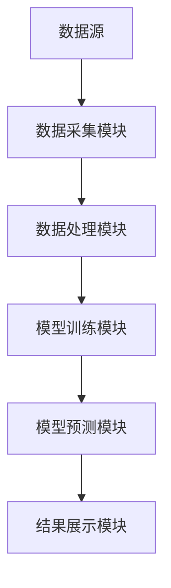
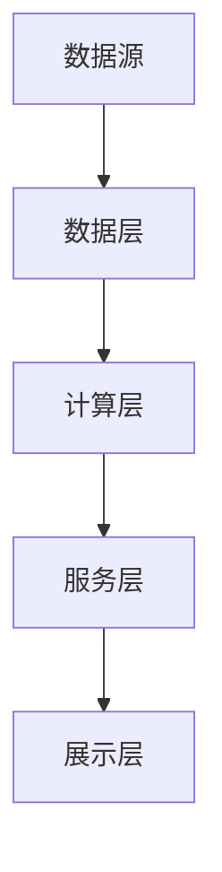
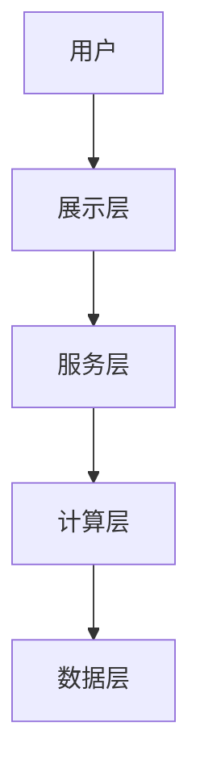

                 


# 特价股票筛选中的深度学习模型应用

## 关键词
深度学习模型, 特价股票筛选, LSTM, 股票价格预测, 金融数据分析

## 摘要
本文探讨了深度学习模型在特价股票筛选中的应用，从背景、核心概念到算法原理、系统设计、项目实战等多个方面进行详细分析。通过理论与实践相结合的方式，展示了如何利用深度学习技术提高股票筛选的效率和准确性。文章最后总结了最佳实践和未来的研究方向。

---

# 第1章: 特价股票筛选的背景与挑战

## 1.1 特价股票的定义与特征

### 1.1.1 特价股票的定义
特价股票是指市场价格低于其内在价值的股票。这些股票通常被市场低估，具有较大的增值潜力，是投资者寻找超额收益的重要目标。

### 1.1.2 特价股票的特征
- **低估值**：市盈率（P/E）或市净率（P/B）低于行业平均水平。
- **高分红**：公司愿意将部分利润以股息形式返还给股东。
- **高成长性**：公司未来盈利增长潜力大。
- **低波动性**：股价波动较小，风险相对较低。

### 1.1.3 特价股票的筛选标准
- 基本面分析：市盈率、市净率、股息率等指标。
- 技术分析：股价趋势、成交量等技术指标。

## 1.2 股票筛选的传统方法

### 1.2.1 基于基本面分析的传统方法
- 分析公司的财务报表，评估其盈利能力、成长性和财务健康状况。
- 优点：逻辑清晰，可解释性强。
- 缺点：依赖人工经验，难以量化。

### 1.2.2 基于技术分析的传统方法
- 通过分析历史股价和成交量，预测未来股价走势。
- 常用技术指标：K线图、MACD、RSI等。
- 优点：直观，易于操作。
- 缺点：受市场情绪影响较大，预测精度有限。

### 1.2.3 传统方法的优缺点
- 优点：简单易懂，易于实施。
- 缺点：主观性较强，难以捕捉复杂市场规律。

## 1.3 深度学习在股票筛选中的应用背景

### 1.3.1 深度学习的定义与特点
- **定义**：深度学习是一种机器学习技术，通过多层非线性变换模拟人脑神经网络的运行方式。
- **特点**：数据驱动、非线性特征提取能力强、模型复杂度高。

### 1.3.2 深度学习在金融领域的应用现状
- 股票价格预测、风险评估、交易策略优化等。
- 深度学习在处理海量金融数据和复杂市场关系方面具有显著优势。

### 1.3.3 深度学习在股票筛选中的优势
- **非线性特征提取**：能够捕捉传统方法难以发现的市场规律。
- **数据驱动决策**：通过大量历史数据训练模型，提高预测精度。
- **自动化特征工程**：模型可以自动提取有用的特征，减少人工干预。

## 1.4 本章小结
本章介绍了特价股票的定义和筛选标准，分析了传统股票筛选方法的优缺点，并探讨了深度学习在股票筛选中的应用背景和优势。

---

# 第2章: 深度学习模型在股票筛选中的核心概念

## 2.1 深度学习模型的基本原理

### 2.1.1 神经网络的基本结构
- **输入层**：接收输入数据。
- **隐藏层**：通过非线性变换提取特征。
- **输出层**：生成最终的预测结果。

### 2.1.2 深度学习与传统机器学习的区别
| 特性       | 传统机器学习          | 深度学习           |
|------------|-----------------------|-------------------|
| 特征工程   | 需要手动提取特征       | 自动提取特征       |
| 模型复杂度 | 模型简单，易于解释     | 模型复杂，非线性强   |
| 数据需求   | 数据量较小            | 数据量需求较大      |

### 2.1.3 深度学习模型的训练过程
- **前向传播**：输入数据通过网络，计算输出结果。
- **反向传播**：计算误差，并通过梯度下降优化权重。

## 2.2 深度学习模型在股票筛选中的应用

### 2.2.1 模型输入特征的定义
- 市盈率（P/E）、市净率（P/B）、股息率（Dividend Yield）等财务指标。
- 历史股价、成交量等技术指标。

### 2.2.2 模型输出目标的定义
- 预测股票未来的价格走势。
- 判断股票是否为特价股票。

### 2.2.3 模型的训练与优化
- 数据预处理：归一化、缺失值处理。
- 模型训练：使用训练数据优化模型参数。
- 模型验证：通过验证集评估模型性能。

## 2.3 深度学习模型的优缺点对比

### 2.3.1 深度学习模型的优点
- **非线性特征提取**：能够捕捉复杂市场规律。
- **自动化特征工程**：减少人工干预。
- **高精度**：在大数据情况下表现优于传统方法。

### 2.3.2 深度学习模型的缺点
- **计算资源需求高**：需要大量计算资源。
- **模型解释性差**：难以解释具体决策逻辑。
- **过拟合风险**：在数据不足的情况下容易过拟合。

### 2.3.3 深度学习模型的适用场景
- 数据量大。
- 特征复杂。
- 需要高精度预测。

## 2.4 本章小结
本章详细介绍了深度学习模型的基本原理及其在股票筛选中的应用，分析了其优缺点和适用场景。

---

# 第3章: 深度学习模型在股票筛选中的算法原理

## 3.1 深度学习模型的选择与优化

### 3.1.1 常见深度学习模型的选择
- **LSTM**：适合处理时间序列数据。
- **CNN**：适合处理图像数据，但在股票筛选中较少使用。
- **随机森林**：虽然属于传统机器学习模型，但在特征筛选中也有应用。

### 3.1.2 模型的优化方法
- **超参数调优**：调整学习率、批量大小等参数。
- **早停法**：防止过拟合。
- **集成学习**：通过集成多个模型提高性能。

### 3.1.3 模型的调参技巧
- 使用网格搜索或随机搜索优化超参数。
- 通过交叉验证评估模型性能。

## 3.2 基于LSTM的股票价格预测模型

### 3.2.1 LSTM的基本原理
- **门控机制**：控制信息的流动。
- **细胞状态**：记忆长期信息。

### 3.2.2 LSTM在股票价格预测中的应用
- 输入：历史股价、技术指标。
- 输出：未来股价预测。

### 3.2.3 LSTM模型的实现步骤
1. 数据预处理：归一化数据。
2. 构建LSTM网络：定义输入层、LSTM层、 Dense层。
3. 训练模型：使用训练数据优化模型参数。
4. 预测与评估：使用测试数据评估模型性能。

### 3.2.4 LSTM的数学公式
- **输入门**：$$i = \sigma(W_i x + U_i h_{prev})$$
- **遗忘门**：$$f = \sigma(W_f x + U_f h_{prev})$$
- **细胞状态更新**：$$c = f \odot c_{prev} + i \odot tanh(W_c x + U_c h_{prev})$$
- **输出门**：$$o = \sigma(W_o x + U_o h_{prev})$$
- **隐藏状态**：$$h = o \odot tanh(c)$$

## 3.3 深度学习模型的训练与验证

### 3.3.1 数据的预处理与特征提取
- **归一化**：将数据标准化到0-1范围。
- **滑动窗口**：提取时间序列特征。

### 3.3.2 模型的训练过程
- **正向传播**：计算预测值和真实值的误差。
- **反向传播**：通过梯度下降优化权重。

### 3.3.3 模型的验证与评估
- **验证集评估**：计算均方误差（MSE）、平均绝对误差（MAE）。
- **测试集验证**：评估模型的泛化能力。

## 3.4 本章小结
本章详细介绍了深度学习模型的选择与优化，以及LSTM模型的实现步骤和数学原理。

---

# 第4章: 深度学习模型在股票筛选中的系统架构设计

## 4.1 系统功能设计

### 4.1.1 系统的功能模块划分
- 数据采集模块：从金融数据源获取股票数据。
- 数据处理模块：清洗、归一化数据。
- 模型训练模块：训练深度学习模型。
- 模型预测模块：预测股票价格。
- 结果展示模块：可视化预测结果。

### 4.1.2 每个模块的功能描述
- 数据采集模块：接口与数据源对接。
- 数据处理模块：数据预处理、特征提取。
- 模型训练模块：训练LSTM网络。
- 模型预测模块：输入数据，输出预测结果。
- 结果展示模块：图表展示预测结果。

### 4.1.3 系统的功能流程图


## 4.2 系统架构设计

### 4.2.1 系统的分层架构设计
- **数据层**：存储原始数据和预处理后的数据。
- **计算层**：模型训练和预测的计算逻辑。
- **服务层**：提供API接口，供其他系统调用。
- **展示层**：用户界面，展示预测结果。

### 4.2.2 每层的详细设计
- 数据层：使用数据库存储数据，支持高效查询。
- 计算层：基于框架（如TensorFlow、PyTorch）实现模型训练和预测。
- 服务层：设计RESTful API，支持HTTP请求。
- 展示层：使用图表库（如Matplotlib）展示结果。

### 4.2.3 系统的架构图


## 4.3 系统接口设计

### 4.3.1 API接口设计
- **GET /data**: 获取股票数据。
- **POST /train**: 训练模型。
- **POST /predict**: 预测股票价格。
- **GET /result**: 获取预测结果。

### 4.3.2 接口交互流程
1. 用户发送数据请求。
2. 服务层调用数据层获取数据。
3. 计算层处理数据并返回结果。
4. 展示层展示结果。

## 4.4 系统交互流程图


## 4.5 本章小结
本章详细介绍了系统的功能设计、架构设计和接口设计，展示了如何将深度学习模型应用于实际系统中。

---

# 第5章: 深度学习模型在股票筛选中的项目实战

## 5.1 环境安装与配置

### 5.1.1 安装Python环境
```bash
python --version
pip install --upgrade pip
```

### 5.1.2 安装深度学习框架
```bash
pip install tensorflow numpy pandas scikit-learn matplotlib
```

### 5.1.3 数据集获取
- 数据来源：Yahoo Finance、Kaggle等。
- 数据格式：CSV文件，包含历史股价、财务指标等。

## 5.2 系统核心实现源代码

### 5.2.1 数据预处理代码
```python
import pandas as pd
import numpy as np

# 读取数据
df = pd.read_csv('stock_data.csv')

# 数据归一化
from sklearn.preprocessing import MinMaxScaler
scaler = MinMaxScaler()
data = scaler.fit_transform(df['Close'].values.reshape(-1, 1))

# 划分训练集和测试集
train_size = int(len(data) * 0.8)
train_data = data[:train_size]
test_data = data[train_size:]

# 创建滑动窗口
window_size = 30
X_train = []
y_train = []
for i in range(window_size, len(train_data)):
    X_train.append(train_data[i-window_size:i])
    y_train.append(train_data[i])

X_train = np.array(X_train)
y_train = np.array(y_train)
```

### 5.2.2 模型训练代码
```python
from tensorflow.keras.models import Sequential
from tensorflow.keras.layers import LSTM, Dense

model = Sequential()
model.add(LSTM(units=50, return_sequences=True, input_shape=(window_size, 1)))
model.add(LSTM(units=50, return_sequences=False))
model.add(Dense(1))

model.compile(loss='mean_squared_error', optimizer='adam')

model.fit(X_train, y_train, epochs=50, batch_size=32)
```

### 5.2.3 模型预测代码
```python
# 数据预测
X_test = []
for i in range(window_size, len(test_data)):
    X_test.append(test_data[i-window_size:i])
X_test = np.array(X_test)

predicted_prices = model.predict(X_test)
predicted_prices = scaler.inverse_transform(predicted_prices)
```

## 5.3 代码应用解读与分析

### 5.3.1 数据预处理
- 使用归一化处理，消除数据量纲的影响。
- 划分训练集和测试集，确保模型的泛化能力。

### 5.3.2 模型训练
- 使用LSTM网络，适合处理时间序列数据。
- 设置训练参数，包括 epochs 和 batch_size。

### 5.3.3 模型预测
- 使用测试数据进行预测。
- 反归一化处理，得到实际的预测价格。

## 5.4 实际案例分析与详细解读
假设我们有一个包含某公司股票历史收盘价的数据集，经过数据预处理和模型训练后，我们可以使用该模型预测未来30天的股价走势。通过对比预测结果和实际股价，评估模型的准确性。

## 5.5 项目小结
本章通过实际案例展示了如何使用深度学习模型进行股票筛选，详细讲解了数据预处理、模型训练和预测的实现过程。

---

# 第6章: 总结与展望

## 6.1 最佳实践 Tips

### 6.1.1 数据处理
- 数据清洗：处理缺失值、异常值。
- 特征选择：选择与目标相关的特征。

### 6.1.2 模型选择
- 根据数据类型选择合适的模型：时间序列数据选择LSTM。
- 考虑计算资源：选择适合当前硬件的模型。

### 6.1.3 模型评估
- 使用多种指标评估模型性能：MSE、MAE、R²。
- 使用交叉验证提高模型的泛化能力。

## 6.2 小结
本文详细探讨了深度学习模型在特价股票筛选中的应用，从理论到实践，展示了如何利用深度学习技术提高股票筛选的效率和准确性。

## 6.3 注意事项
- 深度学习模型的预测结果仅供参考，实际投资需谨慎。
- 模型的预测精度受市场波动和数据质量的影响。

## 6.4 拓展阅读
- 《Deep Learning for Stock Market Prediction》
- 《Advances in Financial Machine Learning》

---

# 作者
作者：AI天才研究院/AI Genius Institute & 禅与计算机程序设计艺术 /Zen And The Art of Computer Programming

