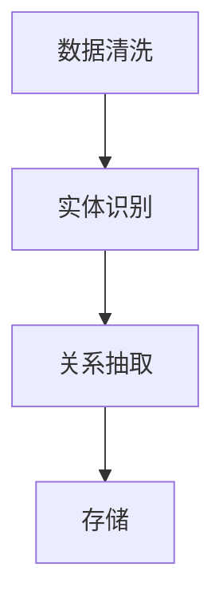
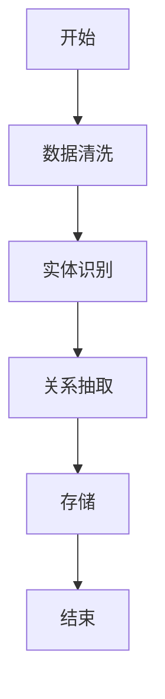
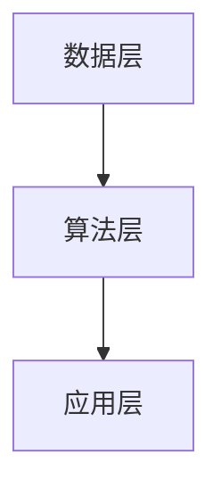

                 


# 知识图谱在金融实体关系挖掘中的应用

## 关键词：知识图谱、金融、实体关系挖掘、深度学习、自然语言处理

## 摘要：  
知识图谱是一种强大的工具，用于表示实体及其关系，广泛应用于金融领域。本文详细探讨了知识图谱在金融实体关系挖掘中的应用，从数据预处理到系统架构设计，再到实际案例分析，系统地介绍了相关技术。通过分析，展示了知识图谱如何帮助金融机构优化业务流程、提高决策效率和风险控制能力。

---

# 第1章: 知识图谱的基本概念与背景

## 1.1 知识图谱的定义与特点  
知识图谱是一种结构化的数据形式，由节点和边组成，节点表示实体，边表示实体间的关联关系。其特点包括语义丰富性、可扩展性、动态更新和分布式存储。  

### 1.1.1 知识图谱的定义  
知识图谱是一种图结构的数据，其中节点代表实体（如人、组织、概念），边代表实体间的关联关系（如“是”、“属于”、“导致”）。  

### 1.1.2 知识图谱的核心特点  
- **语义丰富性**：能够表示复杂的实体关系，如“投资于”、“控股”等。  
- **可扩展性**：支持动态添加新实体和关系。  
- **动态更新**：实时更新以反映最新信息。  
- **分布式存储**：支持大规模数据存储和查询。  

### 1.1.3 知识图谱与传统数据库的区别  
- **关系表示**：传统数据库通过表结构表示关系，而知识图谱通过图结构更直观地表示实体间的关系。  
- **灵活性**：知识图谱支持灵活的关系定义，而传统数据库需要预先定义表结构。  

## 1.2 金融实体关系挖掘的背景与意义  
金融领域的实体关系挖掘旨在通过分析金融数据中的实体及其关系，支持金融决策和业务优化。  

### 1.2.1 金融领域的实体与关系  
- **实体**：包括公司、投资者、交易、市场指数等。  
- **关系**：包括“投资于”、“控股”、“影响”等。  

### 1.2.2 知识图谱在金融中的应用价值  
- **风险控制**：识别关联实体，评估整体风险。  
- **智能投顾**：基于历史数据推荐投资组合。  
- **欺诈检测**：识别异常交易模式。  

### 1.2.3 金融实体关系挖掘的挑战与机遇  
- **挑战**：金融数据复杂，关系多样，且需要实时更新。  
- **机遇**：通过知识图谱技术，提升金融业务的智能化水平。  

## 1.3 本章小结  
本章介绍了知识图谱的基本概念及其在金融领域的应用背景，强调了知识图谱在金融实体关系挖掘中的重要性。

---

# 第2章: 知识图谱的核心概念与联系

## 2.1 实体与关系的定义  
实体是金融领域中的具体对象，如公司、投资者；关系描述实体间的关联，如“投资于”、“控股”。  

### 2.1.1 实体的定义与分类  
- **定义**：实体是知识图谱的基本单位，可以是人、组织或概念。  
- **分类**：金融实体包括公司、投资者、交易、市场指数等。  

### 2.1.2 关系的定义与类型  
- **定义**：关系描述实体间的关联，如“投资于”、“控股”。  
- **类型**：包括直接关系和间接关系，如“投资于”、“间接控股”。  

### 2.1.3 实体与关系的关联方式  
实体通过关系连接，形成复杂的网络结构，如公司A投资于公司B。  

## 2.2 知识图谱的结构化表示  
知识图谱通过结构化的数据表示实体及其关系，支持高效的查询和分析。  

### 2.2.1 RDF与RDFS的介绍  
- **RDF（Resource Description Framework）**：用于描述资源及其属性。  
- **RDFS（RDF Schema）**：扩展RDF，定义类和属性。  

### 2.2.2 实体关系的ER图表示  
使用ER图描述实体和关系，例如公司和投资者之间的“投资于”关系。  

### 2.2.3 实体关系的E-R图架构  
通过E-R图展示实体和关系的结构，帮助理解数据模型。  

## 2.3 知识图谱的属性特征对比  
通过表格对比实体和关系的属性特征，例如实体的名称、类型和关系的强度、方向。  

### 2.3.1 实体属性对比表格  
| 属性 | 实体A | 实体B |
|------|-------|-------|
| 名称 | 公司A | 投资者A |

### 2.3.2 关系属性对比表格  
| 关系 | 强度 | 方向 |
|------|------|------|
| 投资于 | 高 | 单向 |

### 2.3.3 实体与关系的属性特征分析  
实体的属性特征包括名称、类型，关系的属性特征包括强度、方向。  

## 2.4 本章小结  
本章详细介绍了知识图谱的核心概念，包括实体、关系及其结构化表示方法。

---

# 第3章: 金融实体关系挖掘的关键技术

## 3.1 数据预处理技术  
数据预处理是金融实体关系挖掘的基础，包括数据清洗、标注和增强。  

### 3.1.1 数据清洗方法  
- **去重**：去除重复数据。  
- **标准化**：统一数据格式。  

### 3.1.2 数据标注与标准化  
- **标注**：对数据进行人工标注，确保准确性。  
- **标准化**：使用正则表达式提取公司名称和日期。  

### 3.1.3 数据增强技术  
- **数据扩展**：通过合成数据增强训练集。  

## 3.2 实体识别与抽取  
实体识别是通过自然语言处理技术，从文本中提取实体。  

### 3.2.1 基于规则的实体识别  
- **规则**：使用正则表达式识别公司名称。  

### 3.2.2 基于CRF的实体识别  
- **条件随机场**：用于序列标注任务，如命名实体识别。  

### 3.2.3 基于深度学习的实体识别  
- **LSTM模型**：通过长短期记忆网络捕捉上下文信息。  

## 3.3 关系抽取与挖掘  
关系抽取是通过分析文本，识别实体间的关联关系。  

### 3.3.1 基于规则的关系抽取  
- **规则**：定义特定的模式，如“公司A投资于公司B”。  

### 3.3.2 基于句法分析的关系抽取  
- **句法分析**：通过依存句法分析识别关系。  

### 3.3.3 基于深度学习的关系抽取  
- **神经网络模型**：如BERT，用于关系分类。  

## 3.4 知识图谱构建的算法流程  
知识图谱构建包括数据清洗、实体识别、关系抽取和存储。  

### 3.4.1 数据流图  


### 3.4.2 算法流程图  


### 3.4.3 代码实现示例  
```python
import spacy

nlp = spacy.load("en_core_web_sm")
doc = nlp("公司A投资于公司B。")
for ent in doc.ents:
    print(ent.text, ent.label_)
```

## 3.5 本章小结  
本章介绍了金融实体关系挖掘的关键技术，包括数据预处理、实体识别和关系抽取。

---

# 第4章: 知识图谱的构建与管理

## 4.1 知识图谱的建模方法  
知识图谱的建模方法包括RDF、RDFS和OWL。  

### 4.1.1 RDF与RDFS的建模  
- **RDF**：用于描述数据。  
- **RDFS**：扩展RDF，定义类和属性。  

### 4.1.2 实体关系的本体论建模  
- **OWL**：用于定义本体论，增强语义表达。  

## 4.2 知识图谱的构建流程  
知识图谱的构建包括数据清洗、抽取、建模和存储。  

### 4.2.1 数据清洗与抽取  
- **清洗**：去除重复数据。  
- **抽取**：从文本中提取实体和关系。  

### 4.2.2 知识图谱的建模与存储  
- **建模**：使用RDF或OWL定义实体和关系。  
- **存储**：使用图数据库或RDF存储系统。  

## 4.3 知识图谱的管理与维护  
知识图谱的管理包括数据更新、版本控制和数据安全。  

### 4.3.1 数据更新策略  
- **实时更新**：及时反映最新信息。  
- **批量更新**：定期更新数据。  

### 4.3.2 数据安全与隐私保护  
- **数据加密**：保护敏感信息。  
- **访问控制**：限制数据访问权限。  

## 4.4 本章小结  
本章详细介绍了知识图谱的建模方法和构建流程，强调了数据管理和维护的重要性。

---

# 第5章: 知识图谱在金融中的应用场景

## 5.1 风险控制与评估  
知识图谱在风险控制中的应用包括识别关联实体和评估整体风险。  

### 5.1.1 识别关联实体  
通过知识图谱识别公司之间的投资关系，评估整体风险。  

### 5.1.2 评估整体风险  
分析实体间的关联关系，预测潜在风险。  

## 5.2 智能投顾与个性化服务  
知识图谱支持智能投顾，提供个性化投资建议。  

### 5.2.1 个性化投资建议  
基于用户的历史投资行为，推荐相关金融产品。  

### 5.2.2 风险提示  
识别潜在风险，及时提示用户。  

## 5.3 智能合规与监管 reporting  
知识图谱在智能合规中的应用包括识别关联交易和满足监管要求。  

### 5.3.1 识别关联交易  
通过知识图谱识别公司间的关联交易，确保合规性。  

### 5.3.2 满足监管要求  
生成符合监管要求的报告，降低合规风险。  

## 5.4 本章小结  
本章介绍了知识图谱在金融中的主要应用场景，包括风险控制、智能投顾和智能合规。

---

# 第6章: 系统架构与设计

## 6.1 系统架构设计  
知识图谱系统的架构包括数据层、算法层和应用层。  

### 6.1.1 数据层  
- **数据源**：包括金融新闻、公告、交易数据。  
- **数据预处理**：清洗和标注数据。  

### 6.1.2 算法层  
- **实体识别**：使用CRF或深度学习模型。  
- **关系抽取**：基于规则或深度学习模型。  
- **知识图谱构建**：存储和管理知识图谱。  

### 6.1.3 应用层  
- **风险控制**：识别关联实体，评估风险。  
- **智能投顾**：推荐投资组合。  
- **合规管理**：识别关联交易。  

## 6.2 系统功能设计  
知识图谱系统的功能包括数据处理、知识构建和应用服务。  

### 6.2.1 数据处理功能  
- **数据清洗**：去除重复数据。  
- **数据标注**：人工标注实体和关系。  

### 6.2.2 知识构建功能  
- **实体识别**：识别文本中的实体。  
- **关系抽取**：识别实体间的关联关系。  
- **知识图谱存储**：存储知识图谱数据。  

### 6.2.3 应用服务功能  
- **风险评估**：评估投资风险。  
- **智能投顾**：推荐投资组合。  
- **合规管理**：识别关联交易。  

## 6.3 系统架构图  


## 6.4 本章小结  
本章详细介绍了知识图谱系统的架构设计和功能设计。

---

# 第7章: 项目实战

## 7.1 环境搭建  
知识图谱项目的环境搭建包括安装Python、相关库和图数据库。  

### 7.1.1 安装Python  
- 使用Anaconda安装Python 3.8及以上版本。  

### 7.1.2 安装相关库  
- 使用pip安装spacy、networkx、py2neo。  

### 7.1.3 安装图数据库  
- 下载并安装Neo4j社区版。  

## 7.2 核心实现  
知识图谱项目的实现包括数据处理、实体识别、关系抽取和知识图谱存储。  

### 7.2.1 数据处理  
```python
import pandas as pd

df = pd.read_csv('financial_data.csv')
df.drop_duplicates(subset=['content'], inplace=True)
```

### 7.2.2 实体识别  
```python
import spacy

nlp = spacy.load("en_core_web_sm")
doc = nlp("公司A投资于公司B。")
for ent in doc.ents:
    print(ent.text, ent.label_)
```

### 7.2.3 关系抽取  
```python
from spacy import displacy

doc = nlp("公司A投资于公司B。")
displacy.render(doc, style="ent")
```

### 7.2.4 知识图谱存储  
```python
from neo4j import GraphDatabase

driver = GraphDatabase.driver('bolt://localhost:7687', auth=('neo4j', 'password'))
session = driver.session()
session.run("CREATE (a:Company {name: '公司A'})")
session.run("CREATE (b:Company {name: '公司B'})")
session.run("MATCH (a:Company {name: '公司A'}), (b:Company {name: '公司B'}) CREATE (a)-[:INVESTS]->(b)")
```

## 7.3 案例分析  
以投资关系挖掘为例，展示如何识别公司间的投资关系，并存储到知识图谱中。  

### 7.3.1 数据来源  
- 数据来源：新闻报道、公告。  

### 7.3.2 数据处理  
- 数据清洗：去除重复数据。  
- 数据标注：人工标注公司名称和投资关系。  

### 7.3.3 实体识别  
- 使用spacy识别公司名称。  

### 7.3.4 关系抽取  
- 识别“投资于”关系。  

### 7.3.5 知识图谱存储  
- 使用Neo4j存储公司和投资关系。  

## 7.4 本章小结  
本章通过项目实战，展示了知识图谱在金融实体关系挖掘中的具体实现。

---

# 第8章: 最佳实践与总结

## 8.1 最佳实践  
知识图谱在金融中的应用需要注意数据质量和模型调优。  

### 8.1.1 数据质量  
- 数据清洗：确保数据准确。  
- 数据标注：提高标注质量。  

### 8.1.2 模型调优  
- 调整实体识别和关系抽取的参数。  

## 8.2 项目小结  
知识图谱在金融实体关系挖掘中的应用具有重要的价值，能够帮助金融机构优化业务流程和提高决策效率。  

## 8.3 未来展望  
未来，知识图谱在金融中的应用将更加智能化和自动化，支持更多复杂场景。  

## 8.4 本章小结  
本章总结了知识图谱在金融中的最佳实践和未来发展方向。

---

# 作者：AI天才研究院/AI Genius Institute & 禅与计算机程序设计艺术 /Zen And The Art of Computer Programming

---

希望这篇博客文章能够为读者提供关于知识图谱在金融实体关系挖掘中的应用的深入理解，并激发更多探索和实践。

