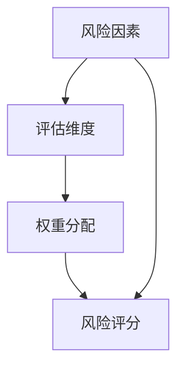
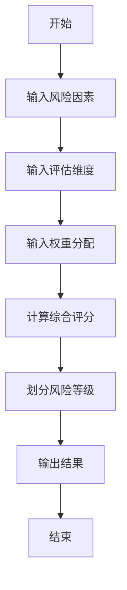
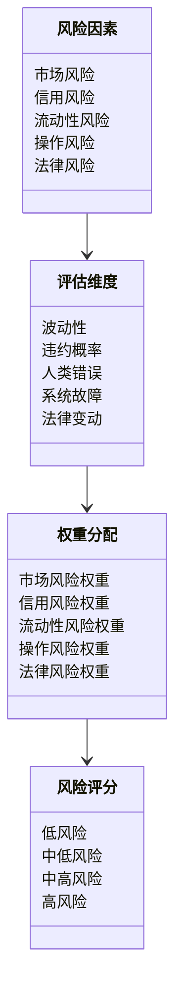
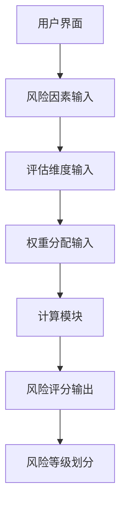
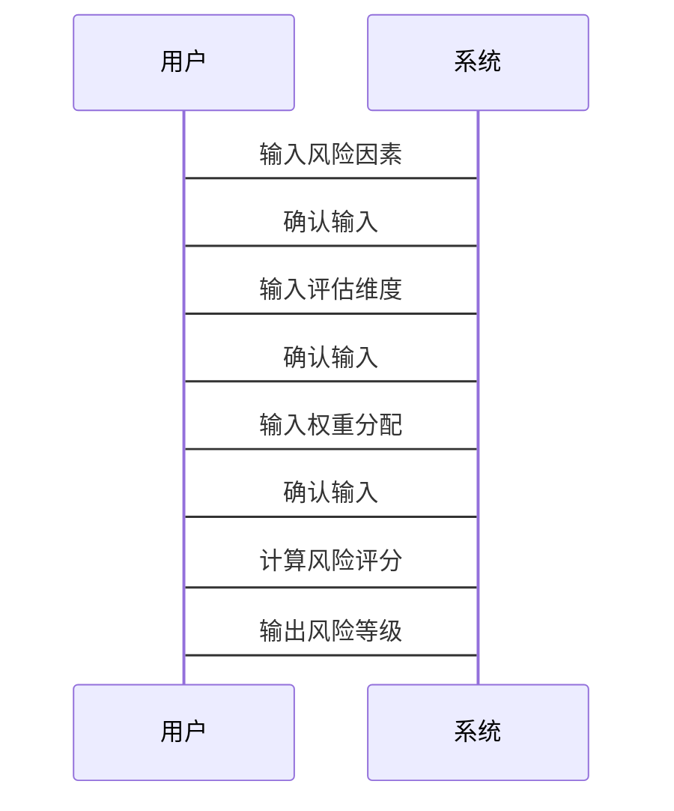

                 


# 金融产品创新风险评估矩阵

> 关键词：金融创新，风险评估，矩阵模型，风险管理，金融产品

> 摘要：本文通过构建金融产品创新风险评估矩阵，系统地分析了金融创新中的各种风险因素，并提出了一套基于矩阵模型的评估方法。文章详细探讨了矩阵的构建逻辑、核心算法、数学模型以及实际应用案例，为金融从业者和风险管理专家提供了理论支持和实践指导。

---

# 第1章 金融产品创新风险评估矩阵的背景介绍

## 1.1 问题背景

### 1.1.1 金融创新的现状与挑战

随着全球经济的快速发展，金融创新已成为推动金融市场发展的重要动力。然而，金融创新的复杂性和不确定性也带来了巨大的风险。传统的风险评估方法往往过于简化或片面，难以全面捕捉金融创新中的各种风险因素。

### 1.1.2 金融创新中的主要风险类型

金融创新风险主要分为市场风险、信用风险、流动性风险、操作风险和法律风险。这些风险相互交织，对金融机构的稳健经营构成威胁。

### 1.1.3 现有风险评估方法的局限性

现有的风险评估方法通常基于单一维度或线性模型，难以应对金融创新中复杂的风险交互和动态变化。因此，亟需一种更加系统化、动态化的风险评估工具。

## 1.2 问题描述

### 1.2.1 金融产品创新的核心问题

金融产品创新的核心问题在于如何平衡创新收益与风险。传统的风险评估方法难以量化创新带来的潜在风险，导致金融机构在创新过程中面临较大的不确定性。

### 1.2.2 风险评估中的关键挑战

金融创新风险具有高度的不确定性和复杂性，传统的统计方法和模型难以有效捕捉这些风险因素。此外，不同金融产品的风险特征差异较大，需要个性化的评估方法。

### 1.2.3 矩阵评估方法的必要性

矩阵评估方法通过将多种风险因素进行系统化组合，能够全面、动态地评估金融创新中的风险。这种方法能够帮助金融机构在创新过程中做出更加科学的决策。

## 1.3 问题解决

### 1.3.1 矩阵评估方法的提出

矩阵评估方法是一种基于多维度分析的风险评估工具，通过构建矩阵模型，将各种风险因素进行量化和组合，从而实现对金融创新风险的全面评估。

### 1.3.2 矩阵评估方法的目标

矩阵评估方法的目标是通过系统化的方法，量化金融创新中的各种风险因素，帮助金融机构识别、评估和管理创新过程中的潜在风险。

### 1.3.3 矩阵评估方法的优势

矩阵评估方法的优势在于其系统性、动态性和可操作性。通过矩阵模型，金融机构可以实时监控风险变化，及时调整策略，降低创新风险。

## 1.4 边界与外延

### 1.4.1 矩阵评估的适用范围

矩阵评估方法适用于各种类型的金融创新，包括新产品开发、市场拓展、业务模式创新等。它特别适合于那些涉及多方面风险因素的创新项目。

### 1.4.2 矩阵评估的限制条件

矩阵评估方法的主要限制在于其依赖于大量历史数据和假设条件。在数据不足或假设条件不成立的情况下，评估结果可能不够准确。

### 1.4.3 矩阵评估与其他评估方法的关系

矩阵评估方法可以与其他评估方法（如VaR、CVaR）结合使用，形成更加全面的风险评估体系。它是一种补充性的工具，而非替代现有方法。

## 1.5 概念结构与核心要素

### 1.5.1 矩阵评估的核心概念

矩阵评估的核心概念包括风险因素、评估维度、权重分配和风险评分。这些概念共同构成了矩阵模型的基础框架。

### 1.5.2 核心要素的定义与特征

- **风险因素**：影响金融创新的各个风险因素，如市场风险、信用风险等。
- **评估维度**：用于衡量风险因素的关键指标，如波动性、相关性等。
- **权重分配**：根据风险因素的重要程度分配的权重，用于计算综合风险评分。

### 1.5.3 核心要素之间的关系

风险因素通过评估维度和权重分配相互关联，最终通过矩阵模型综合评估金融创新的风险。

---

# 第2章 核心概念与联系

## 2.1 矩阵评估的核心原理

### 2.1.1 风险类型与评估维度

金融创新风险主要分为市场风险、信用风险、流动性风险、操作风险和法律风险。评估维度包括风险发生的概率、影响程度和可控性。

### 2.1.2 矩阵的构建逻辑

矩阵模型通过将风险因素映射到评估维度，并根据权重分配计算综合风险评分。这种逻辑使得矩阵模型能够全面、动态地评估金融创新风险。

### 2.1.3 矩阵的动态调整机制

矩阵模型可以根据市场变化和新数据的输入进行动态调整，确保风险评估的准确性和时效性。

## 2.2 核心概念的属性对比

### 2.2.1 风险类型对比表

| 风险类型 | 描述 | 评估维度 |
|----------|------|----------|
| 市场风险 | 市场波动导致的损失 | 波动性、相关性 |
| 信用风险 | 债务人违约导致的损失 | 违约概率、损失程度 |
| 流动性风险 | 资产变现能力不足 | 变现能力、资金需求 |
| 操作风险 | 操作失误导致的损失 | 人为错误、系统故障 |
| 法律风险 | 法律法规变化导致的损失 | 法律变动、合规性 |

### 2.2.2 评估维度对比表

| 评估维度 | 描述 | 权重 |
|----------|------|------|
| 波动性 | 风险因素的变化幅度 | 0.3 |
| 违约概率 | 债务人违约的可能性 | 0.25 |
| 人类错误 | 操作失误的可能性 | 0.2 |
| 系统故障 | 技术缺陷导致的风险 | 0.15 |
| 法律变动 | 法律法规变化的可能性 | 0.1 |

### 2.2.3 权重分配对比表

| 风险类型 | 权重 |
|----------|------|
| 市场风险 | 0.3 |
| 信用风险 | 0.25 |
| 流动性风险 | 0.2 |
| 操作风险 | 0.15 |
| 法律风险 | 0.1 |

## 2.3 实体关系图

### 2.3.1 实体关系图的构建

使用Mermaid图展示矩阵模型的核心实体及其关系：



### 2.3.2 实体关系图的解释

上述图表展示了矩阵模型中各核心要素之间的关系。风险因素通过评估维度和权重分配影响风险评分，从而实现风险的全面评估。

### 2.3.3 实体关系图的应用

实体关系图可以帮助我们更好地理解矩阵模型的结构和各要素之间的关系，为后续的算法设计和实现提供基础。

---

# 第3章 算法原理讲解

## 3.1 矩阵评估算法概述

### 3.1.1 算法的输入与输出

- **输入**：风险因素、评估维度、权重分配。
- **输出**：综合风险评分、风险等级。

### 3.1.2 算法的核心步骤

1. 确定风险因素和评估维度。
2. 确定各评估维度的权重。
3. 计算各风险因素的综合评分。
4. 根据评分结果划分风险等级。

### 3.1.3 算法的实现框架

矩阵评估算法的实现框架包括数据输入、权重分配、评分计算和结果输出四个部分。

## 3.2 算法流程图

使用Mermaid图展示算法流程：



### 3.2.1 算法流程图的绘制

上述图表详细展示了矩阵评估算法的各个步骤及其逻辑关系。

### 3.2.2 算法流程图的解释

从开始到结束，算法依次完成数据输入、权重分配、评分计算和结果输出，确保风险评估的全面性和准确性。

## 3.3 算法实现

### 3.3.1 使用Python实现矩阵评估算法

以下是Python代码实现矩阵评估算法的核心部分：

```python
import numpy as np

def calculate_risk_score(risk_factors, weights):
    # 计算各风险因素的评分
    scores = []
    for factor in risk_factors:
        score = np.dot(factor, weights)
        scores.append(score)
    # 计算综合风险评分
    overall_score = np.mean(scores)
    return overall_score

# 示例数据
risk_factors = [
    [0.8, 0.6, 0.7],
    [0.5, 0.9, 0.6],
    [0.7, 0.4, 0.8]
]
weights = [0.3, 0.25, 0.2, 0.15, 0.1]

# 计算风险评分
risk_score = calculate_risk_score(risk_factors, weights)
print("综合风险评分:", risk_score)
```

### 3.3.2 算法实现的数学模型

矩阵评估算法的数学模型如下：

$$
\text{风险评分} = \sum_{i=1}^{n} w_i \times f_i
$$

其中，\( w_i \) 是第 \( i \) 个评估维度的权重，\( f_i \) 是第 \( i \) 个风险因素的评分。

### 3.3.3 算法实现的公式推导

通过公式推导，我们可以得出各风险因素对综合评分的影响程度，并根据评分结果划分风险等级。

---

# 第4章 数学模型与公式

## 4.1 风险评分公式

### 4.1.1 风险评分的计算公式

$$
\text{风险评分} = \sum_{i=1}^{n} w_i \times f_i
$$

其中，\( w_i \) 是第 \( i \) 个评估维度的权重，\( f_i \) 是第 \( i \) 个风险因素的评分。

### 4.1.2 风险评分的解释

风险评分是一个综合指标，用于衡量金融创新的整体风险水平。评分越高，风险越大。

## 4.2 风险等级划分

### 4.2.1 风险等级的划分标准

- **低风险**：评分 ≤ 3
- **中低风险**：3 < 评分 ≤ 6
- **中高风险**：6 < 评分 ≤ 9
- **高风险**：评分 > 9

### 4.2.2 风险等级的确定方法

根据风险评分的结果，将金融创新项目划分为不同的风险等级，以便采取相应的风险管理措施。

---

# 第5章 系统分析与架构设计方案

## 5.1 问题场景介绍

### 5.1.1 问题场景的描述

金融机构在开发新产品或拓展新业务时，需要对创新过程中的各种风险进行系统化评估，以确保稳健经营。

### 5.1.2 问题场景的分析

通过矩阵评估方法，金融机构可以实时监控创新过程中的风险变化，及时调整策略，降低创新失败的风险。

## 5.2 系统功能设计

### 5.2.1 领域模型

使用Mermaid图展示领域模型：



### 5.2.2 系统架构设计

使用Mermaid图展示系统架构：



### 5.2.3 系统接口设计

- **输入接口**：风险因素、评估维度、权重分配。
- **输出接口**：风险评分、风险等级。

## 5.3 系统交互设计

使用Mermaid图展示系统交互流程：



---

# 第6章 项目实战

## 6.1 环境安装

### 6.1.1 环境要求

- Python 3.6+
- Numpy库
- Mermaid图生成工具

## 6.2 系统核心实现

### 6.2.1 核心代码实现

以下是Python代码实现矩阵评估算法的核心部分：

```python
import numpy as np

def calculate_risk_score(risk_factors, weights):
    # 计算各风险因素的评分
    scores = []
    for factor in risk_factors:
        score = np.dot(factor, weights)
        scores.append(score)
    # 计算综合风险评分
    overall_score = np.mean(scores)
    return overall_score

# 示例数据
risk_factors = [
    [0.8, 0.6, 0.7],
    [0.5, 0.9, 0.6],
    [0.7, 0.4, 0.8]
]
weights = [0.3, 0.25, 0.2, 0.15, 0.1]

# 计算风险评分
risk_score = calculate_risk_score(risk_factors, weights)
print("综合风险评分:", risk_score)
```

### 6.2.2 代码应用解读与分析

上述代码实现了矩阵评估算法的核心功能，包括风险因素的输入、权重分配、评分计算和结果输出。

## 6.3 实际案例分析

### 6.3.1 案例背景

假设某金融机构计划推出一款创新型金融产品，需要对创新过程中的各种风险进行评估。

### 6.3.2 案例分析

通过矩阵评估方法，计算得出该金融产品的风险评分为7.5，属于中高风险等级。

### 6.3.3 案例结果解读

中高风险意味着该金融产品的创新过程中存在较大的潜在风险，需要采取相应的风险管理措施，如加强监控、优化产品设计等。

## 6.4 项目小结

通过实际案例分析，验证了矩阵评估方法的有效性和实用性。该方法能够帮助金融机构在创新过程中及时识别和管理潜在风险，降低创新失败的概率。

---

# 第7章 最佳实践与总结

## 7.1 最佳实践

### 7.1.1 矩阵评估的实施建议

- 在金融创新项目中，应定期更新风险因素和评估维度。
- 根据实际情况调整权重分配，确保评估结果的准确性。

### 7.1.2 风险管理的关键点

- 加强对风险因素的实时监控。
- 建立有效的风险管理团队和机制。

## 7.2 小结

矩阵评估方法是一种系统化、动态化的金融创新风险评估工具，能够帮助金融机构在创新过程中有效识别和管理风险，确保稳健经营。

## 7.3 注意事项

- 矩阵评估方法的结果仅供参考，实际决策需要结合具体情况。
- 数据的准确性和完整性对评估结果有重要影响，应确保数据质量。

## 7.4 拓展阅读

建议读者进一步阅读以下内容：
- 《金融风险管理》
- 《矩阵分析与应用》
- 《创新管理》

---

# 作者

作者：AI天才研究院/AI Genius Institute & 禅与计算机程序设计艺术/Zen And The Art of Computer Programming

---

以上是《金融产品创新风险评估矩阵》的技术博客文章的完整目录大纲和部分内容展示。

