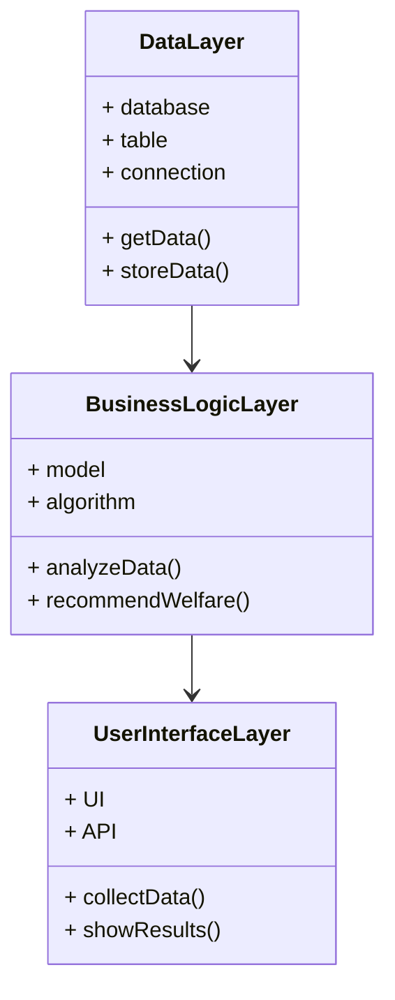

                 


# AI Agent在员工健康与福利管理中的应用前景

> 关键词：AI Agent，员工健康，福利管理，人工智能，健康管理

> 摘要：随着人工智能技术的快速发展，AI Agent在员工健康与福利管理中的应用前景广阔。本文详细探讨了AI Agent在员工健康监测、个性化福利推荐、健康风险预测等方面的核心概念、算法原理和系统架构，并通过实际案例展示了AI Agent在提升员工健康与福利管理效率和效果中的潜力。文章最后总结了当前应用的挑战和未来的发展方向。

---

# 第一部分: 背景介绍

## 第1章: 背景介绍

### 1.1 当前员工健康与福利管理的现状
员工健康与福利管理是企业人力资源管理的重要组成部分，传统的管理方式通常依赖人工记录和处理，存在数据分散、效率低下、个性化不足等问题。随着企业对员工健康和福利的关注度不断提高，如何利用新技术提升管理效率和员工体验成为亟待解决的问题。

#### 1.1.1 问题背景
- 数据分散：员工的健康数据（如体检报告、病历记录）和福利信息（如保险、福利补贴）通常分散在不同的系统中，难以统一管理和分析。
- 个性化不足：传统福利管理往往采用“一刀切”的方式，无法根据员工的个性化需求提供定制化的福利方案。
- 效率低下：人工处理健康数据和福利申请的过程繁琐，容易出错，且难以快速响应员工的需求。

#### 1.1.2 问题分析
- 数据孤岛：不同部门和系统之间缺乏数据共享和集成，导致信息碎片化。
- 个性化需求难以满足：员工的健康状况和福利需求具有高度个性化，传统管理方式难以实现精准匹配。
- 管理成本高：人工处理大量数据和申请的过程耗时耗力，且容易出错。

#### 1.1.3 解决方案
AI Agent作为一种智能代理技术，可以通过自动化数据处理、个性化推荐和智能决策，有效解决上述问题。AI Agent能够实时收集、分析和处理员工健康数据，提供个性化的健康建议和福利推荐，从而提升管理效率和员工满意度。

### 1.2 核心概念与定义
在本章中，我们将详细阐述AI Agent在员工健康与福利管理中的核心概念和定义。

#### 1.2.1 AI Agent的基本定义
AI Agent（人工智能代理）是一种能够感知环境、自主决策并执行任务的智能系统。在员工健康与福利管理中，AI Agent可以扮演多种角色，例如：
- 健康数据收集与分析：通过整合员工的健康数据，识别健康风险。
- 个性化福利推荐：根据员工的需求和偏好，推荐适合的福利方案。
- 智能决策支持：基于数据分析，提供健康管理和福利优化的建议。

#### 1.2.2 实体关系图（ER图）
为了更好地理解AI Agent在员工健康与福利管理中的应用，我们可以通过实体关系图来展示核心实体及其关系。

```mermaid
erDiagram
    employee {
        emp_id : integer
        emp_name : string
        emp_age : integer
        emp_gender : string
        emp_department : string
    }
    health_data {
        data_id : integer
        emp_id : integer
        data_type : string
        data_value : string
        record_time : datetime
    }
    welfare_info {
        info_id : integer
        emp_id : integer
        welfare_type : string
        welfare_value : float
        effective_time : datetime
    }
    agent {
        agent_id : integer
        agent_name : string
        function : string
        status : string
    }
    employee -> health_data : 提供
    employee -> welfare_info : 关联
    agent -> health_data : 处理
    agent -> welfare_info : 推荐
```

通过上述实体关系图，我们可以清晰地看到员工、健康数据、福利信息和AI Agent之间的关系。员工提供健康数据和关联福利信息，AI Agent负责处理健康数据并推荐合适的福利方案。

---

# 第二部分: AI Agent的核心概念与原理

## 第2章: AI Agent的核心概念与原理

### 2.1 AI Agent的基本原理
AI Agent的核心原理是通过感知环境、分析数据、做出决策并执行任务。在员工健康与福利管理中，AI Agent需要处理大量的结构化和非结构化数据，例如：
- 健康数据：体检报告、运动数据、饮食记录等。
- 福利信息：保险计划、补贴政策、培训资源等。

#### 2.1.1 数据处理与分析
AI Agent需要对员工的健康数据和福利信息进行处理和分析。具体步骤如下：
1. 数据收集：通过API或文件导入的方式，获取员工的健康数据和福利信息。
2. 数据清洗：去除重复数据、填补缺失值、处理异常值。
3. 数据分析：使用机器学习算法对健康数据进行风险评估，对福利信息进行个性化推荐。

#### 2.1.2 个性化推荐
AI Agent可以根据员工的健康状况和需求，推荐个性化的福利方案。例如：
- 根据员工的健康风险评估结果，推荐相应的保险计划。
- 根据员工的工作压力和心理状态，推荐心理健康服务。

#### 2.1.3 智能决策
AI Agent可以通过分析员工的健康数据和福利信息，提供智能决策支持。例如：
- 基于健康风险评估结果，优化员工的健康计划。
- 根据员工的需求和企业政策，优化福利方案。

### 2.2 AI Agent的算法与数学模型

#### 2.2.1 健康风险评估模型
健康风险评估是AI Agent在员工健康管理中的核心任务之一。我们可以使用基于概率的模型来评估员工的健康风险。

##### 概率模型
健康风险评估模型可以通过以下步骤构建：
1. 数据预处理：清洗和标准化数据。
2. 特征选择：提取与健康相关的特征（如年龄、性别、BMI、血压等）。
3. 模型训练：使用逻辑回归或随机森林等算法训练健康风险分类模型。
4. 模型评估：通过准确率、召回率等指标评估模型性能。

##### 逻辑回归模型
逻辑回归是一种常用的分类算法，可以用于健康风险评估。其数学模型如下：

$$ P(y=1|x) = \frac{e^{\beta_0 + \beta_1 x}}{1 + e^{\beta_0 + \beta_1 x}} $$

其中，$x$是输入特征，$\beta_0$和$\beta_1$是模型的参数。

#### 2.2.2 福利推荐算法
福利推荐算法的目标是根据员工的需求和企业的政策，推荐最优的福利方案。我们可以使用协同过滤或基于内容的推荐算法。

##### 协同过滤算法
协同过滤是一种基于用户行为的推荐算法。其核心思想是：如果两个用户在历史行为上相似，那么他们未来的兴趣也会相似。

##### 福利推荐模型
福利推荐模型可以通过以下步骤构建：
1. 数据预处理：清洗和标准化数据。
2. 特征选择：提取与福利相关的特征（如员工的年龄、职位、收入等）。
3. 模型训练：使用协同过滤或基于内容的推荐算法训练推荐模型。
4. 模型评估：通过准确率、召回率等指标评估模型性能。

---

# 第三部分: 系统架构与设计方案

## 第3章: 系统架构与设计方案

### 3.1 系统需求分析
在设计AI Agent系统之前，我们需要明确系统的功能需求和性能需求。

#### 3.1.1 功能需求分析
AI Agent系统需要实现以下功能：
1. 数据采集：通过API或文件导入的方式，采集员工的健康数据和福利信息。
2. 数据分析：使用机器学习算法对健康数据进行风险评估，对福利信息进行个性化推荐。
3. 智能决策：根据分析结果，提供健康计划和福利优化建议。

#### 3.1.2 性能需求分析
系统需要满足以下性能需求：
1. 响应时间：系统在处理大量数据时，响应时间不超过5秒。
2. 可扩展性：系统能够支持企业员工数量的快速增长。
3. 安全性：系统需要保证数据的安全性和隐私性。

### 3.2 系统架构设计

#### 3.2.1 分层架构设计
AI Agent系统的分层架构包括以下几个层次：
1. 数据层：负责数据的存储和管理。
2. 业务逻辑层：负责数据的处理和分析。
3. 用户接口层：负责与用户的交互。

##### 分层架构类图


#### 3.2.2 微服务架构设计
为了提高系统的可扩展性和可维护性，我们可以采用微服务架构。

##### 微服务架构图
```mermaid
docker
    services
        service1:
            image: service1-image
            ports:
                - "8080:8080"
        service2:
            image: service2-image
            ports:
                - "8081:8081"
        service3:
            image: service3-image
            ports:
                - "8082:8082"
    volumes:
        - ./data:/app/data
```

### 3.3 系统接口设计

#### 3.3.1 API接口定义
系统需要定义以下API接口：
1. `/api/health-data/upload`：上传健康数据。
2. `/api/welfare-info/query`：查询福利信息。
3. `/api/agent/analyze`：请求AI Agent进行分析。

#### 3.3.2 接口安全设计
为了保证数据的安全性，我们需要对API接口进行身份认证和权限控制。可以采用OAuth 2.0协议进行认证。

---

# 第四部分: 项目实战

## 第4章: 项目实战

### 4.1 项目环境安装

#### 4.1.1 安装Python环境
我们需要安装以下Python库：
- `pandas`：用于数据处理。
- `scikit-learn`：用于机器学习算法。
- `flask`：用于构建Web接口。

```bash
pip install pandas scikit-learn flask
```

### 4.2 系统核心实现

#### 4.2.1 健康风险评估模型实现
以下是健康风险评估模型的实现代码：

```python
import pandas as pd
from sklearn.linear_model import LogisticRegression
from sklearn.metrics import accuracy_score

# 数据加载
data = pd.read_csv('health_data.csv')

# 特征选择
X = data[['age', 'gender', 'bmi']]
y = data['health_risk']

# 模型训练
model = LogisticRegression()
model.fit(X, y)

# 模型预测
y_pred = model.predict(X)

# 模型评估
print("准确率：", accuracy_score(y, y_pred))
```

#### 4.2.2 福利推荐算法实现
以下是福利推荐算法的实现代码：

```python
import pandas as pd
from sklearn.metrics.pairwise import cosine_similarity

# 数据加载
data = pd.read_csv('welfare_info.csv')

# 特征选择
X = data[['age', 'position', 'income']]

# 计算相似性
similarity_matrix = cosine_similarity(X)

# 根据相似性推荐福利
def recommend_welfare(similarity_matrix, index):
    top_indices = similarity_matrix[index].argsort()[::-1][:5]
    return data.iloc[top_indices]

# 推荐结果
print(recommend_welfare(similarity_matrix, 0))
```

### 4.3 项目总结

#### 4.3.1 小结
通过本章的项目实战，我们了解了AI Agent在员工健康与福利管理中的具体应用。通过健康风险评估模型和福利推荐算法的实现，我们可以看到AI Agent在提升管理效率和员工体验方面的巨大潜力。

#### 4.3.2 注意事项
在实际应用中，需要注意以下几点：
1. 数据安全：保护员工的健康数据和福利信息，防止数据泄露。
2. 模型优化：根据实际需求，不断优化模型的性能和准确性。
3. 用户体验：设计直观易用的用户界面，提升员工的使用体验。

---

# 第五部分: 总结与展望

## 第5章: 总结与展望

### 5.1 总结
本文详细探讨了AI Agent在员工健康与福利管理中的应用前景。通过背景介绍、核心概念、算法原理和系统架构的分析，我们了解了AI Agent在提升管理效率和员工体验方面的巨大潜力。

### 5.2 展望
随着人工智能技术的不断发展，AI Agent在员工健康与福利管理中的应用将更加广泛和深入。未来的研究方向包括：
1. 更加个性化的健康管理和福利推荐。
2. 更加智能化的健康风险预测和决策支持。
3. 更加安全和隐私保护的数据管理。

---

# 作者：AI天才研究院/AI Genius Institute & 禅与计算机程序设计艺术 /Zen And The Art of Computer Programming

---

以上是《AI Agent在员工健康与福利管理中的应用前景》的技术博客文章的完整内容。希望这篇文章能够为读者提供清晰的思路和实用的指导。

