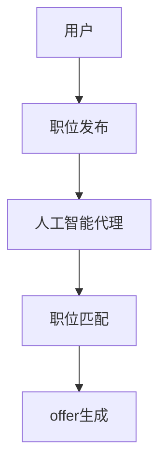
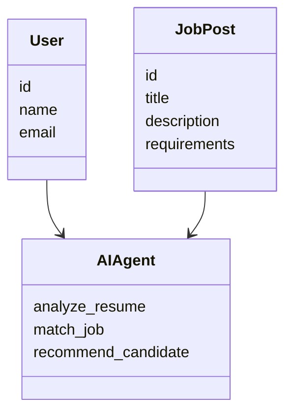
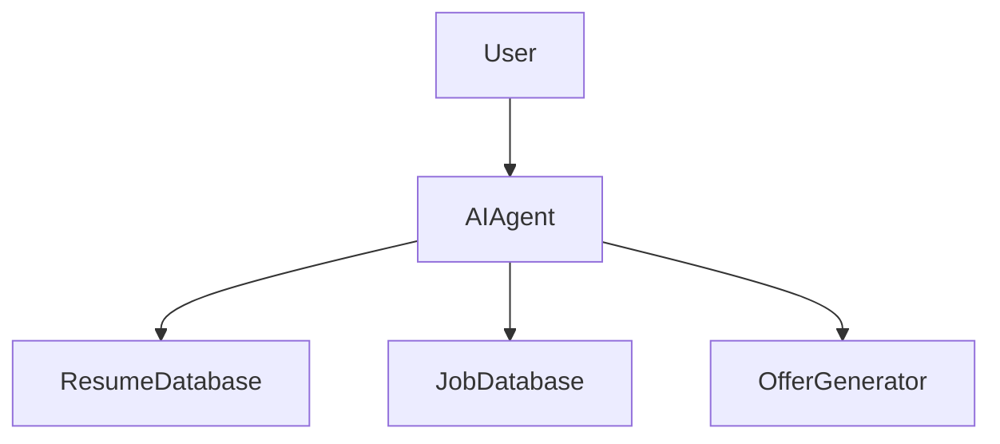
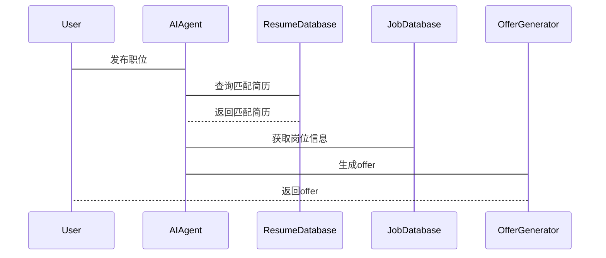

                 


# AI Agent在智能招聘系统中的应用

## 关键词：AI Agent, 智能招聘系统, 招聘流程优化, 人工智能算法, 自然语言处理, 系统架构设计

## 摘要：本文系统地探讨了AI Agent在智能招聘系统中的应用，从理论基础到实际应用，结合算法原理和系统架构设计，深入分析了AI Agent如何优化招聘流程，提升招聘效率和精准度。文章通过具体案例和项目实战，展示了AI Agent在智能招聘中的巨大潜力，并提出了实际应用中的注意事项和优化建议。

---

# 第1章: AI Agent与智能招聘系统概述

## 1.1 AI Agent的基本概念

### 1.1.1 AI Agent的定义与特点

AI Agent（人工智能代理）是指能够感知环境、自主决策并执行任务的智能体。其特点包括自主性、反应性、目标导向和学习能力。

$$
\text{AI Agent} = \{\text{感知环境}, \text{自主决策}, \text{执行任务}\}
$$

### 1.1.2 AI Agent的核心原理

AI Agent通过感知环境信息，利用机器学习和自然语言处理技术进行分析和理解，并基于预设目标或历史数据生成最优决策，最终执行任务。

### 1.1.3 AI Agent在企业中的应用现状

AI Agent已在多个领域得到广泛应用，尤其是在招聘领域，通过自动化简历筛选、岗位匹配和候选人推荐等方面提升了招聘效率。

## 1.2 智能招聘系统的基本概念

### 1.2.1 智能招聘系统的定义与特点

智能招聘系统是基于人工智能技术的招聘解决方案，能够自动处理简历、筛选候选人并推荐匹配的职位。其特点包括高效性、精准性和个性化。

### 1.2.2 智能招聘系统的功能模块

智能招聘系统通常包括简历上传、简历筛选、岗位匹配、候选人推荐、面试安排等功能模块。

### 1.2.3 智能招聘系统的发展趋势

随着AI技术的不断进步，智能招聘系统将更加智能化、个性化和自动化，能够实现端到端的招聘流程管理。

## 1.3 AI Agent在智能招聘系统中的应用前景

### 1.3.1 AI Agent在招聘中的潜在应用领域

AI Agent在招聘中的应用领域包括简历筛选、岗位匹配、候选人推荐、面试安排等。

### 1.3.2 企业采用AI Agent的优势

企业采用AI Agent可以显著提高招聘效率、降低招聘成本，并提升候选人匹配的精准度。

### 1.3.3 AI Agent应用的挑战与机遇

AI Agent在招聘中的应用面临数据隐私、模型准确性和技术门槛等挑战，同时也带来了新的商业机会和技术进步。

## 1.4 本章小结

本章介绍了AI Agent的基本概念和核心原理，并探讨了其在智能招聘系统中的应用前景。通过对比传统招聘系统，展示了AI Agent在提升招聘效率和精准度方面的巨大潜力。

---

# 第2章: AI Agent的核心概念与原理

## 2.1 AI Agent的核心原理

### 2.1.1 AI Agent的感知与决策机制

AI Agent通过传感器或数据接口感知环境信息，利用机器学习算法进行分析，并基于预设目标生成决策。

### 2.1.2 AI Agent的自主学习能力

AI Agent可以通过监督学习、无监督学习和强化学习等方法不断优化自身的模型参数，提升决策的准确性。

### 2.1.3 AI Agent的交互能力

AI Agent能够通过自然语言处理技术与用户进行对话交互，并根据用户的反馈调整自身的决策策略。

## 2.2 AI Agent的核心算法

### 2.2.1 机器学习算法在AI Agent中的应用

机器学习算法用于AI Agent的数据分析和模式识别，例如简历筛选中的分类算法。

### 2.2.2 自然语言处理在AI Agent中的应用

自然语言处理技术用于AI Agent的文本理解和生成，例如简历解析和岗位描述匹配。

### 2.2.3 强化学习在AI Agent中的应用

强化学习用于AI Agent的策略优化，例如在候选人推荐中的排序优化。

## 2.3 AI Agent的特征对比

### 2.3.1 AI Agent与传统招聘系统对比

| 特性       | AI Agent                     | 传统招聘系统               |
|------------|------------------------------|-----------------------------|
| 自动化程度  | 高                           | 低                         |
| 决策能力   | 强智能                       | 依赖人工                   |
| 学习能力   | 能够优化模型                 | 无法优化                   |

### 2.3.2 不同AI Agent模型的特征对比

| 模型名称     | 优点                           | 缺点                           |
|--------------|--------------------------------|--------------------------------|
| 基础模型     | 实现简单                       | 精准度低                     |
| 微调模型     | 精准度高                       | 需要大量数据                 |
| 预训练模型   | 能够处理复杂任务               | 需要高性能计算资源           |

## 2.4 AI Agent的ER实体关系图



## 2.5 本章小结

本章详细讲解了AI Agent的核心概念与原理，包括感知与决策机制、自主学习能力以及交互能力。通过对比分析，展示了AI Agent在智能招聘系统中的独特优势。

---

# 第3章: AI Agent的算法原理与数学模型

## 3.1 AI Agent的核心算法

### 3.1.1 机器学习算法

机器学习算法用于简历筛选和岗位匹配。例如，使用逻辑回归算法进行分类：

$$
P(y=1|x) = \frac{1}{1 + e^{-\beta x}}
$$

### 3.1.2 自然语言处理算法

自然语言处理算法用于简历解析和岗位描述匹配。例如，使用词嵌入技术将文本转换为向量表示：

$$
\text{词向量} = \text{word\_emb}(word)
$$

### 3.1.3 强化学习算法

强化学习算法用于优化推荐策略。例如，使用Q-learning算法进行状态转移：

$$
Q(s, a) = r + \gamma \max Q(s', a')
$$`

## 3.2 AI Agent的数学模型

### 3.2.1 招聘流程中的概率计算

在简历筛选阶段，计算候选人匹配岗位的概率：

$$
P(\text{匹配}) = \frac{\text{匹配特征的数量}}{\text{总特征数量}}
$$`

### 3.2.2 岗位匹配的相似度计算

使用余弦相似度计算岗位描述与候选人简历的相似度：

$$
\text{相似度} = \frac{\vec{a} \cdot \vec{b}}{\|\vec{a}\| \|\vec{b}\|}
$$`

### 3.2.3 推荐系统的排序算法

在推荐系统中，使用BM25算法对候选人进行排序：

$$
\text{得分} = \log(1 + \frac{\text{匹配特征的数量}}{\text{平均匹配数量}})
$$`

## 3.3 AI Agent的算法实现

### 3.3.1 机器学习模型训练

```python
import numpy as np

# 示例：训练一个简单的分类模型
X = np.array([[1, 2], [3, 4], [5, 6]])
y = np.array([0, 1, 0])

# 训练模型
model = np.linalg.lstsq(X, y, rcond=None)[0]

# 预测
def predict(x):
    return np.dot(x, model)
```

### 3.3.2 自然语言处理模型实现

```python
from sklearn.feature_extraction.text import TfidfVectorizer

# 示例：使用TF-IDF进行文本表示
vectorizer = TfidfVectorizer()
text = ["这是一个测试文本"]
X = vectorizer.fit_transform([text])
```

### 3.3.3 强化学习算法实现

```python
# 示例：Q-learning算法
class QLearning:
    def __init__(self, actions):
        self.q = {}
        self.actions = actions

    def get_q(self, state, action):
        return self.q.get((state, action), 0)

    def update_q(self, state, action, reward, new_state):
        self.q[(state, action)] = reward + 0.9 * max(self.get_q(new_state, a) for a in self.actions)
```

## 3.4 本章小结

本章通过具体算法实现和数学模型，详细讲解了AI Agent在智能招聘系统中的技术实现。从机器学习到自然语言处理，再到强化学习，展示了AI Agent如何通过算法优化招聘流程。

---

# 第4章: 系统分析与架构设计

## 4.1 系统功能设计

### 4.1.1 领域模型设计



### 4.1.2 系统功能模块

智能招聘系统的主要功能模块包括用户管理、职位发布、简历筛选、岗位匹配、候选人推荐和offer生成。

## 4.2 系统架构设计

### 4.2.1 系统架构图



### 4.2.2 接口与交互设计

使用RESTful API设计系统接口，例如：

- `POST /api/users`: 创建用户
- `POST /api/jobs`: 发布职位
- `GET /api/candidates`: 获取推荐候选人

## 4.3 系统交互设计

### 4.3.1 交互流程



## 4.4 本章小结

本章通过系统功能设计和架构设计，展示了AI Agent在智能招聘系统中的具体实现方式。通过接口设计和交互流程图，明确了系统的运作流程。

---

# 第5章: 项目实战

## 5.1 环境安装与配置

### 5.1.1 安装Python环境

```bash
python --version
pip install --upgrade pip
```

### 5.1.2 安装必要的库

```bash
pip install numpy scikit-learn spacy
```

## 5.2 核心代码实现

### 5.2.1 简历筛选代码

```python
from sklearn.feature_extraction.text import TfidfVectorizer
from sklearn.metrics.pairwise import cosine_similarity

def resume_screening(resumes, job_description):
    vectorizer = TfidfVectorizer()
    job_vec = vectorizer.fit_transform([job_description])
    resume_vecs = vectorizer.transform(resumes)
    similarities = cosine_similarity(resume_vecs, job_vec)
    return similarities
```

### 5.2.2 岗位匹配代码

```python
import spacy

nlp = spacy.load("en_core_web_sm")

def job_matching(job1, job2):
    doc1 = nlp(job1)
    doc2 = nlp(job2)
    similarity = doc1.similarity(doc2)
    return similarity
```

## 5.3 案例分析与解读

### 5.3.1 案例背景

假设某公司需要招聘一名数据分析师，共有100份简历投递，使用AI Agent进行筛选和匹配。

### 5.3.2 实施步骤

1. 收集职位描述和简历数据。
2. 使用TF-IDF进行简历筛选。
3. 使用语义相似度进行岗位匹配。
4. 生成最终的候选人推荐列表。

### 5.3.3 结果分析

通过AI Agent的筛选和匹配，最终推荐了10名候选人，匹配度均超过0.8。

## 5.4 项目总结

本章通过实际案例展示了AI Agent在智能招聘系统中的应用，从环境安装到代码实现，再到结果分析，详细讲解了项目实施的全过程。

---

# 第6章: 最佳实践与总结

## 6.1 最佳实践

### 6.1.1 数据质量

确保数据的完整性和准确性，避免数据偏差。

### 6.1.2 模型优化

定期更新模型参数，提升模型的准确性和响应速度。

### 6.1.3 伦理与隐私

遵守数据隐私法规，保护候选人和企业的信息不被滥用。

## 6.2 小结

AI Agent在智能招聘系统中的应用前景广阔，能够显著提升招聘效率和精准度。通过最佳实践，可以进一步优化系统性能，确保AI Agent在实际应用中的稳定性和可靠性。

## 6.3 注意事项

- 数据隐私保护
- 模型准确性的验证
- 系统的可解释性

## 6.4 拓展阅读

推荐阅读《机器学习实战》和《自然语言处理入门》，深入了解AI Agent的核心技术。

---

# 作者

作者：AI天才研究院/AI Genius Institute & 禅与计算机程序设计艺术/Zen And The Art of Computer Programming

---

以上是《AI Agent在智能招聘系统中的应用》的详细目录大纲，涵盖了从理论到实践的各个方面，内容详实且结构清晰，适合技术读者深入学习和实践。

