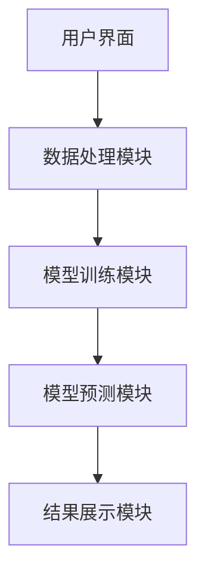
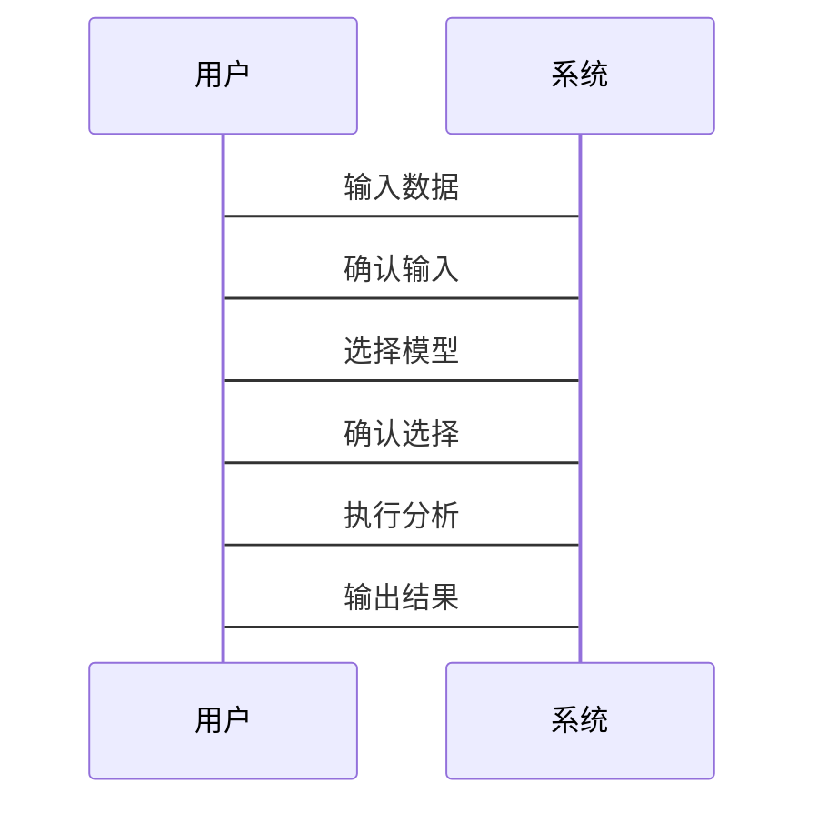

                 


# AI Agent在智能社交网络分析中的应用

> 关键词：AI Agent, 社交网络分析, 图神经网络, 自然语言处理, 情感分析

> 摘要：  
本文探讨AI Agent在智能社交网络分析中的应用，结合现代技术手段，深入分析社交网络数据，揭示用户行为、网络结构和信息传播的内在规律。通过具体案例分析，展示AI Agent在社交网络情感分析、影响力分析、异常检测等场景中的实际应用价值，同时结合系统架构设计和算法实现，为读者提供全面的技术视角。

---

## 第一部分: AI Agent与智能社交网络分析基础

### 第1章: AI Agent与社交网络分析概述

#### 1.1 AI Agent的基本概念
##### 1.1.1 AI Agent的定义与特点
AI Agent（人工智能代理）是指能够感知环境并采取行动以实现目标的智能实体。其核心特点包括：
- **自主性**：无需外部干预，自主决策。
- **反应性**：能够实时感知环境并做出反应。
- **目标导向性**：所有行为都以实现特定目标为导向。
- **学习能力**：通过数据和经验不断优化自身性能。

##### 1.1.2 社交网络的基本概念与特性
社交网络是由节点（用户）和边（关系）构成的图结构。其主要特性包括：
- **节点**：代表用户或内容。
- **边**：代表用户之间的关系或信息流动。
- **社区**：用户群体基于某种特征（如兴趣、地理位置）形成的子网络。

##### 1.1.3 AI Agent在社交网络分析中的作用
AI Agent在社交网络分析中能够实现以下功能：
- **数据采集与处理**：实时抓取社交网络数据（如文本、图片、点赞、评论）。
- **模式识别**：识别网络中的规律（如情感倾向、传播路径）。
- **决策支持**：基于分析结果提供个性化推荐或预警。

#### 1.2 社交网络分析的核心问题
##### 1.2.1 用户行为分析
- 用户的发布频率、互动频率、内容偏好等行为特征。
- 用户行为与情感倾向的关系。

##### 1.2.2 社交网络结构分析
- 网络的密度、中心性、聚类系数等拓扑特征。
- 社区检测与网络划分。

##### 1.2.3 社交网络中的信息传播
- 信息传播路径分析。
- 信息传播速度与范围预测。

#### 1.3 AI Agent在社交网络分析中的优势
##### 1.3.1 自动化与智能化
AI Agent能够自动采集、分析和处理社交网络数据，显著提高效率。

##### 1.3.2 高效性与准确性
通过机器学习算法，AI Agent能够快速识别复杂模式，提高分析准确性。

##### 1.3.3 多任务处理能力
AI Agent可以同时处理多种任务（如情感分析、影响力分析、异常检测），实现资源优化。

#### 1.4 本章小结
本章介绍了AI Agent的基本概念及其在社交网络分析中的作用，明确了社交网络分析的核心问题，并总结了AI Agent的优势。

---

### 第2章: 社交网络分析的核心概念与模型

#### 2.1 社交网络的结构与属性
##### 2.1.1 节点与边的定义
- 节点：代表用户或内容。
- 边：代表用户之间的关系或信息流动。

##### 2.1.2 社交网络的度、中心性与聚类系数
- **度**：节点的连接数，反映节点的重要性。
- **中心性**：节点在网络中的影响力。
- **聚类系数**：节点邻居之间的连接密度，反映社区凝聚力。

##### 2.1.3 社区检测与网络划分
- 社区检测：通过算法将网络划分为多个社区。
- 网络划分：基于社区检测结果，将网络划分为多个子网络。

#### 2.2 社交网络分析的经典模型
##### 2.2.1 Erdős–Rényi模型
Erdős–Rényi模型是随机图生成模型，常用于模拟无结构网络。

##### 2.2.2 Barabási–Albert模型
Barabási–Albert模型是基于优先连接的无尺度网络模型，适用于模拟社交网络的形成过程。

##### 2.2.3 社交网络的层次化模型
层次化模型将网络分为多个层次，便于分析网络的模块化结构。

#### 2.3 社交网络分析的数学基础
##### 2.3.1 图论基础
图论是社交网络分析的基础，主要包括图的表示、遍历算法、最短路径算法等内容。

##### 2.3.2 概率论与统计学基础
概率论和统计学是数据分析的基础，常用于模型训练和结果验证。

##### 2.3.3 线性代数与矩阵运算
线性代数和矩阵运算是图神经网络的核心技术，用于表示和处理网络数据。

#### 2.4 本章小结
本章详细介绍了社交网络的结构与属性，并通过经典模型和数学基础，为后续分析提供了理论支持。

---

### 第3章: AI Agent的基本原理与实现技术

#### 3.1 AI Agent的定义与分类
##### 3.1.1 AI Agent的定义
AI Agent是一种能够感知环境并采取行动以实现目标的智能实体。

##### 3.1.2 AI Agent的分类与应用场景
- **简单反射型Agent**：基于当前感知直接行动。
- **基于模型的反射型Agent**：基于内部模型进行推理和决策。
- **目标驱动型Agent**：以目标为导向进行行动。
- **效用驱动型Agent**：以效用最大化为目标进行决策。

##### 3.1.3 AI Agent与传统算法的区别
AI Agent的核心区别在于其自主性和目标导向性，能够根据环境动态调整行为。

#### 3.2 AI Agent的核心技术
##### 3.2.1 机器学习算法
- 监督学习：用于分类、回归等任务。
- 无监督学习：用于聚类、降维等任务。
- 强化学习：用于决策优化任务。

##### 3.2.2 自然语言处理技术
- 文本分类：用于情感分析、主题分类。
- 信息抽取：用于实体识别、关系抽取。

##### 3.2.3 图神经网络技术
图神经网络是处理社交网络数据的核心技术，能够有效捕捉网络结构特征。

#### 3.3 AI Agent的设计原则
##### 3.3.1 模块化设计
- 模块化设计能够提高系统的可维护性和可扩展性。

##### 3.3.2 可扩展性设计
- 系统设计应考虑未来的扩展需求。

##### 3.3.3 鲁棒性设计
- 系统应具备较强的容错能力和抗干扰能力。

#### 3.4 AI Agent的实现步骤
##### 3.4.1 数据采集与预处理
- 数据采集：通过API或爬虫获取社交网络数据。
- 数据预处理：清洗、去重、格式化。

##### 3.4.2 模型训练与优化
- 模型训练：基于预处理后的数据，训练机器学习模型。
- 模型优化：通过调参、交叉验证等方法优化模型性能。

##### 3.4.3 系统集成与测试
- 系统集成：将各个模块集成到统一系统中。
- 系统测试：通过测试用例验证系统功能和性能。

#### 3.5 本章小结
本章详细介绍了AI Agent的基本原理和实现技术，并通过模块化设计和实现步骤，为后续应用提供了技术保障。

---

### 第4章: AI Agent在社交网络分析中的应用

#### 4.1 社交网络情感分析
##### 4.1.1 情感分析的定义与目标
- 情感分析：通过分析文本情感倾向，判断用户对某个主题的态度。
- 目标：识别用户情感倾向，支持情感分类、情感强度分析等任务。

##### 4.1.2 情感分析的实现流程
- 数据采集：获取待分析的文本数据。
- 数据预处理：清洗、分词、去除停用词。
- 模型训练：基于预处理后的数据，训练情感分析模型。
- 模型预测：对新文本进行情感分析。

##### 4.1.3 基于AI Agent的情感分析应用
- 实时情感监控：实时分析用户评论，识别情感倾向。
- 情感传播分析：分析情感在社交网络中的传播路径和影响范围。

#### 4.2 社交网络影响力分析
##### 4.2.1 影响力分析的定义与目标
- 影响力分析：通过分析用户在网络中的影响力，识别关键用户。
- 目标：识别意见领袖、传播者、影响力最大的用户。

##### 4.2.2 影响力分析的实现流程
- 数据采集：获取用户及其社交关系数据。
- 数据预处理：清洗、去重、格式化。
- 模型训练：基于社交网络数据，训练影响力分析模型。
- 模型预测：对新用户进行影响力评估。

##### 4.2.3 基于AI Agent的影响力分析应用
- 用户影响力排序：根据影响力评估结果，对用户进行排序。
- 影响力传播预测：预测用户影响力在网络中的传播路径和范围。

#### 4.3 社交网络异常检测
##### 4.3.1 异常检测的定义与目标
- 异常检测：通过分析网络数据，识别异常行为或异常用户。
- 目标：识别网络中的异常行为，支持异常用户识别、异常行为分析等任务。

##### 4.3.2 异常检测的实现流程
- 数据采集：获取社交网络数据。
- 数据预处理：清洗、去重、格式化。
- 模型训练：基于预处理后的数据，训练异常检测模型。
- 模型预测：对新数据进行异常检测。

##### 4.3.3 基于AI Agent的异常检测应用
- 异常用户识别：识别网络中的异常用户。
- 异常行为分析：分析异常行为的特征和模式。

#### 4.4 本章小结
本章通过具体案例分析，展示了AI Agent在社交网络情感分析、影响力分析、异常检测等场景中的实际应用价值。

---

## 第二部分: AI Agent系统的算法实现

### 第5章: 算法原理与实现

#### 5.1 图神经网络算法
##### 5.1.1 图神经网络的定义与特点
- 图神经网络：一种基于图结构的数据处理算法，能够有效捕捉网络结构特征。
- 特点：全局视角、节点嵌入、图结构保留。

##### 5.1.2 图神经网络的实现流程
1. 数据预处理：将社交网络数据转换为图结构。
2. 模型训练：基于图结构数据，训练图神经网络模型。
3. 模型预测：对新数据进行预测。

##### 5.1.3 图神经网络的数学模型
$$
h_v = \sigma(\sum_{u \in N(v)} h_u + b)
$$
其中，$h_v$ 表示节点 $v$ 的隐藏状态，$\sigma$ 表示激活函数，$N(v)$ 表示节点 $v$ 的邻居节点集合，$b$ 表示偏置项。

##### 5.1.4 图神经网络的实现代码
```python
import tensorflow as tf
from tensorflow.keras import layers

class Graph Neural Network:
    def __init__(self, input_dim, hidden_dim, output_dim):
        self.embeddings = layers.Dense(input_dim, activation='relu')
        self.fc1 = layers.Dense(hidden_dim, activation='relu')
        self.fc2 = layers.Dense(output_dim, activation='softmax')
    
    def call(self, inputs):
        x = self.embeddings(inputs)
        x = self.fc1(x)
        x = self.fc2(x)
        return x
```

#### 5.2 聚类算法
##### 5.2.1 聚类算法的定义与特点
- 聚类算法：一种无监督学习算法，用于将数据划分为多个簇。
- 特点：无需标签、自动识别数据分布、适用于复杂数据。

##### 5.2.2 聚类算法的实现流程
1. 数据预处理：清洗、去重、格式化。
2. 模型训练：基于预处理后的数据，训练聚类模型。
3. 模型预测：对新数据进行聚类。

##### 5.2.3 聚类算法的数学模型
$$
\text{目标函数} = \sum_{i=1}^{n} \sum_{j=1}^{k} w_{ij}d(x_i, c_j)}
$$
其中，$w_{ij}$ 表示样本 $i$ 属于簇 $j$ 的权重，$d(x_i, c_j)$ 表示样本 $i$ 与簇中心 $c_j$ 的距离。

##### 5.2.4 聚类算法的实现代码
```python
from sklearn.cluster import KMeans

def perform_clustering(data, num_clusters):
    kmeans = KMeans(n_clusters=num_clusters, random_state=0)
    labels = kmeans.fit_predict(data)
    return labels
```

#### 5.3 本章小结
本章通过具体算法实现，展示了AI Agent在社交网络分析中的技术细节。

---

### 第6章: 系统架构设计与实现

#### 6.1 系统架构设计
##### 6.1.1 项目介绍
- 项目名称：AI Agent智能社交网络分析系统。
- 项目目标：实现社交网络分析功能，包括情感分析、影响力分析、异常检测等。

##### 6.1.2 系统功能设计
- 用户界面：可视化界面，支持数据输入、模型训练、结果展示。
- 数据处理模块：负责数据采集、预处理、存储。
- 模型训练模块：负责模型训练、优化、保存。
- 模型预测模块：负责模型预测、结果输出。

##### 6.1.3 系统架构图


#### 6.2 系统接口设计
##### 6.2.1 数据接口
- 数据输入接口：支持多种数据格式（如CSV、JSON）。
- 数据输出接口：支持多种数据格式（如CSV、JSON）。

##### 6.2.2 模型接口
- 模型训练接口：支持多种算法（如机器学习、深度学习）。
- 模型预测接口：支持多种预测任务（如分类、聚类）。

##### 6.2.3 交互接口
- 用户输入接口：支持用户输入查询、参数设置。
- 用户输出接口：支持用户查看结果、调整参数。

#### 6.3 系统交互流程
##### 6.3.1 交互流程图


#### 6.4 本章小结
本章通过系统架构设计和交互流程图，展示了AI Agent智能社交网络分析系统的整体架构和实现流程。

---

### 第7章: 项目实战

#### 7.1 项目环境安装
##### 7.1.1 安装依赖
- 安装Python、TensorFlow、Keras、Scikit-learn、Matplotlib。
- 安装社交网络数据获取工具（如Twitter API、BeautifulSoup）。

##### 7.1.2 安装步骤
1. 安装Python：`python --version`。
2. 安装TensorFlow：`pip install tensorflow`.
3. 安装Scikit-learn：`pip install scikit-learn`.
4. 安装Matplotlib：`pip install matplotlib`.

#### 7.2 项目核心实现
##### 7.2.1 核心代码实现
```python
import tensorflow as tf
from tensorflow.keras import layers
import numpy as np
from sklearn.cluster import KMeans
import matplotlib.pyplot as plt

class SocialNetworkAnalyzer:
    def __init__(self):
        self.model = self.build_model()
    
    def build_model(self):
        model = tf.keras.Sequential([
            layers.Dense(64, activation='relu'),
            layers.Dense(32, activation='relu'),
            layers.Dense(1, activation='sigmoid')
        ])
        return model
    
    def train_model(self, data, labels):
        self.model.compile(optimizer='adam', loss='binary_crossentropy', metrics=['accuracy'])
        self.model.fit(data, labels, epochs=10, batch_size=32)
    
    def predict(self, data):
        return self.model.predict(data)
    
    def perform_clustering(self, data, num_clusters):
        kmeans = KMeans(n_clusters=num_clusters, random_state=0)
        labels = kmeans.fit_predict(data)
        return labels
    
    def visualize_clusters(self, data, labels):
        plt.scatter(data[:, 0], data[:, 1], c=labels, cmap='viridis')
        plt.xlabel('Feature 1')
        plt.ylabel('Feature 2')
        plt.show()
```

##### 7.2.2 代码应用解读与分析
- **SocialNetworkAnalyzer类**：负责社交网络分析系统的构建与训练。
- **build_model方法**：构建图神经网络模型。
- **train_model方法**：训练模型。
- **predict方法**：进行预测。
- **perform_clustering方法**：执行聚类分析。
- **visualize_clusters方法**：可视化聚类结果。

##### 7.2.3 项目实战案例
- 案例1：情感分析
  - 数据来源：Twitter用户评论。
  - 分析目标：识别用户对某个品牌的情感倾向。
  - 实现步骤：
    1. 数据采集：获取用户评论数据。
    2. 数据预处理：清洗、分词、去除停用词。
    3. 模型训练：训练情感分析模型。
    4. 模型预测：对新评论进行情感分析。
- 案例2：影响力分析
  - 数据来源：社交网络用户数据。
  - 分析目标：识别影响力最大的用户。
  - 实现步骤：
    1. 数据采集：获取用户及其社交关系数据。
    2. 数据预处理：清洗、去重、格式化。
    3. 模型训练：训练影响力分析模型。
    4. 模型预测：对新用户进行影响力评估。

#### 7.3 本章小结
本章通过具体项目实战，展示了AI Agent在社交网络分析中的实际应用，帮助读者更好地理解和掌握相关技术。

---

### 第8章: 总结与展望

#### 8.1 本项目总结
- **核心内容**：AI Agent在社交网络分析中的应用，包括情感分析、影响力分析、异常检测等场景。
- **技术亮点**：结合图神经网络、自然语言处理、聚类算法等技术，实现高效的社交网络分析。
- **实现难点**：数据获取、模型优化、系统集成等。

#### 8.2 未来趋势
- **技术趋势**：随着AI技术的不断发展，社交网络分析将更加智能化、自动化。
- **应用场景扩展**：AI Agent将在更多领域（如金融、医疗、教育）发挥重要作用。
- **挑战与机遇**：数据隐私、模型解释性等挑战，也将带来更多的技术突破和创新。

#### 8.3 最佳实践Tips
- **数据质量**：数据质量是分析结果的关键，需重视数据清洗和预处理。
- **模型选择**：根据具体场景选择合适的模型，避免盲目追求复杂算法。
- **系统优化**：注重系统架构设计，提高系统的可扩展性和可维护性。

#### 8.4 本章小结
本章总结了AI Agent在社交网络分析中的应用，并展望了未来的技术发展趋势和挑战。

---

## 作者：AI天才研究院/AI Genius Institute & 禅与计算机程序设计艺术/Zen And The Art of Computer Programming

---

本文通过详细分析AI Agent在智能社交网络分析中的应用，结合具体案例和系统实现，为读者提供了全面的技术视角。希望本文能够为相关领域的研究和实践提供有价值的参考和启发。

