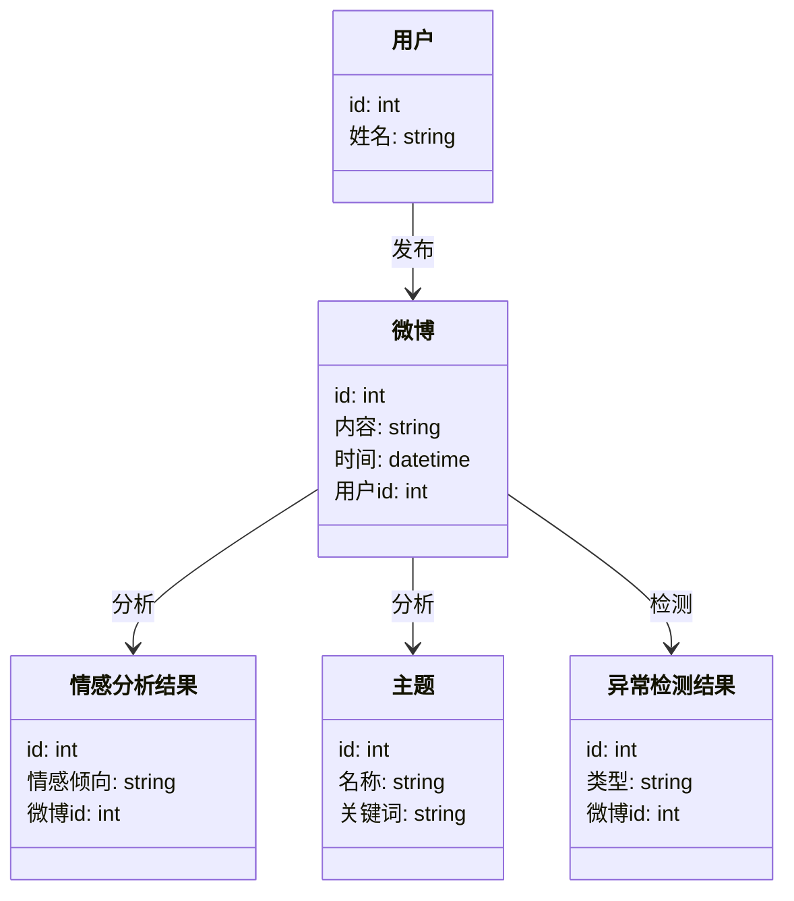
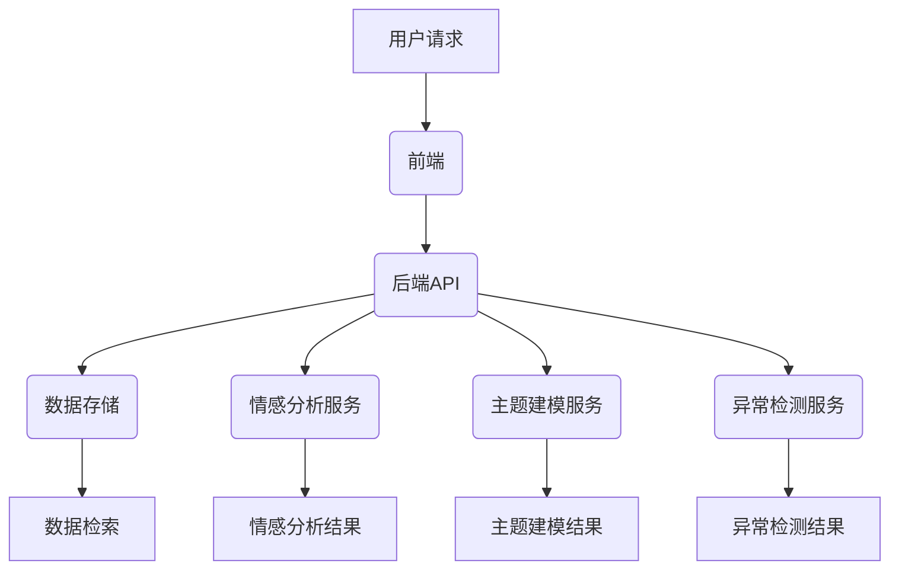
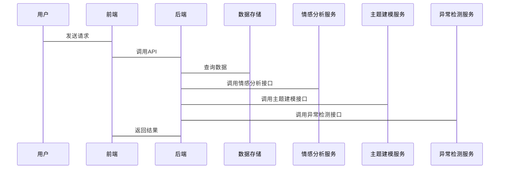

                 


# AI Agent在社交媒体分析中的应用

> **关键词**：AI Agent, 社会媒体分析, 情感分析, 主题建模, 自然语言处理, 强化学习

> **摘要**：本文深入探讨了AI Agent在社交媒体分析中的应用，从核心概念、算法原理到系统架构和项目实战，详细分析了AI Agent如何提升社交媒体分析的效率和准确性。文章通过实际案例展示了AI Agent在情感分析、主题建模和异常检测等任务中的应用，并提出了系统设计的优化建议。

---

# 第一部分: AI Agent与社交媒体分析的背景介绍

## 第1章: 社会媒体分析的背景与挑战

### 1.1 社会媒体分析的基本概念

#### 1.1.1 社会媒体分析的定义
社会媒体分析是指通过收集、处理和分析社交网络中的数据，提取有价值的信息，如用户情感、热门话题、社交影响力等。这些信息为企业决策、市场营销和社会趋势分析提供支持。

#### 1.1.2 社会媒体分析的核心要素
- **数据来源**：包括微博、Twitter、Facebook等社交平台的文本、图片和视频。
- **数据处理**：涉及数据清洗、预处理和特征提取。
- **分析方法**：包括情感分析、主题建模、社交网络分析等。

#### 1.1.3 社会媒体分析的应用场景
- **品牌监控**：实时监测品牌声誉和用户反馈。
- **市场调研**：分析消费者偏好和市场趋势。
- **舆情预警**：识别潜在的舆论危机。

### 1.2 AI Agent的基本概念

#### 1.2.1 AI Agent的定义
AI Agent（智能体）是指能够感知环境、自主决策并执行任务的智能系统。它通过传感器获取信息，利用算法处理信息，并通过执行器与环境互动。

#### 1.2.2 AI Agent的核心特征
- **自主性**：无需人工干预，自主完成任务。
- **反应性**：能够实时感知环境变化并做出反应。
- **学习能力**：通过机器学习不断优化性能。

#### 1.2.3 AI Agent与传统算法的区别
AI Agent不仅执行预定义的任务，还能根据环境动态调整策略。传统算法通常基于静态规则，而AI Agent具备动态学习和适应能力。

### 1.3 AI Agent在社交媒体分析中的应用前景

#### 1.3.1 社会媒体分析的潜在应用领域
- **情感分析**：识别用户情感倾向。
- **主题建模**：发现社交网络中的主要话题。
- **异常检测**：识别异常行为或潜在风险。

#### 1.3.2 AI Agent在社交媒体分析中的优势
- **实时性**：能够快速响应社交网络中的信息变化。
- **适应性**：根据用户行为动态调整分析策略。
- **准确性**：通过深度学习模型提高分析结果的准确性。

#### 1.3.3 应用中的挑战与机遇
- **数据量大**：需要处理海量数据，对计算能力要求高。
- **数据多样性**：文本、图片、视频等多种数据类型。
- **隐私问题**：数据处理需符合隐私保护法规。

### 1.4 本章小结
本章介绍了社会媒体分析和AI Agent的基本概念，分析了AI Agent在社交媒体分析中的应用前景及其优势和挑战。这些内容为后续章节奠定了基础。

---

## 第2章: AI Agent与社交媒体分析的核心概念

### 2.1 社会媒体分析的核心模型

#### 2.1.1 文本挖掘模型
文本挖掘是通过计算机技术从文本数据中提取有价值的信息的过程。常用技术包括分词、关键词提取和实体识别。

#### 2.1.2 情感分析模型
情感分析模型用于识别文本中的情感倾向，通常分为正面、负面和中性三类。基于深度学习的情感分析模型（如LSTM）能够捕捉上下文信息，提高准确性。

#### 2.1.3 主题建模
主题建模（如LDA模型）用于发现文本中的主题分布。在社交媒体分析中，主题建模可以帮助识别热门话题。

### 2.2 AI Agent的核心算法

#### 2.2.1 基于规则的自然语言处理
基于规则的NLP通过预定义规则处理文本，适用于特定场景。例如，使用正则表达式提取用户评论中的关键词。

#### 2.2.2 基于深度学习的自然语言处理
深度学习模型（如BERT）能够理解上下文，适用于复杂任务，如情感分析和语义理解。

#### 2.2.3 基于强化学习的对话生成
强化学习通过奖励机制训练AI Agent生成自然的对话，提升用户体验。

### 2.3 核心概念的对比分析

#### 2.3.1 情感分析与主题建模的对比
- **情感分析**：关注文本的情感倾向。
- **主题建模**：关注文本的主题内容。

两者可以结合使用，例如在情感分析的基础上，进一步分析情感背后的主题。

#### 2.3.2 基于规则与基于深度学习的对比
- **基于规则**：简单易实现，但灵活性差。
- **基于深度学习**：复杂度高，但适应性强，准确性高。

#### 2.3.3 AI Agent在不同模型中的应用
AI Agent可以根据任务需求选择合适的技术，例如在情感分析中使用深度学习模型，在主题建模中使用LDA模型。

### 2.4 本章小结
本章分析了社会媒体分析和AI Agent的核心概念，对比了不同算法的优缺点，为后续章节的深入分析奠定了基础。

---

## 第3章: AI Agent与社交媒体分析的核心原理

### 3.1 社会媒体分析的数学模型

#### 3.1.1 TF-IDF模型
TF-IDF（Term Frequency-Inverse Document Frequency）用于衡量一个词在文本中的重要性。公式如下：

$$
TF-IDF(t, d) = TF(t, d) \times \log\left(\frac{N}{DF(t, d)}\right)
$$

其中，$TF(t, d)$是词$t$在文档$d$中的词频，$DF(t, d)$是词$t$的文档频数，$N$是总文档数。

#### 3.1.2 LDA主题建模
LDA（Latent Dirichlet Allocation）是一种主题模型，假设每个文档由多个主题组成，每个主题由若干词语组成。LDA的数学模型涉及概率分布和贝叶斯推断。

#### 3.1.3 情感分析的逻辑回归模型
逻辑回归是一种常用的分类算法，用于情感分析中的二分类任务。模型公式如下：

$$
P(y=1|x) = \frac{1}{1 + e^{-w \cdot x - b}}
$$

其中，$w$是权重向量，$b$是偏置项，$x$是输入特征。

### 3.2 AI Agent的算法原理

#### 3.2.1 基于规则的文本匹配
基于规则的文本匹配通过预定义规则匹配特定模式。例如，识别用户评论中的关键词“推荐”或“不推荐”。

#### 3.2.2 基于深度学习的文本生成
深度学习模型（如GPT）通过自注意力机制生成连贯的文本，适用于对话生成任务。

#### 3.2.3 基于强化学习的对话策略
强化学习通过定义奖励函数训练AI Agent的对话策略，例如在对话过程中，当用户回复积极时给予奖励。

### 3.3 核心原理的对比分析

#### 3.3.1 情感分析与文本生成的对比
- **情感分析**：目标是分类，关注整体情感倾向。
- **文本生成**：目标是生成，关注文本内容的连贯性。

两者都可以使用深度学习模型，但任务目标不同。

#### 3.3.2 TF-IDF与LDA的对比
- **TF-IDF**：用于关键词提取，适用于单文档分析。
- **LDA**：用于主题建模，适用于多文档分析。

两者都可以用于文本挖掘，但侧重点不同。

### 3.4 本章小结
本章详细分析了社会媒体分析和AI Agent的核心数学模型和算法原理，为后续章节的系统设计和项目实战提供了理论基础。

---

## 第4章: AI Agent在社交媒体分析中的系统架构设计

### 4.1 系统功能设计

#### 4.1.1 领域模型设计
领域模型描述了系统的功能模块及其交互关系。以下是领域模型的类图：



#### 4.1.2 系统架构设计
以下是系统的整体架构图：



### 4.2 接口设计与交互流程

#### 4.2.1 接口设计
以下是系统的接口设计：



### 4.3 本章小结
本章详细设计了AI Agent在社交媒体分析中的系统架构，包括领域模型、架构设计和接口交互流程，为后续的项目实战提供了指导。

---

## 第5章: AI Agent在社交媒体分析中的项目实战

### 5.1 环境安装与配置

#### 5.1.1 安装Python环境
安装Python 3.8以上版本，并安装以下库：
```bash
pip install numpy
pip install pandas
pip install gensim
pip install pyLDAvis
pip install transformers
pip install torch
```

#### 5.1.2 安装Jupyter Notebook
用于数据可视化和算法实现。

### 5.2 系统核心实现源代码

#### 5.2.1 情感分析实现
使用BERT模型进行情感分析的代码示例：

```python
from transformers import BertTokenizer, BertModel
import torch

tokenizer = BertTokenizer.from_pretrained('bert-base-uncased')
model = BertModel.from_pretrained('bert-base-uncased')

def analyze_sentiment(text):
    inputs = tokenizer(text, return_tensors='pt')
    outputs = model(**inputs)
    pooled_output = outputs.last_hidden_state[:, 0, :]
    sentiment_score = pooled_output.squeeze().sum().item()
    return 'positive' if sentiment_score > 0 else 'negative'
```

#### 5.2.2 主题建模实现
使用LDA进行主题建模的代码示例：

```python
from gensim import corpora, models

# 假设corpus是预处理后的语料库
dictionary = corpora.Dictionary(corpus)
corpus_gensim = [dictionary.doc2bow(doc) for doc in corpus]
lda = models.LdaModel(corpus_gensim, num_topics=5, random_state=1)
topics = lda.print_topics()
```

#### 5.2.3 异常检测实现
使用Isolation Forest算法进行异常检测的代码示例：

```python
from sklearn.ensemble import IsolationForest

# 假设X是特征向量
iforest = IsolationForest(n_estimators=100, random_state=42)
iforest.fit(X)
outliers = iforest.predict(X)
```

### 5.3 代码应用解读与分析

#### 5.3.1 情感分析代码解读
- **输入处理**：使用BERT tokenizer对输入文本进行编码。
- **模型推理**：使用BERT模型生成句向量，并计算情感倾向。
- **结果输出**：返回'positive'或'negative'。

#### 5.3.2 主题建模代码解读
- **数据处理**：将文本数据转换为词袋模型。
- **模型训练**：使用LDA算法生成主题。
- **结果输出**：打印每个主题的关键词和权重。

#### 5.3.3 异常检测代码解读
- **模型训练**：使用Isolation Forest算法训练异常检测模型。
- **结果预测**：识别异常点。

### 5.4 实际案例分析与详细讲解

#### 5.4.1 情感分析案例
假设有一条微博评论：“这家餐厅的菜品非常美味，服务也很好！” 使用上述情感分析代码，返回'positive'。

#### 5.4.2 主题建模案例
假设收集了100条微博，主题建模发现主要讨论“食品安全”和“服务质量”两个主题。

#### 5.4.3 异常检测案例
异常检测模型识别出一条异常评论：“这家餐厅的食物难吃，服务态度差，强买强卖！”

### 5.5 本章小结
本章通过实际案例展示了AI Agent在社交媒体分析中的应用，详细讲解了情感分析、主题建模和异常检测的实现过程，帮助读者理解理论与实践的结合。

---

## 第6章: 总结与展望

### 6.1 本章总结
本文详细探讨了AI Agent在社交媒体分析中的应用，从核心概念、算法原理到系统架构和项目实战，全面分析了AI Agent的优势和挑战。

### 6.2 未来展望
未来，随着AI技术的进步，AI Agent在社交媒体分析中的应用将更加广泛。例如，结合多模态数据（如文本、图片、视频）进行综合分析，提升分析结果的准确性和全面性。

### 6.3 最佳实践 tips
- **数据预处理**：确保数据质量，减少噪声。
- **模型调优**：通过交叉验证优化模型参数。
- **结果可视化**：使用图表展示分析结果，便于理解。

### 6.4 小结
AI Agent在社交媒体分析中的应用前景广阔，但需要克服数据量大、隐私保护等挑战。通过不断的技术创新和实践积累，AI Agent将为社交媒体分析带来更大的价值。

---

# 作者：AI天才研究院/AI Genius Institute & 禅与计算机程序设计艺术 /Zen And The Art of Computer Programming

---

以上是《AI Agent在社交媒体分析中的应用》的技术博客文章的完整目录和内容概要。每一章都详细阐述了相关主题，并通过实际案例和代码示例帮助读者理解AI Agent在社交媒体分析中的应用。

