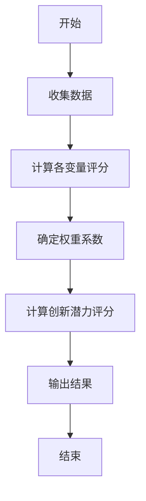
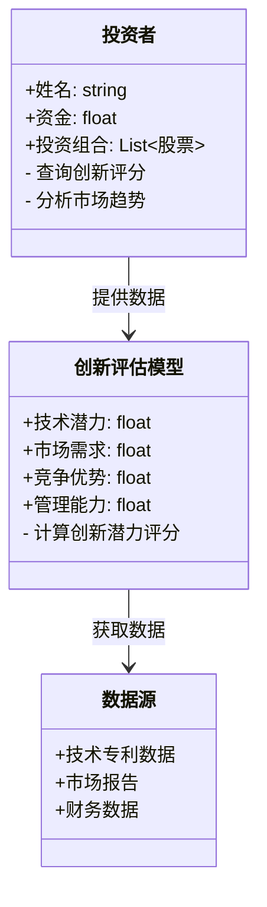
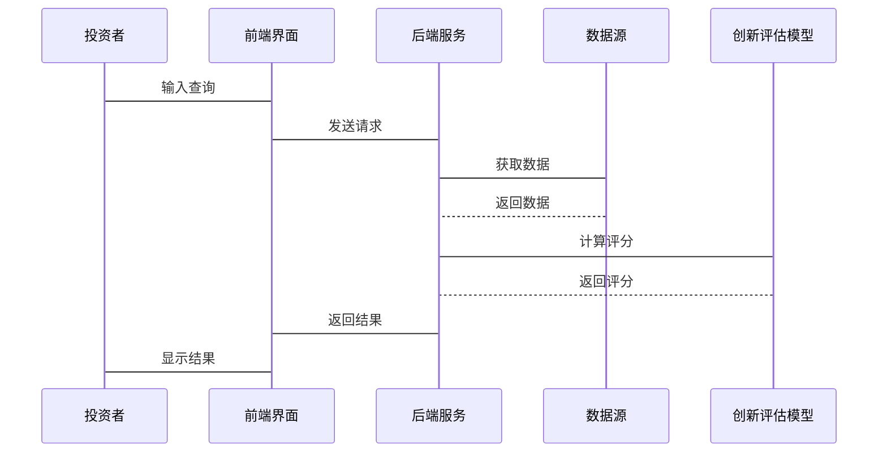

                 


# 价值投资中的颠覆性创新识别

## 关键词：价值投资, 颠覆性创新, 创新识别, 数学模型, 投资策略

## 摘要：本文深入探讨了在价值投资中识别颠覆性创新的关键方法。通过分析技术、市场和创业者的多维度视角，构建了创新评估模型，并结合数学算法和系统架构设计，为投资者提供科学的决策支持，帮助他们在市场中捕捉到真正的颠覆性机会，实现超额收益。

---

## 第一部分: 价值投资中的颠覆性创新识别基础

## 第1章: 价值投资与颠覆性创新概述

### 1.1 价值投资的起源与发展

#### 1.1.1 价值投资的核心理念
价值投资是一种以基本面分析为基础的投资策略，强调以低于内在价值的价格购买优质资产。其核心理念包括长期投资、安全边际和市场有效性的质疑。通过分析公司的财务状况、行业地位和管理团队，价值投资者寻找被市场低估的投资标的。

#### 1.1.2 价值投资的历史演变
价值投资由本杰明·格雷厄姆在20世纪初提出，经过多位大师如菲利普·费雪和沃伦·巴菲特的发展，逐渐成为投资领域的重要流派。其理论在实践中不断丰富，从最初的低市盈率、低市净率策略，发展到如今的内在价值评估和竞争优势分析。

#### 1.1.3 价值投资在现代投资中的地位
在现代投资组合理论和行为金融学的背景下，价值投资依然占据重要地位。它强调长期视角和基本面分析，帮助投资者在市场波动中保持理性，捕捉结构性的机会。

### 1.2 颠覆性创新的定义与特征

#### 1.2.1 颠覆性创新的定义
颠覆性创新是指引入一种新的技术或商业模式，能够在市场中创造出一个新的市场或者显著改变现有市场的竞争结构。它通常以更低的成本、更高的性能或更便捷的方式满足用户需求。

#### 1.2.2 颠覆性创新的核心特征
- **低成本**：通过技术创新或商业模式优化降低成本，使产品或服务更具价格竞争力。
- **高性能**：提供远超现有产品的性能，满足用户未被充分满足的需求。
- **高便捷性**：通过新的商业模式或技术手段，提升用户体验，降低使用门槛。

#### 1.2.3 颠覆性创新与延续性创新的区别
延续性创新是对现有产品或服务的改进，旨在提高性能或降低成本，而颠覆性创新则创造新的市场或破坏现有市场结构，通常针对非主流市场的需求。

### 1.3 价值投资与颠覆性创新的结合

#### 1.3.1 颠覆性创新在价值投资中的重要性
在价值投资中，识别颠覆性创新可以帮助投资者发现那些能够改变行业格局的企业，这些企业往往具有长期的增长潜力和竞争优势。

#### 1.3.2 颠覆性创新如何创造投资机会
颠覆性创新通常出现在新兴行业或技术前沿领域，这些领域的早期企业可能被市场低估，为价值投资者提供了买入的机会。

#### 1.3.3 颠覆性创新识别的挑战与机遇
识别颠覆性创新需要投资者具备前瞻性思维和深入的行业分析能力，但一旦成功识别，往往能够带来超额收益。

---

## 第2章: 颠覆性创新的识别方法

### 2.1 技术分析视角

#### 2.1.1 技术发展的周期性分析
技术发展通常经历萌芽期、成长期、成熟期和衰退期。在萌芽期，新技术可能具有颠覆性潜力，而在成熟期，技术创新可能趋于延续性。

#### 2.1.2 技术成熟度评估
通过评估技术的成熟度和商业化潜力，判断其是否具备颠覆性创新的特征。例如，评估技术是否解决了现有产品的痛点，是否具有规模化生产的可行性。

#### 2.1.3 技术颠覆性潜力的量化指标
可以通过专利数量、研发投入强度、技术壁垒高度等指标量化技术的颠覆性潜力。

### 2.2 市场分析视角

#### 2.2.1 市场需求的变化趋势
分析市场对新技术或新模式的需求变化，判断是否存在未被满足的市场需求，这些需求往往成为颠覆性创新的突破口。

#### 2.2.2 市场渗透率分析
通过分析新技术或新模式的市场渗透率，判断其是否正在或即将改变市场结构。

#### 2.2.3 竞争格局的演变
研究行业内的竞争格局，观察是否有新兴企业通过颠覆性创新改变竞争态势。

### 2.3 创业者视角

#### 2.3.1 创业者的动机与目标
了解创业者的背景和动机，判断他们是否具备颠覆现有市场的雄心和能力。

#### 2.3.2 创业团队的能力评估
评估创业团队的技术背景、行业经验和执行能力，这些因素是颠覆性创新成功的关键。

#### 2.3.3 创业公司的市场定位
分析创业公司的市场定位，判断其是否以颠覆性的方式进入市场。

---

## 第3章: 价值投资中的创新评估模型

### 3.1 创新评估模型的构建

#### 3.1.1 模型的核心要素
- 技术可行性
- 市场需求
- 经济可行性
- 竞争优势
- 管理团队

#### 3.1.2 模型的输入变量
- 技术成熟度
- 市场规模
- 成本结构
- 竞争环境
- 团队能力

#### 3.1.3 模型的输出结果
- 创新潜力评分
- 投资价值评估
- 风险分析

### 3.2 创新潜力的评估方法

#### 3.2.1 技术可行性评估
通过技术专家评审、专利分析和研发投入强度等指标评估技术的可行性。

#### 3.2.2 市场需求评估
通过市场调研、用户反馈和市场规模预测等方法评估市场需求。

#### 3.2.3 经济可行性评估
分析成本结构、收入模型和盈利能力，评估经济可行性。

### 3.3 案例分析

#### 3.3.1 某行业的颠覆性创新案例
以某新兴行业为例，分析其技术特点、市场需求和竞争优势，评估其创新潜力。

#### 3.3.2 创新评估模型的应用实例
通过具体案例，展示创新评估模型的应用过程和结果，验证模型的有效性。

---

## 第4章: 颠覆性创新识别的数学模型与算法

### 4.1 数学模型的构建

#### 4.1.1 模型的假设条件
- 各变量独立
- 数据可得性
- 市场理性

#### 4.1.2 模型的变量定义
- 技术潜力（T）
- 市场需求（M）
- 竞争优势（C）
- 管理能力（E）

#### 4.1.3 模型的数学表达式
创新潜力评分公式：
$$
IP = \alpha T + \beta M + \gamma C + \delta E
$$
其中，$\alpha, \beta, \gamma, \delta$为权重系数，满足$\alpha + \beta + \gamma + \delta = 1$。

### 4.2 算法的实现

#### 4.2.1 算法的步骤分解
1. 收集各变量数据
2. 确定权重系数
3. 计算各变量的评分
4. 综合计算创新潜力评分
5. 根据评分结果进行投资决策

#### 4.2.2 算法的流程图


#### 4.2.3 算法的实现代码
```python
def calculate_innovation_potential(tech_potential, market_demand, competitive_edge, management_capability):
    alpha = 0.3
    beta = 0.3
    gamma = 0.2
    delta = 0.2
    ip = alpha * tech_potential + beta * market_demand + gamma * competitive_edge + delta * management_capability
    return ip

tech_potential = 0.8
market_demand = 0.7
competitive_edge = 0.6
management_capability = 0.5

ip = calculate_innovation_potential(tech_potential, market_demand, competitive_edge, management_capability)
print(f"创新潜力评分为: {ip}")
```

### 4.3 模型的验证与优化

#### 4.3.1 模型的验证方法
通过历史数据验证模型的准确性，调整权重系数以提高预测精度。

#### 4.3.2 模型的优化策略
引入更多变量，如用户反馈和政策影响，优化模型结构。

#### 4.3.3 模型的局限性分析
模型假设各变量独立，实际中可能存在变量之间的相互影响，导致模型预测偏差。

---

## 第5章: 系统架构与实现方案

### 5.1 问题场景介绍
投资者需要一个系统来辅助识别颠覆性创新，优化投资决策过程。

### 5.2 系统功能设计

#### 5.2.1 领域模型（mermaid类图）


### 5.3 系统架构设计

#### 5.3.1 系统架构图
```mermaid
container 系统边界 {
    前端界面
    后端服务
    数据库
    API接口
}
```

#### 5.3.2 系统接口设计
- 前端接口：接收投资者输入，显示评估结果
- 后端接口：处理数据，调用创新评估模型
- 数据库接口：存储和检索数据

#### 5.3.3 系统交互流程图


### 5.4 系统实现细节

#### 5.4.1 环境配置
- 操作系统：Linux/Windows
- 开发工具：Python、Django框架
- 数据库：MySQL
- 开发语言：Python

#### 5.4.2 核心实现代码
```python
from django.shortcuts import render
from .models import StockData, InnovationModel

def analyze_innovation(request):
    # 获取输入数据
    tech_potential = float(request.GET.get('tech_potential', 0.5))
    market_demand = float(request.GET.get('market_demand', 0.5))
    competitive_edge = float(request.GET.get('competitive_edge', 0.5))
    management_capability = float(request.GET.get('management_capability', 0.5))

    # 计算创新潜力评分
    ip = calculate_innovation_potential(tech_potential, market_demand, competitive_edge, management_capability)

    return render(request, 'analyze_result.html', {'ip': ip})
```

---

## 第6章: 项目实战

### 6.1 环境安装

#### 6.1.1 安装Python和Django
```bash
pip install django
```

#### 6.1.2 安装其他依赖
```bash
pip install numpy matplotlib pandas
```

### 6.2 系统核心实现

#### 6.2.1 创新评估模型的实现
```python
import numpy as np

def calculate_innovation_potential(tech_potential, market_demand, competitive_edge, management_capability):
    alpha = 0.3
    beta = 0.3
    gamma = 0.2
    delta = 0.2
    ip = alpha * tech_potential + beta * market_demand + gamma * competitive_edge + delta * management_capability
    return ip

# 示例数据
tech_potential = np.array([0.6, 0.7, 0.5])
market_demand = np.array([0.5, 0.6, 0.4])
competitive_edge = np.array([0.4, 0.5, 0.3])
management_capability = np.array([0.3, 0.4, 0.2])

# 计算创新潜力评分
ip_scores = calculate_innovation_potential(tech_potential, market_demand, competitive_edge, management_capability)

print(ip_scores)
```

### 6.3 代码应用解读与分析
通过上述代码，投资者可以批量计算多个创新项目的潜力评分，辅助决策。

### 6.4 实际案例分析
以某科技公司为例，分析其技术潜力、市场需求等指标，计算创新潜力评分，评估投资价值。

### 6.5 项目小结
通过本项目，投资者能够利用系统快速评估创新潜力，优化投资决策。

---

## 第7章: 最佳实践与小结

### 7.1 投资中的注意事项
- 定期更新模型参数
- 关注市场动态和新技术发展
- 结合多种评估方法进行综合判断

### 7.2 颠覆性创新识别的未来趋势
随着人工智能和大数据技术的发展，颠覆性创新识别将更加精准和高效，投资者需要不断学习新技术，提升分析能力。

### 7.3 本书小结
本书系统地介绍了价值投资中的颠覆性创新识别方法，从理论到实践，为投资者提供了科学的决策工具和方法。

---

## 作者：AI天才研究院/AI Genius Institute & 禅与计算机程序设计艺术 /Zen And The Art of Computer Programming

---

通过以上内容，本文系统地阐述了价值投资中识别颠覆性创新的方法，从理论分析到实践应用，为投资者提供了全面的指导。希望读者能够通过本文，提升在投资中的洞察力和决策能力。

