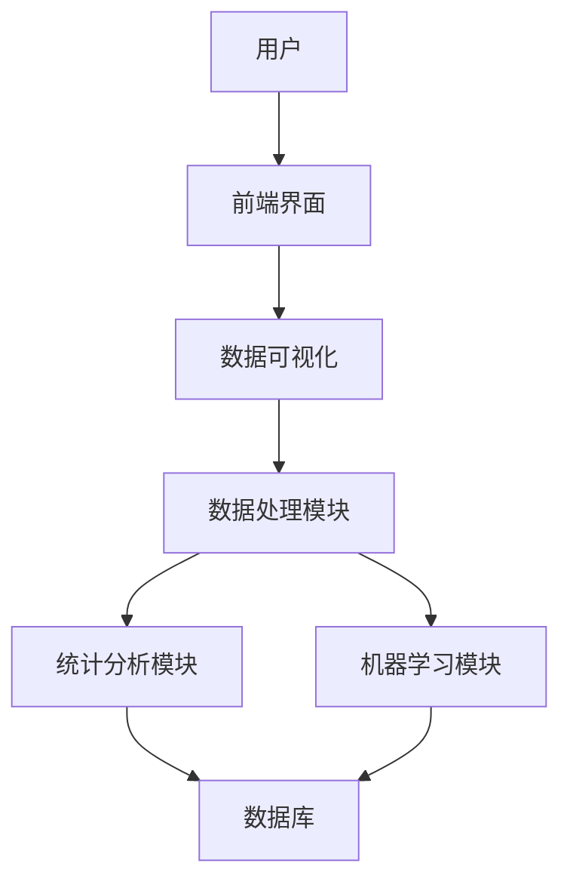
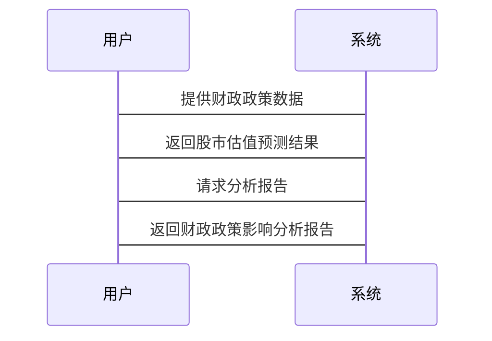

                 


# 全球股市估值与财政政策变化的关系

> **关键词**：股市估值，财政政策，统计学模型，计量经济学，时间序列分析，机器学习

> **摘要**：本文探讨了全球股市估值与财政政策变化之间的复杂关系。通过统计学和计量经济学的方法，结合机器学习模型，分析财政政策如何影响股市估值，以及股市估值变化如何反馈到财政政策的制定与调整中。文章从理论分析、算法原理、系统设计到项目实战，全面阐述了这一关系，并提供了实际案例和最佳实践建议。

---

# 第1章: 背景介绍

## 1.1 股市估值的基本概念

### 1.1.1 股票估值的定义与意义

股票估值是指对股票价值的评估，通常基于企业的基本面、市场情绪和宏观经济环境等因素。股票估值是投资者决策的重要依据，也是衡量市场健康程度的重要指标。通过合理的估值模型，投资者可以判断股票的合理价格区间，从而做出买入或卖出的决策。

### 1.1.2 市盈率、市净率等核心指标解析

市盈率（P/E ratio）是衡量股票估值的重要指标，计算公式为：  
$$\text{市盈率} = \frac{\text{股价}}{\text{每股净利润}}$$  
市盈率反映了市场对公司盈利能力的预期。  
市净率（P/B ratio）是另一个重要指标，计算公式为：  
$$\text{市净率} = \frac{\text{股价}}{\text{每股净资产}}$$  
市净率反映了市场对公司资产价值的评估。

### 1.1.3 股市估值的影响因素

股市估值受到多种因素的影响，包括宏观经济指标（如GDP增长率、通胀率）、企业盈利状况、市场情绪、政策变化等。其中，政策变化尤其是财政政策对股市估值的影响尤为显著。

---

## 1.2 财政政策的基本概念

### 1.2.1 财政政策的定义与目标

财政政策是政府通过调整税收、政府支出和债务发行等工具来影响经济活动的政策。其主要目标包括促进经济增长、调节通胀、改善就业和优化资源配置等。

### 1.2.2 主要财政工具：政府支出、税收、债务等

- **政府支出**：政府通过增加基础设施建设、教育、医疗等领域的支出，刺激经济增长。  
- **税收**：政府通过调整税率和税收优惠政策，影响企业和个人的可支配收入，进而影响消费和投资。  
- **债务**：政府通过发行债券融资，扩大财政支出，但过度的债务可能引发债务风险。

### 1.2.3 财政政策的实施机制

财政政策的实施通常需要通过立法机构的批准，并由财政部等部门具体执行。政策的效果需要通过宏观经济数据和市场反应来评估。

---

## 1.3 股市估值与财政政策的关系

### 1.3.1 财政政策对股市的影响路径

1. **政府支出增加**：政府投资于基础设施等领域，直接增加企业盈利和就业，提升市场信心，从而推高股市估值。  
2. **税收减免**：降低企业税负，增加企业净利润，提升股票吸引力，推高股价。  
3. **债务发行**：大规模债务发行可能导致市场对通货膨胀的担忧，进而影响股市估值。

### 1.3.2 股市估值对财政政策的反馈作用

股市估值的变化会通过企业市值、投资者信心等渠道反作用于财政政策。例如，股市低迷可能迫使政府采取更加宽松的财政政策来提振市场。

### 1.3.3 全球化背景下的互动关系

在全球化背景下，财政政策的变化不仅影响本国股市，还可能通过资本流动影响全球市场。例如，美国的财政刺激政策可能吸引全球资本流入，推高美股估值。

---

## 1.4 本章小结

通过本章的介绍，我们了解了股市估值和财政政策的基本概念，以及它们之间的相互关系。接下来，我们将深入分析股市估值与财政政策的核心原理，并探讨如何通过统计学和计量经济学的方法来量化它们之间的关系。

---

# 第2章: 股市估值与财政政策的核心原理

## 2.1 股市估值的理论基础

### 2.1.1 股票定价模型

股票定价模型是股市估值的核心工具，其中最常用的是股息折扣模型（DDM）和自由现金流模型（DCF）。  
- **股息折扣模型**：$$\text{股票价值} = \frac{\text{股息}}{\text{折现率}}$$  
- **自由现金流模型**：$$\text{股票价值} = \frac{\text{未来自由现金流}}{\text{折现率}}$$  

### 2.1.2 市场情绪与投资者行为

市场情绪和投资者行为是影响股市估值的重要因素。例如，市场恐慌可能导致抛售潮，从而压低股价；而市场乐观情绪则可能推高股价。

### 2.1.3 宏观经济指标

宏观经济指标（如GDP增长率、通胀率、利率等）对股市估值有直接影响。例如，低利率环境通常有利于股市估值的提升。

---

## 2.2 财政政策的传导机制

### 2.2.1 政府支出的刺激作用

政府支出的增加通常会通过乘数效应刺激经济增长，进而提升企业盈利和股市估值。例如，政府投资于新基建可能带动相关行业的需求，提升企业的业绩。

### 2.2.2 税收政策对企业盈利的影响

税收减免可以降低企业的税负，增加净利润，从而提升股票吸引力。例如，企业所得税率的降低可以直接增加企业的净利润，推高股价。

### 2.2.3 财政赤字与债务的影响

财政赤字的增加可能导致市场对通货膨胀的担忧，从而影响股市估值。然而，适度的赤字可能通过刺激经济增长提升股市估值。

---

## 2.3 股市估值与财政政策的相互作用

### 2.3.1 财政政策如何影响股市估值

1. **政府支出增加**：直接刺激经济增长，提升企业盈利和股价。  
2. **税收减免**：增加企业净利润，提升股票吸引力。  
3. **债务发行**：可能导致市场对通货膨胀的担忧，影响股市估值。

### 2.3.2 股市估值变化对财政政策的反馈

股市估值的变化会通过投资者信心和企业市值反作用于财政政策。例如，股市低迷可能迫使政府采取更加宽松的财政政策来提振市场。

---

## 2.4 核心概念对比与ER实体关系图

### 2.4.1 股市估值与财政政策的核心属性对比

| 属性       | 股市估值                     | 财政政策                     |
|------------|------------------------------|------------------------------|
| 定义       | 股票的价值评估               | 政府通过税收、支出等工具影响经济 |
| 影响因素   | 宏观经济、企业盈利、市场情绪 | 税率、政府支出、债务等       |
| 目标       | 为投资者提供参考             | 实现经济增长、调节通胀等       |

### 2.4.2 ER实体关系图

```mermaid
erd
actor 股市估值 {
  id 股票代码
  字段 股价
  关系：属于 股票市场
}
actor 财政政策 {
  id 政策编号
  字段 政府支出、税收、债务
  关系：影响 股市估值
}
```

---

# 第3章: 统计学与计量经济学方法

## 3.1 统计学方法

### 3.1.1 数据收集与预处理

- 数据来源：全球主要股市指数（如标普500、沪深300）和财政政策数据（如政府支出、税收）。  
- 数据预处理：清洗、标准化、缺失值处理。

### 3.1.2 描述性统计分析

- 计算均值、方差、相关系数等指标，分析财政政策与股市估值的相关性。

### 3.1.3 回归分析

通过线性回归模型，量化财政政策变量对股市估值的影响。  
$$y = \beta_0 + \beta_1x + \epsilon$$  
其中，$y$为股市估值，$x$为财政政策变量，$\epsilon$为误差项。

---

## 3.2 计量经济学方法

### 3.2.1 时间序列分析

使用ARIMA模型对时间序列数据进行建模，分析财政政策变化对股市估值的滞后效应。  
$$\text{ARIMA}(p, d, q)$$

### 3.2.2 Granger因果检验

通过Granger因果检验，验证财政政策变化是否是股市估值变化的因果因素。

---

## 3.3 机器学习模型

### 3.3.1 线性回归模型

使用Python的scikit-learn库实现线性回归模型，预测财政政策变量对股市估值的影响。  
```python
from sklearn.linear_model import LinearRegression
model = LinearRegression()
model.fit(X, y)
```

### 3.3.2 时间序列分析

使用LSTM模型对时间序列数据进行建模，预测未来股市估值的变化。  
```python
from tensorflow.keras.layers import LSTM, Dense
from tensorflow.keras.models import Sequential
model = Sequential()
model.add(LSTM(50, input_shape=(timesteps, features)))
model.add(Dense(1))
model.compile(optimizer='adam', loss='mean_squared_error')
```

---

## 3.4 数学模型与公式

### 3.4.1 线性回归模型

$$y = \beta_0 + \beta_1x + \epsilon$$

### 3.4.2 LSTM模型

$$\text{LSTM}(\text{输入长度}, \text{隐藏层大小})$$

---

# 第4章: 系统分析与架构设计方案

## 4.1 问题场景介绍

我们需要构建一个系统，用于分析全球股市估值与财政政策变化的关系，帮助投资者和政策制定者做出更明智的决策。

---

## 4.2 系统功能设计

### 4.2.1 领域模型


---

## 4.3 系统架构设计



---

## 4.4 系统接口设计

### 4.4.1 输入接口

- 政府支出数据接口  
- 税收数据接口  
- 债务数据接口  

### 4.4.2 输出接口

- 股市估值预测结果  
- 财政政策影响分析报告  

---

## 4.5 交互序列图



---

# 第5章: 项目实战

## 5.1 环境安装

安装必要的Python库：  
```bash
pip install pandas numpy scikit-learn tensorflow
```

---

## 5.2 核心代码实现

### 5.2.1 数据处理

```python
import pandas as pd
import numpy as np

# 加载数据
data = pd.read_csv('policy_stock.csv')

# 数据预处理
data['date'] = pd.to_datetime(data['date'])
data.set_index('date', inplace=True)
```

### 5.2.2 模型训练

```python
from sklearn.linear_model import LinearRegression
from sklearn.metrics import mean_squared_error

# 训练线性回归模型
model = LinearRegression()
model.fit(data[['政府支出', '税收']], data['股价'])

# 预测结果
predictions = model.predict(data[['政府支出', '税收']])
print(mean_squared_error(data['股价'], predictions))
```

---

## 5.3 案例分析

以美国为例，分析财政刺激政策对股市估值的影响。通过历史数据，验证模型的预测能力，并解释结果。

---

## 5.4 项目小结

通过本章的实战，我们掌握了如何利用统计学和机器学习方法分析全球股市估值与财政政策变化的关系，并能够通过实际案例验证模型的有效性。

---

# 第6章: 最佳实践与注意事项

## 6.1 最佳实践

1. 数据来源要可靠，确保数据的准确性和完整性。  
2. 在模型训练中，要注意过拟合和欠拟合的问题。  
3. 结果解释要结合实际经济背景，避免机械化的分析。

## 6.2 小结

通过本文的分析，我们不仅掌握了理论知识，还通过实际案例验证了理论的有效性。未来的研究可以进一步结合更多变量，构建更加复杂的模型。

---

## 6.3 注意事项

1. 模型的预测结果仅供参考，实际投资需谨慎。  
2. 数据分析过程中要注意数据的时序性，避免因果关系的混淆。  
3. 在政策制定中，需综合考虑多方面因素，避免单一指标的误导。

---

## 6.4 拓展阅读

1. 《计量经济学导论》  
2. 《机器学习实战》  
3. 《财政学原理》  

---

# 结论与展望

本文通过统计学和计量经济学的方法，结合机器学习模型，深入分析了全球股市估值与财政政策变化的关系。我们得出结论：财政政策对股市估值有显著影响，但这种影响受到多种因素的制约。未来的研究可以进一步结合更多变量，构建更加复杂的模型，并探索政策变化的滞后效应。

---

**作者：AI天才研究院/AI Genius Institute & 禅与计算机程序设计艺术/Zen And The Art of Computer Programming**

