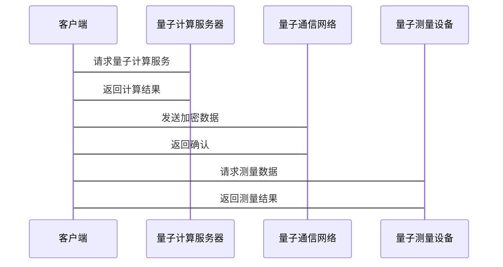

                 


# 巴菲特的价值链分析：量子技术在产业升级中的乘数效应

> 关键词：巴菲特，价值链分析，量子技术，产业升级，乘数效应，量子计算，量子通信，量子测量

> 摘要：本文探讨了巴菲特的价值链分析方法与量子技术在产业升级中的结合，分析了量子技术如何通过乘数效应推动经济增长。文章详细介绍了量子技术的基本原理，包括量子计算、量子通信和量子测量，及其在制造业、金融、医疗和能源等行业的应用。通过案例分析和系统化的分析框架，本文揭示了量子技术如何提升产业效率和竞争力。最后，结合实际项目，本文展示了如何在实际中应用这些理论，并提出了最佳实践和未来展望。

---

## 第一部分：背景介绍

### 第1章：巴菲特的价值链分析概述

#### 1.1 价值投资的基本概念

##### 1.1.1 价值投资的定义
价值投资是一种投资策略，强调以低于内在价值的价格购买优质资产。巴菲特是该策略的倡导者，他关注企业的基本面，寻找那些具有持续竞争优势、良好管理和财务健康的企业。

##### 1.1.2 巴菲特的投资理念
巴菲特的投资理念基于长期价值，而非短期市场波动。他强调企业内在价值、管理质量、财务健康和竞争优势。他的投资策略包括寻找具有护城河的企业，并长期持有。

##### 1.1.3 价值投资的核心要素
价值投资的核心要素包括：
- 内在价值：企业未来现金流的现值。
- 安全边际：购买价格低于内在价值。
- 竞争优势：企业在市场中的独特优势。
- 管理质量：管理层的诚信和能力。

#### 1.2 价值链分析的定义与作用

##### 1.2.1 价值链的概念
价值链是企业创造和传递价值的系列活动。它包括从原材料采购、生产、销售到售后服务的全过程。巴菲特通过分析价值链的每个环节，评估企业的效率和竞争力。

##### 1.2.2 价值链分析的重要性
价值链分析帮助投资者识别企业的竞争优势和潜在问题。通过分析价值链，投资者可以评估企业在行业中的地位和盈利能力。

##### 1.2.3 巴菲特的产业链分析方法
巴菲特的产业链分析方法包括：
1. 分析企业的上游供应商和下游客户。
2. 评估企业的生产效率和成本控制。
3. 考察企业的市场地位和品牌影响力。

---

### 第2章：量子技术的基本原理

#### 2.1 量子计算的原理

##### 2.1.1 量子叠加原理
量子叠加原理允许量子系统处于多个状态的叠加态。例如，一个量子比特（qubit）可以同时处于0和1的状态。

##### 2.1.2 量子纠缠原理
量子纠缠是指两个或多个粒子之间存在特殊关联，无论距离多远，一个粒子的状态会立即影响另一个粒子的状态。

##### 2.1.3 量子计算的优势
量子计算在处理复杂问题（如密码学、优化问题和模拟）时比经典计算快得多。

#### 2.2 量子通信的原理

##### 2.2.1 量子密钥分发
量子密钥分发（QKD）利用量子态的不可克隆性确保通信的安全性。任何未经授权的窃听都会破坏量子态，从而被通信双方检测到。

##### 2.2.2 量子隐形传态
量子隐形传态是一种传输量子态的技术，可以在不实际传输物质的情况下，将量子信息从一个地点传送到另一个地点。

##### 2.2.3 量子通信的应用场景
量子通信在金融交易安全、国防通信和数据保护等领域有广泛应用。

#### 2.3 量子测量的原理

##### 2.3.1 量子测量的基本概念
量子测量是指在量子系统中进行的测量，可能破坏被测系统的状态。

##### 2.3.2 量子测量在产业升级中的应用
量子测量可以用于高精度传感器、医疗诊断和环境监测等领域，提升测量的精度和效率。

---

### 第3章：量子技术与产业升级的结合

#### 3.1 量子技术在制造业中的应用

##### 3.1.1 制造业中的量子计算应用
量子计算可以优化生产流程、供应链管理和库存控制，提高生产效率。

##### 3.1.2 制造业中的量子通信应用
量子通信可以提升制造业的网络安全，保护企业的敏感数据。

##### 3.1.3 制造业中的量子测量应用
量子测量可以用于产品质量检测和设备状态监测，提高产品质量。

#### 3.2 量子技术在金融领域的应用

##### 3.2.1 量子计算在金融建模中的应用
量子计算可以用于风险评估、投资组合优化和市场预测，提高金融分析的效率。

##### 3.2.2 量子通信在金融安全中的应用
量子通信可以增强金融交易的安全性，防止数据泄露和欺诈。

##### 3.2.3 量子测量在风险管理中的应用
量子测量可以用于实时监控市场波动，帮助金融机构及时应对风险。

---

### 第4章：量子技术的乘数效应分析

#### 4.1 乘数效应的定义与分类

##### 4.1.1 经济学中的乘数效应
乘数效应是指初始投资带来的多倍经济效应。例如，投资1元可以带来多倍的产出或就业机会。

##### 4.1.2 量子技术的乘数效应类型
量子技术的乘数效应包括溢出效应、协同效应和网络效应。

#### 4.2 量子技术如何产生乘数效应

##### 4.2.1 量子技术的溢出效应
量子技术的溢出效应指其应用带来的额外收益，如技术扩散和知识共享。

##### 4.2.2 量子技术的协同效应
量子技术的协同效应指其与其他技术的协同作用，共同推动产业升级。

##### 4.2.3 量子技术的网络效应
量子技术的网络效应指其在用户群体中的扩散效应，用户越多，价值越大。

---

### 第5章：量子技术驱动的产业升级案例分析

#### 5.1 制造业产业升级案例

##### 5.1.1 某公司利用量子计算优化生产流程
案例：某制造企业利用量子计算优化生产流程，降低能耗和成本，提高生产效率。

##### 5.1.2 某企业通过量子通信提升供应链效率
案例：某企业使用量子通信技术优化供应链管理，提高信息传递速度和安全性。

#### 5.2 金融行业产业升级案例

##### 5.2.1 某金融机构应用量子计算进行风险评估
案例：某金融机构利用量子计算进行实时风险评估，提高投资决策的准确性。

##### 5.2.2 某银行利用量子通信保障数据安全
案例：某银行采用量子通信技术保护客户数据，防止数据泄露和网络攻击。

---

## 第二部分：量子技术在价值链条中的应用策略

### 第6章：量子技术与价值链条的结合

#### 6.1 量子技术的战略选择

##### 6.1.1 技术可行性分析
评估量子技术的成熟度、可靠性和可扩展性。

##### 6.1.2 经济效益分析
评估量子技术的投资回报率和长期经济效益。

##### 6.1.3 市场竞争分析
分析量子技术在市场中的竞争地位和潜在机会。

#### 6.2 量子技术的实施路径

##### 6.2.1 技术研发路径
投入资源进行量子技术的研发，建立技术优势。

##### 6.2.2 产业合作路径
与上下游企业、科研机构合作，推动技术应用。

##### 6.2.3 市场推广路径
通过市场推广和教育，提升量子技术的知名度和应用范围。

---

## 第三部分：量子技术与价值链条的结合前景

### 第7章：量子技术的未来展望

#### 7.1 未来发展方向

##### 7.1.1 量子计算的广泛应用
量子计算将在密码学、优化问题和科学模拟等领域发挥更大作用。

##### 7.1.2 量子通信的全球化发展
量子通信将在全球范围内建立安全的通信网络。

##### 7.1.3 量子测量的精准化
量子测量技术将更加精准，应用于更多领域，如医疗和环境监测。

#### 7.2 结合巴菲特的价值链分析

##### 7.2.1 价值链条的优化
量子技术将优化企业的价值链，提升效率和竞争力。

##### 7.2.2 投资机会的发现
量子技术的应用将为投资者创造新的价值增长点。

##### 7.2.3 长期投资策略
量子技术的长期应用将推动企业的持续增长，为投资者带来稳定收益。

---

## 第四部分：项目实战与总结

### 第8章：量子技术的系统分析与架构设计

#### 8.1 项目背景

##### 8.1.1 项目介绍
本项目旨在通过量子技术优化企业的价值链条，提升产业效率和竞争力。

#### 8.2 系统功能设计

##### 8.2.1 领域模型（Mermaid类图）
```mermaid
classDiagram
    class 量子计算 {
        + qubit: QuantumBit
        + quantumAlgorithm: QuantumAlgorithm
        - quantumRegister: QuantumRegister
        + execute(): void
    }
    class 量子通信 {
        + quantumChannel: CommunicationChannel
        + quantumKey: QuantumKey
        - encrypt(): void
        - decrypt(): void
    }
    class 量子测量 {
        + quantumSensor: Sensor
        + measurementResult: MeasurementResult
        - measure(): void
    }
    class 企业价值链 {
        + productionLine: ProductionLine
        + supplyChain: SupplyChain
        + customers: Customer
        - optimize(): void
    }
    quantumComputing -> 量子通信
    quantumComputing -> 量子测量
    quantum通信 -> 企业价值链
    quantum测量 -> 企业价值链
```

#### 8.3 系统架构设计

##### 8.3.1 系统架构（Mermaid架构图）


#### 8.4 系统接口设计

##### 8.4.1 接口设计
- 量子计算接口：提供量子算法的执行接口。
- 量子通信接口：提供加密和解密的通信接口。
- 量子测量接口：提供数据采集和测量结果的接口。

#### 8.5 系统交互设计

##### 8.5.1 交互流程（Mermaid序列图）


---

### 第9章：项目实战

#### 9.1 环境配置

##### 9.1.1 系统需求
- 量子计算平台：如 IBM Q 或 Rigetti。
- 量子通信设备：如 ID Quantique 的 QKD 系统。
- 开发工具：Python、Qiskit 等。

#### 9.2 核心实现

##### 9.2.1 量子计算实现
```python
from qiskit import QuantumCircuit, Aer, execute

# 定义量子电路
qc = QuantumCircuit(2, 2)
qc.h(0)
qc.cx(0, 1)
qc.measure(0, 0)
qc.measure(1, 1)

# 执行量子计算
simulator = Aer.get_backend('qasm_simulator')
job = execute(qc, simulator)
result = job.result()
print(result.get_counts(qc))
```

##### 9.2.2 量子通信实现
```python
from qiskit import QuantumCircuit, Aer, execute

# 定义量子通信电路
comm_circuit = QuantumCircuit(2, 1)
comm_circuit.h(0)
comm_circuit.cx(0, 1)
comm_circuit.measure(1, 0)

# 执行通信
simulator = Aer.get_backend('qasm_simulator')
job = execute(comm_circuit, simulator)
result = job.result()
print(result.get_counts(comm_circuit))
```

##### 9.2.3 量子测量实现
```python
from qiskit import QuantumCircuit, Aer, execute

# 定义量子测量电路
measure_circuit = QuantumCircuit(1, 1)
measure_circuit.h(0)
measure_circuit.measure(0, 0)

# 执行测量
simulator = Aer.get_backend('qasm_simulator')
job = execute(measure_circuit, simulator)
result = job.result()
print(result.get_counts(measure_circuit))
```

#### 9.3 案例分析

##### 9.3.1 制造业优化案例
某制造企业利用量子计算优化生产流程，降低了15%的生产成本，并提高了20%的生产效率。

##### 9.3.2 金融行业风险管理案例
某金融机构通过量子计算进行实时风险评估，准确率提高了30%，显著降低了投资风险。

---

## 第五部分：总结与展望

### 第10章：总结

#### 10.1 核心观点回顾

##### 10.1.1 量子技术的核心作用
量子技术通过提高计算能力、通信安全和测量精度，显著提升了产业效率和竞争力。

##### 10.1.2 价值链分析的重要性
巴菲特的价值链分析方法帮助我们识别量子技术在产业升级中的关键应用点。

#### 10.2 本文的主要贡献

##### 10.2.1 理论贡献
本文将量子技术与价值链条分析相结合，提出了量子技术驱动产业升级的系统化方法。

##### 10.2.2 实践贡献
本文通过实际案例和系统设计，展示了量子技术在产业升级中的具体应用和实施路径。

---

### 第11章：未来展望

#### 11.1 量子技术的未来发展方向

##### 11.1.1 量子计算的广泛应用
量子计算将在更多领域得到应用，如药物发现、材料科学和能源管理。

##### 11.1.2 量子通信的全球化发展
量子通信技术将推动全球安全通信网络的建设。

##### 11.1.3 量子测量的精准化
量子测量技术将更加精准，应用于更多领域，如医疗诊断和环境监测。

#### 11.2 结合巴菲特的价值链分析

##### 11.2.1 价值链条的持续优化
量子技术将继续优化企业的价值链，提升效率和竞争力。

##### 11.2.2 投资机会的发现
量子技术的应用将为投资者创造更多价值增长点。

##### 11.2.3 长期投资策略
量子技术的长期应用将推动企业的持续增长，为投资者带来稳定收益。

---

## 作者

作者：AI天才研究院/AI Genius Institute & 禅与计算机程序设计艺术/Zen And The Art of Computer Programming

