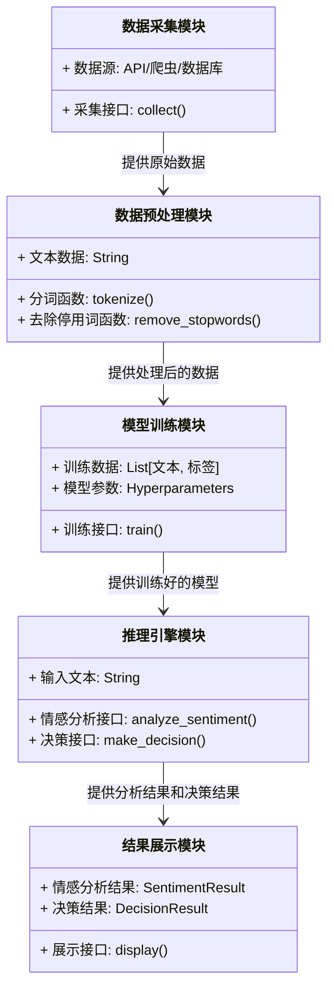
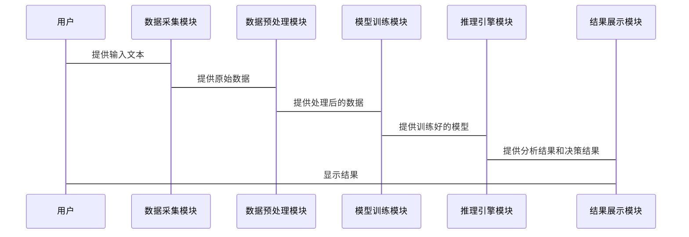

                 


# 开发具有情感分析能力的AI Agent

> 关键词：情感分析，AI Agent，自然语言处理，机器学习，深度学习

> 摘要：本文详细介绍了如何开发一个具有情感分析能力的AI Agent，涵盖从基础概念到算法实现，再到系统架构设计的全过程。通过分析情感分析的核心算法和AI Agent的系统架构，结合实际项目案例，为读者提供全面的技术指导。

---

## 第一部分: 情感分析与AI Agent概述

### 第1章: 情感分析与AI Agent的背景介绍

#### 1.1 情感分析的定义与应用

- **1.1.1 情感分析的定义**
  情感分析是自然语言处理（NLP）中的一个分支，旨在通过分析文本内容来识别和分类作者的情感倾向。情感分析的目标是将文本数据（如评论、微博、新闻等）分为积极、消极或中性等类别。

- **1.1.2 情感分析的应用场景**
  情感分析广泛应用于多个领域，包括社交媒体分析、客户反馈分析、市场研究、品牌监控等。例如，企业可以通过情感分析了解消费者对产品的看法，从而优化产品设计或改进服务质量。

- **1.1.3 情感分析与自然语言处理的关系**
  情感分析依赖于自然语言处理技术，如分词、词性标注、句法分析等，但它的目标是更具体的情感分类。情感分析可以看作是自然语言处理的一个应用方向。

#### 1.2 AI Agent的定义与特点

- **1.2.1 AI Agent的定义**
  AI Agent（人工智能代理）是指能够感知环境并采取行动以实现目标的智能实体。AI Agent可以是软件程序，也可以是物理机器人，它们能够通过传感器获取信息，并通过执行器与环境交互。

- **1.2.2 AI Agent的核心特点**
  AI Agent具有自主性、反应性、目标导向性和社会性。自主性意味着AI Agent可以在没有外部干预的情况下运行；反应性意味着它可以实时感知环境并做出反应；目标导向性意味着它会采取行动以实现特定目标；社会性意味着它可以与其他实体（包括人类和其它AI Agent）进行交互。

- **1.2.3 AI Agent与传统软件的区别**
  传统软件通常需要明确的输入和固定的逻辑流程，而AI Agent能够自主决策、学习和适应环境。AI Agent的核心在于其智能性和自主性，能够处理复杂和不确定的问题。

#### 1.3 情感分析在AI Agent中的作用

- **1.3.1 情感分析如何增强AI Agent的交互能力**
  情感分析使AI Agent能够理解用户的语言中蕴含的情感信息，从而更自然地与用户进行交互。例如，在客服场景中，AI Agent可以通过情感分析识别用户的不满情绪，并主动提供解决方案。

- **1.3.2 情感分析在AI Agent中的应用场景**
  情感分析可以应用于聊天机器人、智能音箱、社交媒体监控等领域。例如，智能音箱可以通过情感分析调整其响应方式，以更好地匹配用户的情绪状态。

- **1.3.3 情感分析对AI Agent性能的提升**
  情感分析使AI Agent能够更准确地理解用户意图，从而提高交互的准确性和效率。例如，在智能推荐系统中，AI Agent可以通过情感分析识别用户的偏好，从而提供更个性化的推荐。

### 第2章: 情感分析的核心概念与联系

#### 2.1 情感分析的核心原理

- **2.1.1 情感分析的分类**
  情感分析可以分为细粒度情感分析、方面情感分析和文档情感分析。细粒度情感分析旨在识别文本中的具体情感维度（如情感强度、情感类别等），而方面情感分析则关注特定方面的情感（如产品质量、服务态度等）。

- **2.1.2 情感分析的特征提取**
  特征提取是情感分析的关键步骤，常用的特征包括词汇特征、句法特征和语义特征。词汇特征包括词袋模型、TF-IDF等，句法特征包括依存句法关系，语义特征则包括词嵌入（如Word2Vec、GloVe）。

- **2.1.3 情感分析的算法选择**
  情感分析算法的选择取决于数据集的规模、任务的复杂性和计算资源。传统机器学习算法（如SVM、Naive Bayes）适用于小规模数据，而深度学习算法（如LSTM、Transformer）适用于大规模复杂数据。

#### 2.2 AI Agent与情感分析的关系

- **2.2.1 AI Agent如何利用情感分析**
  AI Agent通过情感分析理解用户输入的情感信息，从而更智能地进行决策和交互。例如，在智能客服系统中，AI Agent可以通过情感分析识别用户的不满情绪，并自动升级到人工客服。

- **2.2.2 情感分析如何提升AI Agent的用户体验**
  情感分析使AI Agent能够更自然地与用户交互，从而提升用户体验。例如，AI Agent可以根据用户的情感状态调整其响应语气，使其更符合用户的期望。

- **2.2.3 情感分析与AI Agent的协同工作流程**
  情感分析通常作为AI Agent的一个模块，用于处理输入数据的情感信息。AI Agent通过情感分析模块提取情感特征，然后结合其他信息（如上下文、用户历史行为）进行决策。

### 第3章: 情感分析算法原理讲解

#### 3.1 基于传统机器学习的情感分析算法

- **3.1.1 支持向量机（SVM）在情感分析中的应用**
  SVM是一种监督学习算法，常用于分类任务。在情感分析中，SVM可以将文本特征映射到高维空间，并找到一个超平面将不同情感类别分开。

- **3.1.2 朴素贝叶斯（Naive Bayes）在情感分析中的应用**
  Naive Bayes是一种基于概率的分类算法，假设特征之间相互独立。在情感分析中，Naive Bayes通常用于处理文本数据，尤其是当特征数量较大时。

- **3.1.3 K-近邻算法（KNN）在情感分析中的应用**
  KNN是一种非参数分类算法，基于相似性度量进行分类。在情感分析中，KNN可以用于基于词袋模型的文本分类，但其性能通常不如SVM和Naive Bayes。

#### 3.2 基于深度学习的情感分析算法

- **3.2.1 循环神经网络（RNN）在情感分析中的应用**
  RNN是一种处理序列数据的深度学习模型，常用于处理文本序列。在情感分析中，RNN可以捕捉到文本的情感变化和上下文信息。

- **3.2.2 长短期记忆网络（LSTM）在情感分析中的应用**
  LSTM是一种改进的RNN，能够更好地捕捉长距离依赖关系。在情感分析中，LSTM适用于处理长文本序列，能够捕捉到文本中的情感变化。

- **3.2.3 Transformer模型在情感分析中的应用**
  Transformer是一种基于注意力机制的深度学习模型，广泛应用于自然语言处理任务。在情感分析中，Transformer可以通过全局注意力机制捕捉到文本中的关键情感信息。

#### 3.3 情感分析算法的优缺点对比

- **3.3.1 传统机器学习算法的优缺点**
  优点：计算效率高，易于实现，适合小规模数据集。
  缺点：特征工程复杂，难以处理大规模数据，模型表达能力有限。

- **3.3.2 深度学习算法的优缺点**
  优点：模型表达能力强，能够自动学习特征，适合大规模复杂数据。
  缺点：计算资源需求高，训练时间长，模型解释性较差。

- **3.3.3 情感分析算法的性能对比**
  在情感分析任务中，深度学习算法（如LSTM和Transformer）通常优于传统机器学习算法（如SVM和Naive Bayes），尤其是在大规模数据集上。

### 第4章: 情感分析的数学模型与公式

#### 4.1 传统机器学习模型的数学基

- **4.1.1 支持向量机（SVM）的数学模型**
  SVM的目标是最小化分类错误并最大化分类间隔。数学上，SVM可以通过拉格朗日乘数法转化为对偶问题，从而求解线性不可分问题。

$$ \text{优化目标：} \min_{w,b,\xi} \frac{1}{2}||w||^2 + C \sum_{i=1}^n \xi_i $$
$$ \text{约束条件：} y_i(w \cdot x_i + b) \geq 1 - \xi_i, \xi_i \geq 0 $$

- **4.1.2 朴素贝叶斯（Naive Bayes）的数学模型**
  Naive Bayes基于贝叶斯定理，假设特征之间相互独立。数学上，Naive Bayes的分类概率可以通过以下公式计算：

$$ P(y|x) = \frac{P(x|y)P(y)}{P(x)} $$

其中，$P(x|y)$ 是在类别$y$下，特征$x$出现的概率，$P(y)$是类别$y$的先验概率，$P(x)$是特征$x$的全概率。

- **4.1.3 K-近邻算法（KNN）的数学模型**
  KNN通过计算样本之间的距离（如欧氏距离、曼哈顿距离）进行分类。数学上，KNN的分类概率可以通过以下公式计算：

$$ y = \text{mode}\{y_k | k \in \text{NN}(x)\} $$

其中，$y_k$是训练集中与测试样本$x$最近的$k$个邻居的类别，$\text{NN}(x)$是$x$的邻居集合。

#### 4.2 深度学习模型的数学基

- **4.2.1 循环神经网络（RNN）的数学模型**
  RNN通过递归关系处理序列数据。数学上，RNN的状态转移方程可以表示为：

$$ s_t = \tanh(W_s x_t + U_s s_{t-1} + b_s) $$
$$ y_t = W_o s_t + b_o $$

其中，$s_t$是第$t$时刻的状态，$x_t$是输入向量，$W_s$和$U_s$是参数矩阵，$b_s$是偏置项，$W_o$和$b_o$是输出层的参数。

- **4.2.2 长短期记忆网络（LSTM）的数学模型**
  LSTM通过门控机制处理长距离依赖关系。数学上，LSTM的门控机制包括输入门、遗忘门和输出门：

$$ i_t = \sigma(W_i x_t + U_i s_{t-1} + b_i) $$
$$ f_t = \sigma(W_f x_t + U_f s_{t-1} + b_f) $$
$$ o_t = \sigma(W_o x_t + U_o s_{t-1} + b_o) $$
$$ s_t = f_t \cdot s_{t-1} + i_t \cdot g(W_g x_t + U_g s_{t-1} + b_g) $$

其中，$\sigma$是sigmoid函数，$g$是tanh函数。

- **4.2.3 Transformer模型的数学模型**
  Transformer通过自注意力机制捕捉文本中的全局关系。数学上，自注意力机制可以表示为：

$$ \text{Attention}(Q, K, V) = \text{softmax}\left(\frac{QK^T}{\sqrt{d_k}}\right)V $$

其中，$Q$是查询向量，$K$是键向量，$V$是值向量，$d_k$是键向量的维度。

---

## 第二部分: AI Agent的系统架构与实现

### 第5章: AI Agent的系统架构设计

#### 5.1 系统功能设计

- **5.1.1 数据采集模块**
  数据采集模块负责从多种渠道获取文本数据，包括社交媒体、客服对话、用户评论等。常见的数据采集方法包括API调用、网络爬取和数据库查询。

- **5.1.2 数据预处理模块**
  数据预处理模块负责对原始文本数据进行清洗和标注。清洗步骤包括去除停用词、分词、去除标点符号等。标注步骤包括情感标签标注和实体识别。

- **5.1.3 模型训练模块**
  模型训练模块负责使用预处理后的数据训练情感分析模型。模型训练可以采用传统的机器学习算法（如SVM、Naive Bayes）或深度学习算法（如LSTM、Transformer）。

- **5.1.4 推理引擎模块**
  推理引擎模块负责将用户输入的文本传递给情感分析模型，获取情感分析结果，并结合其他信息（如上下文、用户历史行为）进行决策。

- **5.1.5 结果展示模块**
  结果展示模块负责将情感分析结果和推理引擎的决策结果以用户友好的方式展示出来，例如通过聊天界面、可视化仪表盘等。

#### 5.2 系统架构设计

- **5.2.1 系统类图**
  以下是系统的类图，展示了各个模块之间的关系：



- **5.2.2 系统交互流程**
  以下是系统的交互流程图：



#### 5.3 系统接口设计

- **5.3.1 数据采集接口**
  数据采集接口用于从不同数据源获取文本数据。常见的数据采集接口包括API接口和爬虫接口。例如，Twitter API可以用于获取社交媒体上的文本数据。

- **5.3.2 情感分析接口**
  情感分析接口负责接收输入文本并返回情感分析结果。接口通常采用RESTful API设计，支持POST请求，返回JSON格式的结果。

- **5.3.3 决策引擎接口**
  决策引擎接口负责根据情感分析结果和其它信息（如上下文、用户历史行为）进行决策，并返回决策结果。决策引擎接口通常采用服务化设计，支持多种输入格式。

---

## 第三部分: 项目实战与高级主题

### 第6章: 情感分析项目实战

#### 6.1 环境搭建

- **6.1.1 安装Python和必要的库**
  需要安装的库包括：
  - `numpy`：用于数值计算
  - `pandas`：用于数据处理
  - `scikit-learn`：用于机器学习算法
  - `tensorflow` 或 `keras`：用于深度学习模型
  - `transformers`：用于预训练的Transformer模型

#### 6.2 核心实现

- **6.2.1 数据预处理代码**
  以下是数据预处理的Python代码示例：

```python
import numpy as np
from sklearn.feature_extraction.text import TfidfVectorizer
from sklearn.svm import SVC
from sklearn.metrics import accuracy_score

# 数据预处理
def preprocess(text):
    # 分词
    words = text.split()
    # 去除停用词
    stop_words = set(["is", "am", "at", "the", "and", "or"])
    filtered_words = [word for word in words if word not in stop_words]
    return ' '.join(filtered_words)

# 加载数据
data = [
    ("I love this product", "positive"),
    ("This product is terrible", "negative"),
    ("The service is good", "positive"),
    ("I am very satisfied with this", "positive")
]

# 特征提取
vectorizer = TfidfVectorizer(max_features=1000)
X = vectorizer.fit_transform([text for text, label in data])
y = [label for text, label in data]

# 训练模型
model = SVC(C=1.0, random_state=42)
model.fit(X, y)

# 测试
test_data = ["I hate this product", "The service is bad"]
test_vecs = vectorizer.transform(test_data)
predictions = model.predict(test_vecs)
print("Predictions:", predictions)
print("Accuracy:", accuracy_score([

