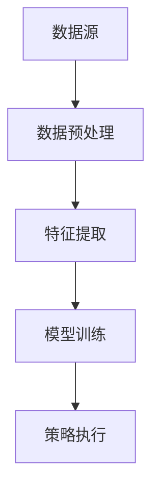

                 


# 彼得林奇的"长期持有"vs"战术性调整"的决策框架

## 关键词
- 彼得林奇
- 长期持有
- 战术性调整
- 投资策略
- 数学模型

## 摘要
本文深入探讨了彼得林奇的两种投资策略：长期持有和战术性调整。通过分析这两种策略的核心原理、优缺点、成功案例以及数学模型，本文旨在为投资者提供一个清晰的决策框架，帮助他们在不同市场环境下做出明智的投资决策。

---

# 第1章: 彼得林奇投资策略的背景与概述

## 1.1 彼得林奇及其投资理念

### 1.1.1 彼得林奇的生平简介
彼得·林奇（Peter Lynch）是美国著名的投资经理人，以其在富达投资管理公司的长期任职期间的卓越表现而闻名。他主张通过深入研究和长期持有优质股票来实现超额收益。

### 1.1.2 彼得林奇的投资哲学
林奇的投资哲学可以概括为“买好不如买好者”。他强调选择具有强大基本面和管理团队的公司，并长期持有，以享受复利效应。

### 1.1.3 彼得林奇的投资方法论
林奇的方法论包括以下几点：
1. **深入研究**：对公司基本面、财务状况和管理层进行详细分析。
2. **分散投资**：通过投资不同行业的公司来分散风险。
3. **长期持有**：避免频繁交易，以降低交易成本和税负。

## 1.2 长期持有与战术性调整的定义

### 1.2.1 长期持有的概念
长期持有是指投资者在较长的时间内持有股票，不因短期市场波动而频繁调整投资组合。这种策略强调对公司长期价值的关注。

### 1.2.2 战术性调整的定义
战术性调整是指根据市场短期走势和公司基本面的变化，灵活调整投资组合的构成。这种策略适用于应对市场波动和规避风险。

### 1.2.3 两种策略的核心区别
| 对比维度 | 长期持有 | 战术性调整 |
|----------|----------|------------|
| 时间跨度 | 长期     | 短期       |
| 调整频率 | 低       | 高         |
| 风险承受 | 高       | 中         |
| 适用场景 | 稳定增长 | 避险或短线收益 |

## 1.3 长期持有与战术性调整的优缺点对比

### 1.3.1 长期持有的优势
1. **复利效应**：长期持有可以最大化复利效应，实现财富的指数增长。
2. **降低交易成本**：频繁交易会增加佣金和税费成本。
3. **避免情绪化决策**：长期持有有助于避免因市场波动而做出的非理性决策。

### 1.3.2 战术性调整的优势
1. **规避短期风险**：通过战术性调整可以避免市场大幅波动带来的损失。
2. **捕捉短期机会**：在市场出现短期机会时，迅速介入以获取超额收益。
3. **灵活应对市场变化**：根据市场环境的变化，及时调整投资策略。

### 1.3.3 长期持有的劣势
1. **市场波动风险**：在市场大幅下跌时，长期持有可能面临较大回撤。
2. **错失短期机会**：在市场短期飙升时，长期持有可能无法及时捕捉收益。

### 1.3.4 战术性调整的劣势
1. **交易成本高**：频繁交易会增加佣金和税费成本。
2. **操作难度大**：需要对市场走势有较高的判断能力，否则可能造成亏损。

---

# 第2章: 长期持有策略的深度分析

## 2.1 长期持有策略的核心原理

### 2.1.1 长期持有的投资逻辑
长期持有策略的核心逻辑是基于对公司内在价值的信任。通过持有优质股票，投资者可以享受公司长期增长带来的收益。

### 2.1.2 长期持有与企业价值的关系
长期持有策略关注企业的基本面，包括盈利能力、财务状况和管理团队。通过持有优质企业，投资者可以分享企业的长期增长。

### 2.1.3 长期持有与市场波动的互动
尽管市场短期波动可能会影响股票价格，但长期持有策略通过忽略短期波动，专注于企业的长期价值，从而实现稳定增长。

## 2.2 长期持有策略的成功案例

### 2.2.1 麦当劳的长期持有案例
麦当劳在20世纪80年代被林奇买入并长期持有。尽管期间股价出现波动，但麦当劳的长期增长使得投资者获得了丰厚的回报。

### 2.2.2 可口可乐的长期持有案例
可口可乐是林奇的经典投资案例之一。通过长期持有，投资者享受了可口可乐品牌的全球扩张和持续增长。

### 2.2.3 其他经典长期持有案例分析
除了麦当劳和可口可乐，其他如强生公司和宝洁公司也是长期持有的成功案例。

## 2.3 长期持有策略的数学模型与公式

### 2.3.1 长期持有收益计算公式
$$ \text{收益} = \text{初始投资} \times (1 + r)^n $$
其中：
- $r$ 是年化收益率
- $n$ 是投资年数

### 2.3.2 长期持有风险评估模型
$$ \text{风险} = \sqrt{\text{方差}} $$
方差反映了资产价格的波动性，长期持有的风险可以通过方差的平方根来衡量。

## 2.4 长期持有策略的挑战与解决方案

### 2.4.1 市场波动对长期持有策略的影响
市场波动可能导致短期亏损，但长期持有策略的核心是忽略短期波动，专注于长期价值。

### 2.4.2 如何应对长期持有的流动性问题
长期持有策略可能面临流动性问题，特别是在市场低迷时。解决方案包括分散投资和选择流动性较高的股票。

### 2.4.3 长期持有策略的优化建议
1. **分散投资**：通过投资不同行业的公司来降低风险。
2. **定期再平衡**：定期检查投资组合，确保符合长期目标。
3. **选择优质公司**：投资具有强大基本面和管理团队的公司。

---

# 第3章: 战术性调整策略的深度分析

## 3.1 战术性调整策略的核心原理

### 3.1.1 战术性调整的投资逻辑
战术性调整策略的核心逻辑是根据市场短期走势和公司基本面的变化，灵活调整投资组合。这种策略适用于应对市场波动和捕捉短期机会。

### 3.1.2 战术性调整与市场周期的关系
战术性调整策略关注市场周期，包括牛市和熊市。在牛市中，投资者可以增加持股比例；在熊市中，减少持股比例以规避风险。

### 3.1.3 战术性调整与资产配置的互动
战术性调整策略强调资产配置的灵活性，通过动态调整资产比例来应对市场变化。

## 3.2 战术性调整策略的成功案例

### 3.2.1 2008年金融危机中的战术性调整案例
在2008年金融危机期间，通过战术性调整策略，投资者可以及时减少风险资产的持仓，避免大幅亏损。

### 3.2.2 美国科技股泡沫破裂中的战术性调整案例
在2000年互联网泡沫破裂期间，战术性调整策略帮助投资者及时退出，避免了巨大损失。

### 3.2.3 其他经典战术性调整案例分析
除了金融危机和科技股泡沫，其他如2018年贸易摩擦期间的战术性调整也是成功的案例。

## 3.3 战术性调整策略的数学模型与公式

### 3.3.1 战术性调整收益计算公式
$$ \text{收益} = \sum_{i=1}^{n} \text{每次交易的收益} $$
其中：
- $n$ 是交易次数
- 每次交易的收益取决于买卖时机的选择

### 3.3.2 动量策略的数学模型
动量策略是战术性调整的一种常见方法，其数学模型为：
$$ \text{动量收益} = \sum_{i=1}^{n} (p_{t} - p_{t-k}) $$
其中：
- $p_{t}$ 是当前价格
- $p_{t-k}$ 是k天前的价格
- $n$ 是交易次数

## 3.4 战术性调整策略的挑战与解决方案

### 3.4.1 如何应对市场短期波动
战术性调整策略需要投资者对市场短期走势有较高的判断能力。解决方案包括使用技术分析工具和情绪指标。

### 3.4.2 如何避免过度交易
战术性调整策略可能导致过度交易，增加交易成本。解决方案包括设定明确的买卖规则和使用纪律性交易系统。

### 3.4.3 战术性调整策略的优化建议
1. **技术分析**：使用K线图、均线和成交量等技术指标来判断买卖时机。
2. **情绪指标**：利用投资者情绪指标（如VIX指数）来指导投资决策。
3. **纪律性**：制定明确的买卖规则，并严格执行。

---

# 第4章: 长期持有与战术性调整的比较分析

## 4.1 长期持有与战术性调整的优缺点对比

| 对比维度 | 长期持有 | 战术性调整 |
|----------|----------|------------|
| 时间跨度 | 长期     | 短期       |
| 风险承受 | 高       | 中         |
| 收益来源 | 复利     | 短期机会   |
| 操作难度 | 低       | 高         |

## 4.2 长期持有与战术性调整的适用场景

### 4.2.1 长期持有的适用场景
1. **市场稳定期**：在市场稳定期，长期持有可以享受复利效应。
2. **优质公司**：对于具有强大基本面的公司，长期持有是最佳选择。

### 4.2.2 战术性调整的适用场景
1. **市场波动期**：在市场波动期，战术性调整可以规避风险。
2. **短期机会**：在市场出现短期机会时，战术性调整可以捕捉收益。

## 4.3 长期持有与战术性调整的组合策略

### 4.3.1 组合策略的优势
通过结合长期持有和战术性调整，投资者可以在稳定增长和短期收益之间找到平衡点。

### 4.3.2 组合策略的实现方法
1. **核心持仓**：选择优质公司作为核心持仓，长期持有。
2. **卫星持仓**：根据市场短期走势，进行战术性调整，捕捉短期机会。

---

# 第5章: 基于彼得林奇策略的投资决策框架

## 5.1 投资决策框架的设计目标
设计一个结合长期持有和战术性调整的决策框架，帮助投资者在不同市场环境下做出最优决策。

## 5.2 投资决策框架的核心要素

### 5.2.1 数据预处理
对历史数据进行清洗和整理，包括去除异常值和填补缺失值。

### 5.2.2 特征选择
选择影响股票收益的关键特征，包括基本面指标和技术指标。

### 5.2.3 模型训练
使用机器学习算法对特征进行训练，预测股票的未来走势。

### 5.2.4 策略执行
根据模型预测结果，执行相应的投资策略，包括买入、卖出和持有。

## 5.3 投资决策框架的实现步骤

### 5.3.1 数据预处理
使用Python的pandas库对数据进行清洗和整理。

### 5.3.2 特征选择
选择如市盈率、市净率和移动平均线等特征。

### 5.3.3 模型训练
使用随机森林或支持向量机等算法进行训练。

### 5.3.4 策略执行
根据模型预测结果，执行相应的买卖操作。

## 5.4 投资决策框架的代码实现

```python
import pandas as pd
from sklearn.ensemble import RandomForestClassifier
from sklearn.metrics import accuracy_score

# 数据预处理
data = pd.read_csv('stock_data.csv')
data = data.dropna()

# 特征选择
features = ['PE', 'PB', 'MA_50']
target = 'label'

# 模型训练
model = RandomForestClassifier()
model.fit(data[features], data[target])

# 策略执行
predicted = model.predict(data[features])
accuracy = accuracy_score(data[target], predicted)
print(f'准确率: {accuracy}')
```

---

# 第6章: 系统架构与实现

## 6.1 系统架构设计

### 6.1.1 系统功能设计
系统功能包括数据采集、特征提取、模型训练和策略执行。

### 6.1.2 系统架构图


### 6.1.3 系统接口设计
系统接口包括数据输入接口、模型训练接口和策略执行接口。

### 6.1.4 系统交互流程
1. 数据采集：从数据源获取股票数据。
2. 数据预处理：清洗和整理数据。
3. 特征提取：选择影响股票收益的关键特征。
4. 模型训练：使用机器学习算法训练模型。
5. 策略执行：根据模型预测结果执行投资策略。

## 6.2 系统实现细节

### 6.2.1 数据预处理代码
```python
import pandas as pd
import numpy as np

# 数据清洗
data = pd.read_csv('stock_data.csv')
data = data.dropna()

# 数据标准化
from sklearn.preprocessing import StandardScaler
scaler = StandardScaler()
data_scaled = scaler.fit_transform(data[features])
```

### 6.2.2 模型训练代码
```python
from sklearn.ensemble import RandomForestClassifier

# 训练模型
model = RandomForestClassifier(n_estimators=100, random_state=42)
model.fit(data_scaled, data[target])
```

### 6.2.3 策略执行代码
```python
# 执行策略
predicted = model.predict(data_scaled)
# 输出买卖信号
buy_signals = predicted == 1
sell_signals = predicted == 0
```

---

# 第7章: 项目实战与案例分析

## 7.1 项目实战

### 7.1.1 环境配置
安装必要的库，如pandas、numpy、scikit-learn和matplotlib。

### 7.1.2 数据获取
从Yahoo Finance获取股票数据，清洗和整理数据。

### 7.1.3 特征工程
选择市盈率、市净率和移动平均线等特征。

### 7.1.4 模型训练
使用随机森林算法训练模型。

### 7.1.5 策略执行
根据模型预测结果，执行相应的买卖操作。

## 7.2 案例分析

### 7.2.1 案例1：长期持有策略
选择苹果公司（AAPL）作为长期持有案例，计算其长期收益。

### 7.2.2 案例2：战术性调整策略
在2020年新冠疫情爆发期间，使用战术性调整策略减少风险资产的持仓，避免大幅亏损。

### 7.2.3 综合策略案例
结合长期持有和战术性调整策略，构建一个稳健的投资组合。

## 7.3 项目小结
通过实战项目，验证了彼得林奇策略的有效性，并展示了如何在实际投资中应用这两种策略。

---

# 第8章: 总结与展望

## 8.1 总结
本文深入分析了彼得林奇的长期持有和战术性调整策略，探讨了它们的核心原理、优缺点和适用场景，并设计了一个结合这两种策略的投资决策框架。

## 8.2 展望
未来的研究可以进一步优化投资决策框架，结合更多的市场因素和投资者需求，开发更加智能化的投资系统。

---

# 作者：AI天才研究院/AI Genius Institute & 禅与计算机程序设计艺术 /Zen And The Art of Computer Programming

