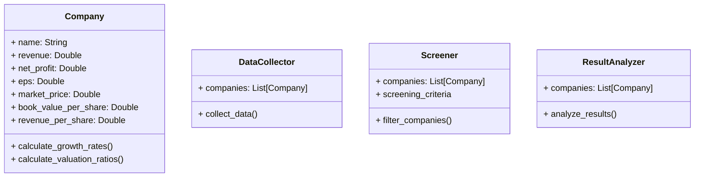
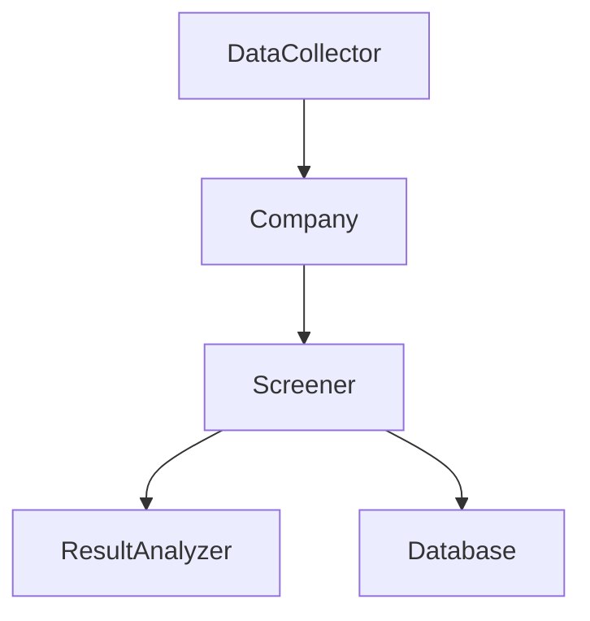
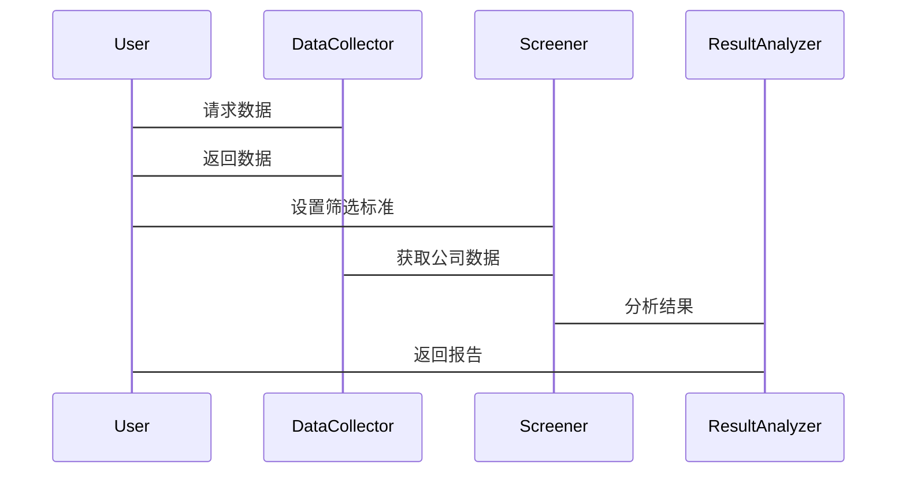

                 


# 彼得林奇的"高增长低估值"在不同行业周期中的筛选

> 关键词：彼得林奇，高增长，低估值，行业周期，投资策略，筛选标准

> 摘要：本文详细探讨了彼得林奇提出的“高增长低估值”投资策略，并分析了该策略在不同行业周期中的筛选方法。通过结合行业周期的特点，本文提出了具体的筛选标准和数学模型，并通过实际案例展示了如何在不同行业周期中应用这一策略。

---

## 第一部分: 彼得林奇的高增长低估值策略概述

### 第1章: 高增长低估值策略的背景与概念

#### 1.1 高增长低估值策略的定义

##### 1.1.1 高增长公司的特征

高增长公司通常表现出以下特征：
- **收入增长率**：公司收入连续多年保持高速增长，通常高于行业平均水平。
- **净利润增长率**：公司净利润持续增长，盈利能力不断增强。
- **市场份额扩张**：公司在市场中占据更大的份额，或通过新产品、新市场实现扩张。
- **创新能力**：公司具备较强的创新能力，能够推出新产品或服务。

##### 1.1.2 低估值公司的特征

低估值公司通常表现出以下特征：
- **市盈率（P/E）**：市盈率低于行业平均水平，意味着股票价格相对于每股收益较低。
- **市净率（P/B）**：市净率低于行业平均水平，表明股票价格相对于每股净资产较低。
- **市销率（P/S）**：市销率低于行业平均水平，意味着股票价格相对于每股销售额较低。
- **股息收益率**：股息收益率较高，表明公司愿意将部分利润返还给股东。

##### 1.1.3 高增长与低估值的内在联系

高增长和低估值之间存在一定的内在联系。高增长公司通常由于未来的高增长潜力，市场会给予较高的估值，但这与低估值的特性相矛盾。因此，筛选高增长低估值公司需要在两者之间找到平衡点，既要确保公司具备持续增长的能力，又要确保其估值处于合理水平。

#### 1.2 彼得林奇投资理念的核心

##### 1.2.1 彼得林奇的选股方法

彼得林奇是美国著名的投资经理，以其独特的选股方法闻名。他的选股方法主要包括以下几个方面：
- **基本面分析**：彼得林奇非常注重对公司基本面的分析，包括财务报表、管理层能力、行业地位等。
- **成长与价值结合**：他寻找那些具有高增长潜力但估值较低的公司，这种结合成长与价值的投资策略成为他成功的关键。
- **长期投资**：彼得林奇倾向于长期持有优质股票，避免频繁交易。

##### 1.2.2 高增长低估值策略的起源

彼得林奇的高增长低估值策略源于他对市场的深刻理解。他认为，市场中存在许多被低估的高增长公司，这些公司由于市场忽视或行业周期的影响，其估值可能低于其实际价值。通过筛选这些公司，投资者可以在市场低估时买入，在市场高估时卖出。

##### 1.2.3 该策略在投资中的优势

该策略的主要优势在于：
- **风险较低**：高增长公司具备较强的盈利能力，低估值公司具备较高的安全边际，两者结合可以降低投资风险。
- **收益较高**：高增长公司通常具备较高的上涨潜力，低估值公司在市场回升时可能有较大的反弹空间。
- **长期收益**：通过长期持有优质股票，投资者可以享受公司成长带来的收益。

#### 1.3 行业周期对策略的影响

##### 1.3.1 行业周期的基本概念

行业周期是指一个行业从衰退到复苏，再到繁荣，最后再到衰退的循环过程。行业周期通常分为以下几个阶段：
- **衰退阶段**：行业需求下降，企业盈利能力减弱。
- **复苏阶段**：行业需求逐步恢复，企业盈利能力开始回升。
- **繁荣阶段**：行业需求旺盛，企业盈利能力达到高峰。
- **衰退阶段**：行业需求再次下降，企业盈利能力减弱。

##### 1.3.2 不同行业周期下的策略调整

在不同的行业周期中，高增长低估值策略的应用需要进行相应的调整：
- **衰退阶段**：在行业衰退阶段，应选择那些具备强大抗压能力的公司，这些公司可能估值较低，但具备在未来复苏时的高增长潜力。
- **复苏阶段**：在行业复苏阶段，应选择那些需求开始回升，且具备较高增长潜力的公司。
- **繁荣阶段**：在行业繁荣阶段，应选择那些估值已经较高的公司，但具备持续增长能力的公司。
- **衰退阶段**：在行业衰退阶段，应选择那些估值较低，但具备较强抗压能力的公司。

##### 1.3.3 经济周期与行业周期的关系

经济周期与行业周期密切相关。在经济繁荣时期，大多数行业都会进入繁荣阶段；在经济衰退时期，大多数行业都会进入衰退阶段。因此，投资者需要结合宏观经济环境来分析行业周期，并相应调整高增长低估值策略。

---

### 第2章: 高增长低估值策略的核心要素

#### 2.1 高增长公司的识别标准

##### 2.1.1 收入增长率

收入增长率是衡量公司增长能力的重要指标。计算公式如下：
$$
收入增长率 = \frac{收入_{current} - 收入_{previous}}{收入_{previous}} \times 100\%
$$

例如，某公司上一年收入为1000万元，今年收入为1200万元，收入增长率为：
$$
收入增长率 = \frac{1200 - 1000}{1000} \times 100\% = 20\%
$$

##### 2.1.2 净利润增长率

净利润增长率是衡量公司盈利能力增长的重要指标。计算公式如下：
$$
净利润增长率 = \frac{净利润_{current} - 净利润_{previous}}{净利润_{previous}} \times 100\%
$$

例如，某公司上一年净利润为500万元，今年净利润为600万元，净利润增长率为：
$$
净利润增长率 = \frac{600 - 500}{500} \times 100\% = 20\%
$$

##### 2.1.3 资产回报率

资产回报率（ROA）是衡量公司资产使用效率的重要指标。计算公式如下：
$$
ROA = \frac{净利润}{平均总资产}
$$

例如，某公司净利润为500万元，平均总资产为5000万元，资产回报率为：
$$
ROA = \frac{500}{5000} = 10\%
$$

#### 2.2 低估值公司的识别标准

##### 2.2.1 市盈率（P/E）

市盈率是衡量公司估值的重要指标之一。计算公式如下：
$$
P/E = \frac{股价}{每股收益（EPS）}
$$

例如，某公司股价为20元，每股收益为2元，市盈率为：
$$
P/E = \frac{20}{2} = 10
$$

##### 2.2.2 市净率（P/B）

市净率是衡量公司估值的另一个重要指标。计算公式如下：
$$
P/B = \frac{股价}{每股净资产（BPS）}
$$

例如，某公司股价为20元，每股净资产为5元，市净率为：
$$
P/B = \frac{20}{5} = 4
$$

##### 2.2.3 市销率（P/S）

市销率是衡量公司估值的第三种重要指标。计算公式如下：
$$
P/S = \frac{股价}{每股销售额（Revenue per share）}
$$

例如，某公司股价为20元，每股销售额为4元，市销率为：
$$
P/S = \frac{20}{4} = 5
$$

#### 2.3 高增长与低估值的平衡点

##### 2.3.1 高增长但估值过高的风险

如果一家公司增长潜力大，但估值过高，投资者可能会面临较高的投资风险。例如，某科技公司收入和净利润均增长30%，但市盈率高达50倍，远高于行业平均水平。这种情况下，虽然公司具备高增长潜力，但过高的估值可能导致投资回报低于预期。

##### 2.3.2 低估值但增长停滞的风险

如果一家公司估值较低，但增长潜力有限，投资者可能会面临资产无法增值的风险。例如，某传统制造公司市盈率为8倍，低于行业平均水平，但收入和净利润增长率仅为5%，且行业处于衰退阶段。这种情况下，虽然公司估值较低，但增长潜力有限，投资回报可能不佳。

##### 2.3.3 如何找到最佳平衡点

找到高增长与低估值的最佳平衡点，需要综合考虑以下几个方面：
- **行业周期**：在不同的行业周期中，高增长与低估值的平衡点不同。例如，在经济衰退时期，可能更注重低估值；在经济复苏时期，可能更注重高增长。
- **公司基本面**：需要综合分析公司的收入增长率、净利润增长率、资产回报率等财务指标，以及公司的行业地位、管理层能力等非财务因素。
- **市场环境**：需要结合当前的市场环境，包括整体市场的估值水平、投资者情绪等。

#### 2.4 核心概念对比表

| 核心概念 | 高增长 | 低估值 |
|----------|--------|--------|
| 收入增长率 | 高     | 无特定要求 |
| 净利润增长率 | 高     | 无特定要求 |
| 市盈率 | 无特定要求 | 低     |
| 市净率 | 无特定要求 | 低     |
| 市销率 | 无特定要求 | 低     |

#### 2.5 本章小结

本章详细介绍了高增长低估值策略的核心要素，包括高增长公司的识别标准和低估值公司的识别标准，并通过对比表展示了两者的区别和联系。同时，本章还强调了在实际应用中需要综合考虑行业周期、公司基本面和市场环境，以找到高增长与低估值的最佳平衡点。

---

## 第三部分: 高增长低估值策略的数学模型与算法

### 第3章: 高增长低估值策略的数学模型与算法

#### 3.1 高增长公司的筛选模型

##### 3.1.1 收入增长率公式

$$
收入增长率 = \frac{收入_{current} - 收入_{previous}}{收入_{previous}} \times 100\%
$$

##### 3.1.2 净利润增长率公式

$$
净利润增长率 = \frac{净利润_{current} - 净利润_{previous}}{净利润_{previous}} \times 100\%
$$

##### 3.1.3 资产回报率公式

$$
ROA = \frac{净利润}{平均总资产}
$$

#### 3.2 低估值公司的筛选模型

##### 3.2.1 市盈率公式

$$
P/E = \frac{股价}{每股收益（EPS）}
$$

##### 3.2.2 市净率公式

$$
P/B = \frac{股价}{每股净资产（BPS）}
$$

##### 3.2.3 市销率公式

$$
P/S = \frac{股价}{每股销售额（Revenue per share）}
$$

#### 3.3 高增长低估值策略的数学模型

##### 3.3.1 综合评分模型

为了综合考虑高增长和低估值的双重因素，可以采用综合评分模型。具体步骤如下：
1. 计算公司收入增长率、净利润增长率和资产回报率，分别赋予不同的权重（例如，收入增长占40%，净利润增长占30%，资产回报率占30%）。
2. 计算公司市盈率、市净率和市销率，分别赋予不同的权重（例如，市盈率占40%，市净率占30%，市销率占30%）。
3. 将高增长评分和低估值评分分别标准化（例如，满分100分），然后计算综合评分。

综合评分公式如下：
$$
综合评分 = 高增长评分 \times 0.5 + 低估值评分 \times 0.5
$$

##### 3.3.2 标准化处理

为了确保不同指标的可比性，需要对各指标进行标准化处理。例如，可以采用Z-score标准化方法：
$$
Z = \frac{X - \mu}{\sigma}
$$
其中，$X$ 是原始数据，$\mu$ 是均值，$\sigma$ 是标准差。

---

## 第四部分: 高增长低估值策略的系统分析与架构设计

### 第4章: 高增长低估值策略的系统分析与架构设计

#### 4.1 问题场景介绍

为了验证高增长低估值策略的有效性，我们可以设计一个系统来筛选符合该策略的公司。该系统需要满足以下需求：
- 能够获取公司财务数据，包括收入、净利润、市盈率、市净率等。
- 能够计算收入增长率、净利润增长率、资产回报率等指标。
- 能够计算市盈率、市净率、市销率等估值指标。
- 能够根据筛选标准，筛选出符合条件的公司。

#### 4.2 系统功能设计

##### 4.2.1 领域模型

以下是领域模型的类图：



##### 4.2.2 系统架构设计

以下是系统架构设计的架构图：



##### 4.2.3 系统接口设计

系统接口设计包括以下内容：
- 数据采集接口：用于从数据库或外部数据源获取公司数据。
- 筛选接口：用于根据筛选标准筛选符合条件的公司。
- 分析接口：用于对筛选结果进行分析，生成报告。

##### 4.2.4 系统交互设计

以下是系统交互的序列图：



---

## 第五部分: 高增长低估值策略的项目实战

### 第5章: 高增长低估值策略的项目实战

#### 5.1 环境安装

为了实现高增长低估值策略的筛选系统，需要以下环境：
- Python 3.8+
- 数据分析库：pandas、numpy
- 可视化库：matplotlib、seaborn
- 数据采集工具：爬虫或API接口

#### 5.2 核心实现

以下是实现高增长低估值策略的核心代码：

```python
import pandas as pd
import numpy as np

# 定义公司类
class Company:
    def __init__(self, name, revenue, net_profit, eps, market_price, book_value, revenue_per_share):
        self.name = name
        self.revenue = revenue
        self.net_profit = net_profit
        self.eps = eps
        self.market_price = market_price
        self.book_value = book_value
        self.revenue_per_share = revenue_per_share

    def calculate_growth_rates(self):
        # 计算收入增长率
        revenue_growth = ((self.revenue - self.revenue.shift(1)) / self.revenue.shift(1)).mean() * 100
        # 计算净利润增长率
        net_profit_growth = ((self.net_profit - self.net_profit.shift(1)) / self.net_profit.shift(1)).mean() * 100
        # 计算资产回报率
        roa = (self.net_profit / (self.revenue / 2)).mean()
        return revenue_growth, net_profit_growth, roa

    def calculate_valuation_ratios(self):
        # 计算市盈率
        pe = self.market_price / self.eps
        # 计算市净率
        pb = self.market_price / (self.book_value / 1000000)
        # 计算市销率
        ps = self.market_price / self.revenue_per_share
        return pe, pb, ps

# 数据采集函数
def collect_data(companies):
    # 假设从数据库或API获取数据
    pass

# 筛选函数
def screen_companies(companies, min_revenue_growth=20, min_net_profit_growth=10, max_pe=15, max_pb=2, max_ps=1.5):
    screened_companies = []
    for company in companies:
        revenue_growth, net_profit_growth, roa = company.calculate_growth_rates()
        pe, pb, ps = company.calculate_valuation_ratios()
        if (revenue_growth >= min_revenue_growth and
            net_profit_growth >= min_net_profit_growth and
            pe <= max_pe and
            pb <= max_pb and
            ps <= max_ps):
            screened_companies.append(company)
    return screened_companies

# 结果分析函数
def analyze_results(screened_companies):
    # 分析筛选结果，生成报告
    pass
```

#### 5.3 代码应用解读与分析

以下是代码的解读与分析：
- **公司类**：定义了公司的基本属性和方法，包括计算增长率和估值比率。
- **数据采集函数**：从数据库或API获取公司数据。
- **筛选函数**：根据预设的筛选标准，筛选出符合条件的公司。
- **结果分析函数**：对筛选结果进行分析，生成报告。

#### 5.4 实际案例分析

以下是实际案例分析：
- **行业选择**：选择科技行业作为分析对象。
- **筛选标准**：
  - 收入增长率 ≥ 20%
  - 净利润增长率 ≥ 10%
  - 市盈率 ≤ 15
  - 市净率 ≤ 2
  - 市销率 ≤ 1.5
- **筛选结果**：筛选出符合标准的公司列表。

#### 5.5 项目小结

本章通过实际案例分析，展示了如何在科技行业中应用高增长低估值策略，并通过代码实现筛选过程。通过实际操作，可以更好地理解该策略的应用方法和注意事项。

---

## 第六部分: 高增长低估值策略的最佳实践

### 第6章: 高增长低估值策略的最佳实践

#### 6.1 小结

本章总结了高增长低估值策略的核心要点和实际应用中的注意事项，包括：
- 筛选标准的设置需要结合行业周期和市场环境。
- 需要综合考虑公司的基本面和估值指标。
- 在实际操作中，建议采用综合评分模型来平衡高增长和低估值。

#### 6.2 注意事项

在实际应用中，需要注意以下几点：
- **数据准确性**：确保数据来源可靠，避免因数据错误导致筛选结果偏差。
- **行业周期影响**：在不同行业周期中，高增长和低估值的平衡点不同，需要进行相应的调整。
- **市场环境变化**：市场环境的变化可能会影响公司的估值和增长潜力，需要及时调整筛选标准。

#### 6.3 拓展阅读

为了进一步深入理解高增长低估值策略，可以阅读以下书籍：
- 《彼得林奇选股术》
- 《价值投资实战指南》
- 《投资学原理》

---

## 第七部分: 作者信息

**作者：AI天才研究院/AI Genius Institute & 禅与计算机程序设计艺术/Zen And The Art of Computer Programming**

---

以上是《彼得林奇的"高增长低估值"在不同行业周期中的筛选》的技术博客文章的完整内容。

