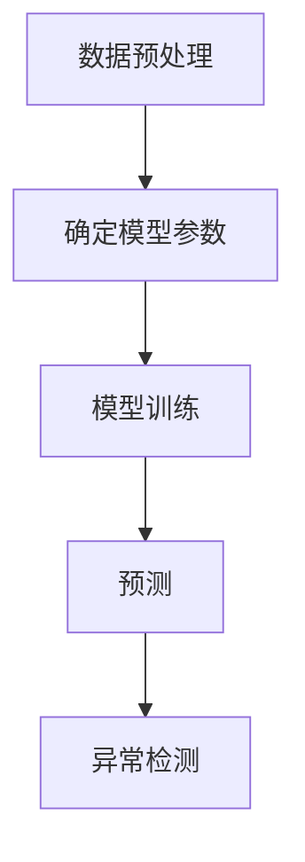
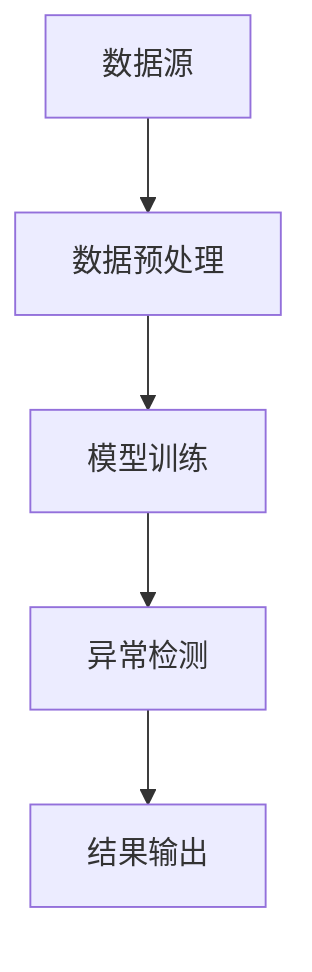

                 


# 《金融时间序列异常检测与处理》

> 关键词：金融时间序列，异常检测，机器学习，深度学习，统计模型

> 摘要：本文深入探讨金融时间序列异常检测的核心概念、算法原理及实际应用。从基础理论到高级算法，结合实际案例，全面解析金融时间序列异常检测的实现方法与最佳实践，帮助读者掌握这一领域的核心技术与应用技巧。

---

## 第1章: 金融时间序列异常检测概述

### 1.1 金融时间序列的基本概念

#### 1.1.1 时间序列的定义与特点
时间序列是指按照时间顺序记录的一组数据，通常用于描述随时间变化的动态过程。金融时间序列具有以下几个特点：
- **连续性**：金融数据通常按固定的时间间隔记录，如分钟、小时、天、周等。
- **波动性**：金融市场的数据往往表现出较大的波动性，受到多种因素的影响。
- **周期性**：许多金融数据呈现出一定的周期性，如月度的经济周期、季度的市场波动等。
- **趋势性**：长期来看，某些金融资产的价格可能呈现上升或下降的趋势。

#### 1.1.2 金融时间序列的特殊性
金融时间序列的特殊性主要体现在以下几个方面：
- **非线性**：金融市场的价格波动通常是非线性的，难以用简单的线性模型描述。
- **异质性**：金融数据的分布可能不均匀，存在长尾分布或尖峰分布。
- **相关性**：金融资产之间的价格波动往往存在相关性，尤其是在市场波动加剧时。

#### 1.1.3 异常检测在金融领域的应用价值
异常检测在金融领域的应用价值主要体现在以下几个方面：
- **风险管理**：及时发现异常交易或价格波动，有助于防范金融风险。
- **欺诈 detection**：识别异常交易行为，帮助发现潜在的欺诈行为。
- **市场监控**：监控市场整体波动，发现异常市场行为，维护市场秩序。

### 1.2 金融时间序列异常检测的背景与挑战

#### 1.2.1 异常检测的基本概念
异常检测是指通过分析数据，识别出与正常数据显著不同的数据点或模式。在金融领域，异常检测的核心目标是识别那些可能影响市场稳定或带来风险的异常事件。

#### 1.2.2 金融领域异常检测的特殊性
金融领域的异常检测具有以下特殊性：
- **数据复杂性**：金融数据通常具有高维性、非线性和时变性。
- **高噪声**：金融市场数据中存在大量的噪声，这使得异常检测的准确性成为一个挑战。
- **实时性要求**：金融交易通常需要实时处理，异常检测算法需要在极短的时间内完成。

#### 1.2.3 异常检测的主要挑战
异常检测在金融领域的应用面临以下主要挑战：
- **数据稀疏性**：某些异常事件可能非常罕见，导致模型难以有效学习。
- **概念漂移**：金融市场的环境可能会随着时间变化，模型需要不断更新以适应新的数据分布。
- **计算效率**：实时处理金融数据需要高效的计算能力，这对算法的时间复杂度提出了更高的要求。

### 1.3 金融时间序列异常检测的应用场景

#### 1.3.1 金融市场监控
金融市场监控是异常检测的重要应用场景。通过实时监控市场数据，可以及时发现异常波动，防止市场操纵和异常交易行为。

#### 1.3.2 风险管理
风险管理是金融领域的重要任务。通过异常检测，可以识别潜在的市场风险，帮助机构制定有效的风险管理策略。

#### 1.3.3 交易行为分析
交易行为分析是研究投资者行为的重要手段。通过分析交易数据，可以识别异常交易行为，帮助发现潜在的市场操纵行为。

### 1.4 本章小结
本章从金融时间序列的基本概念入手，介绍了金融时间序列的特殊性以及异常检测在金融领域的应用价值。同时，分析了异常检测在金融领域的背景与挑战，并总结了异常检测的主要应用场景。

---

## 第2章: 时间序列的基本特征与异常定义

### 2.1 时间序列的特征分解

#### 2.1.1 趋势与周期性
趋势是指时间序列数据在长期内的总体走势，而周期性是指数据在固定时间段内重复出现的模式。例如，许多股票价格可能会在每年的某个特定时间段内出现上涨或下跌的趋势。

#### 2.1.2 季节性与随机性
季节性是指数据在特定时间段内表现出的规律性波动，而随机性则是指数据中无法用任何模式描述的随机波动。

#### 2.1.3 异常点的特征分析
异常点通常表现出以下特征：
- **孤立性**：异常点通常远离正常数据点。
- **突变性**：异常点可能在短时间内发生突变，导致数据分布的变化。
- **局部性**：异常点通常只在特定的局部区域出现。

### 2.2 异常的定义与分类

#### 2.2.1 异常的定义
异常是指在正常数据分布中出现的概率极低的数据点或模式。在金融领域，异常通常指那些可能对市场或交易行为产生重大影响的事件。

#### 2.2.2 异常的分类
异常可以分为以下几类：
- **点异常**：单个数据点的异常，例如某只股票的价格突然出现剧烈波动。
- **上下文异常**：相对于某个上下文环境的异常，例如某只股票的价格相对于其历史价格出现异常。
- **群体异常**：群体数据的异常，例如某段时间内多只股票的价格同时出现异常波动。

#### 2.2.3 异常检测的评价指标
常用的异常检测评价指标包括：
- **准确率**：正确识别的异常点占所有异常点的比例。
- **召回率**：识别到的异常点占实际存在的异常点的比例。
- **F1分数**：准确率和召回率的调和平均数。

### 2.3 异常检测的核心概念与联系

#### 2.3.1 核心概念原理
异常检测的核心原理在于通过建模正常数据的分布，识别出与正常数据分布显著不同的数据点。

#### 2.3.2 概念属性特征对比表格
以下是一个概念属性特征对比表格：

| 概念       | 描述                                                                 |
|------------|--------------------------------------------------------------------|
| 正常数据   | 符合正常分布的数据点                                               |
| 异常数据   | 不符合正常分布的数据点                                             |
| 点异常     | 单个数据点的异常                                                   |
| 上下文异常 | 相对于某个上下文环境的异常                                           |
| 群体异常   | 多个数据点同时出现的异常                                             |

#### 2.3.3 ER实体关系图架构
以下是一个简单的ER实体关系图架构：

```mermaid
erd
  entity 异常检测 {
    id 码
    属性 概念
  }
  entity 正常数据 {
    id 码
    属性 概念
  }
  entity 点异常 {
    id 码
    属性 概念
  }
  entity 上下文异常 {
    id 码
    属性 概念
  }
  entity 群体异常 {
    id 码
    属性 概念
  }
```

### 2.4 本章小结
本章详细分析了时间序列的基本特征，介绍了异常的定义与分类，并通过对比表格和ER实体关系图展示了异常检测的核心概念与联系。

---

## 第3章: 时间序列模型与异常检测算法

### 3.1 线性模型

#### 3.1.1 ARIMA模型
ARIMA（自回归积分滑动平均模型）是一种广泛应用于时间序列预测的线性模型。其基本原理是通过自回归和滑动平均的组合来捕捉时间序列的趋势和周期性。

#### 3.1.2 线性回归模型
线性回归模型是一种简单的时间序列预测模型，假设时间序列的变化服从线性关系。

#### 3.1.3 模型优缺点对比
以下是线性模型的优缺点对比：

| 模型       | 优点                                                                 | 缺点                                                                 |
|------------|----------------------------------------------------------------------|----------------------------------------------------------------------|
| ARIMA      | 能够捕捉时间序列的趋势和周期性                                         | 对非线性时间序列的建模能力较弱                                         |
| 线性回归   | 模型简单，易于实现                                                     | 对时间序列的复杂性建模能力较弱                                         |

### 3.2 非线性模型

#### 3.2.1 LSTM模型
LSTM（长短期记忆网络）是一种基于深度学习的时间序列模型，能够有效捕捉时间序列的长期依赖关系。

#### 3.2.2 GRU模型
GRU（门控循环单元）是另一种基于深度学习的时间序列模型，通过门控机制来捕捉时间序列的变化。

#### 3.2.3 模型优缺点对比
以下是非线性模型的优缺点对比：

| 模型       | 优点                                                                 | 缺点                                                                 |
|------------|----------------------------------------------------------------------|----------------------------------------------------------------------|
| LSTM       | 能够捕捉时间序列的长期依赖关系                                       | 计算复杂度较高                                                       |
| GRU        | 计算复杂度较低                                                       | 对某些时间序列的建模能力可能不如LSTM                                    |

### 3.3 统计模型

#### 3.3.1 Z-Score
Z-Score是一种常用的统计方法，通过计算数据点与均值的距离标准化值来识别异常点。

#### 3.3.2 LOF算法
LOF（局部 outlier factor）算法是一种基于密度的局部异常检测算法，能够识别局部区域内的异常点。

#### 3.3.3 模型优缺点对比
以下是统计模型的优缺点对比：

| 模型       | 优点                                                                 | 缺点                                                                 |
|------------|----------------------------------------------------------------------|----------------------------------------------------------------------|
| Z-Score    | 计算简单，易于实现                                                   | 对异常点的检测能力可能受到数据分布的影响                               |
| LOF        | 能够识别局部异常点                                                   | 计算复杂度较高                                                       |

### 3.4 机器学习模型

#### 3.4.1 Isolation Forest
Isolation Forest是一种基于树的异常检测算法，通过构建隔离树来识别异常点。

#### 3.4.2 Autoencoders
Autoencoders是一种基于深度学习的无监督学习算法，通过重构输入数据来识别异常点。

#### 3.4.3 模型优缺点对比
以下是机器学习模型的优缺点对比：

| 模型       | 优点                                                                 | 缺点                                                                 |
|------------|----------------------------------------------------------------------|----------------------------------------------------------------------|
| Isolation Forest | 计算效率较高，适合大数据集                                         | 对异常点的检测能力可能受到数据分布的影响                               |
| Autoencoders | 能够捕捉数据的高层次特征                                             | 计算复杂度较高                                                       |

### 3.5 算法原理与流程图

#### 3.5.1 算法原理
以ARIMA模型为例，其基本原理是通过自回归和滑动平均的组合来预测未来的时间序列值。

#### 3.5.2 算法流程图
以下是ARIMA模型的流程图：



### 3.6 本章小结
本章详细介绍了时间序列模型与异常检测算法，分析了线性模型、非线性模型、统计模型和机器学习模型的优缺点，并通过流程图展示了算法的原理与实现步骤。

---

## 第4章: 金融时间序列异常检测的系统架构设计

### 4.1 系统功能设计

#### 4.1.1 数据预处理
数据预处理是异常检测的第一步，包括数据清洗、数据标准化等步骤。

#### 4.1.2 模型训练
模型训练是异常检测的核心步骤，需要选择合适的模型并进行参数调优。

#### 4.1.3 异常检测
异常检测是通过模型对数据进行预测，识别出异常点。

### 4.2 系统架构设计

#### 4.2.1 系统架构图
以下是系统的架构图：



#### 4.2.2 系统功能模块
系统功能模块包括数据预处理模块、模型训练模块、异常检测模块和结果输出模块。

### 4.3 本章小结
本章详细分析了金融时间序列异常检测系统的功能设计与架构设计，展示了系统的整体结构与各模块之间的关系。

---

## 第5章: 金融时间序列异常检测的项目实战

### 5.1 项目背景与目标
本项目旨在通过实际案例，展示金融时间序列异常检测的实现过程。

### 5.2 项目实现

#### 5.2.1 环境安装
需要安装的主要工具包括Python、NumPy、Pandas、Scikit-learn等。

#### 5.2.2 代码实现
以下是实现异常检测的Python代码示例：

```python
import numpy as np
import pandas as pd
from sklearn.ensemble import IsolationForest

# 数据加载
data = pd.read_csv('financial_data.csv')

# 数据预处理
data_processed = data[['price', 'volume']]

# 模型训练
model = IsolationForest(n_estimators=100, contamination=0.05)
model.fit(data_processed)

# 异常检测
outlier_flag = model.predict(data_processed)
outlier_indices = np.where(outlier_flag == -1)[0]

# 结果输出
print("异常点索引：", outlier_indices)
```

### 5.3 案例分析
通过具体案例分析，展示了异常检测在金融时间序列中的应用。

### 5.4 本章小结
本章通过项目实战，详细展示了金融时间序列异常检测的实现过程，包括环境安装、代码实现和案例分析。

---

## 第6章: 金融时间序列异常检测的最佳实践

### 6.1 核心技术总结
总结金融时间序列异常检测的核心技术与关键点。

### 6.2 实践 tips
提供一些实用的建议和技巧，帮助读者更好地实现异常检测。

### 6.3 本章小结
本章总结了金融时间序列异常检测的最佳实践，提供了实用的建议和技巧。

---

## 作者信息

作者：AI天才研究院/AI Genius Institute & 禅与计算机程序设计艺术/Zen And The Art of Computer Programming

---

以上是《金融时间序列异常检测与处理》的完整大纲和部分内容，希望对您有所帮助！

