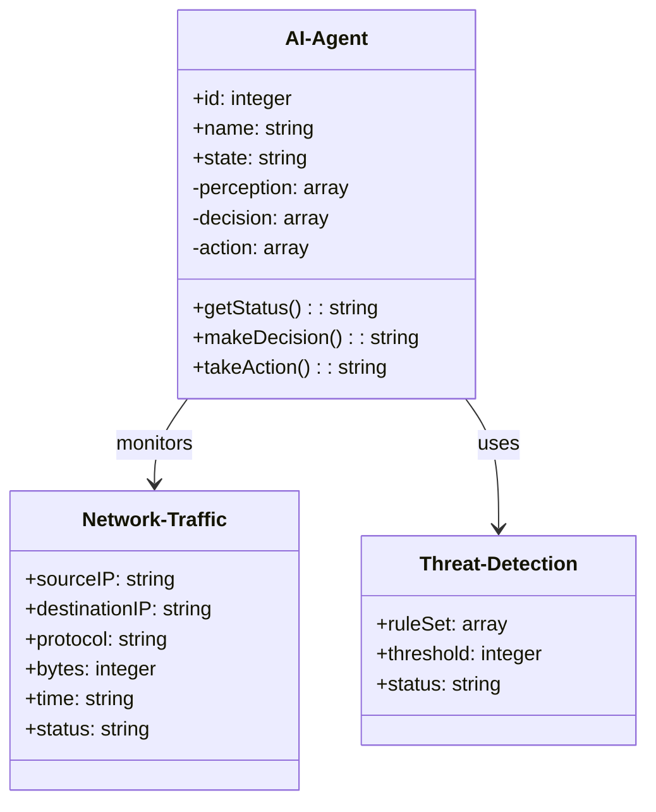
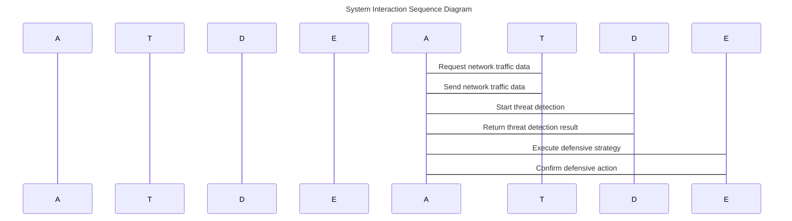

                 


# AI Agent在企业网络安全态势感知中的应用

> 关键词：AI Agent, 网络安全, 态势感知, 强化学习, 图神经网络

> 摘要：本文详细探讨了AI Agent在企业网络安全态势感知中的应用，分析了其核心概念、算法原理、系统架构设计以及实际项目实现。通过结合强化学习和图神经网络等技术，AI Agent能够有效提升网络安全态势感知的准确性和实时性，为企业提供智能化的安全防护解决方案。

---

## 第一部分：AI Agent与网络安全态势感知概述

### 第1章：AI Agent与网络安全态势感知概述

#### 1.1 AI Agent的基本概念

##### 1.1.1 AI Agent的定义与特点
AI Agent（人工智能代理）是指在计算机系统中，能够感知环境、自主决策并执行任务的智能实体。AI Agent的特点包括：
- **自主性**：能够在没有外部干预的情况下自主运行。
- **反应性**：能够实时感知环境变化并做出反应。
- **学习能力**：通过数据和经验不断优化自身的行为。
- **协作性**：能够与其他AI Agent或系统进行协作。

##### 1.1.2 AI Agent的核心属性与特征
AI Agent的核心属性包括：
- **感知能力**：通过传感器或数据源获取环境信息。
- **决策能力**：基于感知信息做出最优决策。
- **执行能力**：通过执行机构或接口实现决策。

AI Agent的特征对比如下：

| 特性 | 定义 | 示例 |
|------|------|------|
| 感知能力 | 能够获取环境信息 | 网络流量数据、日志记录 |
| 决策能力 | 基于感知信息做出选择 | 判断是否异常流量 |
| 执行能力 | 执行决策 | 发出警告或采取防御措施 |

##### 1.1.3 AI Agent在网络安全中的作用
AI Agent在网络安全中的作用主要体现在：
- **实时监控**：持续监测网络中的异常行为。
- **智能防御**：通过学习和推理，主动识别并应对威胁。
- **协同防护**：与其它安全系统协同工作，构建多层次的安全防护体系。

#### 1.2 网络安全态势感知的定义与特点

##### 1.2.1 网络安全态势感知的定义
网络安全态势感知（Cybersecurity Situation Awareness）是指通过收集、分析和理解网络安全相关数据，实时掌握网络系统的安全状态，并预测未来安全趋势的过程。

##### 1.2.2 网络安全态势感知的核心要素
网络安全态势感知的核心要素包括：
- **数据采集**：从网络设备、日志、流量中获取原始数据。
- **数据分析**：对数据进行处理、建模和分析，提取有价值的信息。
- **态势评估**：基于分析结果，评估当前网络安全状态。
- **预测与预警**：预测未来可能的安全威胁，并发出预警。

##### 1.2.3 网络安全态势感知的挑战与机遇
网络安全态势感知的挑战包括：
- **数据复杂性**：网络数据量大、类型多样，难以处理。
- **威胁动态性**：攻击者不断进化，威胁难以预测。
- **系统集成性**：需要整合多种安全工具和系统，集成复杂。

网络安全态势感知的机遇包括：
- **AI技术的进步**：AI Agent等技术的应用，显著提升了态势感知的效率和准确性。
- **大数据分析能力**：强大的数据处理能力为态势感知提供了有力支持。
- **智能化防御**：通过态势感知，可以实现主动防御和智能响应。

#### 1.3 AI Agent在网络安全态势感知中的应用前景

##### 1.3.1 AI Agent在网络安全态势感知中的优势
AI Agent在网络安全态势感知中的优势包括：
- **自主性**：能够独立运行，减少人工干预。
- **实时性**：能够快速响应网络安全事件。
- **学习能力**：通过不断学习，提升威胁检测和防御能力。

##### 1.3.2 AI Agent在网络安全态势感知中的应用场景
AI Agent在网络安全态势感知中的应用场景包括：
- **网络流量监控**：实时分析网络流量，识别异常行为。
- **威胁情报分析**：整合外部威胁情报，评估内部安全风险。
- **应急响应**：在发现威胁时，快速启动应急响应机制。

##### 1.3.3 AI Agent在网络安全态势感知中的未来发展趋势
AI Agent在网络安全态势感知中的未来发展趋势包括：
- **智能化**：进一步提升AI Agent的自主决策能力。
- **协同化**：与其他安全系统和AI Agent协同工作，构建智能化安全防护体系。
- **自适应性**：根据网络安全环境的变化，动态调整自身的行为策略。

---

## 第二部分：AI Agent与网络安全态势感知的核心概念

### 第2章：AI Agent与网络安全态势感知的核心概念

#### 2.1 AI Agent的核心概念

##### 2.1.1 AI Agent的感知机制
AI Agent的感知机制是其获取环境信息的关键部分，主要包括以下步骤：
1. **数据采集**：通过传感器、日志文件、网络流量等获取原始数据。
2. **数据预处理**：对数据进行清洗、归一化等处理，确保数据质量。
3. **特征提取**：从数据中提取有用的特征，用于后续分析。

##### 2.1.2 AI Agent的决策机制
AI Agent的决策机制是其根据感知信息做出决策的核心部分，主要包括：
1. **状态评估**：基于感知信息，评估当前状态。
2. **威胁分析**：分析潜在威胁的可能性和影响。
3. **决策制定**：根据分析结果，制定最优决策。

##### 2.1.3 AI Agent的执行机制
AI Agent的执行机制是其将决策转化为实际操作的关键部分，主要包括：
1. **行动规划**：制定具体的行动步骤。
2. **行动执行**：通过接口或代理执行机构，实施决策。
3. **反馈收集**：收集执行结果的反馈，用于优化决策。

#### 2.2 网络安全态势感知的核心概念

##### 2.2.1 网络安全态势感知的感知层
网络安全态势感知的感知层是其数据采集和初步分析的部分，主要包括：
1. **数据采集**：从网络设备、日志、流量中获取原始数据。
2. **数据预处理**：对数据进行清洗、归一化等处理。
3. **特征提取**：提取有助于态势分析的特征。

##### 2.2.2 网络安全态势感知的分析层
网络安全态势感知的分析层是其对数据进行深度分析的部分，主要包括：
1. **数据建模**：构建网络安全模型，用于分析威胁。
2. **威胁检测**：通过模型分析，识别潜在威胁。
3. **风险评估**：评估威胁的严重性和可能性。

##### 2.2.3 网络安全态势感知的决策层
网络安全态势感知的决策层是其根据分析结果制定策略的部分，主要包括：
1. **策略制定**：根据分析结果，制定防御策略。
2. **策略执行**：将策略转化为具体的行动。
3. **策略优化**：根据反馈，优化策略。

#### 2.3 AI Agent与网络安全态势感知的结合

##### 2.3.1 AI Agent在网络安全态势感知中的角色
AI Agent在网络安全态势感知中的角色包括：
- **数据采集者**：负责收集网络数据。
- **分析者**：负责分析数据，识别威胁。
- **决策者**：负责制定防御策略。
- **执行者**：负责执行防御措施。

##### 2.3.2 AI Agent与网络安全态势感知的协同机制
AI Agent与网络安全态势感知的协同机制包括：
1. **数据共享**：AI Agent与其他系统共享数据，实现信息协同。
2. **任务协作**：AI Agent与其他系统协同完成任务，如威胁应对。
3. **反馈优化**：AI Agent根据反馈优化自身行为，提升整体效能。

##### 2.3.3 AI Agent与网络安全态势感知的系统架构
AI Agent与网络安全态势感知的系统架构包括：
- **数据采集层**：负责数据的采集和预处理。
- **数据分析层**：负责数据的深度分析和威胁检测。
- **决策支持层**：负责制定和优化防御策略。
- **执行层**：负责策略的执行和反馈的收集。

---

## 第三部分：AI Agent在网络安全态势感知中的算法原理

### 第3章：AI Agent的感知算法

#### 3.1 AI Agent的感知算法

##### 3.1.1 基于强化学习的感知算法
基于强化学习的感知算法是一种通过试错机制不断优化感知能力的算法。其核心步骤包括：
1. **状态识别**：识别当前网络环境的状态。
2. **动作选择**：选择下一步动作。
3. **奖励机制**：根据结果给予奖励或惩罚，优化策略。

##### 3.1.2 基于图神经网络的感知算法
基于图神经网络的感知算法是一种通过图结构数据进行分析的算法。其核心步骤包括：
1. **图构建**：将网络数据转换为图结构。
2. **节点嵌入**：通过图神经网络提取节点特征。
3. **异常检测**：基于节点嵌入检测异常行为。

##### 3.1.3 基于深度学习的感知算法
基于深度学习的感知算法是一种通过神经网络进行特征学习的算法。其核心步骤包括：
1. **数据输入**：将原始数据输入神经网络。
2. **特征提取**：通过多层神经网络提取特征。
3. **分类或回归**：对数据进行分类或回归分析。

### 第4章：AI Agent的决策算法

#### 4.1 AI Agent的决策算法

##### 4.1.1 基于Q-learning的决策算法
基于Q-learning的决策算法是一种经典的强化学习算法，其核心步骤包括：
1. **状态转移**：根据当前状态和动作，转移到新的状态。
2. **Q值更新**：根据奖励更新Q值。
3. **策略选择**：根据Q值选择最优动作。

##### 4.1.2 基于策略梯度的决策算法
基于策略梯度的决策算法是一种通过优化策略参数来提升决策能力的算法。其核心步骤包括：
1. **策略参数化**：将策略表示为参数化的函数。
2. **梯度计算**：计算策略的梯度。
3. **参数更新**：根据梯度更新参数。

##### 4.1.3 基于规则的决策算法
基于规则的决策算法是一种通过预定义规则进行决策的算法。其核心步骤包括：
1. **规则定义**：定义具体的决策规则。
2. **规则匹配**：根据当前状态匹配规则。
3. **决策输出**：根据匹配规则输出决策。

### 第5章：AI Agent的执行算法

#### 5.1 AI Agent的执行算法

##### 5.1.1 基于反馈机制的执行算法
基于反馈机制的执行算法是一种通过实时反馈优化执行行为的算法。其核心步骤包括：
1. **反馈收集**：收集执行结果的反馈。
2. **策略调整**：根据反馈调整执行策略。
3. **持续优化**：不断优化执行行为。

##### 5.1.2 基于多智能体的执行算法
基于多智能体的执行算法是一种通过多个AI Agent协同执行任务的算法。其核心步骤包括：
1. **任务分配**：将任务分配给不同的AI Agent。
2. **协同执行**：多个AI Agent协同完成任务。
3. **协调与通信**：通过通信机制协调执行过程。

##### 5.1.3 基于强化学习的执行算法
基于强化学习的执行算法是一种通过强化学习优化执行行为的算法。其核心步骤包括：
1. **状态识别**：识别当前执行状态。
2. **动作选择**：选择下一步动作。
3. **奖励机制**：根据结果给予奖励或惩罚，优化策略。

---

## 第四部分：网络安全态势感知的系统架构设计

### 第6章：网络安全态势感知的系统架构设计

#### 6.1 网络安全态势感知的系统组成

##### 6.1.1 数据采集层
数据采集层是网络安全态势感知系统的数据来源部分，主要包括：
1. **网络设备**：如路由器、交换机等。
2. **日志系统**：如服务器日志、防火墙日志等。
3. **流量监控**：如网络流量数据、行为分析数据等。

##### 6.1.2 数据分析层
数据分析层是网络安全态势感知系统的核心部分，主要包括：
1. **数据预处理**：对数据进行清洗、归一化等处理。
2. **数据分析**：对数据进行统计分析、关联分析等。
3. **威胁检测**：通过分析数据，识别潜在威胁。

##### 6.1.3 决策支持层
决策支持层是网络安全态势感知系统的决策部分，主要包括：
1. **风险评估**：评估威胁的严重性和可能性。
2. **策略制定**：根据评估结果，制定防御策略。
3. **应急响应**：在发生威胁时，启动应急响应机制。

#### 6.2 AI Agent在系统架构中的位置

##### 6.2.1 AI Agent作为数据采集模块
AI Agent可以作为数据采集模块，负责从网络设备、日志系统等获取数据。

##### 6.2.2 AI Agent作为数据分析模块
AI Agent可以作为数据分析模块，负责对数据进行深度分析，识别威胁。

##### 6.2.3 AI Agent作为决策支持模块
AI Agent可以作为决策支持模块，负责制定防御策略，优化安全防护。

#### 6.3 系统架构的优化与实现

##### 6.3.1 系统架构的优化策略
系统架构的优化策略包括：
- **数据预处理**：通过数据清洗、归一化等处理，提高数据质量。
- **算法优化**：通过优化算法参数、选择合适的算法，提升分析效率。
- **系统集成**：通过集成多种安全工具和系统，构建智能化安全防护体系。

##### 6.3.2 系统架构的实现步骤
系统架构的实现步骤包括：
1. **需求分析**：明确系统需求和目标。
2. **系统设计**：设计系统的模块、接口和流程。
3. **系统实现**：根据设计，逐步实现各个模块。
4. **系统测试**：对系统进行测试，发现并解决问题。
5. **系统部署**：将系统部署到实际环境中，进行实际应用。

---

## 第五部分：项目实战与总结

### 第7章：项目实战

#### 7.1 项目背景与目标
项目背景：某企业希望通过引入AI Agent技术，提升其网络安全态势感知能力。
项目目标：实现基于AI Agent的网络安全态势感知系统，能够实时监控网络流量，识别异常行为，预测安全威胁，并制定防御策略。

#### 7.2 系统功能设计

##### 7.2.1 领域模型设计
领域模型设计如下：



##### 7.2.2 系统架构设计


##### 7.2.3 系统接口设计
系统接口设计如下：
- **数据接口**：AI-Agent与Network-Traffic-Collector之间的接口，用于数据获取。
- **分析接口**：AI-Agent与Threat-Detection之间的接口，用于威胁检测。
- **执行接口**：AI-Agent与Defense-Agent之间的接口，用于策略执行。

##### 7.2.4 系统交互设计



#### 7.3 核心代码实现

##### 7.3.1 环境安装与配置
环境安装与配置步骤如下：
1. **安装Python**：确保系统中安装了Python 3.8或更高版本。
2. **安装依赖库**：安装所需的依赖库，如TensorFlow、Keras、Scikit-learn等。
3. **安装框架**：安装所需的AI框架，如TensorFlow、Keras、Scikit-learn等。

##### 7.3.2 AI Agent核心代码实现

```python
import numpy as np
import tensorflow as tf
from tensorflow.keras import layers

class AIAgent:
    def __init__(self, input_dim, output_dim):
        self.model = self.build_model(input_dim, output_dim)
        self.model.compile(optimizer='adam', loss='binary_crossentropy', metrics=['accuracy'])
    
    def build_model(self, input_dim, output_dim):
        model = tf.keras.Sequential()
        model.add(layers.Dense(64, activation='relu', input_dim=input_dim))
        model.add(layers.Dense(32, activation='relu'))
        model.add(layers.Dense(output_dim, activation='sigmoid'))
        return model
    
    def train(self, x_train, y_train, epochs=100):
        self.model.fit(x_train, y_train, epochs=epochs, batch_size=32)
    
    def predict(self, x_test):
        return self.model.predict(x_test)
```

##### 7.3.3 网络安全态势感知系统实现

```python
class CyberSituationAwareness:
    def __init__(self, ai_agent):
        self.ai_agent = ai_agent
        self.data_collector = NetworkTrafficCollector()
        self.threat_detector = ThreatDetection()
    
    def monitor_traffic(self):
        traffic_data = self.data_collector.collect_data()
        return traffic_data
    
    def detect_threats(self, traffic_data):
        threat_score = self.threat_detector.detect(traffic_data)
        return threat_score
    
    def assess_risk(self, threat_score):
        if threat_score > 0.8:
            return 'High Risk'
        elif threat_score > 0.5:
            return 'Medium Risk'
        else:
            return 'Low Risk'
    
    def generate_alert(self, risk_level):
        if risk_level == 'High Risk':
            return 'Immediate action required'
        elif risk_level == 'Medium Risk':
            return 'Watch closely'
        else:
            return 'No action needed'
```

##### 7.3.4 实际案例分析
实际案例分析如下：
1. **数据采集**：从网络设备中采集流量数据，包括源IP、目的IP、协议类型、数据包大小、时间戳等。
2. **数据预处理**：对数据进行清洗、归一化处理，提取特征。
3. **模型训练**：使用训练数据训练AI Agent模型，使其能够识别正常流量和异常流量。
4. **威胁检测**：使用训练好的模型对实时流量进行检测，识别潜在威胁。
5. **风险评估**：根据检测结果，评估威胁的严重性。
6. **应急响应**：根据风险评估结果，启动相应的应急响应措施。

#### 7.4 项目小结
通过本项目，我们实现了基于AI Agent的网络安全态势感知系统，能够实时监控网络流量，识别异常行为，预测安全威胁，并制定防御策略。该系统具有以下优势：
- **高效性**：能够快速响应网络安全事件。
- **准确性**：通过AI技术，提升了威胁检测的准确率。
- **智能化**：能够自主学习和优化，适应不断变化的网络安全环境。

---

## 第六部分：总结与展望

### 第8章：总结与展望

#### 8.1 总结
本文详细探讨了AI Agent在企业网络安全态势感知中的应用，分析了其核心概念、算法原理、系统架构设计以及实际项目实现。通过结合强化学习和图神经网络等技术，AI Agent能够有效提升网络安全态势感知的准确性和实时性，为企业提供智能化的安全防护解决方案。

#### 8.2 展望
未来，随着AI技术的不断发展，AI Agent在网络安全态势感知中的应用将更加广泛和深入。以下是未来的发展方向：
- **智能化**：进一步提升AI Agent的自主决策能力，实现更智能化的安全防护。
- **协同化**：与其他安全系统和AI Agent协同工作，构建智能化安全防护体系。
- **自适应性**：根据网络安全环境的变化，动态调整自身的行为策略。
- **可解释性**：提升AI Agent的决策过程的可解释性，增强用户对系统的信任。

---

## 作者：AI天才研究院/AI Genius Institute & 禅与计算机程序设计艺术 /Zen And The Art of Computer Programming

---

通过以上结构，您可以开始撰写具体的章节内容，确保每个部分都详细展开，并包含必要的数学公式、代码示例、图表和解释。

