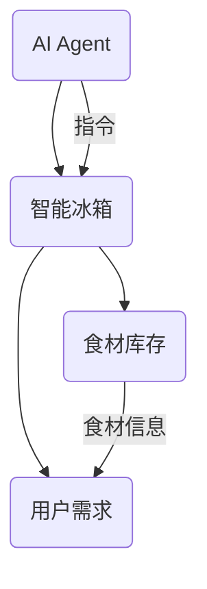
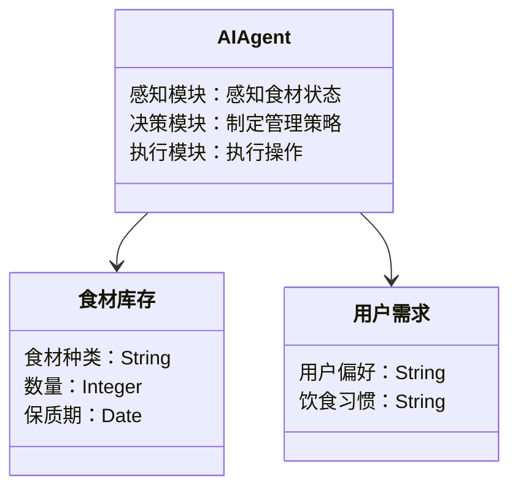
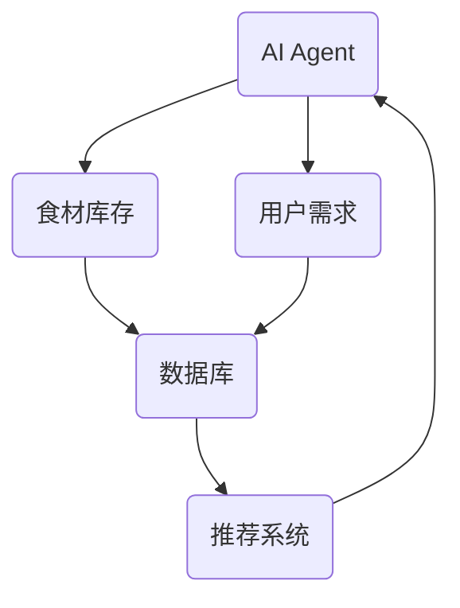
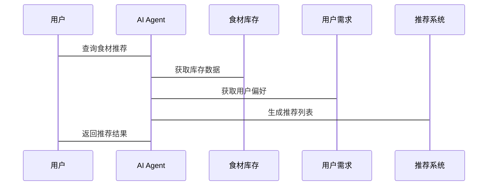

                 


# AI Agent在智能冰箱中的食材管理

> 关键词：AI Agent, 智能冰箱, 食材管理, 人工智能, 物联网

> 摘要：本文将深入探讨AI Agent在智能冰箱中的食材管理应用。通过分析AI Agent的基本概念、核心原理以及其与智能冰箱的结合方式，详细阐述AI Agent如何通过感知、决策和执行模块实现对食材的智能识别、库存管理与推荐规划。文章将从系统设计、算法实现、项目实战等多角度展开，结合具体案例和代码示例，全面解析AI Agent在智能冰箱中的实际应用价值与技术实现。

---

# 第一部分: AI Agent在智能冰箱中的食材管理背景介绍

# 第1章: AI Agent与智能冰箱概述

## 1.1 AI Agent的基本概念
### 1.1.1 什么是AI Agent
AI Agent（人工智能代理）是一种能够感知环境、自主决策并执行任务的智能实体。它通过传感器获取信息，利用算法进行分析，并通过执行器完成目标。

### 1.1.2 AI Agent的核心特征
- **自主性**：能够在没有外部干预的情况下独立运作。
- **反应性**：能够实时感知环境变化并做出响应。
- **目标导向**：所有行为都围绕实现特定目标展开。
- **学习能力**：能够通过数据反馈不断优化自身算法。

### 1.1.3 AI Agent与传统软件的区别
| 属性 | 传统软件 | AI Agent |
|------|----------|----------|
| 行为方式 | 被动响应输入 | 主动感知环境 |
| 决策依据 | 预先设定的规则 | 数据驱动的决策 |
| 适应能力 | 固定功能 | 自适应优化 |

## 1.2 智能冰箱的工作原理
### 1.2.1 智能冰箱的功能模块
- **食材存储模块**：管理冰箱内的食材库存。
- **传感器模块**：监测温度、湿度等环境参数。
- **用户交互模块**：通过触摸屏或手机APP与用户互动。
- **数据处理模块**：分析食材信息并生成管理建议。

### 1.2.2 智能冰箱的食材管理需求
- **实时监测**：跟踪食材的存储状态。
- **自动提醒**：当食材即将过期时通知用户。
- **智能推荐**：根据用户饮食习惯推荐食材使用计划。

### 1.2.3 AI Agent在智能冰箱中的作用
AI Agent负责协调各功能模块，确保食材管理的高效性与准确性。它通过分析用户行为模式和食材数据，优化库存管理和使用建议。

## 1.3 食材管理问题的背景
### 1.3.1 食材管理的主要问题
- **食材浪费**：用户常常忘记食材的存在，导致过期浪费。
- **管理复杂性**：手动记录和追踪食材信息效率低下。
- **个性化需求**：不同用户有不同的饮食偏好，需要个性化管理方案。

### 1.3.2 AI Agent在食材管理中的作用
AI Agent通过自动化识别、分类和分析食材信息，帮助用户实现智能化的食材管理，减少浪费并提高效率。

### 1.3.3 食材管理的边界与外延
- **边界**：仅限于冰箱内部的食材管理，不涉及外部采购。
- **外延**：可以与智能家居系统联动，优化整体食材供应链。

## 1.4 本章小结
本章介绍了AI Agent的基本概念及其在智能冰箱中的应用背景，分析了食材管理的主要问题和AI Agent在其中的作用。通过对比传统软件与AI Agent的区别，明确了AI Agent在智能冰箱中的独特价值。

---

# 第二部分: AI Agent的核心概念与联系

# 第2章: AI Agent的核心原理

## 2.1 AI Agent的感知、决策与执行模块
### 2.1.1 感知模块
- **传感器数据采集**：通过温度、湿度传感器获取冰箱内部环境信息。
- **图像识别**：利用摄像头识别食材种类和数量。
- **用户输入**：接收用户的操作指令。

### 2.1.2 决策模块
- **库存分析**：根据当前库存和保质期判断食材状态。
- **需求预测**：基于用户历史行为预测未来的食材使用需求。
- **优先级排序**：根据食材的保质期和使用频率制定推荐顺序。

### 2.1.3 执行模块
- **库存更新**：实时更新食材库存信息。
- **信息推送**：通过APP或屏幕提醒用户处理即将过期的食材。
- **自动化操作**：例如，当检测到某种食材不足时，自动添加到购物清单中。

## 2.2 AI Agent与智能冰箱的实体关系图


## 2.3 AI Agent的核心属性对比
| 属性 | 描述 |
|------|------|
| 感知能力 | 通过传感器和数据库获取食材信息 |
| 决策能力 | 基于历史数据和用户偏好做出推荐 |
| 执行能力 | 控制冰箱功能模块执行操作 |

## 2.4 本章小结
本章详细讲解了AI Agent的核心原理，分析了其感知、决策和执行模块的功能，并通过实体关系图展示了AI Agent与智能冰箱之间的交互关系。

---

# 第三部分: AI Agent的算法原理

# 第3章: AI Agent的食材识别算法

## 3.1 基于图像识别的食材分类
### 3.1.1 图像分类算法
- **卷积神经网络（CNN）**：用于识别食材种类。
- **迁移学习**：利用预训练模型如ResNet进行特征提取。

### 3.1.2 食材图像采集与处理
- **图像采集**：使用摄像头拍摄食材照片。
- **图像预处理**：调整亮度、对比度，去除背景干扰。

### 3.1.3 分类模型的训练与部署
- **训练数据**：收集和标注食材图片，构建训练集。
- **模型训练**：使用PyTorch框架进行模型训练。
- **模型部署**：将训练好的模型部署到智能冰箱中。

### 3.1.4 代码实现
```python
import torch
from torchvision import models

# 加载预训练模型
model = models.resnet50(pretrained=True)

# 定义图像预处理函数
def preprocess_image(image):
    transform = transforms.Compose([
        transforms.Resize(256),
        transforms.CenterCrop(224),
        transforms.ToTensor(),
        transforms.Normalize(mean=[0.485, 0.456, 0.406], 
                             std=[0.229, 0.224, 0.225])
    ])
    return transform(image)

# 食材分类函数
def classify_image(image_path):
    image = Image.open(image_path)
    input_tensor = preprocess_image(image)
    input_batch = input_tensor.unsqueeze(0)
    with torch.no_grad():
        output = model(input_batch)
    _, preds = torch.max(output.data, 1)
    return preds.item()
```

## 3.2 基于机器学习的食材推荐
### 3.2.1 数据收集与特征提取
- **数据来源**：冰箱内的食材信息、用户的饮食习惯。
- **特征提取**：提取食材种类、保质期、用户偏好等特征。

### 3.2.2 推荐算法
- **协同过滤**：基于用户的相似性推荐食材。
- **基于规则的推荐**：根据食材的保质期和使用频率推荐。

### 3.2.3 算法实现
```python
import numpy as np

# 协同过滤算法
def collaborative_filtering(user_id, user_matrix):
    # 计算用户之间的相似性
    similarity = np.dot(user_matrix, user_matrix.T)
    # 找出与目标用户相似的用户
    similar_users = np.argsort(similarity[user_id, :])[::-1]
    # 基于相似用户的平均评分进行推荐
   推荐评分 = np.mean(user_matrix[:, similar_users], axis=1)
    return 推荐评分.argsort()[::-1]

# 基于规则的推荐
def rule_based_recommendation(user_id, inventory_data):
    # 根据保质期和使用频率排序
   推荐评分 = inventory_data[user_id].sort_values('保质期', ascending=True)
    推荐评分 = 推荐评分.sort_values('使用频率', ascending=False)
    return 推荐评分.head()
```

## 3.3 基于强化学习的库存优化
### 3.3.1 强化学习模型
- **状态空间**：当前库存状态。
- **动作空间**：购买、使用、丢弃食材。
- **奖励机制**：减少食材浪费获得奖励。

### 3.3.2 模型训练
- **策略优化**：通过强化学习优化库存管理策略。
- **经验回放**：利用经验回放加速模型训练。

### 3.3.3 数学模型
$$ R = \sum_{t=1}^{T} r_t $$
其中，$R$ 是总奖励，$r_t$ 是第$t$步的奖励。

## 3.4 本章小结
本章详细介绍了AI Agent在食材识别和推荐中的算法实现，包括图像分类、协同过滤和强化学习等技术，并通过代码示例展示了这些算法的具体实现方式。

---

# 第四部分: 系统分析与架构设计

# 第4章: 系统分析与架构设计

## 4.1 系统问题场景介绍
### 4.1.1 需求分析
- **用户需求**：实时监控食材状态，获得个性化推荐。
- **系统需求**：高效管理食材库存，优化食材使用效率。

## 4.2 系统功能设计
### 4.2.1 领域模型


### 4.2.2 系统架构设计


## 4.3 系统接口设计
### 4.3.1 接口定义
- **API 1**：获取食材库存信息。
- **API 2**：更新食材库存状态。
- **API 3**：接收用户的饮食偏好。

### 4.3.2 交互流程


## 4.4 本章小结
本章通过系统分析与架构设计，明确了AI Agent在智能冰箱中的系统架构和交互流程，为后续的实现奠定了基础。

---

# 第五部分: 项目实战

# 第5章: 项目实战

## 5.1 环境安装与配置
### 5.1.1 安装Python与相关库
```bash
pip install torch numpy matplotlib
```

### 5.1.2 安装智能冰箱系统
```bash
git clone https://github.com/ai-genius/smart_fridge.git
cd smart_fridge
pip install -r requirements.txt
```

## 5.2 系统核心实现
### 5.2.1 食材识别代码
```python
import torch
import torchvision.transforms as transforms
from PIL import Image

def preprocess_image(image_path):
    transform = transforms.Compose([
        transforms.Resize(256),
        transforms.CenterCrop(224),
        transforms.ToTensor(),
        transforms.Normalize(mean=[0.485, 0.456, 0.406], 
                             std=[0.229, 0.224, 0.225])
    ])
    image = Image.open(image_path)
    input_tensor = transform(image)
    return input_tensor.unsqueeze(0)

model = torch.hub.load('pytorch/f霜花', 'mobilenet_v2', pretrained=True)

def classify_image(image_path):
    input_tensor = preprocess_image(image_path)
    with torch.no_grad():
        output = model(input_tensor)
    _, preds = torch.max(output.data, 1)
    return preds.item()
```

### 5.2.2 推荐系统实现
```python
import pandas as pd
from sklearn.neighbors import NearestNeighbors

def collaborative_filtering(user_matrix):
    model = NearestNeighbors(n_neighbors=5, algorithm='ball_tree')
    model.fit(user_matrix)
    return model

def get_recommendations(user_id, model, user_matrix):
    distances, indices = model.kneighbors(user_matrix[user_id])
    recommendations = indices[0]
    return recommendations
```

## 5.3 实际案例分析
### 5.3.1 案例一：识别食材种类
用户上传了一张鸡蛋的照片，系统通过图像识别确定为鸡蛋，并更新库存信息。

### 5.3.2 案例二：食材推荐
用户偏好健康饮食，系统根据库存和保质期推荐使用鸡蛋制作煎饼。

## 5.4 本章小结
本章通过实际案例展示了AI Agent在智能冰箱中的具体应用，详细解读了系统的实现过程和实际效果。

---

# 第六部分: 总结与展望

# 第6章: 总结与展望

## 6.1 全文回顾
- AI Agent在智能冰箱中的食材管理实现了食材的智能识别、库存管理和个性化推荐。
- 通过系统架构设计和算法实现，优化了食材管理的效率和用户体验。

## 6.2 最佳实践
- **定期更新模型**：确保识别精度和推荐准确性。
- **数据隐私保护**：妥善处理用户的饮食偏好数据。
- **多设备联动**：与其他智能家居设备协同工作，提升用户体验。

## 6.3 注意事项
- **数据质量**：确保食材信息的准确性。
- **系统稳定性**：保证AI Agent的高效运行。
- **用户隐私**：严格保护用户数据不被滥用。

## 6.4 未来展望
- **更强大的AI模型**：探索更大规模的预训练模型应用。
- **多模态交互**：结合语音识别和视觉识别提升用户体验。
- **动态优化**：实现更精细的库存管理和食材推荐。

## 6.5 本章小结
本章总结了全文的主要内容，并提出了未来的优化方向和技术挑战。

---

# 附录

## 附录A: 参考文献

1. LeCun, Y., Bengio, Y., & Hinton, G. (2015). Deep learning. Nature, 521(7552), 436-444.
2. Goodfellow, I., Bengio, Y., & Courville, A. (2016). Deep learning. MIT Press.
3. Krizhevsky, A., Sutskever, I., & Hinton, G. E. (2012). ImageNet classification with deep convolutional neural networks. Communications of the ACM, 55(22), 17-24.

## 附录B: 工具与资源

- **AI框架**：PyTorch、TensorFlow
- **图像处理库**：OpenCV、 Pillow
- **推荐算法库**：scikit-learn、 Surprise

---

# 作者

作者：AI天才研究院/AI Genius Institute & 禅与计算机程序设计艺术/Zen And The Art of Computer Programming

---

以上是《AI Agent在智能冰箱中的食材管理》的技术博客文章的完整目录大纲和部分具体内容。希望对您有所帮助！

