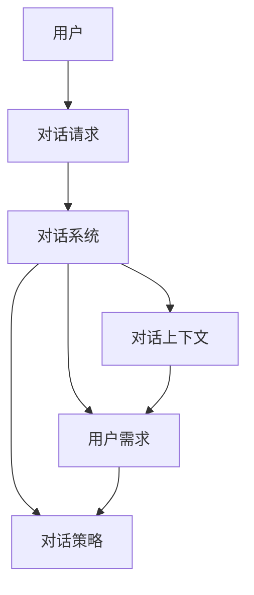
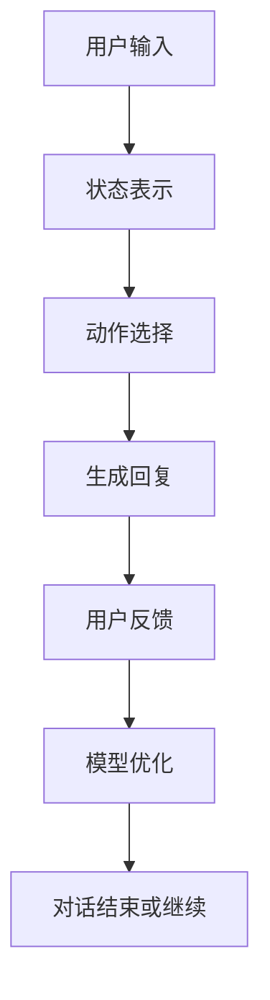
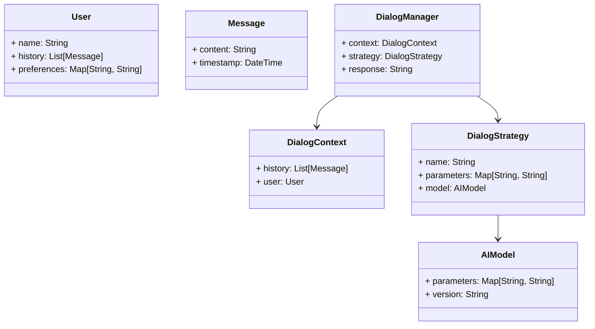
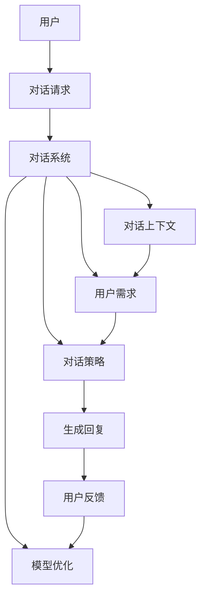
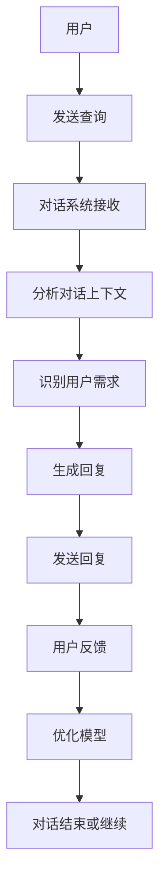

                 


# AI Agent的自适应对话管理系统

> 关键词：AI Agent，自适应对话管理，对话系统，自然语言处理，机器学习，系统架构

> 摘要：本文详细探讨了AI Agent在自适应对话管理中的应用，从背景介绍、核心概念、算法原理、系统架构到项目实战，全面分析了自适应对话管理系统的实现过程。通过结合自然语言处理和机器学习技术，本文提出了一种动态调整对话策略的方法，以提升对话系统的智能化水平和用户体验。

---

# 第一部分: AI Agent的自适应对话管理概述

# 第1章: AI Agent与自适应对话管理的背景介绍

## 1.1 AI Agent的基本概念

### 1.1.1 AI Agent的定义与特点

AI Agent（人工智能代理）是一种智能实体，能够感知环境、自主决策并执行任务。AI Agent的核心特点包括：

1. **自主性**：能够在没有外部干预的情况下自主运行。
2. **反应性**：能够根据环境的变化实时调整行为。
3. **目标导向性**：具有明确的目标，并通过行动来实现这些目标。
4. **学习能力**：能够通过数据和经验不断优化自身的决策能力。

### 1.1.2 自适应对话管理的定义

自适应对话管理是一种动态调整对话流程的技术，旨在根据用户的实时反馈和对话上下文优化对话体验。它不同于传统的基于规则的对话管理，能够根据对话的实时情况灵活调整策略。

### 1.1.3 问题背景与问题描述

传统对话系统主要依赖于固定的规则和预定义的对话流程，难以应对复杂多变的用户需求和对话场景。随着自然语言处理和机器学习技术的进步，对话系统需要更加智能化和动态化，以提供更贴近人类自然对话的用户体验。

### 1.1.4 问题解决的思路与方法

通过结合自然语言处理和机器学习技术，AI Agent能够实时分析对话上下文和用户意图，动态调整对话策略。具体方法包括：

1. **用户需求识别**：通过自然语言处理技术分析用户输入，识别用户的真实需求。
2. **对话上下文理解**：基于历史对话记录和当前对话内容，理解对话的上下文信息。
3. **动态策略调整**：根据用户反馈和对话进展，实时优化对话流程。

### 1.1.5 边界与外延

自适应对话管理的边界主要集中在对话过程中，不涉及系统的输入和输出的最终呈现方式。其外延则包括与自然语言处理、机器学习、人机交互等技术的结合应用。

---

## 1.2 自适应对话管理的核心要素

### 1.2.1 对话上下文的理解

对话上下文是自适应对话管理的基础，包括：

- **历史对话记录**：记录用户和系统之间的所有历史对话。
- **用户意图**：用户在当前对话中试图表达的目标或需求。
- **对话状态**：当前对话的进展和系统对用户意图的理解程度。

### 1.2.2 用户需求的识别

用户需求识别是自适应对话管理的关键步骤，主要通过以下方式实现：

1. **关键词提取**：从用户的输入中提取关键词，识别用户的主要诉求。
2. **意图分类**：将用户的输入映射到预定义的意图类别中。
3. **上下文推理**：结合历史对话记录，推断用户的潜在需求。

### 1.2.3 动态调整对话策略

动态调整对话策略是自适应对话管理的核心，主要方法包括：

1. **基于规则的调整**：根据预定义的规则动态调整对话流程。
2. **基于机器学习的调整**：利用机器学习模型预测用户的下一步需求，并动态调整对话策略。
3. **反馈驱动的调整**：根据用户的实时反馈优化对话策略。

### 1.2.4 对话结果的反馈与优化

对话结果的反馈与优化是自适应对话管理的重要环节，包括：

- **用户反馈收集**：通过用户满意度调查、关键词提取等方式收集用户反馈。
- **对话历史分析**：分析历史对话数据，发现对话过程中的问题和优化点。
- **模型优化**：根据反馈数据优化机器学习模型，提升对话系统的准确性和智能化水平。

---

## 1.3 本章小结

本章详细介绍了AI Agent和自适应对话管理的基本概念，并分析了自适应对话管理的核心要素和实现方法。通过对背景和核心概念的探讨，为后续章节的深入分析奠定了基础。

---

# 第二部分: 自适应对话管理的核心概念与联系

# 第2章: 自适应对话管理的核心概念

## 2.1 对话管理的原理

### 2.1.1 对话管理的流程

对话管理的流程包括以下步骤：

1. **用户输入接收**：接收用户的对话输入。
2. **需求识别**：分析用户输入，识别用户需求。
3. **对话策略制定**：根据用户需求和对话上下文制定对话策略。
4. **对话执行**：根据对话策略生成回复，并发送给用户。
5. **反馈收集与优化**：收集用户反馈，优化对话策略。

### 2.1.2 对话管理的模型

对话管理的模型主要基于自然语言处理和机器学习技术，包括：

- **规则驱动模型**：基于预定义的规则进行对话管理。
- **数据驱动模型**：基于机器学习模型进行对话管理。
- **混合驱动模型**：结合规则和机器学习模型进行对话管理。

### 2.1.3 对话管理的实现方式

对话管理的实现方式包括：

1. **基于模板的对话管理**：通过预定义的模板生成回复。
2. **基于生成模型的对话管理**：利用生成模型（如GPT）生成回复。
3. **基于检索模型的对话管理**：通过检索预定义的对话库生成回复。

---

## 2.2 自适应对话管理的特点

### 2.2.1 动态性

自适应对话管理能够根据对话的实时情况动态调整对话策略，确保对话的流畅性和准确性。

### 2.2.2 智能性

自适应对话管理结合了自然语言处理和机器学习技术，具备较高的智能化水平，能够理解用户意图并进行智能推理。

### 2.2.3 用户个性化

自适应对话管理能够根据用户的个性化需求动态调整对话策略，提供个性化的对话体验。

---

## 2.3 核心概念对比表

| 概念         | 描述                                   |
|--------------|--------------------------------------|
| 对话管理      | 基于规则或模型的对话控制方式         |
| 自适应对话管理 | 根据实时反馈动态调整对话策略         |
| 用户需求识别  | 通过上下文分析用户的真实需求         |
| 对话上下文    | 包括历史对话记录、用户意图等         |

---

## 2.4 ER实体关系图



---

## 2.5 本章小结

本章通过对比和分析，详细阐述了自适应对话管理的核心概念和特点，帮助读者更好地理解自适应对话管理的实现原理和优势。

---

# 第三部分: 自适应对话管理的算法原理

# 第3章: 对话管理的算法原理

## 3.1 基于强化学习的对话管理算法

### 3.1.1 算法原理

基于强化学习的对话管理算法通过定义一个状态空间和动作空间，利用强化学习模型（如DQN）进行对话策略的优化。具体步骤如下：

1. **状态表示**：将对话上下文表示为一个状态。
2. **动作选择**：基于当前状态选择一个动作（回复）。
3. **奖励机制**：根据用户的反馈定义奖励函数，评估对话策略的好坏。
4. **模型优化**：通过强化学习算法优化模型，提升对话策略的准确性。

### 3.1.2 算法流程



### 3.1.3 数学模型

基于强化学习的对话管理算法的数学模型如下：

- **状态空间**：S = (s_t, s_{t-1}, ..., s_1)
- **动作空间**：A = (a_t, a_{t-1}, ..., a_1)
- **奖励函数**：R(s_t, a_t) = r_t
- **目标函数**：J = ∑_{t=1}^T γ^{t-1} r_t

其中，γ为折扣因子，用于平衡当前奖励和未来奖励的重要性。

### 3.1.4 代码实现

以下是一个简单的基于强化学习的对话管理算法的Python代码示例：

```python
import numpy as np
import random

class DQN:
    def __init__(self, state_space_size, action_space_size):
        self.state_space_size = state_space_size
        self.action_space_size = action_space_size
        self.gamma = 0.99
        self.epsilon = 1.0
        self.epsilon_min = 0.01
        self.epsilon_decay = 0.995
        self.model = self.build_model()

    def build_model(self):
        # 构建神经网络模型
        pass

    def remember(self, state, action, reward, next_state):
        # 存储记忆
        pass

    def act(self, state):
        # 根据当前状态选择动作
        if random.random() < self.epsilon:
            return random.randint(0, self.action_space_size - 1)
        return self.model.predict(state)[0]

    def replay(self, batch_size):
        # 回放记忆并优化模型
        pass

    def decay_epsilon(self):
        # 衰减epsilon
        self.epsilon = max(self.epsilon_min, self.epsilon * self.epsilon_decay)
```

---

## 3.2 对话管理算法的实现细节

### 3.2.1 对话上下文的表示

对话上下文的表示可以通过将历史对话记录编码为向量来实现。常用的编码方法包括：

1. **词袋模型**：将历史对话记录中的词语统计为向量。
2. **TF-IDF**：基于词频和逆文档频率的向量表示。
3. **BERT编码**：利用预训练的BERT模型生成对话上下文的向量表示。

### 3.2.2 用户需求识别的实现

用户需求识别可以通过以下步骤实现：

1. **分词**：将用户的输入文本进行分词处理。
2. **词向量生成**：将分词后的词语转换为词向量。
3. **意图分类**：基于机器学习模型（如SVM、随机森林、神经网络等）进行意图分类。

### 3.2.3 对话策略的优化

对话策略的优化可以通过以下步骤实现：

1. **定义奖励函数**：根据用户的反馈定义奖励函数，例如，用户满意度评分。
2. **强化学习训练**：利用强化学习算法（如DQN、PG、A2C等）优化对话策略。
3. **模型评估**：通过离线数据评估模型的性能，并进行优化。

---

## 3.3 本章小结

本章详细介绍了自适应对话管理的算法原理，包括基于强化学习的对话管理算法的实现细节和对话上下文的表示方法。通过对算法原理的深入分析，为后续章节的系统架构设计奠定了基础。

---

# 第四部分: 自适应对话管理系统的架构设计

# 第4章: 系统架构设计

## 4.1 问题场景介绍

在本章中，我们将设计一个自适应对话管理系统，该系统能够根据用户的实时反馈动态调整对话策略，提供个性化的对话体验。

## 4.2 项目介绍

我们的项目目标是设计一个基于AI Agent的自适应对话管理系统，实现以下功能：

1. **用户需求识别**：准确识别用户的意图和需求。
2. **对话上下文理解**：理解对话的上下文信息。
3. **动态对话策略调整**：根据用户反馈动态调整对话策略。

## 4.3 系统功能设计

### 4.3.1 领域模型类图



### 4.3.2 系统架构设计



### 4.3.3 系统交互流程图



---

## 4.4 系统接口设计

系统接口设计包括以下几个方面：

1. **用户输入接口**：接收用户的对话请求。
2. **对话系统接口**：处理用户的对话请求，生成回复。
3. **模型优化接口**：根据用户反馈优化对话策略。

---

## 4.5 系统实现细节

### 4.5.1 对话上下文分析模块

对话上下文分析模块负责分析历史对话记录，提取对话的上下文信息。其实现步骤包括：

1. **分词**：将历史对话记录中的文本进行分词处理。
2. **关键词提取**：提取历史对话记录中的关键词。
3. **意图分类**：根据关键词进行意图分类。

### 4.5.2 用户需求识别模块

用户需求识别模块负责识别用户的真实需求，其实现步骤包括：

1. **分词**：将用户的输入文本进行分词处理。
2. **词向量生成**：将分词后的词语转换为词向量。
3. **意图分类**：利用机器学习模型进行意图分类。

---

## 4.6 本章小结

本章详细介绍了自适应对话管理系统的架构设计，包括系统功能设计、系统架构设计和系统交互流程图。通过对系统架构的深入分析，为后续章节的项目实战奠定了基础。

---

# 第五部分: 自适应对话管理系统的项目实战

# 第5章: 项目实战

## 5.1 环境安装与配置

### 5.1.1 环境要求

- **Python**：3.7+
- **TensorFlow**：2.0+
- **Keras**：2.2.5+
- **NLTK**：3.5+
- **Spacy**：2.2+

### 5.1.2 安装依赖

```bash
pip install python>=3.7
pip install tensorflow>=2.0
pip install keras>=2.2.5
pip install nltk>=3.5
pip install spacy>=2.2
```

---

## 5.2 系统核心实现

### 5.2.1 对话上下文分析模块实现

```python
import spacy

def analyze_context(history):
    # 使用Spacy进行分词和词向量生成
    nlp = spacy.load("en_core_web_lg")
    doc = nlp(history)
    return [token.vector for token in doc]
```

### 5.2.2 用户需求识别模块实现

```python
from sklearn.feature_extraction.text import TfidfVectorizer
from sklearn.svm import SVC

def extract_keywords(text):
    vectorizer = TfidfVectorizer()
    X = vectorizer.fit_transform([text])
    feature_names = vectorizer.get_feature_names_out()
    return feature_names[np.argmax(X.toarray()[0])]

def classify_intent(text, model):
    # 使用SVM模型进行意图分类
    return model.predict([text])[0]
```

---

## 5.3 代码解读与分析

### 5.3.1 对话上下文分析模块

对话上下文分析模块通过Spacy库对历史对话记录进行分词和词向量生成，提取对话的上下文信息。其实现步骤包括：

1. **加载模型**：加载预训练的Spacy模型。
2. **文本处理**：将历史对话记录输入模型，生成词向量。
3. **返回结果**：返回对话上下文的向量表示。

### 5.3.2 用户需求识别模块

用户需求识别模块通过TF-IDF和SVM模型实现意图分类。其实现步骤包括：

1. **关键词提取**：通过TF-IDF提取用户的输入文本中的关键词。
2. **意图分类**：利用SVM模型对用户的输入文本进行意图分类。

---

## 5.4 实际案例分析

### 5.4.1 案例背景

假设用户输入为“我需要预订一张从北京到上海的机票”。

### 5.4.2 对话上下文分析

历史对话记录为空，因此对话上下文为空。

### 5.4.3 用户需求识别

1. **关键词提取**：提取关键词“预订”、“机票”。
2. **意图分类**：识别用户的意图是“预订机票”。

### 5.4.4 对话策略调整

根据用户的意图，系统生成回复：“请提供您的出发日期和具体需求。”

---

## 5.5 本章小结

本章通过具体的项目实战，详细介绍了自适应对话管理系统的实现过程，包括环境安装、核心代码实现和实际案例分析。通过本章的学习，读者可以更好地理解自适应对话管理系统的实际应用。

---

# 第六部分: 最佳实践与小结

# 第6章: 最佳实践

## 6.1 最佳实践总结

1. **数据质量**：确保训练数据的质量和多样性，以提升模型的准确性和鲁棒性。
2. **模型优化**：通过不断优化机器学习模型，提升对话系统的智能化水平。
3. **用户反馈**：重视用户的实时反馈，动态调整对话策略，提升用户体验。
4. **系统安全**：确保系统的安全性，防止用户数据泄露和系统攻击。

---

## 6.2 小结

通过对AI Agent的自适应对话管理系统的深入分析和实践，我们总结出以下几点：

1. **智能化水平**：自适应对话管理系统通过结合自然语言处理和机器学习技术，具备较高的智能化水平。
2. **动态调整能力**：自适应对话管理系统能够根据用户的实时反馈动态调整对话策略，提供个性化的对话体验。
3. **系统架构设计**：通过合理的系统架构设计，确保系统的高效运行和良好的扩展性。

---

## 6.3 注意事项

1. **数据隐私**：在处理用户数据时，需注意数据隐私问题，确保符合相关法律法规。
2. **系统性能**：在优化系统性能时，需平衡计算资源的使用和系统响应速度。
3. **用户体验**：在设计对话系统时，需注重用户体验，确保对话的流畅性和自然性。

---

## 6.4 拓展阅读

1. **强化学习在对话系统中的应用**：深入研究强化学习在对话系统中的应用，提升对话策略的优化能力。
2. **多轮对话技术**：探索多轮对话技术在自适应对话管理系统中的应用，提升对话的连贯性和逻辑性。
3. **用户个性化推荐**：研究如何在自适应对话管理系统中实现用户个性化推荐，提升用户体验。

---

# 结语

通过本文的详细分析和实践，我们深入探讨了AI Agent在自适应对话管理中的应用，从背景介绍、核心概念、算法原理到系统架构和项目实战，全面解析了自适应对话管理系统的实现过程。希望本文能够为相关领域的研究和实践提供有价值的参考。

---

# 作者

作者：AI天才研究院/AI Genius Institute & 禅与计算机程序设计艺术/Zen And The Art of Computer Programming

