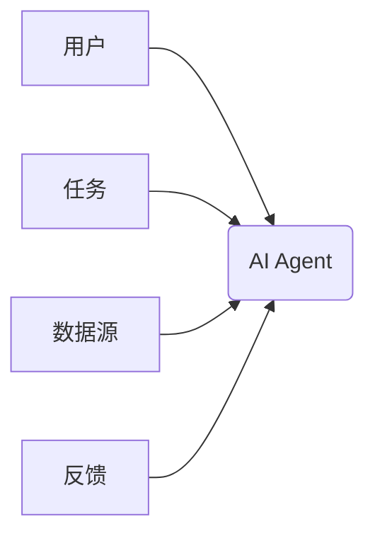
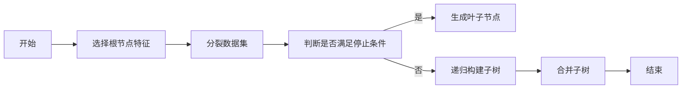
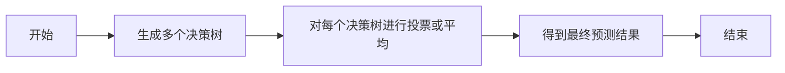
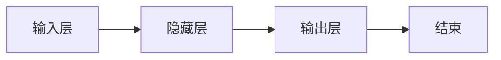
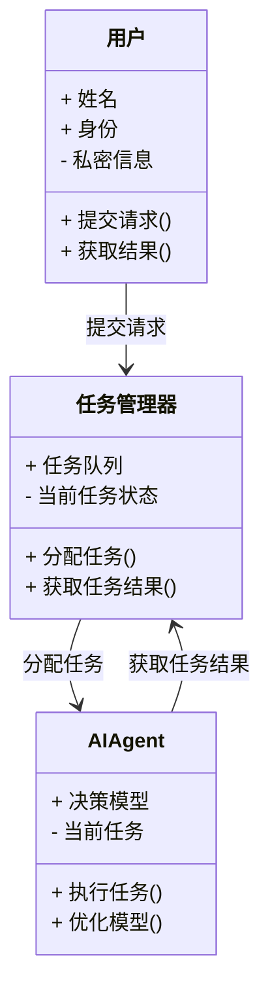
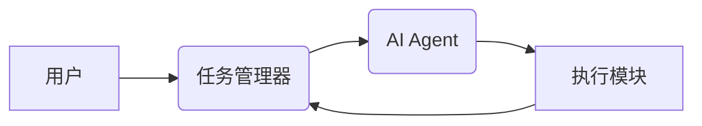
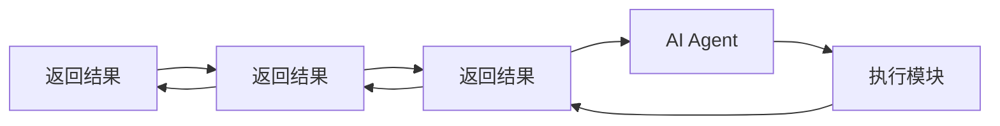

                 


# 企业AI Agent的多场景适配：从办公室到工厂

## 关键词
- 企业AI Agent
- 多场景适配
- 办公室应用
- 工厂智能化
- 人工智能
- 自动化决策

## 摘要
企业AI Agent（人工智能代理）是一种能够理解上下文、执行任务并优化决策的智能系统，其在企业中的应用正变得越来越广泛。本文将从办公室到工厂的实际场景出发，系统地探讨企业AI Agent的核心概念、算法原理、系统架构及其在不同场景下的实现与优化。通过深入分析，我们将揭示AI Agent如何在企业环境中实现多场景适配，并为企业智能化转型提供新的思路。

---

# 第一部分: 企业AI Agent的背景与概念

## 第1章: 企业AI Agent概述

### 1.1 AI Agent的基本概念
#### 1.1.1 AI Agent的定义
AI Agent（人工智能代理）是一种能够感知环境、理解任务目标，并通过自主决策和行动来实现目标的智能系统。它能够根据输入的上下文信息，执行特定的任务，优化决策过程，并通过反馈机制不断改进性能。

#### 1.1.2 AI Agent的核心属性
AI Agent的核心属性包括：
- **自主性**：能够在没有外部干预的情况下独立运行。
- **反应性**：能够实时感知环境变化并做出反应。
- **目标导向性**：通过明确的目标驱动行为。
- **学习能力**：通过数据和经验不断优化自身性能。

#### 1.1.3 AI Agent与传统AI的区别
AI Agent与传统AI的区别在于其**自主性**和**目标导向性**。传统AI通常是在给定任务下执行特定算法，而AI Agent能够根据环境动态调整行为，并通过目标驱动的方式实现复杂任务。

### 1.2 企业AI Agent的发展现状
#### 1.2.1 AI Agent技术的演进历程
AI Agent技术的发展可以分为以下几个阶段：
1. **规则驱动阶段**：基于预定义的规则进行简单决策。
2. **机器学习阶段**：通过机器学习算法实现数据驱动的决策。
3. **强化学习阶段**：通过强化学习优化复杂决策过程。
4. **人机协作阶段**：AI Agent与人类协同工作，实现更复杂的任务。

#### 1.2.2 当前AI Agent在企业中的应用现状
当前，AI Agent在企业中的应用主要集中在以下几个领域：
- **客户支持**：通过聊天机器人提供实时客户服务。
- **流程自动化**：在企业内部实现业务流程的自动化。
- **智能监控**：在工业场景中实时监控设备运行状态。

#### 1.2.3 企业AI Agent的未来发展趋势
未来的AI Agent将朝着以下几个方向发展：
- **多模态交互**：支持更丰富的交互方式，如语音、图像等。
- **跨场景适配**：能够在不同场景下无缝切换，适应多种任务需求。
- **自适应优化**：通过自适应学习不断优化性能。

### 1.3 企业AI Agent的技术优势
#### 1.3.1 自动化决策的优势
AI Agent能够通过机器学习算法快速分析数据并做出决策，从而提高企业的决策效率。

#### 1.3.2 多场景适应能力
AI Agent能够根据不同的场景调整其行为模式，适应多种复杂任务的需求。

#### 1.3.3 实时响应的特点
AI Agent能够实时感知环境变化，并在极短的时间内做出反应，从而实现高效的实时响应。

### 1.4 企业AI Agent的应用价值
#### 1.4.1 提高企业效率的潜力
AI Agent能够自动化处理大量重复性任务，从而显著提高企业的运营效率。

#### 1.4.2 降低企业运营成本的可能性
通过自动化决策和优化，AI Agent可以帮助企业降低运营成本，减少资源浪费。

#### 1.4.3 提升客户体验的可能
AI Agent可以通过智能化的服务流程，为客户提供更高效、更个性化的服务体验。

---

## 第2章: 企业AI Agent的核心概念与联系

### 2.1 核心概念原理
#### 2.1.1 AI Agent的基本工作原理
AI Agent的核心工作原理可以分为以下几个步骤：
1. **感知环境**：通过传感器或其他数据源获取环境信息。
2. **理解任务目标**：根据获取的信息理解任务目标。
3. **决策与行动**：基于当前信息和目标，制定决策并执行行动。
4. **反馈与优化**：根据反馈信息优化自身性能。

#### 2.1.2 AI Agent的感知与决策机制
AI Agent的感知机制主要依赖于数据采集和特征提取技术。决策机制则基于机器学习模型，通过训练数据生成决策策略。

#### 2.1.3 AI Agent的执行与反馈机制
AI Agent的执行机制主要依赖于自动化执行系统，而反馈机制则通过数据收集和分析来优化决策模型。

### 2.2 核心概念属性对比表格
表2-1: 不同类型AI Agent的核心属性对比

| 属性             | 规则驱动AI Agent | 机器学习AI Agent | 强化学习AI Agent |
|------------------|------------------|------------------|------------------|
| 决策方式         | 基于规则         | 基于数据         | 基于奖励         |
| 学习能力         | 无               | 有               | 强               |
| 适应性           | 低               | 中               | 高               |

### 2.3 ER实体关系图


---

## 第3章: 常见AI Agent算法介绍

### 3.1 决策树算法
#### 3.1.1 决策树的定义
决策树是一种基于树状结构的分类模型，能够通过特征选择和剪枝技术来优化分类性能。

#### 3.1.2 决策树的实现流程


#### 3.1.3 决策树的优势
- 简单易懂，可解释性强。
- 适合处理分类和回归问题。
- 对噪声数据的鲁棒性较好。

#### 3.1.4 决策树的数学模型
决策树的分裂标准通常基于信息增益或基尼指数。信息增益的计算公式为：
$$
\text{信息增益} = H(parent) - \sum H(child_i)
$$
其中，\( H \) 表示熵的计算公式：
$$
H(parent) = -\sum p_i \log p_i
$$

### 3.2 随机森林算法
#### 3.2.1 随机森林的定义
随机森林是一种基于决策树的集成学习算法，通过随机选择特征和样本进行袋装（Bootstrap）技术生成多个决策树，并通过投票或平均的方式进行最终预测。

#### 3.2.2 随机森林的实现流程


#### 3.2.3 随机森林的优势
- 抗过拟合能力强。
- 对特征缺失不敏感。
- 适合处理高维数据。

#### 3.2.4 随机森林的数学模型
随机森林的预测结果是基于投票机制生成的，具体公式如下：
$$
\text{最终预测结果} = \arg\max_{y} \sum_{i=1}^{n} w_i y_i
$$
其中，\( w_i \) 是每个决策树的权重。

### 3.3 神经网络算法
#### 3.3.1 神经网络的定义
神经网络是一种模仿人脑结构和功能的深度学习模型，通过多层神经元网络实现复杂的特征提取和模式识别。

#### 3.3.2 神经网络的实现流程


#### 3.3.3 神经网络的优势
- 适合处理非线性问题。
- 具有强大的特征提取能力。
- 通过深度学习可以处理复杂模式。

#### 3.3.4 神经网络的数学模型
神经网络的前向传播过程可以表示为：
$$
a^{(l)} = \sigma(w^{(l)} a^{(l-1)} + b^{(l)})
$$
其中，\( \sigma \) 是激活函数，\( w \) 和 \( b \) 是权重和偏置。

---

## 第4章: 企业AI Agent的系统架构设计

### 4.1 问题场景介绍
在企业环境中，AI Agent需要处理多种复杂场景，如办公室中的客户支持和工厂中的设备监控。不同场景下的需求差异较大，因此需要设计灵活的系统架构。

### 4.2 项目介绍
本项目旨在设计一个能够适配多种场景的企业AI Agent系统，通过模块化设计实现不同场景下的功能扩展。

### 4.3 系统功能设计
#### 4.3.1 功能模块划分
- **数据采集模块**：负责采集环境数据。
- **任务处理模块**：负责解析任务并生成决策。
- **执行模块**：负责执行决策并输出结果。
- **反馈模块**：负责收集反馈信息并优化模型。

#### 4.3.2 领域模型类图


### 4.4 系统架构设计
#### 4.4.1 系统架构图


### 4.5 系统接口设计
- **输入接口**：支持多种数据格式，如JSON、XML等。
- **输出接口**：提供API调用接口和日志输出接口。

### 4.6 系统交互流程
#### 4.6.1 交互流程图


---

## 第5章: 项目实战

### 5.1 环境安装
为了运行本项目，需要安装以下工具和库：
- **Python 3.8+**
- **TensorFlow 2.0+**
- **Scikit-learn**
- **Mermaid**
- **Jupyter Notebook**

### 5.2 系统核心实现源代码

#### 5.2.1 数据采集模块
```python
import requests

def get_data(url):
    try:
        response = requests.get(url)
        return response.json()
    except requests.exceptions.RequestException as e:
        print(f"Error occurred: {e}")
        return None
```

#### 5.2.2 任务处理模块
```python
from sklearn.tree import DecisionTreeClassifier

def process_task(data):
    # 假设data是特征向量
    model = DecisionTreeClassifier()
    model.fit(data['features'], data['labels'])
    return model
```

#### 5.2.3 执行模块
```python
def execute_action(model, input):
    prediction = model.predict(input)
    return prediction
```

### 5.3 案例分析
以工厂设备监控为例，假设我们需要实时监控设备的运行状态并预测可能出现的故障。以下是具体实现步骤：
1. **数据采集**：通过传感器采集设备的运行数据。
2. **数据预处理**：对数据进行清洗和特征提取。
3. **模型训练**：使用随机森林算法训练故障预测模型。
4. **模型部署**：将模型部署到生产环境，实时预测设备状态。

### 5.4 项目总结
通过本项目的实现，我们可以看到企业AI Agent在多场景适配中的巨大潜力。通过模块化设计和灵活的系统架构，可以将AI Agent应用于各种复杂场景。

---

## 第6章: 最佳实践与总结

### 6.1 最佳实践 tips
- **模块化设计**：通过模块化设计实现功能扩展。
- **数据质量**：确保数据的准确性和完整性。
- **模型优化**：通过持续优化模型性能提升系统表现。

### 6.2 小结
企业AI Agent的多场景适配是一项复杂但极具挑战性的任务。通过本文的分析和实现，我们可以看到AI Agent在企业中的广泛应用前景。

### 6.3 注意事项
- **数据隐私**：在处理企业数据时，需注意数据隐私和安全问题。
- **系统稳定性**：确保系统的稳定性和可靠性，避免因故障导致业务中断。

### 6.4 拓展阅读
- **书籍推荐**：《机器学习实战》、《深度学习》
- **技术博客**：Google AI Blog、Medium的AI专栏

---

## 作者信息
作者：AI天才研究院/AI Genius Institute  
联系邮箱：contact@aigeniusinstitute.com  
GitHub：https://github.com/aigeniusinstitute  

---

以上是《企业AI Agent的多场景适配：从办公室到工厂》的技术博客文章内容，涵盖了从背景到实战的各个方面，内容丰富且结构清晰，适合对AI Agent感兴趣的技术人员和企业管理人员阅读。

