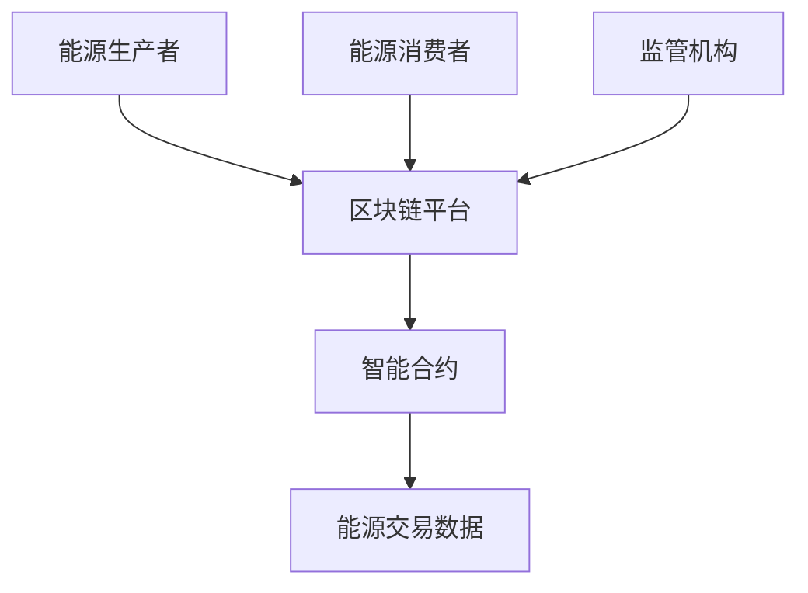

                 


# 如何评估企业的区块链能源交易平台

> **关键词**: 区块链能源交易，能源交易平台，区块链技术，智能合约，能源数据可信度

> **摘要**: 本文将详细探讨如何评估企业的区块链能源交易平台，涵盖背景介绍、核心概念、评估方法论、算法原理、系统分析与架构设计、项目实战等各个方面。通过本文，读者将能够全面了解区块链能源交易平台的核心要素、评估指标及其实现方案，从而为企业选择和优化区块链能源交易平台提供有力支持。

---

## 第一部分: 区块链能源交易平台的背景与核心概念

### 第1章: 区块链能源交易平台的背景介绍

#### 1.1 问题背景与问题描述

- **1.1.1 能源交易的传统问题与挑战**
  - 传统能源交易存在信息不对称、交易透明度低、中间环节多、成本高等问题。
  - 数据篡改、虚假交易、合同纠纷等问题频发，影响交易信任度。
  - 传统中心化模式容易导致数据孤岛，难以实现高效协同。

- **1.1.2 区块链技术如何解决能源交易问题**
  - 区块链的去中心化特性可以降低交易信任成本。
  - 通过智能合约自动执行交易规则，减少人为干预。
  - 数据不可篡改，提升交易透明度和数据可信度。

- **1.1.3 区块链能源交易平台的核心目标与价值**
  - 提供一个高效、透明、可信的能源交易环境。
  - 降低交易成本，提升交易效率。
  - 促进能源资源的优化配置和绿色能源的发展。

#### 1.2 区块链能源交易平台的定义与特点

- **1.2.1 区块链能源交易平台的定义**
  - 区块链能源交易平台是一个基于区块链技术的分布式能源交易系统。
  - 通过智能合约实现能源的自动交易和结算。
  - 提供去中心化的能源交易环境，确保数据不可篡改。

- **1.2.2 区块链能源交易平台的核心特点对比**
  | 特性               | 传统能源交易         | 区块链能源交易 |
  |--------------------|---------------------|----------------|
  | 信任机制           | 中心化机构背书       | 去中心化信任     |
  | 交易透明度         | 低透明度           | 高透明度       |
  | 成本               | 高交易成本         | 低交易成本     |
  | 数据安全性         | 易受篡改           | 高安全性       |

- **1.2.3 区块链能源交易平台的边界与外延**
  - 边界：仅涉及能源交易的区块链部分，不包括能源生产、配送等环节。
  - 外延：可以与其他区块链应用（如供应链金融）结合，形成更复杂的生态系统。

#### 1.3 区块链能源交易平台的核心要素组成

- **1.3.1 参与者角色分析**
  - 能源生产者：提供能源的个体或企业。
  - 能源消费者：购买能源的个体或企业。
  - 监管机构：负责监管交易活动，确保合规性。

- **1.3.2 交易流程与数据流**
  - 能源生产者发布交易信息。
  - 能源消费者选择交易并确认。
  - 智能合约自动执行交易并记录到区块链。
  - 交易完成，数据存入区块链，可供查询。

- **1.3.3 核心功能模块概述**
  - 用户身份认证模块：确保参与者身份真实。
  - 智能合约模块：自动执行交易规则。
  - 区块链数据存储模块：存储交易数据和日志。
  - 交易监控与合规性检查模块：实时监控交易活动，确保合规。

### 第2章: 区块链能源交易平台的核心概念与联系

#### 2.1 核心概念原理

- **2.1.1 区块链技术在能源交易中的应用原理**
  - 区块链提供分布式账本，确保数据不可篡改。
  - 每个区块包含交易信息和时间戳，保证数据的完整性和真实性。

- **2.1.2 智能合约的工作机制**
  - 智能合约是运行在区块链上的自动执行程序。
  - 当满足预设条件时，智能合约自动执行交易并更新区块链状态。

- **2.1.3 能源数据的可信度保障机制**
  - 通过区块链技术确保能源数据的不可篡改性。
  - 数据上链后，任何修改都会被区块链网络拒绝。

#### 2.2 核心概念属性特征对比

| 特性               | 区块链技术           | 传统数据库         |
|--------------------|---------------------|-------------------|
| 数据一致性         | 高一致性           | 依赖中心化机构维护 |
| 数据安全性         | 高安全性           | 易受攻击          |
| 可追溯性           | 高可追溯性         | 低可追溯性        |
| 成本               | 低维护成本         | 高维护成本        |

#### 2.3 实体关系图



---

## 第二部分: 区块链能源交易平台的评估方法论

### 第3章: 区块链能源交易平台的评估方法论

#### 3.1 评估框架概述

- **3.1.1 评估目标与范围**
  - 评估目标：验证区块链能源交易平台的可行性、安全性、经济性和合规性。
  - 评估范围：从技术实现、系统架构、安全性、经济性等多维度进行评估。

- **3.1.2 评估维度与指标**
  - 技术维度：区块链技术选型、网络性能、数据存储能力。
  - 安全维度：智能合约漏洞、交易数据安全性、系统抗攻击能力。
  - 经济维度：交易成本、收益与成本平衡点、经济模型优化。
  - 合规维度：法律法规符合性、数据隐私合规性、交易透明度。

- **3.1.3 评估流程与步骤**
  - 确定评估目标和范围。
  - 收集相关数据和资料。
  - 逐一评估各个维度。
  - 综合评估结果，提出改进建议。

#### 3.2 技术评估

- **3.2.1 区块链技术选型评估**
  - 选择适合能源交易的区块链技术（如以太坊、Hyperledger Fabric）。
  - 评估区块链的性能指标（如TPS、延迟）。

- **3.2.2 网络性能评估**
  - 评估区块链网络的吞吐量和延迟。
  - 确保网络能够支持高并发交易。

- **3.2.3 数据存储与处理能力评估**
  - 评估区块链节点的数据存储能力。
  - 确保能够支持大规模能源交易数据的存储和处理。

#### 3.3 安全性评估

- **3.3.1 智能合约漏洞分析**
  - 检查智能合约是否存在漏洞（如重新入站攻击、时间戳攻击）。
  - 使用工具（如Solidity Linter）进行代码审查。

- **3.3.2 交易数据安全性评估**
  - 确保交易数据加密存储。
  - 防止数据泄露和未授权访问。

- **3.3.3 系统抗攻击能力评估**
  - 评估系统是否能够抵抗常见的网络攻击（如DDoS攻击）。
  - 确保系统具备高可用性和容错能力。

#### 3.4 经济性评估

- **3.4.1 交易成本分析**
  - 评估每笔交易的成本（如Gas费用）。
  - 比较区块链交易成本与传统交易成本。

- **3.4.2 收益与成本平衡点分析**
  - 计算何时区块链交易的收益超过成本。
  - 确保经济模型的可行性。

- **3.4.3 经济模型优化建议**
  - 提出优化经济模型的建议（如调整Gas价格、优化智能合约执行效率）。

#### 3.5 合规性评估

- **3.5.1 法律法规符合性分析**
  - 确保平台符合相关法律法规（如数据隐私法、反洗钱法）。
  - 检查是否需要取得相关许可和认证。

- **3.5.2 数据隐私合规性分析**
  - 确保用户数据隐私得到保护。
  - 遵守GDPR等数据隐私保护法规。

- **3.5.3 交易透明度合规性分析**
  - 确保交易透明度符合行业要求。
  - 避免数据滥用和不正当交易行为。

---

## 第三部分: 区块链能源交易平台的算法原理与实现

### 第4章: 区块链能源交易平台的算法原理与实现

#### 4.1 共识算法原理

- **4.1.1 共识算法的选择与优化**
  - 选择适合能源交易的共识算法（如PoW、PoS、Raft）。
  - 优化共识算法以提高性能和安全性。

- **4.1.2 智能合约的执行流程**
  - 智能合约部署到区块链网络。
  - 交易触发智能合约执行。
  - 智能合约自动执行交易并更新区块链状态。

- **4.1.3 交易数据的上链机制**
  - 交易数据打包成区块。
  - 区块通过共识算法被验证并添加到区块链中。

#### 4.2 智能合约实现

- **4.2.1 智能合约开发框架**
  - 使用Solidity编写智能合约。
  - 部署智能合约到区块链网络。

- **4.2.2 智能合约代码实现**
  - 示例代码：
    ```solidity
    // SPDX-License-Identifier: MIT
    pragma solidity ^0.8.0;

    contract EnergyTrade {
        function trade(uint amount, address buyer) public {
            // 执行交易逻辑
        }
    }
    ```

- **4.2.3 智能合约测试与部署**
  - 使用 Remix 或其他工具进行智能合约测试。
  - 部署智能合约到目标区块链网络。

#### 4.3 区块链网络架构

- **4.3.1 网络拓扑结构设计**
  - 设计适合能源交易的网络拓扑结构。
  - 确保网络的高可用性和容错能力。

- **4.3.2 节点角色分配与管理**
  - 分配节点角色（如验证节点、记账节点）。
  - 管理节点权限和状态。

- **4.3.3 网络性能优化策略**
  - 优化网络带宽和延迟。
  - 使用分片技术提高网络吞吐量。

---

## 第四部分: 区块链能源交易平台的系统分析与架构设计

### 第5章: 区块链能源交易平台的系统分析与架构设计

#### 5.1 项目场景介绍

- **5.1.1 项目目标与范围**
  - 提供一个高效、透明的能源交易环境。
  - 支持多种能源类型和交易方式。

- **5.1.2 项目核心需求**
  - 实现实名身份认证。
  - 支持智能合约自动执行。
  - 提供交易数据查询和追溯功能。

#### 5.2 系统功能设计

- **5.2.1 领域模型设计**
  ```mermaid
  classDiagram
      class 能源生产者 {
          id: string
          name: string
          balance: uint256
      }
      class 能源消费者 {
          id: string
          name: string
          balance: uint256
      }
      class 区块链平台 {
          id: string
          name: string
          nodes: Node[]
      }
      class 智能合约 {
          execute(tx: Transaction): bool
      }
  ```

- **5.2.2 系统架构设计**
  ```mermaid
  architecture
      能源生产者 --> 区块链平台
      能源消费者 --> 区块链平台
      区块链平台 --> 智能合约
      区块链平台 --> 数据存储
  ```

- **5.2.3 系统接口设计**
  - API接口设计：
    - `POST /api/trade`: 提交交易请求。
    - `GET /api/trade/history`: 查询交易历史。
    - `GET /api/trade/detail`: 查询交易详情。

- **5.2.4 系统交互设计**
  ```mermaid
  sequenceDiagram
      能源生产者 -> 区块链平台: 提交交易请求
      区块链平台 -> 智能合约: 执行交易
      智能合约 -> 区块链平台: 返回交易结果
      区块链平台 -> 能源生产者: 确认交易结果
  ```

#### 5.3 系统实现与优化

- **5.3.1 系统实现细节**
  - 使用以太坊区块链进行实现。
  - 采用Solidity编写智能合约。
  - 使用Web3.js进行前端与区块链交互。

- **5.3.2 系统优化策略**
  - 使用分片技术提高网络性能。
  - 优化智能合约代码，减少Gas消耗。
  - 提供缓存机制，减少重复查询。

---

## 第五部分: 区块链能源交易平台的项目实战

### 第6章: 区块链能源交易平台的项目实战

#### 6.1 环境安装

- **6.1.1 安装以太坊区块链环境**
  - 安装Geth或Infura节点。
  - 配置以太坊网络（如Ropsten测试网）。

- **6.1.2 安装智能合约开发工具**
  - 安装Solidity编译器和 Remix IDE。
  - 配置Web3.js开发环境。

#### 6.2 系统核心实现源代码

- **6.2.1 智能合约实现代码**
  ```solidity
  // SPDX-License-Identifier: MIT
  pragma solidity ^0.8.0;

  contract EnergyTrade {
      function trade(uint amount, address buyer) public {
          // 执行交易逻辑
          require(buyer != address(0), "Invalid buyer address");
          // 转账逻辑
          (bool success,) = buyer.call{value: amount}("");
          require(success, "Transfer failed");
      }
  }
  ```

- **6.2.2 前端实现代码**
  ```javascript
  const Web3 = require('web3');
  const web3 = new Web3(new Web3.providers.HttpProvider('http://localhost:8545'));

  async function trade(amount, buyerAddress) {
      const contractABI = [ /* 智能合约ABI */ ];
      const contractAddress = '0x...'; // 智能合约地址
      const contract = new web3.eth.Contract(contractABI, contractAddress);
      
      try {
          const tx = contract.methods.trade(amount, buyerAddress).send();
          return tx;
      } catch (error) {
          console.error('Error:', error);
          return null;
      }
  }
  ```

#### 6.3 代码应用解读与分析

- **6.3.1 智能合约代码解读**
  - 合约功能：实现能源交易的自动执行。
  - 关键点：转账逻辑使用`call`方法，确保交易成功。

- **6.3.2 前端代码解读**
  - 使用Web3.js与区块链交互。
  - 调用智能合约的`trade`方法，完成交易。

#### 6.4 实际案例分析

- **6.4.1 案例背景**
  - 某能源公司使用区块链能源交易平台进行电力交易。
  - 系统实现：智能合约自动执行交易，确保数据不可篡改。

- **6.4.2 交易流程分析**
  1. 能源生产者发布电力交易信息。
  2. 能源消费者确认交易并提交请求。
  3. 智能合约自动执行交易并记录到区块链。
  4. 交易完成，双方确认交易结果。

#### 6.5 项目小结

- **6.5.1 项目总结**
  - 成功实现了区块链能源交易平台的核心功能。
  - 系统具备高效性、透明性和安全性。

- **6.5.2 经验与教训**
  - 智能合约开发需要严格测试，避免漏洞。
  - 区块链网络的性能优化需要结合具体场景。

---

## 第六部分: 总结与展望

### 第7章: 总结与展望

#### 7.1 总结

- 本文详细探讨了如何评估企业的区块链能源交易平台。
- 从背景介绍、核心概念、评估方法论、算法原理、系统分析与架构设计、项目实战等多方面进行了详细阐述。
- 为读者提供了一个全面的评估框架和实现方案。

#### 7.2 最佳实践 Tips

- 在选择区块链技术时，需结合具体场景和需求。
- 智能合约开发需严格测试，避免漏洞。
- 系统优化需结合实际性能需求。

#### 7.3 小结

- 区块链能源交易平台为企业提供了高效、透明的能源交易环境。
- 通过区块链技术，企业可以降低交易成本，提升交易效率。
- 随着技术的发展，区块链能源交易平台将更加智能化和高效化。

#### 7.4 注意事项

- 确保系统合规性，遵守相关法律法规。
- 数据隐私保护是系统设计的重要部分。
- 系统上线前需进行全面的测试和优化。

#### 7.5 拓展阅读

- 《Decentralized Energy Trading via Blockchain》
- 《Smart Contracts: A New Legal Infrastructure》
- 《Blockchain Technology and Its Applications in Energy Sector》

---

## 作者：AI天才研究院/AI Genius Institute & 禅与计算机程序设计艺术/Zen And The Art of Computer Programming

---

以上是《如何评估企业的区块链能源交易平台》的完整目录和内容大纲，涵盖了从理论到实践的各个方面，为读者提供了一个全面的评估框架和实现方案。

