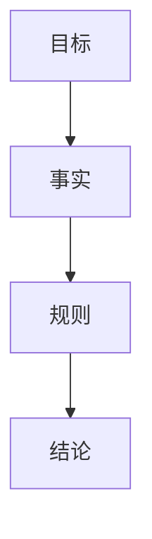
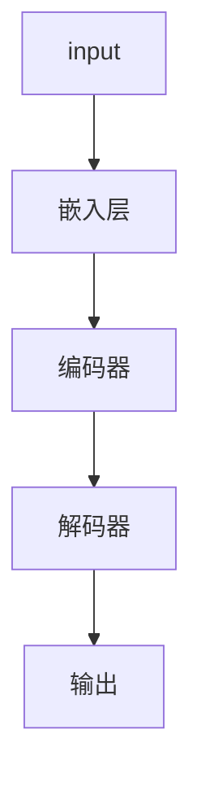
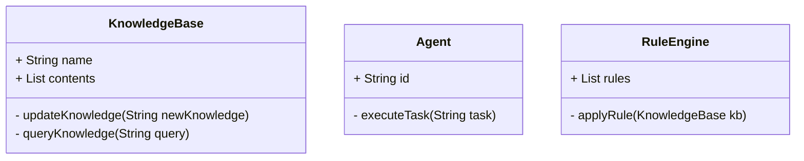
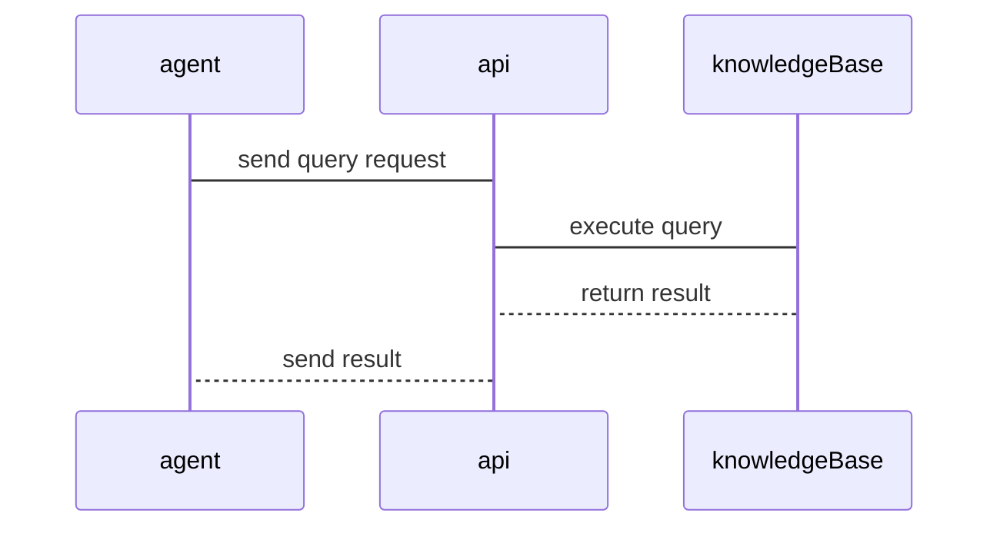

                 


# 实现AI Agent的动态知识库管理系统

## 关键词：AI Agent，动态知识库，知识表示，动态更新，知识推理，机器学习

## 摘要：  
AI Agent需要依赖动态知识库来进行高效决策和行动。本文详细介绍了动态知识库管理系统的实现，包括知识表示方法、动态更新机制、算法原理以及系统架构设计。通过具体案例分析，展示了如何实现一个高效、灵活的动态知识库管理系统，为AI Agent的应用提供坚实的基础。

---

# 第1章: AI Agent与动态知识库概述

## 1.1 AI Agent的基本概念  
AI Agent是一种具有自主决策能力的智能体，能够感知环境、理解任务并执行操作。动态知识库是支持AI Agent进行高效决策的核心组件，它能够实时更新和维护知识，以适应不断变化的环境。

### 1.1.1 AI Agent的定义与特点  
AI Agent是具有以下特点的智能体：  
1. **自主性**：能够独立决策和行动。  
2. **反应性**：能够实时感知环境并做出响应。  
3. **学习能力**：能够通过经验改进性能。  
4. **社交能力**：能够与其他Agent或人类进行交互。  

### 1.1.2 AI Agent的核心功能与应用场景  
AI Agent的核心功能包括：  
1. **感知环境**：通过传感器或接口获取环境信息。  
2. **知识推理**：基于知识库进行推理和决策。  
3. **执行操作**：根据推理结果执行具体操作。  

应用场景包括智能助手、自动驾驶、机器人控制等。

### 1.1.3 动态知识库的定义与重要性  
动态知识库是一种能够实时更新和维护的知识存储系统，支持AI Agent在动态环境中高效运作。其重要性体现在：  
1. **实时性**：能够快速响应环境变化。  
2. **准确性**：确保知识的准确性和一致性。  
3. **可扩展性**：支持大规模知识存储和更新。  

---

## 1.2 动态知识库管理系统的背景与挑战  

### 1.2.1 知识库管理的传统方法与局限性  
传统知识库管理方法通常基于静态数据，难以应对动态变化的环境。其局限性包括：  
1. **更新延迟**：知识更新速度较慢，无法满足实时需求。  
2. **复杂性**：大规模知识更新和维护较为复杂。  
3. **灵活性不足**：难以适应多样化的需求。  

### 1.2.2 动态知识库管理的必要性  
随着AI Agent的应用场景越来越复杂，动态知识库管理成为必要：  
1. **支持实时决策**：动态知识库能够提供最新的信息支持决策。  
2. **适应环境变化**：动态知识库能够快速响应环境变化。  
3. **提高系统性能**：通过高效的动态更新，提升系统的整体性能。  

### 1.2.3 当前技术面临的挑战与解决方案  
当前技术面临的挑战包括：  
1. **数据一致性**：动态更新可能导致数据不一致。  
2. **性能瓶颈**：大规模动态更新可能影响系统性能。  
3. **安全性**：动态更新可能带来数据泄露或篡改的风险。  

解决方案包括采用分布式存储、优化更新算法和增强安全机制。

---

## 1.3 本章小结  
本章介绍了AI Agent的基本概念、核心功能及其应用场景，分析了动态知识库管理系统的背景和必要性，指出了当前技术面临的挑战及解决方案。这为后续章节的深入探讨奠定了基础。

---

# 第2章: 知识表示与动态更新机制  

## 2.1 知识表示方法  

### 2.1.1 基于符号的知识表示  
基于符号的知识表示使用符号逻辑来描述知识，例如规则、谓词逻辑等。  
- **优点**：清晰、易于推理。  
- **缺点**：难以处理复杂和模糊的知识。  

### 2.1.2 基于图结构的知识表示  
基于图结构的知识表示使用节点和边来表示知识，例如知识图谱。  
- **优点**：能够表示复杂的语义关系。  
- **缺点**：构建和维护较为复杂。  

### 2.1.3 基于向量的知识表示  
基于向量的知识表示使用向量空间模型，例如Word2Vec。  
- **优点**：能够表示语义相似性。  
- **缺点**：难以处理语法和语义的复杂性。  

#### 知识表示方法对比（表格）  

| 方法         | 优点                                   | 缺点                                   |
|--------------|--------------------------------------|--------------------------------------|
| 基于符号     | 清晰、易于推理                         | 难以处理复杂和模糊的知识             |
| 基于图结构   | 能够表示复杂的语义关系                 | 构建和维护较为复杂                   |
| 基于向量     | 能够表示语义相似性                     | 难以处理语法和语义的复杂性           |

---

## 2.2 动态知识更新机制  

### 2.2.1 基于规则的动态更新  
基于规则的动态更新通过预定义的规则来自动更新知识库。  
- **优点**：简单易实现。  
- **缺点**：灵活性不足，难以应对复杂场景。  

### 2.2.2 基于机器学习的动态更新  
基于机器学习的动态更新通过训练模型来自动更新知识库。  
- **优点**：灵活性高，能够处理复杂场景。  
- **缺点**：需要大量数据和计算资源。  

### 2.2.3 分布式更新机制  
分布式更新机制通过分布式系统实现知识库的实时更新。  
- **优点**：高可用性和高扩展性。  
- **缺点**：复杂性和延迟较高。  

---

## 2.3 知识表示与更新的对比分析  

### 2.3.1 不同知识表示方法的优缺点对比（表格）  

| 方法         | 优点                                   | 缺点                                   |
|--------------|--------------------------------------|--------------------------------------|
| 基于符号     | 清晰、易于推理                         | 难以处理复杂和模糊的知识             |
| 基于图结构   | 能够表示复杂的语义关系                 | 构建和维护较为复杂                   |
| 基于向量     | 能够表示语义相似性                     | 难以处理语法和语义的复杂性           |

### 2.3.2 知识表示与更新的ER实体关系图（Mermaid流程图）  

```mermaid
er
actor(AI Agent) --> knowledge_base: 查询/更新知识
knowledge_base --> rule_engine: 应用规则进行更新
knowledge_base --> ml_model: 训练模型进行更新
knowledge_base --> distributed_system: 分布式更新
```

---

## 2.3 本章小结  
本章详细探讨了知识表示方法及其优缺点，并介绍了动态知识更新机制，分析了不同更新方法的适用场景和优缺点。通过对比分析，为后续实现动态知识库管理系统提供了理论基础。

---

# 第3章: 动态知识库管理的算法原理  

## 3.1 基于规则的知识推理算法  

### 3.1.1 知识推理的基本原理  
基于规则的知识推理通过预定义的规则进行推理，例如逻辑推理、反向链推理等。  
- **逻辑推理**：根据逻辑规则进行推理。  
- **反向链推理**：从目标出发，逆向寻找支持目标的事实。  

### 3.1.2 基于规则的推理流程（Mermaid流程图）  



### 3.1.3 算法实现的Python代码示例  

```python
def rule_based_reasoning(fact, rule):
    # 假设fact和rule是已知的条件和规则
    if rule["condition"](fact):
        return rule["conclusion"](fact)
    else:
        return None
```

---

## 3.2 基于机器学习的知识更新算法  

### 3.2.1 机器学习在知识更新中的应用  
机器学习可以用于知识更新，例如通过监督学习、无监督学习和强化学习来更新知识库。  
- **监督学习**：基于标记数据进行训练。  
- **无监督学习**：基于未标记数据进行聚类。  
- **强化学习**：通过奖励机制优化知识更新策略。  

### 3.2.2 基于深度学习的知识更新模型（Mermaid流程图）  



### 3.2.3 模型训练的数学公式与实现细节  
深度学习模型的训练目标是最小化预测值与真实值的误差，通常使用交叉熵损失函数。  

$$ L = -\sum_{i} y_i \log(p_i) + (1 - y_i) \log(1 - p_i) $$  

其中，$y_i$ 是真实标签，$p_i$ 是模型预测概率。

---

## 3.3 算法的数学模型与公式  

### 3.3.1 基于规则的知识推理公式  
基于规则的知识推理可以通过逻辑运算符进行，例如逻辑与、逻辑或、逻辑非。  

$$ \text{结论} = \bigwedge_{i} \text{事实}_i \land \bigvee_{j} \text{规则}_j $$  

### 3.3.2 基于机器学习的知识更新公式  
深度学习模型的训练通常使用梯度下降方法，优化目标函数：  

$$ \theta = \theta - \eta \frac{\partial L}{\partial \theta} $$  

其中，$\theta$ 是模型参数，$\eta$ 是学习率。

---

## 3.3 本章小结  
本章详细讲解了基于规则的知识推理算法和基于机器学习的知识更新算法，分析了它们的数学模型和实现细节。通过对比，为后续实现动态知识库管理系统提供了算法基础。

---

# 第4章: 动态知识库管理系统的架构与设计  

## 4.1 系统分析与架构设计  

### 4.1.1 问题场景与需求分析  
假设我们开发一个AI客服系统，需要实时更新和维护客户信息、产品信息等知识库。  

### 4.1.2 系统功能设计  
系统功能包括知识查询、知识更新、知识推理和知识可视化。  

### 4.1.3 功能模块划分  
功能模块包括：  
1. 知识查询模块：支持快速查询知识库。  
2. 知识更新模块：支持实时更新知识库。  
3. 知识推理模块：支持基于知识库进行推理。  
4. 知识可视化模块：支持知识的可视化展示。  

---

## 4.2 系统架构设计  

### 4.2.1 领域模型设计（Mermaid类图）  



### 4.2.2 系统架构设计（Mermaid架构图）  

```mermaid
container Database {
    KnowledgeBase
}
container Agent {
    KnowledgeQuery
    KnowledgeUpdate
    KnowledgeReasoning
    KnowledgeVisualization
}
container API {
    REST API
}
```

### 4.2.3 接口设计与交互流程（Mermaid序列图）  



---

## 4.3 系统实现的关键技术  

### 4.3.1 分布式存储技术  
分布式存储技术如分布式文件系统和分布式数据库，能够支持大规模知识存储和实时更新。  

### 4.3.2 实时更新技术  
实时更新技术包括事务处理和日志记录，确保知识库的更新一致性。  

### 4.3.3 高可用性  
通过负载均衡和容灾备份，确保系统的高可用性。  

---

## 4.3 本章小结  
本章详细设计了动态知识库管理系统的架构，包括领域模型设计、系统架构图和接口设计。通过这些设计，确保了系统的高效性和可扩展性。

---

# 第5章: 项目实战 - 实现一个动态知识库管理系统  

## 5.1 环境安装  

### 5.1.1 安装Python和相关库  
安装Python和必要的库，如Flask、Pandas、Scikit-learn等。  

### 5.1.2 安装数据库  
选择一个合适的数据库，如PostgreSQL或MySQL，并安装相应的驱动。  

---

## 5.2 系统核心实现  

### 5.2.1 知识库管理类的实现  

```python
class KnowledgeBase:
    def __init__(self, name):
        self.name = name
        self.contents = {}
    
    def updateKnowledge(self, key, value):
        self.contents[key] = value
    
    def queryKnowledge(self, key):
        return self.contents.get(key, None)
```

### 5.2.2 基于规则的知识推理实现  

```python
class RuleEngine:
    def __init__(self, rules):
        self.rules = rules
    
    def applyRule(self, knowledgeBase):
        for rule in self.rules:
            if rule["condition"](knowledgeBase.queryKnowledge(rule["condition_key"])):
                knowledgeBase.updateKnowledge(rule["action_key"], rule["action_value"])
```

### 5.2.3 基于机器学习的更新实现  

```python
from sklearn import linear_model

class MLModel:
    def __init__(self):
        self.model = linear_model.LinearRegression()
    
    def train(self, X, y):
        self.model.fit(X, y)
    
    def predict(self, X):
        return self.model.predict(X)
```

---

## 5.3 代码应用解读与分析  

### 5.3.1 知识库管理类的解读  
知识库管理类`KnowledgeBase`提供了更新和查询知识的功能，支持动态知识库的管理。  

### 5.3.2 基于规则的知识推理解读  
`RuleEngine`通过预定义的规则对知识库进行推理，能够实现简单的动态更新。  

### 5.3.3 基于机器学习的更新解读  
`MLModel`通过训练模型实现知识库的动态更新，能够处理复杂场景。  

---

## 5.4 案例分析与详细讲解  

### 5.4.1 案例背景  
假设我们开发一个AI客服系统，需要实时更新和维护客户信息和产品信息。  

### 5.4.2 系统实现  
通过上述代码实现知识库的管理、更新和推理功能。  

### 5.4.3 案例分析  
通过具体案例分析，验证系统的功能和性能。  

---

## 5.5 本章小结  
本章通过具体案例展示了动态知识库管理系统的实现，包括环境搭建、核心代码实现和案例分析。这为读者提供了实践指导。

---

# 第6章: 总结与展望  

## 6.1 本章总结  
本文详细介绍了AI Agent的动态知识库管理系统的实现，包括知识表示方法、动态更新机制、算法原理和系统架构设计。通过具体案例分析，展示了系统的实现过程和实际应用。

## 6.2 未来展望  
未来，动态知识库管理系统将朝着以下方向发展：  
1. **智能化**：通过更智能的算法实现自适应更新。  
2. **分布式化**：通过分布式技术提升系统的扩展性和可用性。  
3. **安全性**：增强系统的安全性，防止数据泄露和篡改。  

---

# 作者：AI天才研究院/AI Genius Institute & 禅与计算机程序设计艺术 /Zen And The Art of Computer Programming

