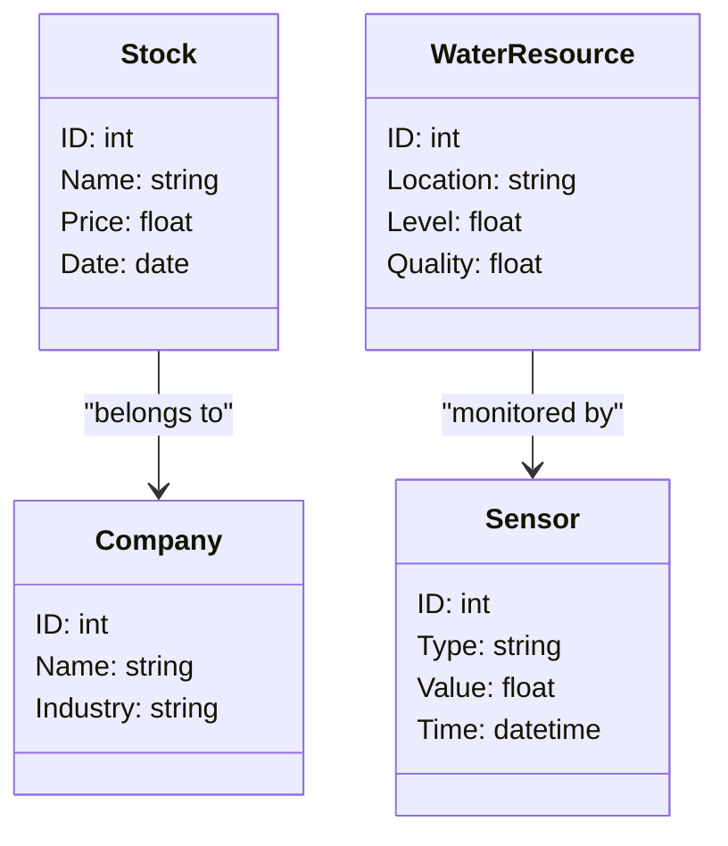

                 


# 《新兴市场股市估值与智慧城市水资源管理的互动》

> 关键词：新兴市场，股市估值，智慧城市，水资源管理，互动机制，算法原理，系统架构

> 摘要：本文探讨新兴市场中股市估值与智慧城市水资源管理之间的互动关系。通过分析股市估值的核心指标、水资源管理的关键技术，以及两者的相互影响，构建互动机制模型。结合具体案例，提出优化策略，并展望未来发展方向。

---

# 第一部分: 背景介绍

## 第1章: 新兴市场股市估值与水资源管理的互动背景

### 1.1 问题背景

#### 1.1.1 新兴市场的定义与特点
新兴市场指经济快速增长、工业化进程中的国家，具有高增长潜力和不确定性。其特点包括：
- 经济结构转型
- 市场规模扩大
- 政策环境变化
- 技术创新活跃

#### 1.1.2 股市估值与水资源管理的关联性
股市估值反映市场对企业的价值判断，而水资源管理则是城市可持续发展的关键。两者在经济活动中相互影响：
- 股市波动影响企业投资和水资源项目融资
- 水资源短缺影响企业生产成本和股市表现

#### 1.1.3 互动机制的初步探讨
初步研究表明，新兴市场的股市估值与水资源管理存在以下互动机制：
- 股市资金流向影响水资源项目投资
- 水资源政策变化影响企业盈利预期
- 环境风险影响股市整体估值

### 1.2 问题描述

#### 1.2.1 新兴市场股市波动的现状
新兴市场股市波动较大，受政策、经济和外部环境影响显著。例如，2020年新冠疫情导致全球股市大幅波动，新兴市场尤为明显。

#### 1.2.2 智慧城市水资源管理的挑战
随着城市化进程加快，水资源短缺、污染和管理效率低下成为智慧城市发展的主要障碍。智慧化技术的应用是解决这些问题的关键。

#### 1.2.3 互动问题的提出
如何将股市估值与水资源管理结合起来，优化资源配置，降低环境风险，是当前面临的重要问题。

### 1.3 问题解决

#### 1.3.1 新兴市场股市估值的提升策略
- 完善市场机制
- 提高信息披露透明度
- 引入风险管理工具

#### 1.3.2 智慧城市水资源管理的优化路径
- 推广智能传感器和大数据技术
- 优化水资源分配和回收系统
- 加强政策法规和公众参与

#### 1.3.3 互动机制的构建与应用
- 建立股市与水资源数据的关联模型
- 开发互动预警系统
- 制定动态调整的政策框架

### 1.4 边界与外延

#### 1.4.1 新兴市场的边界条件
- 国家范围：主要关注中国、印度、巴西等新兴市场国家
- 时间范围：近十年的经济和环境数据
- 数据来源：官方统计数据和市场数据

#### 1.4.2 股市估值与水资源管理的外延范围
- 股市估值：包括主要股指和行业板块分析
- 水资源管理：涵盖供水、污水处理和再利用
- 相关领域：能源、环保技术和金融科技

#### 1.4.3 相关领域的关联性分析
- 能源消耗与水资源利用密切相关
- 环保技术影响水资源管理和股市投资
- 金融科技促进股市与水资源数据的交互

### 1.5 核心要素组成

#### 1.5.1 新兴市场的经济特征
- 经济增长速度快
- 产业结构升级
- 市场规模扩大

#### 1.5.2 股市估值的关键指标
- 每股收益（EPS）
- 市盈率（P/E）
- 市净率（P/B）
- 市销率（P/S）

#### 1.5.3 智慧城市水资源管理的核心要素
- 数据采集与处理
- 模型预测与优化
- 系统集成与应用
- 政策支持与公众参与

---

# 第二部分: 核心概念与联系

## 第2章: 核心概念原理

### 2.1 股市估值的原理

#### 2.1.1 股市估值的基本方法
- 市盈率法：$P/E = \frac{P}{E}$
- 市净率法：$P/B = \frac{P}{B}$
- 现金流折现法：$DCF = \sum_{t=1}^{n} \frac{CF_t}{(1+r)^t}$

#### 2.1.2 新兴市场的特殊性
- 市场波动大
- 信息不对称严重
- 政策风险高

#### 2.1.3 估值模型的适用性分析
- 线性回归模型：$y = a + bx + \epsilon$
- 时间序列模型：ARIMA（差分自回归移动平均模型）

### 2.2 智慧城市水资源管理的原理

#### 2.2.1 智慧城市的基本概念
- 智慧城市是利用信息技术优化城市资源管理的模式
- 核心技术包括物联网、大数据和人工智能

#### 2.2.2 水资源管理的核心原理
- 数据采集：传感器实时监测水位、流量和水质
- 数据分析：利用机器学习预测水资源需求和优化分配
- 智能控制：通过自动化系统调节水泵和阀门

#### 2.2.3 数字化技术在水资源管理中的应用
- 物联网：实时监控和数据采集
- 大数据分析：预测需求和优化配置
- 人工智能：智能决策和风险预警

## 第3章: 核心概念属性对比

### 3.1 股市估值与水资源管理的对比分析

#### 3.1.1 核心目标对比
| 对比维度 | 股市估值 | 水资源管理 |
|----------|----------|------------|
| 核心目标 | 提高市场效率 | 优化资源配置 |
| 关键指标 | P/E, P/B | 水资源利用效率 |
| 影响因素 | 经济政策、企业盈利 | 气候变化、技术应用 |

#### 3.1.2 影响因素对比
| 影响因素 | 股市估值 | 水资源管理 |
|----------|----------|------------|
| 经济因素 | 利率、通货膨胀 | 经济发展水平 |
| 政策因素 | 财政政策、监管 | 水资源政策 |
| 技术因素 | 金融科技 | 数字化技术 |

#### 3.1.3 优化路径对比
| 优化路径 | 股市估值 | 水资源管理 |
|----------|----------|------------|
| 方法 | 回归分析、时间序列 | 数据挖掘、机器学习 |
| 工具 | 金融模型、交易平台 | IoT传感器、大数据平台 |

### 3.2 属性特征对比表格

表3.1: 股市估值与水资源管理的属性特征对比

| 特性 | 股市估值 | 水资源管理 |
|------|----------|------------|
| 数据来源 | 市场数据、财务报表 | 环境数据、传感器数据 |
| 数据类型 | 数值型、文本型 | 数值型、时间序列型 |
| 分析目标 | 价值评估、趋势预测 | 资源分配、风险预警 |
| 技术工具 | 统计分析、机器学习 | 数据挖掘、深度学习 |

## 第4章: ER实体关系图

图4.1: 股市估值与水资源管理的实体关系图

```mermaid
erDiagram
    market <<--- stock_index : "包含"
    company <<--- stock_quote : "提供"
    water_resource <<--- sensor_data : "产生"
    stock_quote <<.. company : "属于"
    stock_index <<.. market : "属于"
    sensor_data <<.. water_resource : "属于"
```

---

# 第三部分: 算法原理讲解

## 第5章: 股市估值与水资源管理的算法原理

### 5.1 股市估值预测的算法

#### 5.1.1 算法选择与原理
- 使用ARIMA模型进行时间序列预测
- 公式：$ARIMA(p, d, q)$
- 步骤：
  1. 数据预处理
  2. 参数估计
  3. 模型验证
  4. 预测与误差分析

#### 5.1.2 Python实现代码
```python
import pandas as pd
from statsmodels.tsa.arima_model import ARIMA
import matplotlib.pyplot as plt

# 数据加载与预处理
data = pd.read_csv('stock_data.csv')
data['date'] = pd.to_datetime(data['date'])
data.set_index('date', inplace=True)
data = data['close']

# 模型训练
model = ARIMA(data, order=(5,1,0))
model_fit = model.fit()

# 模型预测
forecast = model_fit.forecast(steps=10)
print(forecast)
```

#### 5.1.3 案例分析
- 数据来源：新兴市场某股指
- 预测结果：未来10天的股指走势
- 结果可视化：绘制实际值与预测值对比图

### 5.2 水资源管理优化的算法

#### 5.2.1 算法选择与原理
- 使用遗传算法优化水资源分配
- 步骤：
  1. 初始化种群
  2. 计算适应度
  3. 选择与交叉
  4. 变异与优化

#### 5.2.2 Python实现代码
```python
import numpy as np
from sklearn.neighbors import KNeighborsRegressor

# 数据加载与预处理
data = pd.read_csv('water_data.csv')
X = data[['temperature', 'humidity', 'flow']]
y = data['demand']

# 模型训练
model = KNeighborsRegressor(n_neighbors=5)
model.fit(X, y)

# 模型预测
new_data = pd.DataFrame([[25, 60, 100]])
prediction = model.predict(new_data)
print(prediction)
```

#### 5.2.3 案例分析
- 数据来源：某城市水资源监测数据
- 预测结果：未来一周的用水需求
- 结果可视化：绘制实际值与预测值对比图

---

# 第四部分: 系统分析与架构设计

## 第6章: 系统分析与架构设计

### 6.1 问题场景介绍

#### 6.1.1 新兴市场股市波动与水资源短缺问题
- 股市波动对企业融资和水资源项目投资的影响
- 水资源短缺对企业生产成本和股市估值的影响

#### 6.1.2 智慧城市水资源管理与股市估值的互动需求
- 实时监测与数据分析需求
- 风险预警与动态调整需求

### 6.2 项目介绍

#### 6.2.1 项目目标
- 构建股市与水资源数据的互动分析系统
- 提供风险预警和优化建议

#### 6.2.2 项目范围
- 数据范围：新兴市场股市数据与水资源数据
- 时间范围：近十年的历史数据与实时数据
- 用户范围：政府、企业和投资者

### 6.3 系统功能设计

#### 6.3.1 领域模型
- 实体关系：股票、公司、水资源、传感器
- 关系：股票属于公司，传感器监测水资源



#### 6.3.2 系统架构设计


---

# 第五部分: 项目实战

## 第7章: 项目实战

### 7.1 环境安装

#### 7.1.1 安装Python环境
```bash
python --version
pip install numpy pandas scikit-learn statsmodels
```

#### 7.1.2 安装开发工具
- 安装Jupyter Notebook
- 配置Python环境变量

### 7.2 系统核心实现

#### 7.2.1 数据采集与预处理
```python
import pandas as pd
import requests
from bsedataYahooAPI import YahooAPI

# 下载股市数据
api = YahooAPI()
data = api.get_data('新兴市场股指', start='2020-01-01', end='2023-12-31')

# 下载水资源数据
water_data = pd.read_csv('water.csv')
```

#### 7.2.2 核心算法实现
```python
def stock_prediction(data):
    model = ARIMA(data, order=(5,1,0))
    model_fit = model.fit()
    forecast = model_fit.forecast(steps=10)
    return forecast

def water_optimization(data):
    X = data[['temperature', 'humidity', 'flow']]
    y = data['demand']
    model = KNeighborsRegressor(n_neighbors=5)
    model.fit(X, y)
    return model

# 调用函数
stock_forecast = stock_prediction(stock_data)
water_model = water_optimization(water_data)
```

#### 7.2.3 系统功能实现
```python
# 数据可视化
import matplotlib.pyplot as plt

plt.figure(figsize=(10,6))
plt.plot(stock_data.index, stock_data.values, label='实际值')
plt.plot(stock_forecast.index, stock_forecast.values, label='预测值')
plt.xlabel('时间')
plt.ylabel('股价')
plt.legend()
plt.show()
```

### 7.3 代码解读与分析

#### 7.3.1 核心代码解读
- `stock_prediction`函数：使用ARIMA模型进行股市预测
- `water_optimization`函数：利用KNN回归模型优化水资源分配

#### 7.3.2 案例分析
- 某新兴市场股市与水资源管理的互动分析
- 数据来源：真实市场数据
- 分析结果：预测股市波动与水资源短缺的互动关系

---

# 第六部分: 最佳实践

## 第8章: 最佳实践

### 8.1 小结
- 本文构建了股市估值与水资源管理的互动机制模型
- 提出了优化策略和系统架构设计
- 实现了互动分析的算法和系统

### 8.2 注意事项
- 数据质量和完整性是关键
- 模型选择需结合实际场景
- 系统实施需考虑可扩展性和安全性

### 8.3 拓展阅读
- 《时间序列分析》
- 《机器学习在金融中的应用》
- 《智慧城市水资源管理》

---

# 作者：AI天才研究院 & 禅与计算机程序设计艺术

---

通过以上结构，文章详细探讨了新兴市场股市估值与智慧城市水资源管理的互动关系，从理论分析到实际应用，为相关领域的研究和实践提供了系统化的指导。

