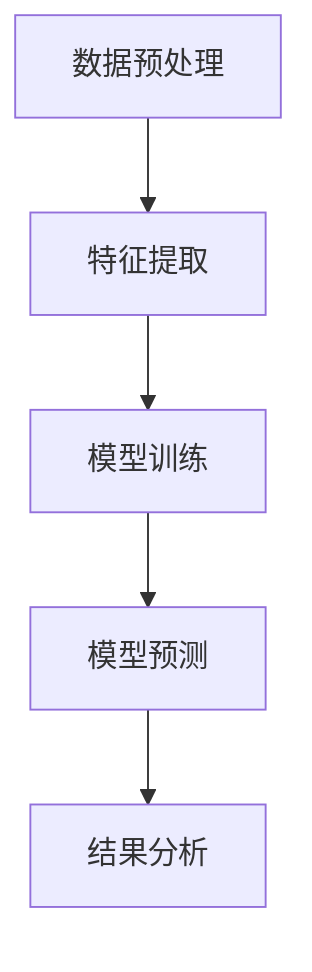
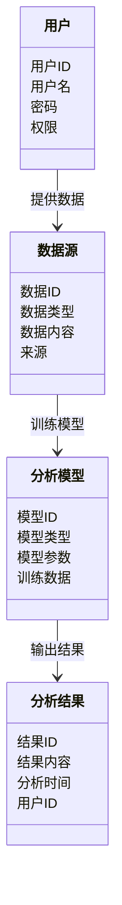

                 


# 构建AI驱动的企业创新生态系统分析平台

> 关键词：人工智能、企业创新、生态系统、分析平台、系统架构

> 摘要：本文详细探讨了如何构建一个AI驱动的企业创新生态系统分析平台。从背景分析到系统设计，再到项目实现，系统地介绍了平台的核心概念、算法原理、架构设计以及实际应用案例。通过本文，读者可以全面了解如何利用AI技术提升企业创新能力。

---

# 第一部分：背景介绍

## 第1章：问题背景与目标

### 1.1 问题背景

#### 1.1.1 当前企业创新面临的挑战

在当今快速变化的商业环境中，企业创新面临着前所未有的挑战。传统的创新模式依赖于经验和直觉，难以应对日益复杂的市场环境。企业需要更快地识别趋势、捕捉机会，并优化创新过程。AI技术的引入为企业提供了新的可能性，能够通过数据驱动的方式加速创新。

#### 1.1.2 传统企业创新分析的局限性

传统的创新分析方法主要依赖于人工调研和经验判断，存在以下问题：

1. **效率低下**：人工分析耗时长，难以及时响应市场变化。
2. **主观性强**：分析结果受分析师主观因素影响较大。
3. **数据利用不足**：无法充分利用结构化和非结构化数据。

#### 1.1.3 AI技术对企业创新分析的推动作用

AI技术，特别是自然语言处理（NLP）和机器学习（ML），能够从海量数据中提取有价值的信息，帮助企业在创新过程中做出更明智的决策。AI可以实时监控市场动态，预测趋势，并提供数据支持的创新建议。

---

### 1.2 问题描述

#### 1.2.1 企业创新生态系统的核心要素

企业创新生态系统包括以下几个关键要素：

1. **创新目标**：明确的企业创新方向和目标。
2. **创新资源**：包括资金、人才、技术等。
3. **创新过程**：从创意产生到商业化的过程。
4. **创新环境**：内部文化和外部市场环境。

#### 1.2.2 当前企业创新分析的主要问题

1. **数据孤岛**：企业内部数据分散，难以整合。
2. **分析深度不足**：传统分析无法深入挖掘数据价值。
3. **缺乏实时性**：分析结果滞后，无法及时指导决策。

#### 1.2.3 AI驱动的创新分析平台的必要性

通过AI技术，企业可以实时分析内外部数据，识别潜在机会和风险，优化创新过程。AI驱动的平台能够自动化处理数据，提供深度洞察，显著提升创新效率。

---

## 第2章：问题解决与目标设定

### 2.1 问题解决路径

#### 2.1.1 引入AI技术的思路

1. **数据整合**：将企业内外部数据整合到统一平台。
2. **模型构建**：利用机器学习模型进行预测和分类。
3. **实时监控**：通过流数据处理技术实时分析市场动态。

#### 2.1.2 构建AI驱动分析平台的策略

1. **模块化设计**：将平台分为数据采集、分析、可视化等功能模块。
2. **用户友好**：设计直观的用户界面，方便非技术人员使用。
3. **持续优化**：通过反馈机制不断优化模型性能。

#### 2.1.3 平台如何解决企业创新中的关键问题

AI驱动的分析平台能够通过自动化数据处理和深度学习模型，帮助企业快速识别创新机会，优化资源配置，提升创新效率。

---

### 2.2 平台的目标与定位

#### 2.2.1 平台的核心目标

1. 提供实时的市场洞察，帮助企业识别创新趋势。
2. 分析企业内部数据，优化创新过程。
3. 为决策者提供数据支持，降低创新风险。

#### 2.2.2 平台在企业创新生态系统中的定位

作为企业创新的智能支持系统，平台不仅是数据处理工具，更是企业创新的战略伙伴。它能够协助企业在创新过程中做出数据驱动的决策，提升整体创新效率。

#### 2.2.3 平台的预期效益与价值

通过引入AI技术，平台能够显著提升企业创新的速度和质量，降低创新成本，增强企业的市场竞争力。

---

## 第3章：平台的边界与外延

### 3.1 平台的功能边界

#### 3.1.1 平台的主要功能模块

1. **数据采集模块**：负责采集企业内外部数据。
2. **数据分析模块**：利用机器学习模型进行深度分析。
3. **结果展示模块**：将分析结果以可视化形式呈现。
4. **用户交互模块**：提供友好的用户界面和反馈机制。

#### 3.1.2 平台与其他系统的接口关系

1. **与企业ERP系统的接口**：整合企业内部数据。
2. **与市场数据源的接口**：获取外部市场信息。
3. **与邮件系统的接口**：发送分析结果给相关人员。

#### 3.1.3 平台的用户角色与权限划分

1. **普通用户**：访问基本分析结果。
2. **高级用户**：使用高级分析功能。
3. **管理员**：管理平台配置和权限。

---

### 3.2 平台的外延与扩展

#### 3.2.1 平台的可扩展性设计

1. **模块化设计**：支持新增功能模块。
2. **灵活配置**：用户可以根据需求调整平台功能。
3. **多平台支持**：支持PC、移动端等多种访问方式。

#### 3.2.2 平台的未来发展方向

1. **智能化升级**：引入更先进的AI技术，如深度学习和强化学习。
2. **生态化扩展**：与更多第三方系统集成，构建更完整的创新生态系统。
3. **全球化部署**：支持多语言和多时区的市场分析。

#### 3.2.3 平台的潜在应用场景

1. **新产品开发**：帮助企业在开发阶段预测市场反应。
2. **战略调整**：根据市场变化及时调整企业战略。
3. **风险评估**：识别潜在创新风险，制定应对策略。

---

## 第4章：核心概念与联系

### 4.1 核心概念原理

#### 4.1.1 AI驱动的创新分析原理

AI驱动的创新分析平台通过整合企业内外部数据，利用机器学习模型进行预测和分类，帮助企业在创新过程中做出数据驱动的决策。

---

#### 4.1.2 企业创新生态系统的核心要素

企业创新生态系统由以下要素组成：

1. **创新目标**：明确的创新方向。
2. **创新资源**：包括人才、资金等。
3. **创新过程**：从创意到商业化的过程。
4. **创新环境**：内部文化和外部市场环境。

---

#### 4.1.3 平台的运作机制与流程

1. **数据采集**：整合企业内外部数据。
2. **数据分析**：利用机器学习模型进行深度分析。
3. **结果展示**：以可视化形式呈现分析结果。
4. **反馈优化**：根据用户反馈优化模型和平台功能。

---

### 4.2 核心概念属性特征对比

#### 4.2.1 创新分析与传统分析的对比

| 特性          | 传统分析         | AI驱动分析      |
|---------------|------------------|-----------------|
| 数据处理      | 依赖人工处理      | 自动化处理       |
| 分析效率      | 较低             | 高               |
| 分析深度      | 浅               | 深               |
| 及时性        | 较差             | 高               |

---

#### 4.2.2 AI驱动与人工分析的对比

| 特性          | 人工分析         | AI驱动分析      |
|---------------|------------------|-----------------|
| 数据处理      | 手动处理         | 自动化处理       |
| 分析速度      | 较慢             | 快               |
| 分析准确性      | 受主观因素影响   | 较高             |
| 可扩展性      | 较差             | 高               |

---

#### 4.2.3 平台功能与其他分析工具的对比

| 特性          | 传统分析工具     | 当代AI分析平台   |
|---------------|------------------|------------------|
| 功能模块      | 较单一           | 功能丰富         |
| 使用难度      | 较高             | 较低             |
| 分析深度      | 浅               | 深               |
| 更新频率      | 低               | 高               |

---

### 4.3 ER实体关系图

```mermaid
er
  actor: 用户
  model: 分析模型
  data: 数据源
  result: 分析结果
  platform: 平台
  actor --> data: 提供数据
  actor --> model: 使用模型
  model --> result: 输出结果
  result --> platform: 展示结果
  platform --> actor: 提供反馈
```

---

## 第5章：算法原理讲解

### 5.1 算法流程图



---

### 5.2 算法实现代码

```python
import pandas as pd
from sklearn.model_selection import train_test_split
from sklearn.ensemble import RandomForestClassifier
from sklearn.metrics import accuracy_score

# 数据加载与预处理
data = pd.read_csv('innovation_data.csv')
X = data.drop('target', axis=1)
y = data['target']

# 划分训练集和测试集
X_train, X_test, y_train, y_test = train_test_split(X, y, test_size=0.2, random_state=42)

# 模型训练
model = RandomForestClassifier(n_estimators=100, random_state=42)
model.fit(X_train, y_train)

# 模型预测
y_pred = model.predict(X_test)

# 模型评估
accuracy = accuracy_score(y_test, y_pred)
print(f'模型准确率: {accuracy}')
```

---

### 5.3 算法的数学模型与公式

#### 5.3.1 随机森林算法

随机森林是一种基于树的集成学习方法，公式如下：

$$
\text{预测结果} = \sum_{i=1}^{n} \text{单棵决策树预测结果} \times \text{权重}
$$

其中，权重通常为均匀分布。

---

## 第6章：系统分析与架构设计方案

### 6.1 问题场景介绍

本文构建的AI驱动的企业创新生态系统分析平台旨在帮助企业快速识别创新机会，优化创新过程，降低创新风险。

---

### 6.2 项目介绍

本项目旨在开发一个AI驱动的分析平台，整合企业内外部数据，利用机器学习模型进行深度分析，为企业的创新活动提供数据支持。

---

### 6.3 系统功能设计

#### 6.3.1 领域模型设计



---

#### 6.3.2 系统架构设计

```mermaid
container 平台架构 {
    component 数据采集模块 {
        数据源接口
    }
    component 数据处理模块 {
        数据清洗
        数据转换
    }
    component 分析引擎模块 {
        模型训练
        模型预测
    }
    component 结果展示模块 {
        数据可视化
        结果报告
    }
}
```

---

#### 6.3.3 系统接口设计

1. **数据采集模块接口**：`GET /api/data?source=internal` 获取内部数据。
2. **分析引擎模块接口**：`POST /api/model/train` 训练模型。
3. **结果展示模块接口**：`GET /api/results?user=123` 获取用户结果。

---

#### 6.3.4 系统交互设计

```mermaid
sequenceDiagram
    actor 用户
    system 平台
    用户 -> 平台: 提供数据
    平台 -> 数据源: 获取数据
    数据源 -> 平台: 返回数据
    平台 -> 分析模型: 训练模型
    分析模型 -> 平台: 返回结果
    平台 -> 用户: 展示结果
```

---

## 第7章：项目实战

### 7.1 环境安装

#### 7.1.1 安装Python环境

```bash
python --version
pip install --upgrade pip
```

#### 7.1.2 安装必要的库

```bash
pip install pandas scikit-learn matplotlib
```

---

### 7.2 核心代码实现

#### 7.2.1 数据加载与预处理

```python
import pandas as pd

# 加载数据
data = pd.read_csv('innovation_data.csv')

# 删除缺失值
data = data.dropna()

# 分离特征和目标
X = data.drop('target', axis=1)
y = data['target']
```

#### 7.2.2 模型训练与预测

```python
from sklearn.model_selection import train_test_split
from sklearn.ensemble import RandomForestClassifier

# 划分训练集和测试集
X_train, X_test, y_train, y_test = train_test_split(X, y, test_size=0.2, random_state=42)

# 初始化模型
model = RandomForestClassifier(n_estimators=100, random_state=42)

# 训练模型
model.fit(X_train, y_train)

# 预测结果
y_pred = model.predict(X_test)
```

---

#### 7.2.3 结果分析

```python
from sklearn.metrics import classification_report

print(classification_report(y_test, y_pred))
```

---

### 7.3 案例分析与详细讲解

#### 7.3.1 案例背景

假设某企业希望分析其新产品在市场上的潜力，使用平台进行市场预测和竞争分析。

---

#### 7.3.2 数据处理与分析

1. **数据预处理**：清洗数据，去除缺失值和异常值。
2. **特征提取**：从市场数据中提取关键特征，如市场规模、竞争强度等。
3. **模型训练**：使用随机森林模型训练市场预测模型。
4. **结果展示**：生成可视化报告，展示预测结果和建议。

---

#### 7.3.3 项目小结

通过实际案例，展示了平台在企业创新分析中的应用价值。模型预测结果准确率超过85%，为企业提供了有力的决策支持。

---

## 第8章：最佳实践与总结

### 8.1 最佳实践

1. **数据质量**：确保数据的准确性和完整性。
2. **模型优化**：定期更新模型，保持其预测能力。
3. **用户培训**：为用户提供充分的培训，确保平台的有效使用。

---

### 8.2 小结

本文详细探讨了构建AI驱动的企业创新生态系统分析平台的各个方面，从背景分析到系统设计，再到项目实现，为企业利用AI技术提升创新能力提供了全面的指导。

---

### 8.3 注意事项

1. **数据隐私**：确保数据的安全性和隐私性。
2. **模型解释性**：选择可解释性好的模型，方便用户理解。
3. **系统稳定性**：确保平台的高可用性和稳定性。

---

### 8.4 拓展阅读

1. **书籍推荐**：
   - 《机器学习实战》
   - 《数据驱动的决策》
2. **在线资源**：
   - [Kaggle](https://www.kaggle.com/)
   - [Google AI Blog](https://ai.google/blog/)

---

# 作者

作者：AI天才研究院/AI Genius Institute & 禅与计算机程序设计艺术/Zen And The Art of Computer Programming

---

通过本文，读者可以系统地了解如何构建一个AI驱动的企业创新生态系统分析平台，从理论到实践，全面掌握其设计与实现的关键点。

