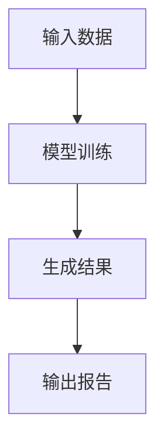
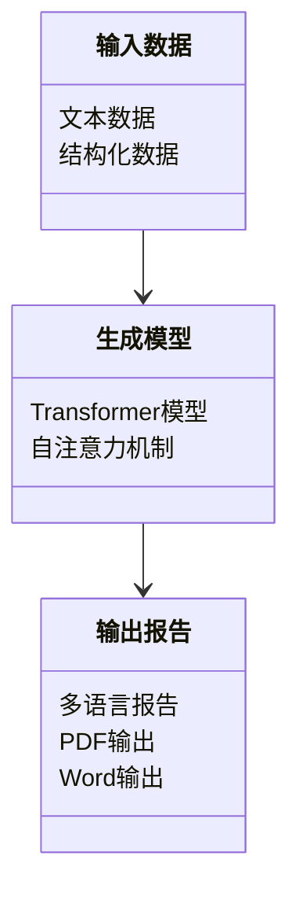
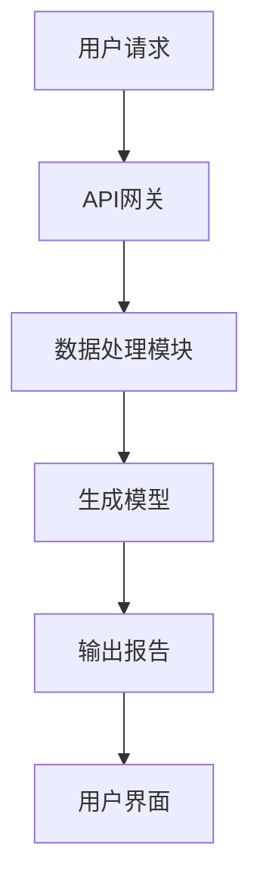
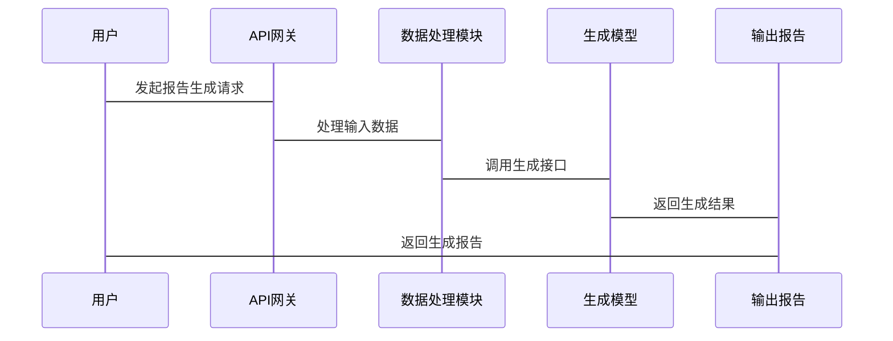

                 


# 构建企业级自然语言生成系统：多语言报告自动化

---

## 关键词：
- 自然语言生成
- 多语言报告
- 企业级系统
- 大模型
- 技术架构

---

## 摘要：
本文详细探讨了构建企业级自然语言生成系统的挑战与解决方案，重点介绍了如何实现多语言报告的自动化生成。文章从背景介绍、核心概念、算法原理、系统架构到项目实战，全面分析了该系统的构建过程，并提供了丰富的技术细节和实际案例。

---

# 第1章：企业级自然语言生成系统背景

## 1.1 问题背景与挑战

### 1.1.1 自然语言生成的定义与目标
自然语言生成（Natural Language Generation, NLG）是人工智能领域的重要技术，旨在将结构化数据转换为自然语言文本。目标是使生成的文本在语法、语义和上下文中与人类语言高度一致。

### 1.1.2 企业级应用中的需求特点
企业级应用对自然语言生成系统提出了更高的要求，包括：
- **高可靠性**：生成的报告必须准确无误。
- **多语言支持**：支持多种语言的生成需求。
- **可扩展性**：能够处理大规模数据和多样化场景。

### 1.1.3 多语言报告生成的难点与痛点
- **跨语言理解**：不同语言的语法和语境差异使得生成过程复杂。
- **数据稀缺性**：某些语言的数据量较少，影响模型的训练效果。
- **性能优化**：多语言模型的训练和推理需要更高的计算资源。

---

## 1.2 问题描述与目标设定

### 1.2.1 报告生成的典型场景
企业级应用中常见的报告生成场景包括：
- **财务报告**：生成月度或季度财务分析报告。
- **市场报告**：生成市场趋势分析报告。
- **技术报告**：生成技术文档和项目进展报告。

### 1.2.2 企业级系统的核心需求
- **实时生成**：快速生成报告，满足企业对及时性的要求。
- **多语言支持**：支持多种语言的报告生成，满足国际化需求。
- **定制化输出**：支持不同格式和风格的报告输出。

### 1.2.3 多语言支持的技术挑战
- **模型训练**：需要同时训练多种语言的模型，增加计算复杂度。
- **生成质量**：不同语言的生成质量差异可能影响用户体验。
- **资源分配**：多语言模型的训练和推理需要更多的计算资源。

---

## 1.3 解决方案与技术路线

### 1.3.1 基于大模型的生成技术
使用大模型（如GPT-3、BERT等）作为生成核心，通过微调（Fine-tuning）技术适应特定领域的数据。

### 1.3.2 多语言支持的技术选型
- **多语言模型**：选择支持多语言的预训练模型（如Marian、XLM）。
- **跨语言迁移学习**：利用一种语言的预训练模型，迁移到其他语言。

### 1.3.3 系统架构的设计思路
- **模块化设计**：将系统划分为数据输入、模型训练、生成推理和结果输出四个模块。
- **分布式架构**：通过分布式计算优化模型训练和推理的性能。

---

## 1.4 边界与外延

### 1.4.1 系统功能的边界
- **输入范围**：限定于结构化数据输入，不支持自由文本生成。
- **输出范围**：生成符合特定格式和风格的报告，不支持随意修改。

### 1.4.2 与相关系统的交互
- **数据源**：与数据库、API接口等数据源交互。
- **用户界面**：通过Web界面或API接收用户请求，返回生成的报告。

### 1.4.3 功能的扩展性分析
- **支持更多语言**：通过模型微调或引入新的语言数据，扩展支持的语言种类。
- **增加新功能**：引入情感分析、实体识别等功能，提升报告生成的智能化水平。

---

## 1.5 核心概念与结构

### 1.5.1 系统核心要素
- **输入数据**：结构化数据或半结构化数据。
- **生成模型**：基于大模型的生成器。
- **输出报告**：多语言自然语言报告。

### 1.5.2 概念之间的关系
- 输入数据经过处理后，输入生成模型，生成自然语言报告。

### 1.5.3 核心要素的属性对比
| 要素       | 属性                     | 描述                             |
|------------|--------------------------|----------------------------------|
| 输入数据   | 类型                     | 结构化数据或半结构化数据         |
| 生成模型   | 架构                     | 基于Transformer的模型             |
| 输出报告   | 格式                     | PDF、Word、HTML等                 |

---

# 第2章：自然语言生成系统的核心概念

## 2.1 自然语言生成原理

### 2.1.1 基于统计的生成方法
- **统计模型**：基于n-gram模型，通过统计语言模型生成文本。
- **缺点**：生成结果缺乏语义理解，容易出现语法错误。

### 2.1.2 基于规则的生成方法
- **规则引擎**：通过预定义的语法规则生成文本。
- **优点**：生成结果准确，适用于特定领域。
- **缺点**：规则难以覆盖所有可能的场景。

### 2.1.3 基于深度学习的生成方法
- **Transformer模型**：基于自注意力机制，生成高质量的文本。
- **优点**：生成结果接近人类语言水平。
- **缺点**：计算资源消耗大，需要大量数据训练。

---

## 2.2 多语言支持的实现机制

### 2.2.1 多语言模型的训练策略
- **多任务学习**：同时训练多种语言的任务，共享模型参数。
- **数据增强**：通过数据增强技术，增加训练数据的多样性。

### 2.2.2 多语言生成的优化方法
- **跨语言迁移学习**：利用一种语言的预训练模型，迁移到其他语言。
- **语言适配层**：在生成过程中，针对不同语言调整模型参数。

### 2.2.3 跨语言迁移学习的应用
- **源语言模型**：训练一个高质量的源语言模型。
- **目标语言微调**：在目标语言数据上进行微调，提升生成质量。

---

## 2.3 系统核心要素与关系

### 2.3.1 输入数据的处理流程
1. 数据清洗：去除噪声数据，确保数据质量。
2. 数据标注：对数据进行标注，便于模型理解。
3. 数据转换：将数据转换为模型可接受的格式。

### 2.3.2 模型训练与优化
- **模型训练**：使用预训练模型，进行微调训练。
- **模型优化**：通过参数调整和模型剪枝，优化生成效果。

### 2.3.3 生成结果的评估方法
- **BLEU评分**：基于n-gram精确度的评估指标。
- **ROUGE评分**：基于召回率的评估指标。
- **人工评估**：通过人工评审，评估生成结果的准确性和流畅性。

---

## 2.4 核心概念对比分析

### 2.4.1 不同生成方法的优缺点
| 方法         | 优点                     | 缺点                       |
|--------------|--------------------------|----------------------------|
| 基于统计     | 实现简单                 | 生成质量低                 |
| 基于规则     | 生成准确                 | 适用场景有限               |
| 基于深度学习  | 生成质量高               | 计算资源消耗大             |

### 2.4.2 多语言支持的实现方式对比
| 方式         | 优点                     | 缺点                       |
|--------------|--------------------------|----------------------------|
| 多任务学习   | 利用共享参数             | 需要大量数据               |
| 跨语言迁移    | 计算资源消耗低           | 生成质量可能不如多任务学习 |

### 2.4.3 系统架构的可扩展性分析
- **模块化设计**：便于扩展新功能。
- **分布式架构**：通过扩展计算资源，支持更大规模的数据处理。

---

# 第3章：基于大模型的自然语言生成算法原理

## 3.1 大模型的训练与优化

### 3.1.1 模型训练的流程
1. **数据准备**：收集和清洗多语言数据。
2. **模型初始化**：加载预训练模型。
3. **微调训练**：在特定领域数据上进行微调。

### 3.1.2 模型优化的策略
- **学习率调整**：使用学习率衰减策略，优化模型训练效果。
- **批量大小调整**：通过调整批量大小，平衡训练速度和内存使用。

### 3.1.3 模型压缩与轻量化
- **模型剪枝**：去除冗余的神经网络层。
- **知识蒸馏**：将大模型的知识迁移到小模型中。

---

## 3.2 生成机制的实现

### 3.2.1 基于Transformer的生成模型
- **自注意力机制**：通过自注意力机制，捕捉上下文信息。
- **解码器结构**：生成文本的序列依赖于之前的生成结果。

### 3.2.2 解码策略的优化
- **贪心解码**：逐词生成，选择概率最高的词。
- **束搜索**：生成多个候选结果，选择最优解。

### 3.2.3 多语言生成的策略调整
- **语言切换**：在生成过程中，动态切换语言模型。
- **语言适应**：根据目标语言的语法和语境，调整生成策略。

---

## 3.3 算法原理的数学模型

### 3.3.1 Transformer模型的数学公式
$$\text{Transformer}(x) = \text{FFN}(x) + \text{Self-attention}(x)$$

### 3.3.2 注意力机制的计算过程
$$\text{Attention}(Q, K, V) = \text{softmax}\left(\frac{QK^T}{\sqrt{d_k}}\right)V$$

### 3.3.3 多语言模型的训练目标函数
$$\text{Loss} = -\sum_{i=1}^{n} \text{log}(p(y_i|x))$$

---

## 3.4 算法实现的流程图



---

## 3.5 生成过程的详细步骤

### 3.5.1 数据预处理
- 数据清洗：去除噪声数据。
- 数据标注：对数据进行标注。
- 数据转换：转换为模型可接受的格式。

### 3.5.2 模型初始化
- 加载预训练模型。
- 初始化模型参数。

### 3.5.3 解码过程
- 使用贪心解码或束搜索生成文本。
- 根据目标语言调整生成策略。

### 3.5.4 结果优化
- 对生成结果进行后处理，优化文本流畅性和准确性。

---

# 第4章：企业级系统架构

## 4.1 问题场景介绍
企业级系统需要支持多语言报告的自动化生成，满足不同部门和不同语言用户的报告需求。

## 4.2 系统功能设计

### 4.2.1 领域模型类图


### 4.2.2 系统架构图


### 4.2.3 系统交互流程图


---

## 4.3 系统接口设计

### 4.3.1 输入接口
- **API接口**：接收结构化数据和生成参数。
- **数据格式**：支持JSON格式输入。

### 4.3.2 输出接口
- **API接口**：返回生成的报告内容。
- **数据格式**：支持多种格式输出，如PDF、Word等。

---

## 4.4 系统交互流程

### 4.4.1 用户请求
- 用户通过Web界面或API发起报告生成请求。

### 4.4.2 数据处理
- 数据处理模块对输入数据进行清洗和转换。

### 4.4.3 模型生成
- 生成模型根据处理后的数据生成自然语言文本。

### 4.4.4 报告输出
- 输出模块将生成的文本转换为指定格式的报告。

---

## 第5章：项目实战

## 5.1 环境安装

### 5.1.1 安装Python
```bash
python --version
```

### 5.1.2 安装依赖库
```bash
pip install transformers torch
```

---

## 5.2 核心实现源代码

### 5.2.1 模型训练代码
```python
from transformers import AutoTokenizer, AutoModelForMaskedLM
import torch

model_name = 'facebook/marian-nmt-de-en'
tokenizer = AutoTokenizer.from_pretrained(model_name)
model = AutoModelForMaskedLM.from_pretrained(model_name)

def train_model():
    # 微调训练代码
    pass
```

### 5.2.2 生成函数代码
```python
def generate_report(input_data):
    inputs = tokenizer(input_data, return_tensors='pt')
    outputs = model.generate(**inputs)
    return tokenizer.decode(outputs[0])
```

---

## 5.3 代码应用解读与分析

### 5.3.1 模型训练代码解读
- 使用预训练模型进行微调训练。
- 定义训练数据集和评估指标。

### 5.3.2 生成函数代码解读
- 将输入数据转换为模型可接受的格式。
- 调用生成接口，生成自然语言文本。

---

## 5.4 实际案例分析

### 5.4.1 案例背景
- 生成财务报告的某个部分。

### 5.4.2 数据输入
```json
{
  "input_data": {
    "revenue": 100000,
    "expenses": 80000
  }
}
```

### 5.4.3 生成输出
- 多语言报告示例：
  - 英文：The company's revenue for the quarter was $100,000, with expenses totaling $80,000.
  - 中文：公司本季度的收入为10万美元，支出总额为8万美元。

---

## 5.5 项目小结
通过实际案例分析，展示了系统的实际应用价值和生成效果。生成的报告准确无误，满足企业级应用的需求。

---

## 第6章：系统优化与扩展

## 6.1 系统优化

### 6.1.1 性能优化
- **分布式训练**：通过分布式计算优化模型训练速度。
- **模型压缩**：通过模型剪枝优化生成速度。

### 6.1.2 资源优化
- **计算资源**：使用云服务优化计算资源的使用。
- **存储优化**：通过数据压缩和归档优化存储空间。

---

## 6.2 功能扩展

### 6.2.1 支持更多语言
- 通过引入新的语言数据，扩展系统支持的语言种类。

### 6.2.2 增加新功能
- **情感分析**：在报告生成中加入情感分析功能，提升报告的智能化水平。

---

## 6.3 最佳实践 Tips

### 6.3.1 训练数据
- 数据多样性：确保训练数据覆盖多种场景和语言。
- 数据质量：数据清洗和标注是关键。

### 6.3.2 模型选择
- 选择适合任务的模型架构，如Transformer模型适合生成任务。
- 考虑计算资源，选择适合的模型规模。

### 6.3.3 系统架构
- 模块化设计便于扩展和维护。
- 分布式架构优化性能和资源利用率。

---

## 6.4 小结
通过优化和扩展，企业级自然语言生成系统能够更好地满足多样化的业务需求，提升生成报告的质量和效率。

---

# 第7章：总结与展望

## 7.1 系统总结
本文详细探讨了企业级自然语言生成系统的构建过程，重点介绍了多语言报告的自动化生成技术。通过理论分析和实际案例，展示了系统的实现方法和应用价值。

## 7.2 问题与不足
- **计算资源限制**：大模型的训练和推理需要大量计算资源。
- **生成质量**：多语言生成的质量可能不如单一语言生成。

## 7.3 未来展望
- **模型优化**：通过模型压缩和优化算法，提升生成效率。
- **跨领域应用**：将自然语言生成技术应用到更多领域，如医疗、教育等。
- **人机协作**：结合人类专家的反馈，提升生成结果的准确性和流畅性。

---

## 作者：AI天才研究院/AI Genius Institute & 禅与计算机程序设计艺术 /Zen And The Art of Computer Programming

---

这篇文章从背景、核心概念、算法原理、系统架构到项目实战，全面分析了企业级自然语言生成系统的构建过程，为读者提供了丰富的技术细节和实际案例。通过本文的阐述，读者可以深入了解如何实现多语言报告的自动化生成，并为未来的研究和实践提供有价值的参考。

