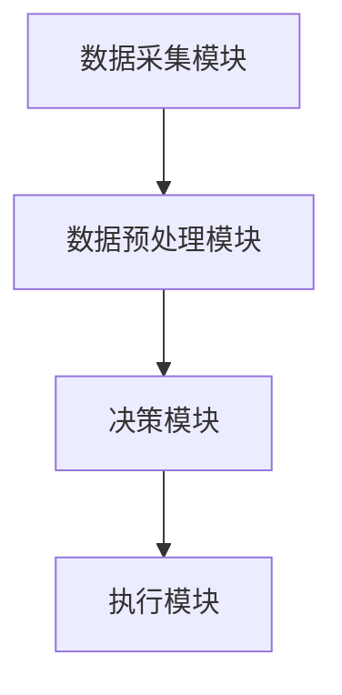
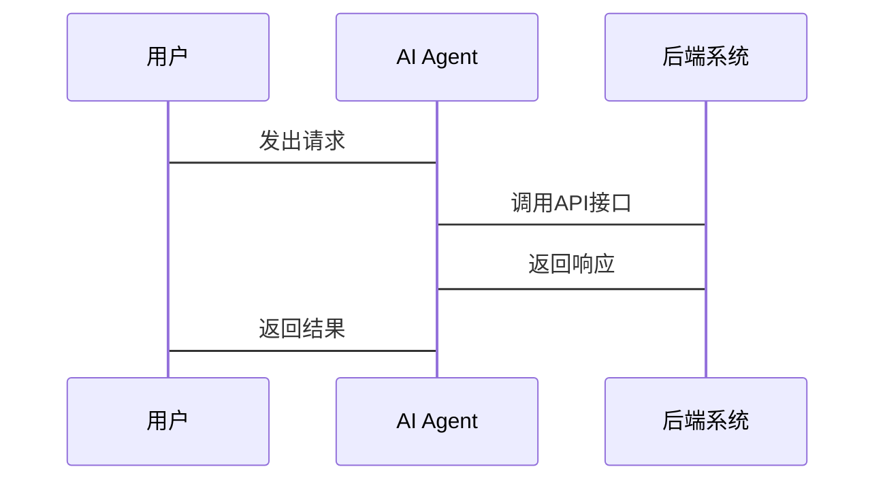

                 


# 确保AI Agent的安全性与隐私保护

> 关键词：AI Agent, 安全性, 隐私保护, 人工智能, 隐私计算, 安全框架

> 摘要：本文将探讨AI Agent的安全性和隐私保护问题，分析其核心概念、威胁模型、隐私保护原则，以及如何通过算法和系统架构设计来实现安全与隐私保护。我们将从AI Agent的基本概念出发，逐步深入到安全性与隐私保护的具体实现，最后通过实际案例分析和项目实战，帮助读者掌握AI Agent的安全性与隐私保护的关键技术。

---

# 第一部分：AI Agent的基本概念与背景

## 第1章：AI Agent的定义与应用场景

### 1.1 AI Agent的定义
#### 1.1.1 AI Agent的基本概念
AI Agent（人工智能代理）是指能够感知环境、自主决策并执行任务的智能实体。它可以是一个软件程序、机器人或其他智能系统，旨在模拟人类或其他智能生物的行为。

#### 1.1.2 AI Agent的核心特征
- **自主性**：能够在没有外部干预的情况下自主决策。
- **反应性**：能够根据环境变化实时调整行为。
- **目标导向**：基于预设目标执行任务。
- **学习能力**：通过数据和经验不断优化自身性能。

#### 1.1.3 AI Agent的分类与类型
- **简单反射型AI Agent**：基于预设规则进行简单决策。
- **基于模型的反应式AI Agent**：利用内部模型感知环境并做出决策。
- **目标驱动型AI Agent**：以特定目标为导向，优化行为以实现目标。
- **实用驱动型AI Agent**：根据效用函数最大化收益。

### 1.2 AI Agent的应用场景
#### 1.2.1 智能助手与个人服务
- 智能音箱（如Alexa、Google Home）
- 智能手机助手（如Siri、Google Assistant）
- 个人健康助手（如Fitbit健康助手）

#### 1.2.2 企业级AI Agent的应用
- 智能客服系统
- 自动化交易系统
- 企业资源规划（ERP）中的智能代理

#### 1.2.3 AI Agent在不同领域的应用案例
- **金融领域**：自动化交易、风险管理。
- **医疗领域**：疾病诊断辅助、治疗方案推荐。
- **制造业**：工业机器人、生产优化。

### 1.3 本章小结
本章介绍了AI Agent的基本概念、核心特征及其应用场景，为后续的安全性和隐私保护分析奠定了基础。

---

# 第二部分：AI Agent的安全性与隐私保护的重要性

## 第2章：AI Agent安全性的核心概念

### 2.1 AI Agent面临的安全威胁
#### 2.1.1 常见的安全威胁类型
- **数据泄露**：敏感信息被未经授权的第三方获取。
- **数据篡改**：数据被恶意修改，导致决策错误。
- **拒绝服务攻击（DoS）**：通过消耗资源使AI Agent无法正常运行。
- **身份伪造**：仿冒合法用户或系统，进行非法操作。

#### 2.1.2 安全威胁的分类与对比
| �威 �胁 类 型 | 描述 | 示例 |
|-------------|------|------|
| 数据泄露     | 敏感信息被窃取 | 用户隐私数据泄露 |
| 数据篡改     | 数据被恶意修改 | 恶意修改交易记录 |
| 拒绝服务攻击   | 服务不可用       | DDoS攻击 |
| 身份伪造     | 仿冒合法用户       | 社会工程攻击 |

#### 2.1.3 安全威胁的来源与影响
- **来源**：内部攻击、外部攻击、系统漏洞。
- **影响**：可能导致严重的经济损失、声誉损害，甚至威胁用户安全。

### 2.2 AI Agent的安全性框架
#### 2.2.1 安全性框架的核心要素
- **身份验证**：确保用户身份的真实性。
- **访问控制**：限制对敏感数据和功能的访问。
- **加密技术**：保护数据在传输和存储过程中的安全性。
- **安全审计**：定期检查系统安全性和漏洞。

#### 2.2.2 安全性框架的设计原则
- **最小权限原则**：用户和AI Agent应仅拥有完成任务所需的最小权限。
- **纵深防御**：通过多层次的安全措施来降低风险。
- **可追溯性**：记录所有操作日志，以便在发生安全事件时进行追溯。

### 2.3 AI Agent的安全性原则
#### 2.3.1 最小权限原则
AI Agent应仅拥有完成任务所需的最小权限，以减少被攻击的可能性。

#### 2.3.2 鉴权与授权机制
- **鉴权**：验证用户身份的真实性和合法性。
- **授权**：根据用户权限限制其可执行的操作。

#### 2.3.3 安全审计与日志管理
- **安全审计**：定期检查系统安全性和漏洞。
- **日志管理**：记录所有操作日志，便于安全事件的分析和追溯。

## 第3章：AI Agent隐私保护的核心概念

### 3.1 AI Agent中的隐私问题
#### 3.1.1 数据隐私的重要性
- **数据隐私**：用户数据未经授权不得被访问、使用或披露。
- **数据保护**：防止数据被非法获取、篡改或删除。

#### 3.1.2 用户隐私与数据保护的冲突
- **数据收集**：AI Agent需要收集大量数据以提高准确性。
- **隐私泄露**：数据收集可能引发隐私泄露风险。

### 3.2 隐私保护的核心原则
#### 3.2.1 数据最小化原则
AI Agent应仅收集实现目标所需的最少数据。

#### 3.2.2 数据匿名化与脱敏技术
- **数据匿名化**：通过技术手段去除数据中可以识别个人身份的信息。
- **数据脱敏**：对敏感数据进行处理，使其在不改变数据用途的情况下失去可识别性。

#### 3.2.3 隐私计算与保护机制
- **隐私计算**：在保护数据隐私的前提下进行数据处理和计算。
- **联邦学习**：通过分布式的计算方式，保护数据隐私的同时进行模型训练。

### 3.3 隐私保护的技术框架
#### 3.3.1 隐私保护的层次模型
- **数据层**：保护原始数据不被未经授权的访问。
- **计算层**：在保护隐私的前提下进行数据计算。
- **应用层**：确保应用程序在使用数据时符合隐私保护原则。

#### 3.3.2 隐私保护的技术实现
- **加密技术**：如同态加密、安全多方计算。
- **数据脱敏**：如数据屏蔽、数据泛化。
- **匿名化技术**：如k-匿名性、l-多样性。

## 第4章：AI Agent安全性与隐私性核心概念对比

### 4.1 安全性与隐私性的关系
#### 4.1.1 安全性与隐私性的相互依赖
- **安全性**：保护数据和系统不被攻击和破坏。
- **隐私性**：保护数据不被未经授权的访问和使用。

#### 4.1.2 安全性与隐私性的权衡
- **权衡点**：在实现安全性的同时，需要考虑对隐私性的影响，反之亦然。

### 4.2 安全性与隐私性的对比分析
| 比较维度     | 安全性                          | 隐私性                          |
|-------------|--------------------------------|----------------------------------|
| 定义         | 保护系统和数据不被攻击和破坏      | 保护数据不被未经授权的访问和使用  |
| 关注点       | 系统完整性、数据完整性           | 用户隐私、数据匿名性             |
| 实现方法     | 加密技术、访问控制、安全审计     | 数据脱敏、隐私计算、匿名化技术    |
| 依赖关系     | 隐私性是安全性的重要组成部分      | 安全性是隐私性实现的基础          |

---

# 第三部分：AI Agent安全性与隐私保护的解决方案

## 第5章：AI Agent安全性与隐私性的算法实现

### 5.1 安全强化学习算法
#### 5.1.1 强化学习的基本原理
- **状态（State）**：环境中的当前情况。
- **动作（Action）**：AI Agent在状态下的行为选择。
- **奖励（Reward）**：对动作的反馈，用于优化策略。

#### 5.1.2 安全强化学习的应用场景
- **网络安全**：通过强化学习优化安全策略。
- **自动驾驶**：在复杂环境中做出安全决策。

#### 5.1.3 安全强化学习的数学模型
$$ R(s, a) = \text{奖励函数} $$
其中，$s$ 表示状态，$a$ 表示动作。

### 5.2 隐私保护的机器学习模型
#### 5.2.1 隐私保护的机器学习概述
- **隐私保护的机器学习**：在保护数据隐私的前提下，进行模型训练和推理。

#### 5.2.2 隐私保护的机器学习技术
- **联邦学习（Federated Learning）**：分布式模型训练，保护数据隐私。
- **同态加密（Homomorphic Encryption）**：在加密状态下进行计算。

#### 5.2.3 隐私保护的机器学习模型实现
$$ f(x) = \text{模型函数} $$
其中，$x$ 表示输入数据，$f(x)$ 表示模型输出。

### 5.3 安全多方计算
#### 5.3.1 安全多方计算的基本概念
- **安全多方计算**：在多个参与方之间进行计算，确保数据隐私。

#### 5.3.2 安全多方计算的应用场景
- **联合数据分析**：多个机构联合分析数据，保护各方隐私。
- **隐私保护的交易系统**：在不泄露详细信息的情况下进行交易。

#### 5.3.3 安全多方计算的协议实现
$$ y = f(x_1, x_2, ..., x_n) $$
其中，$x_i$ 表示各方输入的数据，$y$ 表示计算结果。

---

## 第6章：AI Agent安全性与隐私保护的系统架构设计

### 6.1 系统功能设计
#### 6.1.1 领域模型设计
- **领域模型**：AI Agent的功能模块及其交互关系。

#### 6.1.2 功能模块设计
- **数据采集模块**：负责数据的收集和预处理。
- **决策模块**：基于数据做出决策。
- **执行模块**：根据决策执行操作。

### 6.2 系统架构设计
#### 6.2.1 系统架构图


#### 6.2.2 系统接口设计
- **API接口**：定义了系统与其他模块的交互接口。
- **数据接口**：定义了数据的输入和输出格式。

### 6.3 系统交互设计
#### 6.3.1 交互流程设计


---

## 第7章：AI Agent安全性与隐私保护的项目实战

### 7.1 环境配置
#### 7.1.1 开发环境
- **操作系统**：Linux/Windows/macOS
- **编程语言**：Python
- **框架**：TensorFlow、PyTorch
- **工具**：Jupyter Notebook、VS Code

### 7.2 核心代码实现
#### 7.2.1 数据隐私保护代码
```python
def anonymize_data(data):
    # 数据匿名化处理
    return data.anonymize()
```

#### 7.2.2 安全强化学习代码
```python
def safe_reinforcement_learning(env):
    # 初始化策略
    policy = initialize_policy(env)
    # 强化学习循环
    while True:
        # 选择动作
        action = policy.choose_action(state)
        # 执行动作
        next_state, reward, done = env.step(action)
        # 更新策略
        policy.update_policy(reward)
        if done:
            break
    return policy
```

### 7.3 测试与优化
#### 7.3.1 测试环境
- **测试用例**：设计多个测试用例，覆盖不同场景。
- **测试工具**：使用自动化测试工具，如unittest、pytest。

#### 7.3.2 性能优化
- **算法优化**：优化强化学习算法，提高计算效率。
- **数据优化**：减少数据冗余，提高数据处理效率。

### 7.4 案例分析
#### 7.4.1 智能客服系统的安全与隐私保护
- **数据隐私保护**：保护用户隐私，防止数据泄露。
- **安全强化学习**：优化客服系统决策，提高用户体验。

---

## 第8章：AI Agent安全性与隐私保护的最佳实践

### 8.1 核心要点总结
- **安全性**：通过加密、访问控制等技术保护系统安全。
- **隐私性**：通过数据脱敏、隐私计算等技术保护用户隐私。

### 8.2 小结
- **安全性**：安全性是AI Agent正常运行的基础。
- **隐私性**：隐私性是AI Agent信任的重要保障。

### 8.3 注意事项
- **数据收集**：仅收集必要的数据，避免过度收集。
- **数据处理**：在处理数据时，遵循数据最小化原则。
- **系统设计**：在设计系统时，优先考虑安全性和隐私性。

### 8.4 拓展阅读
- **推荐书籍**：《数据隐私与数据安全》
- **推荐论文**：《Privacy-Preserving Machine Learning via Federated Learning》

---

# 作者：AI天才研究院/AI Genius Institute & 禅与计算机程序设计艺术 /Zen And The Art of Computer Programming

