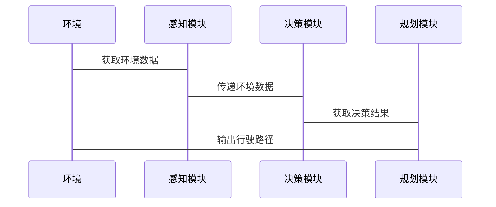

                 


# AI Agent在智能交通事故预防中的实践

> 关键词：AI Agent, 智能交通, 交通事故预防, 自动驾驶, 多智能体协同

> 摘要：AI Agent作为人工智能技术的核心应用之一，在智能交通事故预防中发挥着重要作用。本文将详细探讨AI Agent在交通事故预防中的核心概念、算法原理、系统架构设计以及实际案例，旨在为读者提供全面的理论和技术指导。

---

## 第一部分：AI Agent在智能交通事故预防中的背景与概念

### 第1章：AI Agent与交通事故预防概述

#### 1.1 AI Agent的基本概念

- **1.1.1 什么是AI Agent**
  AI Agent（智能体）是一种能够感知环境、做出决策并采取行动的实体。在交通事故预防中，AI Agent通常指的是自动驾驶车辆或其他智能交通系统中的智能组件。

- **1.1.2 AI Agent的核心特点**
  - 自主性：能够在没有外部干预的情况下自主运行。
  - 反应性：能够实时感知环境变化并做出相应反应。
  - 学习能力：通过数据和经验不断优化自身的决策能力。

- **1.1.3 AI Agent与传统自动驾驶的区别**
  传统自动驾驶依赖预设的规则和路径规划，而AI Agent能够根据实时环境动态调整行为，具备更强的适应性和灵活性。

#### 1.2 交通事故预防的现状与挑战

- **1.2.1 交通事故的主要原因**
  - 人类驾驶员的失误（如疲劳驾驶、酒驾、超速等）。
  - 交通信号灯和标志的不明确或不合理。
  - 复杂的交通环境（如恶劣天气、道路施工等）。

- **1.2.2 当前交通事故预防技术的局限性**
  - 传统交通规则和基础设施难以应对复杂的交通场景。
  - 现有的自动驾驶技术在极端天气和复杂路况下的表现仍有不足。

- **1.2.3 AI Agent在交通事故预防中的优势**
  - AI Agent能够实时感知和分析交通环境，提前预测潜在危险。
  - 通过多智能体协同，实现更高效的交通流量管理和事故预防。

#### 1.3 AI Agent在交通事故预防中的作用

- **1.3.1 AI Agent如何实现主动安全**
  AI Agent通过实时感知和决策，主动调整车辆行驶状态，避免潜在的碰撞风险。

- **1.3.2 AI Agent在复杂交通场景中的应用**
  在城市交通、高速公路等复杂场景中，AI Agent能够协调多个车辆的行驶，优化交通流量，减少事故发生。

- **1.3.3 AI Agent与交通管理系统的协同**
  AI Agent可以与交通管理系统（如交通信号灯、监控系统等）协同工作，实现更高效的交通管理和事故预防。

#### 1.4 本章小结

本章主要介绍了AI Agent的基本概念及其在交通事故预防中的重要性。通过对比传统自动驾驶和AI Agent，强调了AI Agent在复杂交通场景中的优势和作用。

---

## 第二部分：AI Agent的核心概念与技术原理

### 第2章：AI Agent的核心概念与技术原理

#### 2.1 AI Agent的感知模块

- **2.1.1 感知模块的功能与实现**
  感知模块负责收集环境中的交通信息，包括车辆、行人、交通信号灯等。常用的技术包括摄像头、激光雷达、雷达等。

- **2.1.2 常用的感知技术**
  - 摄像头：用于图像识别和目标检测。
  - 激光雷达：用于高精度的障碍物检测和距离测量。
  - 雷达：用于检测移动物体的速度和方向。

- **2.1.3 多传感器融合技术**
  通过融合多种传感器的数据，提高感知的准确性和可靠性。例如，使用卡尔曼滤波算法对传感器数据进行融合。

#### 2.2 AI Agent的决策模块

- **2.2.1 决策模块的核心算法**
  - 强化学习：通过奖励机制训练AI Agent在不同场景下做出最优决策。
  - 规则引擎：基于预设的规则进行决策，适用于简单场景。

- **2.2.2 决策模块的逻辑流程**
  1. 接收感知模块提供的环境数据。
  2. 分析数据，判断当前场景。
  3. 根据规则或算法做出决策。
  4. 输出决策结果。

#### 2.3 AI Agent的规划模块

- **2.3.1 规划模块的功能与实现**
  规划模块负责制定具体的行驶路径和时间安排，确保车辆的安全行驶。

- **2.3.2 常用的规划算法**
  - A*算法：用于寻找最短路径。
  - RRT算法：用于处理动态障碍物的路径规划。

- **2.3.3 规划模块的动态调整与优化**
  根据实时环境变化，动态调整规划路径，确保最优行驶路线。

#### 2.4 AI Agent的通信与协同

- **2.4.1 多AI Agent之间的通信机制**
  - 通过车联网（V2X）技术实现车辆之间的实时通信。
  - 使用消息队列（如Kafka）进行数据传输。

- **2.4.2 协同决策与任务分配**
  在多车辆协同场景中，AI Agent需要进行任务分配和协同决策，例如在车队行驶中分配不同的任务。

- **2.4.3 网络延迟与数据同步问题**
  由于网络延迟可能导致决策延迟，需要设计高效的通信协议和数据同步机制。

#### 2.5 本章小结

本章详细介绍了AI Agent的核心模块，包括感知、决策和规划模块，并探讨了多智能体协同的通信机制和算法。

---

## 第三部分：AI Agent的算法原理与数学模型

### 第3章：AI Agent的算法原理与数学模型

#### 3.1 感知算法原理

- **3.1.1 深度学习在目标检测中的应用**
  - 使用YOLO、Faster R-CNN等算法进行目标检测。
  - 模型训练使用大量的标注数据，通过反向传播优化权重。

- **3.1.2 图像分割算法的实现原理**
  - 使用U-Net等模型进行图像分割，识别道路、车辆、行人等区域。

- **3.1.3 多目标跟踪算法的流程**
  - 使用SORT（Simple Online and Realtime Tracking）算法进行多目标跟踪。

#### 3.2 决策算法原理

- **3.2.1 强化学习在决策中的应用**
  - 使用深度Q网络（DQN）进行决策。
  - 算法流程：环境→动作→奖励→更新策略。

- **3.2.2 Q-Learning算法的数学模型**
  $$ Q(s, a) = Q(s, a) + \alpha (r + \gamma \max Q(s', a') - Q(s, a)) $$
  其中，\( \alpha \) 是学习率，\( \gamma \) 是折扣因子。

- **3.2.3 蒙特卡洛方法在决策中的应用**
  通过模拟多次可能的场景，计算每个决策的期望值。

#### 3.3 规划算法原理

- **3.3.1 A*算法的数学模型**
  $$ f(n) = g(n) + h(n) $$
  其中，\( g(n) \) 是从起点到节点n的实际成本，\( h(n) \) 是从节点n到目标的估计成本。

- **3.3.2 RRT算法的实现流程**
  - 随机采样：生成随机点。
  - 状态扩展：将随机点连接到现有树的节点。
  - 检查碰撞：判断新路径是否与障碍物相交。

#### 3.4 本章小结

本章详细讲解了AI Agent中常用的算法原理，包括深度学习、强化学习和路径规划算法，并给出了相应的数学模型和代码示例。

---

## 第四部分：AI Agent的系统分析与架构设计

### 第4章：AI Agent的系统分析与架构设计

#### 4.1 问题场景介绍

- **4.1.1 城市交通管理**
  在城市交通中，AI Agent需要实时监测交通流量，优化信号灯配置，减少拥堵和事故发生。

- **4.1.2 高速公路行驶**
  在高速公路上，AI Agent需要处理快速行驶的车辆和复杂的交通环境，确保车队的安全行驶。

#### 4.2 项目介绍

- **4.2.1 项目目标**
  开发一个基于AI Agent的智能交通管理系统，实现交通事故预防和交通流量优化。

- **4.2.2 项目范围**
  包括感知、决策、规划和通信模块的设计与实现。

#### 4.3 系统功能设计

- **4.3.1 领域模型类图**
  ```mermaid
  classDiagram
    class AI_Agent {
      +感知模块
      +决策模块
      +规划模块
      +通信模块
    }
    class 环境 {
      +车辆
      +行人
      +交通信号灯
    }
    AI_Agent --> 环境: 感知
    AI_Agent --> AI_Agent: 决策
    AI_Agent --> AI_Agent: 规划
    AI_Agent --> AI_Agent: 通信
  ```

- **4.3.2 系统架构图**
  ```mermaid
  graph TD
    A[AI Agent] --> B[感知模块]
    A --> C[决策模块]
    A --> D[规划模块]
    A --> E[通信模块]
    B --> F[传感器数据]
    C --> G[决策结果]
    D --> H[行驶路径]
    E --> I[其他AI Agent]
  ```

#### 4.4 系统接口设计

- **4.4.1 感知模块接口**
  - 输入：传感器数据（如摄像头图像、激光雷达点云）。
  - 输出：环境感知结果（如障碍物位置、行人检测）。

- **4.4.2 决策模块接口**
  - 输入：环境数据、当前状态。
  - 输出：决策动作（如转向、加速、减速）。

#### 4.5 系统交互序列图



#### 4.6 本章小结

本章从系统角度分析了AI Agent在交通事故预防中的应用，设计了系统的功能模块和架构，并通过图表展示了系统的交互流程。

---

## 第五部分：AI Agent的项目实战

### 第5章：AI Agent的项目实战

#### 5.1 环境配置

- **5.1.1 开发环境**
  - 操作系统：Ubuntu 20.04
  - 开发工具：PyCharm
  - 依赖库：Python 3.8, numpy, pandas, matplotlib, scikit-learn

- **5.1.2 安装依赖**
  ```bash
  pip install numpy pandas matplotlib scikit-learn
  ```

#### 5.2 核心实现

- **5.2.1 感知模块实现**
  ```python
  import cv2

  def detect_objects(image):
      # 使用OpenCV进行目标检测
      gray = cv2.cvtColor(image, cv2.COLOR_BGR2GRAY)
      edges = cv2.Canny(gray, 50, 150)
      return edges
  ```

- **5.2.2 决策模块实现**
  ```python
  import numpy as np

  def make_decision(speed, distance):
      if distance < 5:
          return 'brake'
      elif speed > 10:
          return 'decelerate'
      else:
          return 'continue'
  ```

- **5.2.3 规划模块实现**
  ```python
  import math

  def plan_path(start, end, obstacles):
      # 使用A*算法规划路径
      open_set = {start}
      came_from = {}
      g_score = {start: 0}
      f_score = {start: heuristic(start, end)}
      while open_set:
          current = get_min_f_score(open_set, f_score)
          if current == end:
              break
          neighbors = get_neighbors(current)
          for neighbor in neighbors:
              tentative_g = g_score[current] + heuristic(current, neighbor)
              if neighbor not in g_score or tentative_g < g_score[neighbor]:
                  came_from[neighbor] = current
                  g_score[neighbor] = tentative_g
                  f_score[neighbor] = g_score[neighbor] + heuristic(neighbor, end)
      return reconstruct_path(start, end, came_from)

  def heuristic(a, b):
      return math.sqrt((a.x - b.x)**2 + (a.y - b.y)**2)
  ```

#### 5.3 案例分析

- **5.3.1 案例1：城市交通管理**
  - **场景描述**
    在城市交通中，AI Agent需要实时监测交通流量，优化信号灯配置，减少拥堵和事故发生。
  - **实现细节**
    使用AI Agent感知模块监测道路上的车辆和行人，决策模块根据交通流量调整信号灯时序，规划模块优化车辆的行驶路径。

- **5.3.2 案例2：高速公路行驶**
  - **场景描述**
    在高速公路上，AI Agent需要处理快速行驶的车辆和复杂的交通环境，确保车队的安全行驶。
  - **实现细节**
    使用多智能体协同技术，实现车队的协同决策和路径规划，确保车辆之间保持安全距离。

#### 5.4 本章小结

本章通过具体的项目实战，展示了AI Agent在交通事故预防中的实际应用，详细讲解了系统的实现过程和案例分析。

---

## 第六部分：总结与展望

### 第6章：总结与展望

#### 6.1 总结

本文详细探讨了AI Agent在智能交通事故预防中的应用，从核心概念到算法原理，再到系统设计和项目实战，全面分析了AI Agent在交通事故预防中的重要性和潜力。通过具体案例的分析，展示了AI Agent在实际应用中的优势和效果。

#### 6.2 展望

尽管AI Agent在交通事故预防中取得了显著成果，但仍然存在一些挑战和不足。未来的研究方向包括：

- **6.2.1 提高感知算法的准确性**
  通过引入更先进的深度学习模型和多传感器融合技术，进一步提高感知的准确性和可靠性。

- **6.2.2 优化决策算法的效率**
  研究更高效的强化学习算法，减少计算复杂度，提高决策的实时性。

- **6.2.3 探索多智能体协同的新方法**
  在多智能体协同中，探索更高效的通信机制和任务分配策略，进一步提高系统的整体效率。

- **6.2.4 推动AI Agent的标准化和规范化**
  制定统一的行业标准，促进不同厂商和系统之间的兼容性和互操作性。

#### 6.3 本章小结

本文总结了AI Agent在交通事故预防中的应用成果，并展望了未来的发展方向，为读者提供了更广阔的思考空间。

---

## 作者信息

作者：AI天才研究院/AI Genius Institute & 禅与计算机程序设计艺术 /Zen And The Art of Computer Programming

---

以上是《AI Agent在智能交通事故预防中的实践》的技术博客文章的完整目录和内容框架，涵盖了从基础概念到实际应用的各个方面，结合理论与实践，为读者提供了全面的指导和深入的分析。

